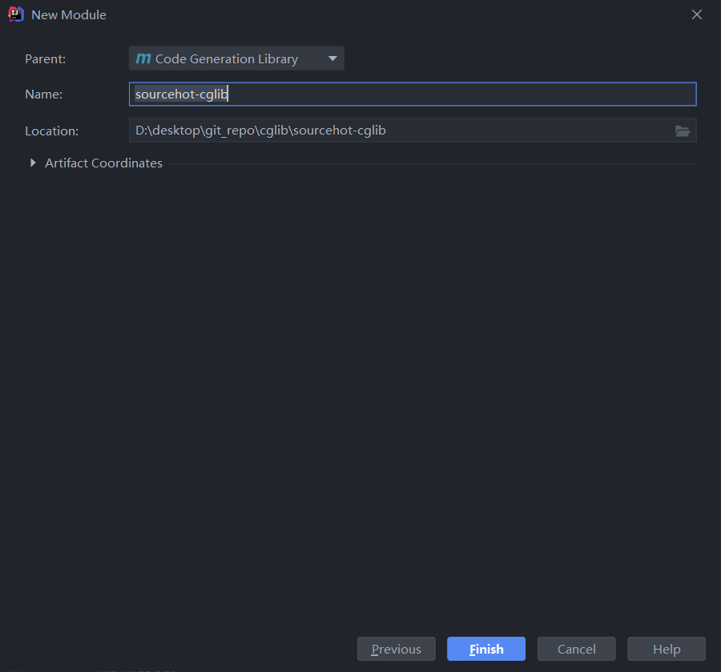
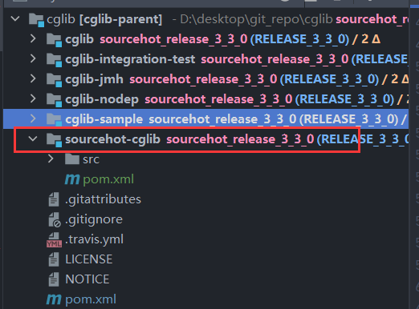
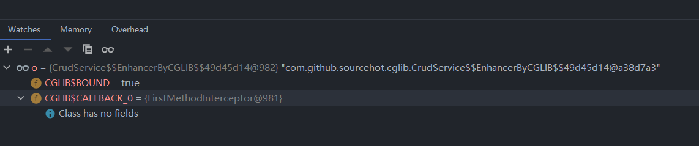
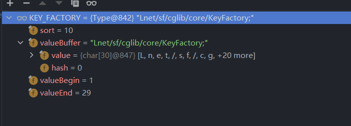
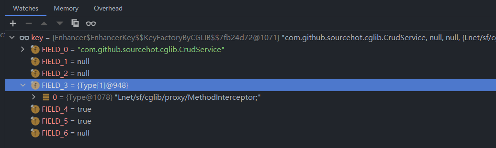

# CGLIB

从这一章节开始将进入到CGLIB 这项技术的源码分析中。

## 环境搭建

首先需要确定CGLIB分析的版本号. 学习 CGLIB 框架的主要目标还是为了 SpringFramework 框架中AOP相关知识服务，所以需要在 SpringFramework 框架中找到CGLIB的目标版本，在Spring源码分析中所选用的SpringFramework版本是 **5.2.3.release** ，通过查看 `spring-core.gradle` 文档可以确认具体 CGLIB 版本号：**3.3.0**。

- `spring-core.gradle` 文档信息

```groovy
import com.github.jengelman.gradle.plugins.shadow.tasks.ShadowJar

plugins {
	id "com.github.johnrengelman.shadow" version "5.2.0"
}

description = "Spring Core"

apply plugin: "kotlin"

def cglibVersion = "3.3.0"
def objenesisVersion = "3.1"

configurations {
	cglib
	objenesis
	coroutines
}

// 省略其他
```


确定了版本号后来进行源码下载，CGLIB 的源码托管在 [GitHub](https://github.com/cglib/cglib)上。下面我们来进行代码获取操作

1. 克隆代码

```shell
git clone https://github.com/cglib/cglib.git
```

2. 查看tag

```shell
// 进入cglib文件夹
cd cglib
// 查看tag
git tag
```

- tag 列表

```
RC2
RELEACE_1_0
RELEASE_1_1_RC1
RELEASE_2_0
RELEASE_2_0_1
RELEASE_2_0_2
RELEASE_2_0_BETA_1
RELEASE_2_0_RC2
RELEASE_2_0_RC_1
RELEASE_2_1
RELEASE_2_1_0
RELEASE_2_1_02
RELEASE_2_1_1
RELEASE_2_1_3
RELEASE_2_2
RELEASE_2_2_BETA_1
RELEASE_3_1
RELEASE_3_2_0
RELEASE_3_2_1
RELEASE_3_2_10
RELEASE_3_2_11
RELEASE_3_2_12
RELEASE_3_2_2
RELEASE_3_2_3
RELEASE_3_2_4
RELEASE_3_2_5
RELEASE_3_2_6
RELEASE_3_2_7
RELEASE_3_2_8
RELEASE_3_2_9
RELEASE_3_3_0
Root_RELEASE_2_2_3
start

```

3. 下面我们需要切换到具体的tag：**RELEASE_3_3_0**

```shell
// 首先切换到 RELEASE_3_3_0
git checkout RELEASE_3_3_0
// 签出一个新的分支
git switch -c sourcehot_release_3_3_0
```


进过上述操作就获得了后续源码分析的基础分支。下面来创建一个测试用的maven 工程





创建完成用例工程后，来看此时的文件情况




项目创建完成后需要引入CGLIB依赖

- cglib 依赖

```xml
<dependency>
    <groupId>${project.groupId}</groupId>
    <artifactId>cglib</artifactId>
</dependency>
```


### 测试用例编写

工程准备就绪，下面编写一个简单的测试用例。

第一步需要编写一个被代理的对象

```java
public class CrudService {
   public void save() {
      System.out.println("保存方法");
   }
}
```

第二步需要编写方法增强器

```java
public class FirstMethodInterceptor implements MethodInterceptor {
   @Override
   public Object intercept(Object obj, Method method, Object[] args, MethodProxy proxy) throws Throwable {

      if (method != null) {
         System.out.println("当前正在执行的方法是:" + method.getName());
      }

      return proxy.invokeSuper(obj, args);
   }
}
```

第三步需要编写测试类

```java
public class CrudServiceTest {

   @Test
   public void testSave() {
      Enhancer enhancer = new Enhancer();
      enhancer.setSuperclass(CrudService.class);
      FirstMethodInterceptor firstMethodInterceptor = new FirstMethodInterceptor();
      enhancer.setCallback(firstMethodInterceptor);

      Object o = enhancer.create();
      if (o instanceof CrudService) {
         ((CrudService) o).save();
      }
   }
}
```


- 测试方法 `testSave` 输出结果

```
当前正在执行的方法是:save
保存方法
```


## `Enhancer#create` 分析

在前文所编写的测试方法中除了一些对象创建和属性设置以外对 `Enhancer` 对象的使用其实只有 `enhancer.create` 这样一段，这段代码返回给程序使用的是一个 Object 对象，可以将其理解成为代理对象或者增强对象。下面来是增强对象的一些属性信息

- 增强类的属性

 

从上图中可以看到增强对象的一些数据信息，这些数据信息还不够完善，通过下面这段代码来输出更多的对象信息

```java
System.setProperty(DebuggingClassWriter.DEBUG_LOCATION_PROPERTY, "D:\\desktop\\git_repo\\cglib\\sourcehot-cglib\\proxy");
```

这段代码的含义试讲代理对象输出到某一个指定的路径中，输出的文件拓展名是 `class`

- 生成后的数据

```java
// 省略无关数据
public class CrudService$$EnhancerByCGLIB$$49d45d14 extends CrudService implements Factory {
    private MethodInterceptor CGLIB$CALLBACK_0;
    final void CGLIB$save$0() {
        super.save();
    }

    public final void save() {
        MethodInterceptor var10000 = this.CGLIB$CALLBACK_0;
        if (var10000 == null) {
            CGLIB$BIND_CALLBACKS(this);
            var10000 = this.CGLIB$CALLBACK_0;
        }

        if (var10000 != null) {
            var10000.intercept(this, CGLIB$save$0$Method, CGLIB$emptyArgs, CGLIB$save$0$Proxy);
        } else {
            super.save();
        }
    }
}
```

从这样一段生成出来的代码中可以看到这里的 `save` 方法前面有 `MethodInterceptor` 的数据传递，这个数据信息从断点截图中可以知道这是在测试用例中所编写的 `FirstMethodInterceptor` 对象，现在可以看到整个方法的处理流程，如果存在 `FirstMethodInterceptor` 对象则进行方法调用，最后在执行 `save` 方法


下面来看 `create` 方法的详细内容

- `net.sf.cglib.proxy.Enhancer#create()` 方法详情

```java
public Object create() {
    classOnly = false;
    argumentTypes = null;
    return createHelper();
}
```

在这段代码中设计两个参数和一个方法的调用，下面是两个参数的含义

1. `classOnly`：类是否唯一
2. `argumentTypes`：参数类型列表


CGLIB 中关于`createHelper` 方法的代码信息如下：

```java
private Object createHelper() {
   // 前置验证
   preValidate();
   // key 的生成
   Object key = KEY_FACTORY.newInstance((superclass != null) ? superclass.getName() : null,
         ReflectUtils.getNames(interfaces),
         filter == ALL_ZERO ? null : new WeakCacheKey<CallbackFilter>(filter),
         callbackTypes,
         useFactory,
         interceptDuringConstruction,
         serialVersionUID);
   // 设置成员变量 currentKey
   this.currentKey = key;
   // 创建代理类
   Object result = super.create(key);
   return result;
}
```

在这段方法中主要流程如下

1. 进行前置数据验证
2. key的生成
3. 代理对象的生成

下面对着三个主要操作流程做更详细的分析

## 数据验证

首先来看`createHelper`方法中关于数据验证的方法，具体代码如下：

```java
private void preValidate() {
    // 回调类型为空的处理
    if (callbackTypes == null) {
        // 回调类型的推论
        callbackTypes = CallbackInfo.determineTypes(callbacks, false);
        // 设置需要验证
        validateCallbackTypes = true;
    }
    // 过滤器为空的处理
    if (filter == null) {
        // 回调类型数量大于1 抛出异常
        if (callbackTypes.length > 1) {
            throw new IllegalStateException("Multiple callback types possible but no filter specified");
        }
        // 设置一个空的验证
        filter = ALL_ZERO;
    }
}

```

阅读完成方法后，对整个`preValidate` 方法进行流程整理：

1. 如果回调类型为空，那么 CGLIB 会通过回调接口列表来推论出最终的回调类型列表，在完成推论后将验证标记设置为 `true`

2. 如果回调过滤器为空

   1. 如果回调类型数量大于1抛出异常

   


## key 的生成

接下来进行key生成的相关源码分析，CGLIB中对于key生成的代码如下：

```java
Object key = KEY_FACTORY.newInstance((superclass != null) ? superclass.getName() : null,
      ReflectUtils.getNames(interfaces),
      filter == ALL_ZERO ? null : new WeakCacheKey<CallbackFilter>(filter),
      callbackTypes,
      useFactory,
      interceptDuringConstruction,
      serialVersionUID);
```

这段代码中需要先来认识  `KEY_FACTORY` 对象，这个对象是 `Enhancer` 中的一个成员变量，具体信息如下

```java
private static final EnhancerKey KEY_FACTORY =
      (EnhancerKey) KeyFactory.create(EnhancerKey.class, KeyFactory.HASH_ASM_TYPE, null);
```

下面先来整理 `KeyFactory.create` 方法的参数列表

- `KeyFactory.create` 参数表

| 参数名称       | 参数类型                     | 参数说明              |
| -------------- | ---------------------------- | --------------------- |
| `keyInterface` | `Class`                      | key 生成接口          |
| `first`        | `KeyFactoryCustomizer`       | 自定义的 `KeyFactory` |
| `next`         | `List<KeyFactoryCustomizer>` | 自定义的 `KeyFactory` |


继续向下追踪源代码，找到 `net.sf.cglib.core.KeyFactory#create(java.lang.ClassLoader, java.lang.Class, net.sf.cglib.core.KeyFactoryCustomizer, java.util.List<net.sf.cglib.core.KeyFactoryCustomizer>)` 方法


```java
public static KeyFactory create(ClassLoader loader, Class keyInterface, KeyFactoryCustomizer customizer,
      List<KeyFactoryCustomizer> next) {
   Generator gen = new Generator();
   gen.setInterface(keyInterface);

   if (customizer != null) {
      gen.addCustomizer(customizer);
   }
   if (next != null && !next.isEmpty()) {
      for (KeyFactoryCustomizer keyFactoryCustomizer : next) {
         gen.addCustomizer(keyFactoryCustomizer);
      }
   }
   gen.setClassLoader(loader);
   return gen.create();
}
```

在这段代码中可以看到具体生成能力是 `Generator` 所提供的，在该方法中主体逻辑是设置各类数据。设置属性的方法就不做展开了，来看最下面一行的 `create` 方法详情

```java
protected Object create(Object key) {
    // 获取类加载器
    ClassLoader loader = getClassLoader();
    // 获取缓存对象
    Map<ClassLoader, ClassLoaderData> cache = CACHE;
    // 缓存对象中虎丘 类加载数据
    ClassLoaderData data = cache.get(loader);
    // 换掉数据不存在的情况下补充缓存数据
    if (data == null) {
        synchronized (AbstractClassGenerator.class) {
            cache = CACHE;
            data = cache.get(loader);
            if (data == null) {
                Map<ClassLoader, ClassLoaderData> newCache = new WeakHashMap<ClassLoader, ClassLoaderData>(cache);
                data = new ClassLoaderData(loader);
                newCache.put(loader, data);
                CACHE = newCache;
            }
        }
    }
    // 设置 key
    this.key = key;
    // 从 ClassLoaderData 获取数据
    Object obj = data.get(this, getUseCache());
    if (obj instanceof Class) {
        // 子类实现
        return firstInstance((Class) obj);
    }
    return nextInstance(obj);
}
```

阅读完成上述方法后来进行该方法的流程整理：

1. 第一步：处理是关于数据缓存相关，缓存中是否存在数据存在就不做处理，不存在就重新设置到缓存中。
2. 第二步：处理时关于对象获取的，这部分代码的实现是由子类 `Enhancer` 进行处理。


### `Enhancer#firstInstance` 方法分析

接下来进行 `firstInstance` 方法的分析，CGLIB中 `firstInstance` 的代码如下：

- `net.sf.cglib.proxy.Enhancer#firstInstance` 方法详情

```java
protected Object firstInstance(Class type) throws Exception {
   if (classOnly) {
      return type;
   }
   else {
      return createUsingReflection(type);
   }
}
```

方法处理逻辑：

1. 判断 `classOnly` 是否为 `true` 如果是直接将入参返回。
2. 通过 `createUsingReflection` 进行构造

构造方法的具体代码如下

```java
private Object createUsingReflection(Class type) {
    // 设置线程回调
    setThreadCallbacks(type, callbacks);
    try {

        if (argumentTypes != null) {
            // 通过 class + 构造参数类型 + 参数列表反射创建对象
            return ReflectUtils.newInstance(type, argumentTypes, arguments);

        }
        else {
            // 根据 class 反射创建对象
            return ReflectUtils.newInstance(type);

        }
    }
    finally {
        // clear thread callbacks to allow them to be gc'd
        // 清理线程的回调
        setThreadCallbacks(type, null);
    }
}

```

这里就不具体再往下深入挖掘 `ReflectUtils.newInstance` 方法的信息了。


现在对于 `firstInstance` 方法的处理流程有了更深入的了解。


### `Enhancer#nextInstance` 方法分析

下面来看另一个创建 `KeyFactory` 的方法 `nextInstance` 

```java
protected Object nextInstance(Object instance) {
   // 将参数做类型强制转换 EnhancerFactoryData
   EnhancerFactoryData data = (EnhancerFactoryData) instance;


   if (classOnly) {
      // 从 EnhancerFactoryData 中获取 generatedClass 作为返回值
      return data.generatedClass;
   }

   Class[] argumentTypes = this.argumentTypes;
   Object[] arguments = this.arguments;
   if (argumentTypes == null) {
      argumentTypes = Constants.EMPTY_CLASS_ARRAY;
      arguments = null;
   }
   // EnhancerFactoryData 进行对象创建
   return data.newInstance(argumentTypes, arguments, callbacks);
}
```

在这段代码中可以看到两种获取 `Object` 的方式

1. 第一种：通过 `EnhancerFactoryData` 的属性 `generatedClass` 获取。
2. 第二种：通过 `data.newInstance` 方法进行获取对象。

第二种获取方式的本质是通过 `Class` + 参数类型 + 参数列表 反射创建对象。


现在拥有了 `KEY_FACTORY` 对象，现在 `KEY_FACTORY`的数据内容如下图所示：



这个对象是在内存中的一个对象，在前文有提到如何获取这样一个对象，下面是生成出来的对象信息：

- `Enhancer$EnhancerKey$$KeyFactoryByCGLIB$$7fb24d72` 生成的`keyFactory`

```java
public class Enhancer$EnhancerKey$$KeyFactoryByCGLIB$$7fb24d72 extends KeyFactory implements EnhancerKey {
    private final String FIELD_0;
    private final String[] FIELD_1;
    private final WeakCacheKey FIELD_2;
    private final Type[] FIELD_3;
    private final boolean FIELD_4;
    private final boolean FIELD_5;
    private final Long FIELD_6;

    public Enhancer$EnhancerKey$$KeyFactoryByCGLIB$$7fb24d72() {
    }

    public Object newInstance(String var1, String[] var2, WeakCacheKey var3, Type[] var4, boolean var5, boolean var6, Long var7) {
        return new Enhancer$EnhancerKey$$KeyFactoryByCGLIB$$7fb24d72(var1, var2, var3, var4, var5, var6, var7);
    }

    public Enhancer$EnhancerKey$$KeyFactoryByCGLIB$$7fb24d72(String var1, String[] var2, WeakCacheKey var3, Type[] var4, boolean var5, boolean var6, Long var7) {
        this.FIELD_0 = var1;
        this.FIELD_1 = var2;
        this.FIELD_2 = var3;
        this.FIELD_3 = var4;
        this.FIELD_4 = var5;
        this.FIELD_5 = var6;
        this.FIELD_6 = var7;
    }

    // 省略其他代码
}
```

在这个生成的类中我们可以看到一些熟悉的内容

1. 继承类 `KeyFactory` 
2. 实现类 `EnhancerKey`

这两个类中需要关注重点是 **`EnhancerKey`**接口，这个接口就是最开始的入口：**key生成的方法定义者** 。通过这段代码可以确认在这个阶段中对于 key 的生成结果就是将**参数全部传递进来然后赋值给 FIELD_0-6 字段**

- key 的生成结果




## 代理对象的生成

代理对象的生成依靠 `create` 方法，这一点在前文已经做出分析。


到这里还有一个疑问这个代理class是怎么生成出来的，这里就涉及到接口 `net.sf.cglib.core.ClassGenerator` ，这段方法的调用入口是由 `net.sf.cglib.core.AbstractClassGenerator.ClassLoaderData#get` 提供的


## 生成类分析

下面来看生成类中的一些细节，首先来看直接增强对象 `CrudService$$EnhancerByCGLIB$$49d45d14`，在这个对象中主要的查询目标是 `save` 方法

```java
public class CrudService$$EnhancerByCGLIB$$49d45d14 extends CrudService implements Factory {

    public final void save() {
        MethodInterceptor var10000 = this.CGLIB$CALLBACK_0;
        if (var10000 == null) {
            CGLIB$BIND_CALLBACKS(this);
            var10000 = this.CGLIB$CALLBACK_0;
        }

        if (var10000 != null) {
            var10000.intercept(this, CGLIB$save$0$Method, CGLIB$emptyArgs, CGLIB$save$0$Proxy);
        } else {
            super.save();
        }
    }
}
```

根据测试用例中的拦截处理在执行`save`方法之前做了一层操作，这一层操作体现在生成的类上面就是调用 `MethodInterceptor` 接口。

下面来看`save`方法寻找的过程，

这里笔者又产生一个问题：**如何找到这个save方法执行**，这里我们就需要 `FastClass` 来提供帮助，在 `FastClass` 中提供了一个 `invoke` 方法，这个方法就是来搜索调用具体方法的，下面我们来看生成的 `CrudService$$FastClassByCGLIB$$16b1ce10`

```java
public Object invoke(int var1, Object var2, Object[] var3) throws InvocationTargetException {
    CrudService var10000 = (CrudService)var2;
    int var10001 = var1;

    try {
        switch(var10001) {
            case 0:
                var10000.save();
                return null;
            case 1:
                return new Boolean(var10000.equals(var3[0]));
            case 2:
                return var10000.toString();
            case 3:
                return new Integer(var10000.hashCode());
        }
    } catch (Throwable var4) {
        throw new InvocationTargetException(var4);
    }

    throw new IllegalArgumentException("Cannot find matching method/constructor");
}
```

这里不难看到其中对 `var1` 进行了swatch操作然后得到了一个具体的索引然后就根据索引调用对应的方法。这里的 `var1` 其实是一个方法的索引，在生成的类中也有相关定义。


 现在我们知道了一个大概的处理流程我们试着编写一段类似的代码


```java
public class FastClassTest {


   @Test
   public void testFastClass() {
      Method method = new Method();
      FastClassExample fastClassExample = new FastClassExample();
      fastClassExample.invoke(
            fastClassExample.getIndex("method1"),
            method, null);
   }

   class Method {
      public void method1() {
         System.out.println("method1");
      }

      public void method2() {
         System.out.println("method2");
      }
   }


   class FastClassExample {
      public Object invoke(int index, Object o, Object[] params) {
         if (o instanceof Method) {
            switch (index) {
               case 0:
                  ((Method) o).method1();
                  break;
               case 1:
                  ((Method) o).method2();
                  break;
            }
         }
         return null;
      }

      public int getIndex(String methodName) {
         if (methodName.equals("method1")) {
            return 0;
         }
         else if (methodName.equals("method2")) {
            return 1;
         }
         return -1;
      }

   }
}
```


最后我们在 `MethodInterceptor` 实现类中需要调用 `net.sf.cglib.proxy.MethodProxy#invokeSuper` 来执行原有的方法（被增强的方法）


- `net.sf.cglib.proxy.MethodProxy#invokeSuper` 方法详情

```java
public Object invokeSuper(Object obj, Object[] args) throws Throwable {
   try {
      init();
      FastClassInfo fci = fastClassInfo;
      return fci.f2.invoke(fci.i2, obj, args);
   }
   catch (InvocationTargetException e) {
      throw e.getTargetException();
   }
}
```

在这里所调用的 `fci.f2.invoke` 方法的实现就是从


### Enhancer 成员变量表

| 变量名称                      | 变量类型         | 变量说明                         |
| ----------------------------- | ---------------- | -------------------------------- |
| `currentKey`                  | `Object`         | 缓存key                          |
| `interfaces`                  | `Class[]`        | 接口列表                         |
| `filter`                      | `CallbackFilter` | 回调过滤器                       |
| `callbacks`                   | `Callback[]`     | 回调器列表                       |
| `callbackTypes`               | `Type[]`         | 回调器类型列表                   |
| `validateCallbackTypes`       | `boolean`        | 是否需要进行回调接口类型验证     |
| `classOnly`                   | `boolean`        | 类是否唯一                       |
| `superclass`                  | `Class`          | 支持的类，需要进行代理的类       |
| `argumentTypes`               | `Class[]`        | 参数类型                         |
| `arguments`                   | `Object[]`       | 参数值                           |
| `useFactory`                  | `boolean`        | 是否使用工厂                     |
| `serialVersionUID`            | `Long`           | 序列化ID                         |
| `interceptDuringConstruction` | `boolean`        | 是否从代理类的构造函数中调用方法 |


### CGLIB 中的核心类

| 类名             | 作用                                          |
| ---------------- | --------------------------------------------- |
| `Enhancer`       | 增强类                                        |
| `ClassGenerator` | 类生成器，生成字节码                          |
| `MethodProxy`    | 方法代理借口                                  |
| `Callback`       | 回调接口，通常我们编写的是`MethodInterceptor` |
| `CallbackFilter` | 回调接口过滤器                                |
| `FastClass`      | 通过 FastClass 对象来进行代理类的调用         |
|                  |                                               |
|                  |                                               |
|                  |                                               |


下面来看生成类中的一些细节，首先来看直接增强对象 `CrudService$$EnhancerByCGLIB$$49d45d14`，在这个对象中主要的查询目标是 `save` 方法
