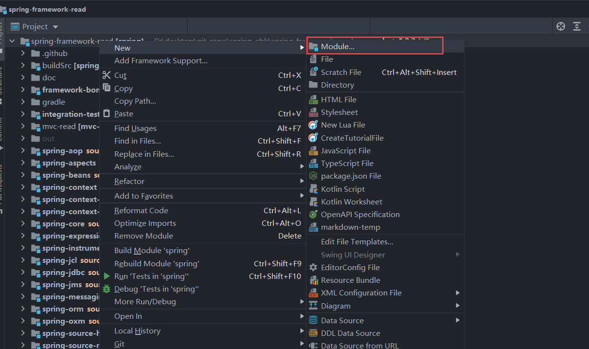
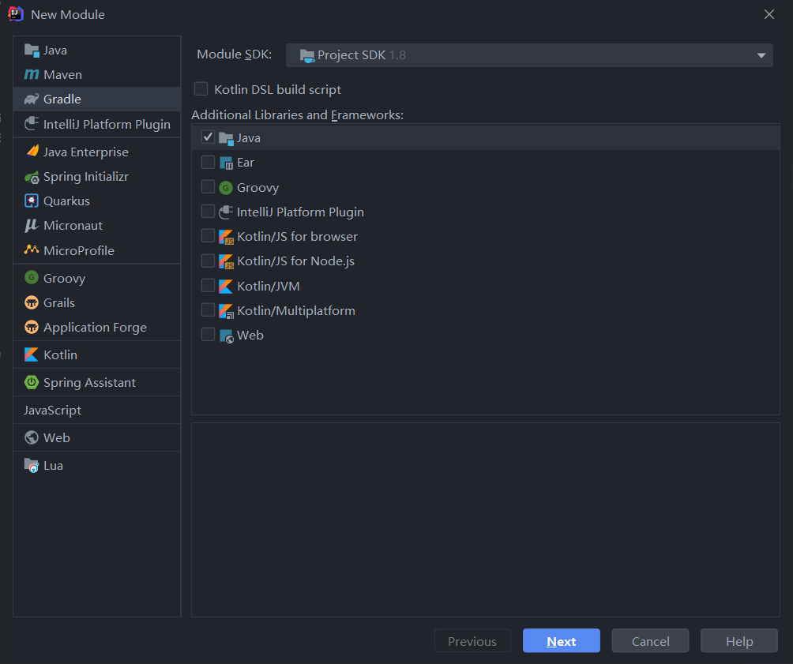
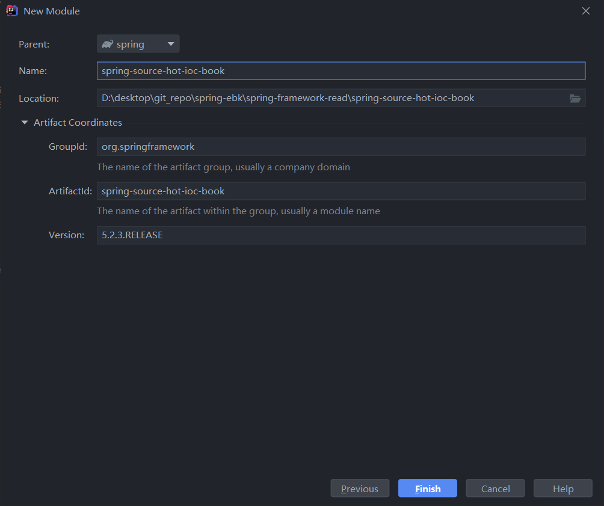
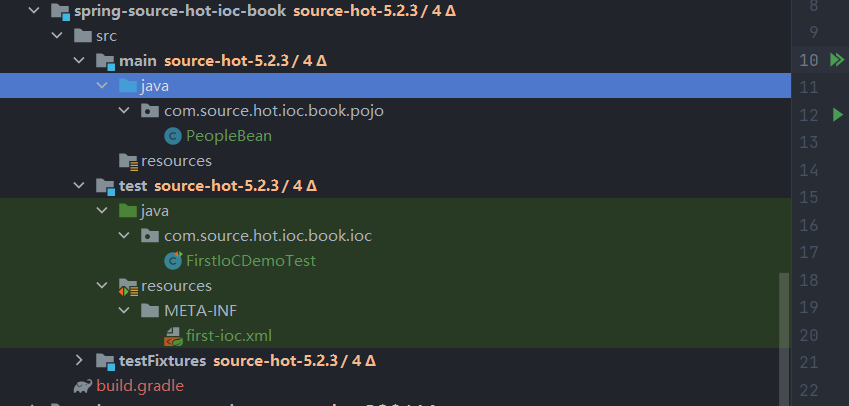

<div style='display: none'>

Copyright 2020 [HuiFer](http://github.com/huifer) All rights reserved.

Licensed under the Apache License, Version 2.0 (the "License");
you may not use this file except in compliance with the License.
You may obtain a copy of the License at

     http://www.apache.org/licenses/LICENSE-2.0

Unless required by applicable law or agreed to in writing, software
distributed under the License is distributed on an "AS IS" BASIS,
WITHOUT WARRANTIES OR CONDITIONS OF ANY KIND, either express or implied.
See the License for the specific language governing permissions and
limitations under the License.

</div>


# 第一章 容器环境搭建及基本使用
- 本章笔者会带领各位读者创建一个关于 SpringIoC 的基本环境和基本使用. 下面笔者来进行基本环境的创建


## 1.1 容器环境搭建


### 1.1.1 工程创建


- 第一步创建 测试工程

  在项目顶层右键 根据 <KBD>New</KBD> -> <KBD>Module</KBD>  进行点击




- 点击后会弹出

  我们选择 **Gradle** + **Java** 点击 <KBD>Next</KbD>




- 点击 <KBD>Next</kbd> 后弹出下面的内容，请输入 **Name** 、**GroupId** 、**ArtifactId** 、**Version**



- 在输入完成相关信息后点击 <KBD>Finish</KBD> 完成工程创建


### 1.1.2 基本代码编辑


在完成工程创建后我们需要来创建几个基本的类和配置文件. 

在 `build.gradle` 文件中加入依赖： **spring-context** 、**spring-core** . 这两个依赖是 Spring 容器的最小依赖. 后续可以在这个基础上添加其他的 spring 依赖来进行环境搭建. 

- 编辑后的文件

  ```groovy
  plugins {
      id 'java'
  }
  
  group 'org.springframework'
  version '5.2.3.RELEASE'
  
  repositories {
      mavenCentral()
  }
  dependencies {
      compile(project(":spring-context"))
      compile(project(":spring-core"))
      testCompile("org.junit.jupiter:junit-jupiter-api")
      testCompile("org.junit.jupiter:junit-jupiter-params")
  }
  
  test {
      useJUnitPlatform()
  }
  ```

  **注意笔者这里是使用源码环境进行工程创建, 所以这里笔者不需要使用 `compile group: 'org.springframework', name: 'spring-core', version: '5.2.3.RELEASE'` 这样的语法, 各位读者请自行选择具体的使用方式.  **


在完成基本的 `build.gradle` 配置后我们开始编写测试代码. 创建一个最小的 Bean 实体, 配置 xml 从容器中读取. 

下面笔者将代码全部贴出, 读者可以自行阅读, 或对其进行修改. 

- 最小 Bean 实体

  ```java
  public class PeopleBean {
      private String name;
  
      public String getName() {
          return name;
      }
  
      public void setName(String name) {
          this.name = name;
      }
  }
  ```

- spring xml 配置

  ```xml
  <?xml version="1.0" encoding="UTF-8"?>
  <beans xmlns:xsi="http://www.w3.org/2001/XMLSchema-instance"
         xmlns="http://www.springframework.org/schema/beans"
         xsi:schemaLocation="http://www.springframework.org/schema/beans http://www.springframework.org/schema/beans/spring-beans.xsd">
  
  
      <bean id="people" class="com.source.hot.ioc.book.pojo.PeopleBean">
          <property name="name" value="zhangsan"/>
      </bean>
  </beans>
  ```

- 测试用例

  ```java
  class FirstIoCDemoTest {
      @Test
      void testIoC() {
          ClassPathXmlApplicationContext context
                  = new ClassPathXmlApplicationContext("META-INF/first-ioc.xml");
  
          PeopleBean people = context.getBean("people", PeopleBean.class);
  
          String name = people.getName();
          assumeTrue(name.equals("zhangsan"));
      }
  }
  ```


当前目录结构




- 在基本测试用例中笔者采用了 `ClassPathXmlApplicationContext` 类用来做容器对象, 但其实在 Spring 中还有其他的几个可以作为容器对象的类, 如 **`FileSystemXmlApplicationContext`** 、 **`XmlBeanFactory`** ,  不过在这两个类中 `XmlBeanFactory` 已经被废弃了, 虽然被标记了 `@Deprecated` 注解但我们开始可以使用

  

- `XmlBeanFactory` 废弃标记 

  ```java
  
  /**
  *
  as of Spring 3.1 in favor of {@link DefaultListableBeanFactory} and
   * {@link XmlBeanDefinitionReader}
   */
  @Deprecated
  @SuppressWarnings({ "serial", "all" })
  public class XmlBeanFactory extends DefaultListableBeanFactory {}
  ```


说了这么多笔者将剩下两个类的测试用例贴出来

- `XmlBeanFactory` 测试用例

  ```java
  @Test
  void testXmlBeanFactory() {
      XmlBeanFactory beanFactory = new XmlBeanFactory(new ClassPathResource("META-INF/first-ioc.xml"));
  
      PeopleBean people = beanFactory.getBean("people", PeopleBean.class);
  
      String name = people.getName();
      assumeTrue(name.equals("zhangsan"));
  }
  ```


- `FileSystemXmlApplicationContext` 测试用例

  **注意: 在使用 `FileSystemXmlApplicationContext` 需要输入全路径或者相对路径.** 笔者这里的全路径是`"D:\\desktop\\git_repo\\spring-ebk\\spring-framework-read\\spring-source-hot-ioc-book\\src\\test\\resources\\META-INF\\first-ioc.xml"` 读者可以根据自己的路径地址进行修改. 

  ```java
  @Test
  void testFileSystemXmlApplicationContext() {
      FileSystemXmlApplicationContext context
              = new FileSystemXmlApplicationContext("D:\\desktop\\git_repo\\spring-ebk\\spring-framework-read\\spring-source-hot-ioc-book\\src\\test\\resources\\META-INF\\first-ioc.xml");
  
      PeopleBean people = context.getBean("people", PeopleBean.class);
  
      String name = people.getName();
      assumeTrue(name.equals("zhangsan"));
  }
  ```

  


- 到此我们就共同完成了 Spring 源码分析的第一步**基础环境搭建**，下面笔者将来介绍容器提供了那些功能. 


## 1.2 容器功能

从我们的用例上不难发现它至少具备了这样几个功能. 

1. 读取配置文件, spring xml 文件.
2. 从容器中获取实例. (获取 Bean)


