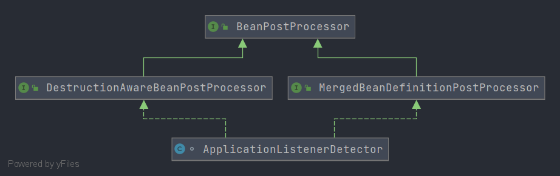
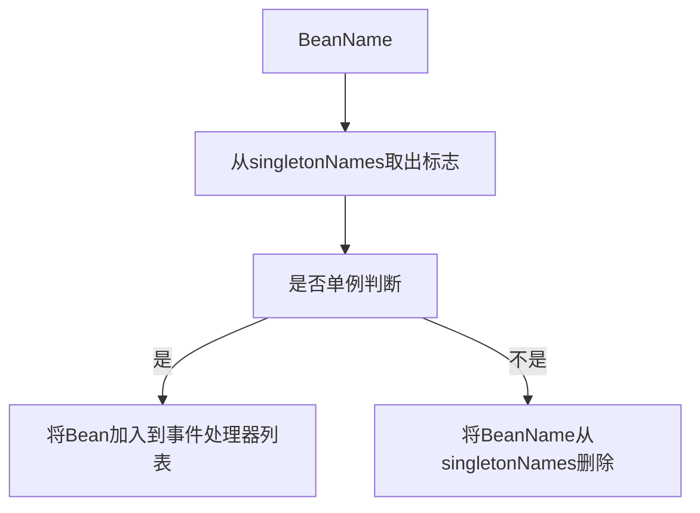
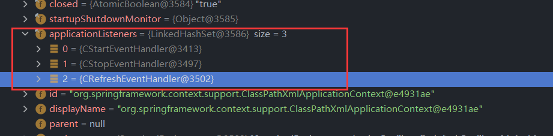
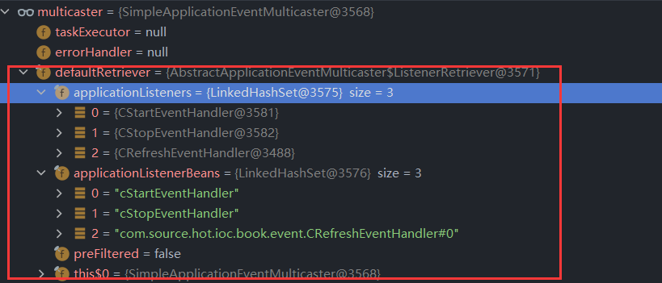
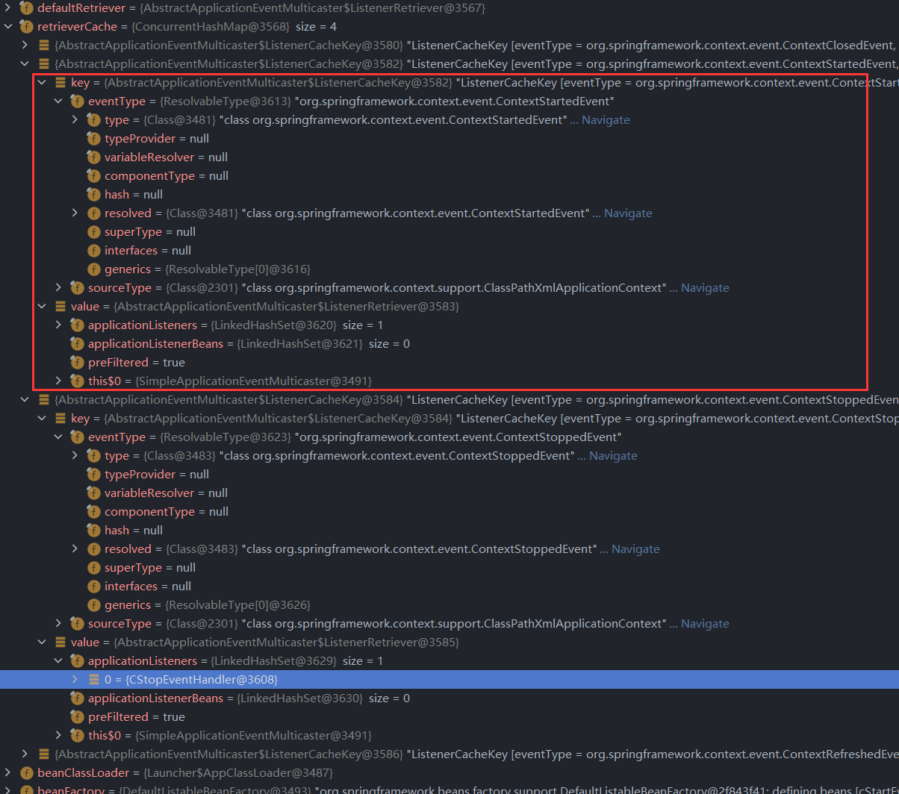

# 第十五章 Spring 事件
在本章笔者将和各位读者一起讨论 Spring 中关于事件相关的处理


## 15.1 环境搭建
不知道各位是否还记得在 `AbstractApplicationContext#finishRefresh` 方法中有一个关于事件推送的方法 `publishEvent`，我们在这一章节中所使用的测试用例就是围绕这段代码开始的，先来看 `publishEvent` 的调用代码。

- `publishEvent` 方法调用

```java
publishEvent(new ContextRefreshedEvent(this));
```

在 Spring 的启动流程中我们还有这些地方用到了 Spring 提供的基本事件

- `start` 方法

```java
publishEvent(new ContextStartedEvent(this));
```

- `stop` 方法

```java
publishEvent(new ContextStoppedEvent(this));
```

我们这里编写的测试用例就是围绕 `ContextRefreshedEvent`、`ContextStartedEvent` 和 `ContextStoppedEvent` 编写，下面来看这三个 Event 的监听器

- `CRefreshEventHandler`：当触发 `ContextRefreshedEvent` 事件的时候执行

```java
public class CRefreshEventHandler
   implements ApplicationListener<ContextRefreshedEvent>{

   public void onApplicationEvent(ContextRefreshedEvent event) {
      System.out.println("ContextRefreshedEvent Received");
   }
}
```

- `CStartEventHandler`：当触发 `ContextStartedEvent` 事件的时候执行

```java
public class CStartEventHandler 
   implements ApplicationListener<ContextStartedEvent>{

   public void onApplicationEvent(ContextStartedEvent event) {
      System.out.println("ContextStartedEvent Received");
   }
}
```

- `CStopEventHandler`：当触发 `ContextStoppedEvent` 事件的时候执行

```java
public class CStopEventHandler 
   implements ApplicationListener<ContextStoppedEvent>{

   public void onApplicationEvent(ContextStoppedEvent event) {
      System.out.println("ContextStoppedEvent Received");
   }
}
```


在这些类编辑完成后我们来编写 Spring XML 配置和测试用例

- Spring XML: `spring-event.xml`

```XML
<?xml version="1.0" encoding="UTF-8"?>
<beans xmlns:xsi="http://www.w3.org/2001/XMLSchema-instance"
      xmlns="http://www.springframework.org/schema/beans"
      xsi:schemaLocation="http://www.springframework.org/schema/beans http://www.springframework.org/schema/beans/spring-beans.xsd">

   <bean id="cStartEventHandler" class="com.source.hot.ioc.book.event.CStartEventHandler"/>
   <bean id="cStopEventHandler" class="com.source.hot.ioc.book.event.CStopEventHandler"/>
   <bean class="com.source.hot.ioc.book.event.CRefreshEventHandler"/>
</beans>
```

- 测试用例

```java
public class EventTest {

   @Test
   void testEvent() {
      ClassPathXmlApplicationContext context = new ClassPathXmlApplicationContext("META-INF/spring-event.xml");
      context.start();
      context.stop();
      context.close();
   }
}
```


执行输出

```tex
ContextRefreshedEvent Received
ContextStartedEvent Received
ContextStoppedEvent Received
```


用例准备完毕下面我们进入源码分析阶段


## 15.2 事件处理器注册

我们在使用事件处理器之前必须要将事件处理器全部注册到 Spring 中才可以发挥作用，我们需要找到注册这些事件处理器的方法。不知道各位是否还记得在 `org.springframework.context.support.AbstractApplicationContext#finishBeanFactoryInitialization` 方法最后有一个方法 `beanFactory.preInstantiateSingletons()`  ，这个方法就是帮我们进行注册的方法。那么这里可以作为我们观察事件处理器注册的方法入口，通过入口进一步往下追踪源码可以在 `AbstractAutowireCapableBeanFactory#initializeBean(java.lang.String, java.lang.Object, org.springframework.beans.factory.support.RootBeanDefinition)` 中找到 `org.springframework.beans.factory.support.AbstractAutowireCapableBeanFactory#applyBeanPostProcessorsAfterInitialization` 方法，这个方法主要做的事情是 `BeanPostProcessor` 的调用，那么我们这里要关注的 `BeanPostProcessor` 是谁呢？我们这里需要关注 `ApplicationListenerDetector` 对象，在 `ApplicationListenerDetector#postProcessAfterInitialization` 方法中就有将事件处理器加入到容器中的具体代码。下面我们来整理一下整个调用过程。

- 事件处理器注册的完整调用链路

1. `org.springframework.context.support.AbstractApplicationContext#finishBeanFactoryInitialization`
   1. `org.springframework.context.support.AbstractApplicationContext#finishBeanFactoryInitialization`
      1. `org.springframework.beans.factory.support.AbstractAutowireCapableBeanFactory#initializeBean(java.lang.String, java.lang.Object, org.springframework.beans.factory.support.RootBeanDefinition)`
         1. `org.springframework.beans.factory.support.AbstractAutowireCapableBeanFactory#applyBeanPostProcessorsAfterInitialization`
            1. `org.springframework.context.support.ApplicationListenerDetector#postProcessAfterInitialization`


现在我们找到了负责注册事件处理器的对象 `ApplicationListenerDetector` 并且知道 `ApplicationListenerDetector` 实现了 `BeanPostProcessor` 下面我们就开始看这个类的一些细节内容


### 15.2.1 `ApplicationListenerDetector` 分析

我们先来看一下 `ApplicationListenerDetector` 类图确认一下类图关系，主要确定 `BeanPostProcessor` 接口的存在

- `ApplicationListenerDetector` 类图

  


在类图上我们看到 `BeanPostProcessor` 接口的存在，我们可以反映出两个想法

1. 第一个：实例创建之后需要做什么
2. 第二个：实例摧毁之前需要做什么

这就是 `BeanPostProcessor` 的两个方法的主要作用。

下面我们来看创建之后需要做什么

#### 15.2.1.1 实例创建之后做什么

我们先来看实例创建之后的代码

- `ApplicationListenerDetector#postProcessAfterInitialization` 方法详情

```java
@Override
public Object postProcessAfterInitialization(Object bean, String beanName) {
   if (bean instanceof ApplicationListener) {
      // potentially not detected as a listener by getBeanNamesForType retrieval
      Boolean flag = this.singletonNames.get(beanName);
      if (Boolean.TRUE.equals(flag)) {
         // singleton bean (top-level or inner): register on the fly
         this.applicationContext.addApplicationListener((ApplicationListener<?>) bean);
      }
      else if (Boolean.FALSE.equals(flag)) {
         if (logger.isWarnEnabled() && !this.applicationContext.containsBean(beanName)) {
            // inner bean with other scope - can't reliably process events
            logger.warn("Inner bean '" + beanName + "' implements ApplicationListener interface " +
                  "but is not reachable for event multicasting by its containing ApplicationContext " +
                  "because it does not have singleton scope. Only top-level listener beans are allowed " +
                  "to be of non-singleton scope.");
         }
         this.singletonNames.remove(beanName);
      }
   }
   return bean;
}
```

在这个方法中我们需要理解 `singletonNames` 的存储结构，先来看看数据结构

```java
private final transient Map<String, Boolean> singletonNames = new ConcurrentHashMap<>(256);
```

在这个结构中我们需要知道 Key 和 Value 分别代表了什么。在 `ApplicationListenerDetector` 类中可以找到如下代码

```java
@Override
public void postProcessMergedBeanDefinition(RootBeanDefinition beanDefinition, Class<?> beanType, String beanName) {
   if (ApplicationListener.class.isAssignableFrom(beanType)) {
      this.singletonNames.put(beanName, beanDefinition.isSingleton());
   }
}
```

通过这段代码我们可以确定 `singletonNames` 的 Key 和 Value 代表的含义：

1. key ：Bean Name
2. value ：Bean Name 对应的 Bean Definition 是否单例

在了解了 `singletonNames` 存储内容后我们来看 `postProcessAfterInitialization` 就比较清晰，处理流程如下




知道了处理流程后我们来看存储事件处理器的对象

```java
private final Set<ApplicationListener<?>> applicationListeners = new LinkedHashSet<>();
```

通过 `this.applicationContext.addApplicationListener((ApplicationListener<?>) bean);` 操作最终事件处理器都会放在`applicationListeners` 中。

- 注册完成后的 `applicationListeners` 数据信息

  


#### 15.2.1.2 实例摧毁之前做什么

前面我们了解实例创建后需要做的事项，接下来我们来对实例摧毁前所做的事项进行分析，下面请各位先进行代码阅读

- `ApplicationListenerDetector#postProcessBeforeDestruction`

```java
@Override
public void postProcessBeforeDestruction(Object bean, String beanName) {
   if (bean instanceof ApplicationListener) {
      try {
         ApplicationEventMulticaster multicaster = this.applicationContext.getApplicationEventMulticaster();
         multicaster.removeApplicationListener((ApplicationListener<?>) bean);
         multicaster.removeApplicationListenerBean(beanName);
      }
      catch (IllegalStateException ex) {
         // ApplicationEventMulticaster not initialized yet - no need to remove a listener
      }
   }
}
```

在这段代码中我们可以看到具体处理都是关于移除事件处理器的，在这里体现出来两种移除方式

1. 第一种：根据 Bean 实例进行移除
2. 第二种：根据 Bean Name 进行移除

在这里我们需要找到正真的移除容器是哪一个。

通过追踪代码我们可以找到 `org.springframework.context.event.AbstractApplicationEventMulticaster#defaultRetriever` 该变量中存储了事件处理器，下面我们来看该结构的数据内容



经过移除操作首先会将 `applicationListeners` 和 `applicationListenerBeans` 中移除对应的数据内容，同时在做每次移除操作的时候都会将 `retrieverCache` 数据删除，下面我们来看看 `retrieverCache` 中存储的是什么

- `retrieverCache` 数据信息




在这里笔者就简单介绍一些我们比较关注的内容

1. key中的 `eventType#type` ：该信息表示需要处理的事件类型
2. value中的 `applicationListeners` ：该信息表示提供处理的处理接口

这两项信息再事件处理阶段会产生作用，这里简单提一句，将 `applicationListeners` 循环并将事件对象放入执行每个 `applicationLisenter`


现在我们对于 `ApplicationListenerDetector` 中关于 `BeanPostProcessor` 的两个重点方法分析结束。


## 15.3 事件推送和处理

接下来我们来看事件推送相关的分析，首先我们需要找到能够进行事件推送的对象或者接口。通过阅读 `org.springframework.context.support.AbstractApplicationContext#publishEvent(java.lang.Object, org.springframework.core.ResolvableType)` 方法我们可以再其中发现这样一段代码 `getApplicationEventMulticaster().multicastEvent(applicationEvent, eventType)` ，这段代码就是进行事件推送(事件广播)的核心了，再这里我们进一步查找可以发现正真处理的接口是 `ApplicationEventMulticaster`，在 Spring 中可以找到的唯一的一个处理事件推送的对象 `SimpleApplicationEventMulticaster` 下面我们来看其中对于 `multicastEvent` 的实现。


- `SimpleApplicationEventMulticaster#multicastEvent(org.springframework.context.ApplicationEvent, org.springframework.core.ResolvableType)`

```java
@Override
public void multicastEvent(final ApplicationEvent event, @Nullable ResolvableType eventType) {
   ResolvableType type = (eventType != null ? eventType : resolveDefaultEventType(event));
   Executor executor = getTaskExecutor();
   for (ApplicationListener<?> listener : getApplicationListeners(event, type)) {
      if (executor != null) {
         executor.execute(() -> invokeListener(listener, event));
      }
      else {
         invokeListener(listener, event);
      }
   }
}
```

这段代码就是推送消息的核心，这里与其说是推送更好的说法应该是将事件对应的处理器找到并执行。

我们对于传入的 `event` 对象是已知的，那么接下来的问题就是找到 `event` 对应的处理器了，思考一个问题什么地方存储了事件处理器(`ApplicationListener`)，这个问题的答案笔者在前文介绍事件处理器注册的时候有提到，具体存储数据对象是在 `retrieverCache` 和 `defaultRetriever` 中，在事件推送和处理阶段最重要的就是在这个容器中找到对应的 `ApplicationLisenter` 。在这里提到的两个缓存数据存在优先级或者加载顺序的一些额外因素。我们来看 `getApplicationLiseteners` 方法中的一些内容。


- `getApplicationListeners` 方法详情

```java
protected Collection<ApplicationListener<?>> getApplicationListeners(
			ApplicationEvent event, ResolvableType eventType) {

    // 获取 事件源信息
    Object source = event.getSource();
    // 事件源信息类型
    Class<?> sourceType = (source != null ? source.getClass() : null);
    // 缓存对象key的创建
    ListenerCacheKey cacheKey = new ListenerCacheKey(eventType, sourceType);

    // 从容器中获取
    // Quick check for existing entry on ConcurrentHashMap...
    ListenerRetriever retriever = this.retrieverCache.get(cacheKey);
    // 不为空直接从缓存值中获取
    if (retriever != null) {
        // 从缓存值中获取 应用监听器列表
        return retriever.getApplicationListeners();
    }

    if (this.beanClassLoader == null ||
        (ClassUtils.isCacheSafe(event.getClass(), this.beanClassLoader) &&
         (sourceType == null || ClassUtils.isCacheSafe(sourceType, this.beanClassLoader)))) {
        // Fully synchronized building and caching of a ListenerRetriever
        synchronized (this.retrievalMutex) {
            retriever = this.retrieverCache.get(cacheKey);
            if (retriever != null) {
                return retriever.getApplicationListeners();
            }
            retriever = new ListenerRetriever(true);
            // 从 defaultRetriever 推算 ApplicationListener 对象
            Collection<ApplicationListener<?>> listeners =
                retrieveApplicationListeners(eventType, sourceType, retriever);
            this.retrieverCache.put(cacheKey, retriever);
            return listeners;
        }
    }
    else {
        // No ListenerRetriever caching -> no synchronization necessary
        return retrieveApplicationListeners(eventType, sourceType, null);
    }
}
```

在 `getApplicationListeners` 方法中主要围绕前文提到的两个存储 `ApplicationListener` 展开

1. 第一：从 `retrieverCache` 中读取数据，注意第一次读取的事件类型(`cacheKey`)是不存在的，Spring 启动完成后 `retrieverCache` 是一个空数据对象

2. 第二：`retrieverCache` 中搜索不到数据后在 `defaultRetriever` 中进行推算 `ApplicationLisenter` ，这里的推算围绕两种情况

   1. 第一种情况：从 `ApplicationListener` 实例列表中进行搜索
   2. 第二种情况：从 `ApplicationListener` 实例名称列表中搜索

   这两种情况的本质都是来判断实现了 `ApplicationListener` 的对象是否支持当前传递的事件类型，如果支持就会添加到返回值中。

在 Spring 中围绕这两个缓存结构做出了 `ApplicationListener` 的存储，现在我们找到了搜索 `ApplicationLisenter` 的方法那么我们就可以进行下面的调用阶段了（`invokeListener` 方法执行）。


- `invokeListener` 方法详情

```java
protected void invokeListener(ApplicationListener<?> listener, ApplicationEvent event) {
   ErrorHandler errorHandler = getErrorHandler();
   if (errorHandler != null) {
      try {
         doInvokeListener(listener, event);
      }
      catch (Throwable err) {
         errorHandler.handleError(err);
      }
   }
   else {
      doInvokeListener(listener, event);
   }
}

	@SuppressWarnings({"rawtypes", "unchecked"})
private void doInvokeListener(ApplicationListener listener, ApplicationEvent event) {
	try {
		listener.onApplicationEvent(event);
	}
	catch (ClassCastException ex) {
		String msg = ex.getMessage();
		if (msg == null || matchesClassCastMessage(msg, event.getClass())) {
			// Possibly a lambda-defined listener which we could not resolve the generic event type for
			// -> let's suppress the exception and just log a debug message.
			Log logger = LogFactory.getLog(getClass());
			if (logger.isTraceEnabled()) {
				logger.trace("Non-matching event type for listener: " + listener, ex);
			}
		}
		else {
			throw ex;
		}
	}
}

```

通过阅读 `invokeListener` 方法和 `doInvokeListener` 方法我们现在可以直观的了解到在这里进行的是一个简单的接口方法调用，到此就会真正的去调用我们所编写的 `ApplicationLisenter` 。

这里还有一个注意点：调用 `ApplicationLisenter` 会占据一个独立的线程。


## 15.4 总结

在这一章节中笔者和各位读者一起讨论了关于 Spring Event 相关内容，主要围绕 Spring 启动和停止阶段中的三个事件进行拓展，在编写事件的应用监听器后笔者和各位一起进入了源码，在源码中我们进一步的了解了其中对于 event 和 listener 的存储及调用。


