# 第十七章 Spring注解模式
本章节笔者将和各位读者一起讨论 Spring 中除了 XML 方式以外的另一种方式**注解**相关的一些内容。

## 17.1 测试环境搭建

为了更好的进行源码分析我们先来进行测试环境的搭建。

第一步：创建一个 Bean 对象  `AnnPeople`

```JAVA
public class AnnPeople {
   private String name;

   public String getName() {
      return name;
   }

   public void setName(String name) {
      this.name = name;
   }
}
```

第二步：实例化 Bean

```java
@Component
public class AnnBeans {
   @Bean
   public AnnPeople annPeople() {
      AnnPeople annPeople = new AnnPeople();
      annPeople.setName("people");
      return annPeople;
   }
}
```

第三步：使用 Bean 

```java
public class AnnotationContextTest {

	@Test
	void testBasePackages(){
		AnnotationConfigApplicationContext context =
				new AnnotationConfigApplicationContext("com.source.hot.ioc.book.ann");
		AnnPeople bean = context.getBean(AnnPeople.class);
		assert bean.getName().equals("people");
	}

	@Test
	void testComponentClasses(){
		AnnotationConfigApplicationContext context =
				new AnnotationConfigApplicationContext(AnnBeans.class);
		AnnPeople bean = context.getBean(AnnPeople.class);
		assert bean.getName().equals("people");
	}
}
```

从这个测试用例中我们可以发现我们有两种初始化上下文的方式，这里就是我们需要进行分析的内容，也是本章的主要讨论点。


## 17.2 `basePackages` 模式启动

我们先来看 `basePackages` 的启动方式，找到与之对应的构造函数

- `basePackages` 模式的构造函数

```java
public AnnotationConfigApplicationContext(String... basePackages) {
   this();
   scan(basePackages);
   refresh();
}
```

下面笔者将跟着这三个方法进行追踪阅读，我们先来进行 `this` 方法的阅读


### 17.2.1 `AnnotationConfigApplicationContext` 无参构造器

`this` 方法指向了 `AnnotationConfigApplicationContext` 的无参构造函数，具体代码如下

- `AnnotationConfigApplicationContext` 无参构造

```java
public AnnotationConfigApplicationContext() {
   this.reader = new AnnotatedBeanDefinitionReader(this);
   this.scanner = new ClassPathBeanDefinitionScanner(this);
}
```

在这个无参构造函数中主要创建两个**读取(解析)**对象，下面笔者向各位介绍一下它们的作用

1. `AnnotatedBeanDefinitionReader`：读取注解转换成 BeanDefinition 进行注册
2. `ClassPathBeanDefinitionScanner`：扫描某些指定包路径下的类转换成 BeanDefinition 进行注册

在简单了解了这两个对象的能力后我们进行下一个方法 `scan` 方法的分析。


### 17.2.2 `scan` 方法分析

我们进一步进行源码追踪找到 `scan` 方法的代码

- `AnnotationConfigApplicationContext#scan` 方法详情

```java
@Override
public void scan(String... basePackages) {
   Assert.notEmpty(basePackages, "At least one base package must be specified");
   this.scanner.scan(basePackages);
}
```

这里我们就看到了在无参构造方法中创建的 `scanner` 对象，更进一步我们的分析目标就是 `ClassPathBeanDefinitionScanner#scan`，先来看改代码的具体实现

- `ClassPathBeanDefinitionScanner#scan` 方法详情

```java
public int scan(String... basePackages) {
   // 在执行扫描方法前beanDefinition的数量
   int beanCountAtScanStart = this.registry.getBeanDefinitionCount();

   // 真正的扫描方法
   doScan(basePackages);

   // 是否需要注册 注解的配置处理器
   // Register annotation config processors, if necessary.
   if (this.includeAnnotationConfig) {
      // 注册注解后置处理器
      AnnotationConfigUtils.registerAnnotationConfigProcessors(this.registry);
   }

   //  当前 BeanDefinition 数量 - 历史 B
   return (this.registry.getBeanDefinitionCount() - beanCountAtScanStart);
}
```

在这段代码中 Spring 处理了四个事情：

1. **第一项：获取没有执行扫描前的 Bean Definition 的数量**
2. **第二项：进行扫描**
3. **第三项：注册各类处理器(偏向注解配置的处理器)**
4. **第四项：计算扫描后新增的 Bean Definition 数量**

下面我们先来看第二项的具体代码

#### 17.2.2.1 `doScan` 方法分析

- `doScan` 方法详情

```java
protected Set<BeanDefinitionHolder> doScan(String... basePackages) {
   Assert.notEmpty(basePackages, "At least one base package must be specified");
   // bean 定义持有器列表
   Set<BeanDefinitionHolder> beanDefinitions = new LinkedHashSet<>();
   // 循环包路径进行扫描
   for (String basePackage : basePackages) {
      // 搜索可能的组件. 得到 组件的BeanDefinition
      Set<BeanDefinition> candidates = findCandidateComponents(basePackage);
      // 循环候选bean定义
      for (BeanDefinition candidate : candidates) {
         // 获取 作用域元数据
         ScopeMetadata scopeMetadata = this.scopeMetadataResolver.resolveScopeMetadata(candidate);
         // 设置作用域
         candidate.setScope(scopeMetadata.getScopeName());
         // beanName 生成
         String beanName = this.beanNameGenerator.generateBeanName(candidate, this.registry);
         // 类型判断 AbstractBeanDefinition
         if (candidate instanceof AbstractBeanDefinition) {
            // bean 定义的后置处理
            postProcessBeanDefinition((AbstractBeanDefinition) candidate, beanName);
         }
         // 类型判断 AnnotatedBeanDefinition
         if (candidate instanceof AnnotatedBeanDefinition) {
            // 通用注解的处理
            AnnotationConfigUtils.processCommonDefinitionAnnotations((AnnotatedBeanDefinition) candidate);
         }
         // 候选检测
         if (checkCandidate(beanName, candidate)) {
            BeanDefinitionHolder definitionHolder = new BeanDefinitionHolder(candidate, beanName);
            // 作用于属性应用
            definitionHolder =
                  AnnotationConfigUtils.applyScopedProxyMode(scopeMetadata, definitionHolder, this.registry);
            beanDefinitions.add(definitionHolder);
            // 注册 bean定义
            registerBeanDefinition(definitionHolder, this.registry);
         }
      }
   }
   return beanDefinitions;
}
```

在这个方法中又是一层层结构，我们先来看这个方法中的一个完整流程

1. **第一步：搜索某个包路径下的所有 Bean Defintion。**
2. **第二步：单个 Bean Definition 的处理。**
   1. **处理1：Scope 相关处理。**
   2. **处理2：Bean Name 相关处理。**
   3. **处理3：Bean Definition 的补充处理。**
      1. **处理3.1：Bean Definiton 默认值处理。**
      2. **处理3.2：Spring 中通用注解的处理。**
   4. **处理4：代理相关的 Scope 设置。**
   5. **处理5：注册到容器。**


#### 17.2.2.2 `findCandidateComponents`: 搜索包路径下的所有 Bean Definition

本节我们将分析扫描方法中的核心 `findCandidateComponents` 方法，先来看代码细节

- `findCandidateComponents` 方法详情

```java
public Set<BeanDefinition> findCandidateComponents(String basePackage) {
   if (this.componentsIndex != null && indexSupportsIncludeFilters()) {
      return addCandidateComponentsFromIndex(this.componentsIndex, basePackage);
   }
   else {
      return scanCandidateComponents(basePackage);
   }
}
```

这里我们看到两个处理方法，我们先来看第二个处理方法 `scanCandidateComponents` 


##### 17.2.2.2.1 `scanCandidateComponents` 方法分析

笔者先将方法签名贴出便于各位读者进行搜索 `org.springframework.context.annotation.ClassPathScanningCandidateComponentProvider#scanCandidateComponents`，找到目标方法后我们来阅读相关代码

- `ClassPathScanningCandidateComponentProvider#scanCandidateComponents` 方法详情

```java
// 删除日志和部分 else 代码
private Set<BeanDefinition> scanCandidateComponents(String basePackage) {
	// 候选组件列表 BeanDefinition 列表
	Set<BeanDefinition> candidates = new LinkedHashSet<>();
	try {
		// classpath*: + replace(basePackage,'.','/') + / + **/*.class
		String packageSearchPath = ResourcePatternResolver.CLASSPATH_ALL_URL_PREFIX +
				resolveBasePackage(basePackage) + '/' + this.resourcePattern;
		// 转换成资源对象
		// 这里会转换成 FileSystemResource
		Resource[] resources = getResourcePatternResolver().getResources(packageSearchPath);

		// 资源处理
		for (Resource resource : resources) {
		
			if (resource.isReadable()) {
				try {
					// 元数据读取器
					MetadataReader metadataReader = getMetadataReaderFactory().getMetadataReader(resource);
					if (isCandidateComponent(metadataReader)) {
						// bean定义扫描
						ScannedGenericBeanDefinition sbd = new ScannedGenericBeanDefinition(metadataReader);
						// 设置资源对象
						sbd.setResource(resource);
						// 设置源对象
						sbd.setSource(resource);
						// 判断是否是候选值
						if (isCandidateComponent(sbd)) {
							
							// 加入容器
							candidates.add(sbd);
						}
					}
				}
				catch (Throwable ex) {
					throw new BeanDefinitionStoreException(
							"Failed to read candidate component class: " + resource, ex);
				}
			}
		}
	}
	catch (IOException ex) {
		throw new BeanDefinitionStoreException("I/O failure during classpath scanning", ex);
	}
	return candidates;
}
```

在这个方法中我们还是需要先来整理整体处理流程

1. 步骤一：包路径转换
2. 步骤二：将转换后的包路径解析成资源对象
3. 步骤三：资源对象到 Bean Definition 的转换

先来了解一下包路径转换的方式：`"classpath*:" + basePackage.replace('.','/') + "/" + "**/*.class"` ，知道转换方法后我们来看我们在测试用例中的传递的参数会被转换成什么。

- 步骤一得到的结果

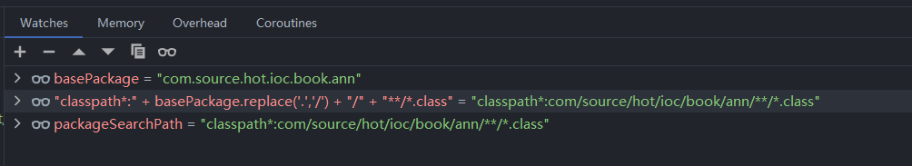


在得到一个以`classpath`开头的路径地址后 Spring 会进行数据收集，主要将各个可能的 `class` 都收集并将其组装成 `FileSystemResource` 对象（也可能有其他类型的 `Resource` 对象），负责处理该行为的核心类是 `PathMatchingResourcePatternResolver` 。

- 收集 `Resource` 对象

```java
getResourcePatternResolver().getResources(packageSearchPath)
```

- 收集后的结果

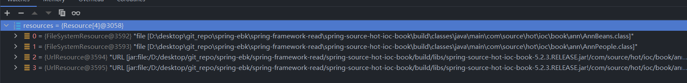

通过截图我们可以看到此时出现的数据是两种，第一种：文件形式的资源对象，第二种：Jar 形式的资源对象，接下来我们就需要对这两种资源进行转换，将其转换为 Bean Definition。

在处理 Resource 转换成 Bean Definition 的过程中核心是 `MetadataReaderFactory` 接口 ，我们先来看 `getMetadataReaderFactory().getMetadataReader(resource)` 处理后得到的对象

- `metadataReader` 数据信息 

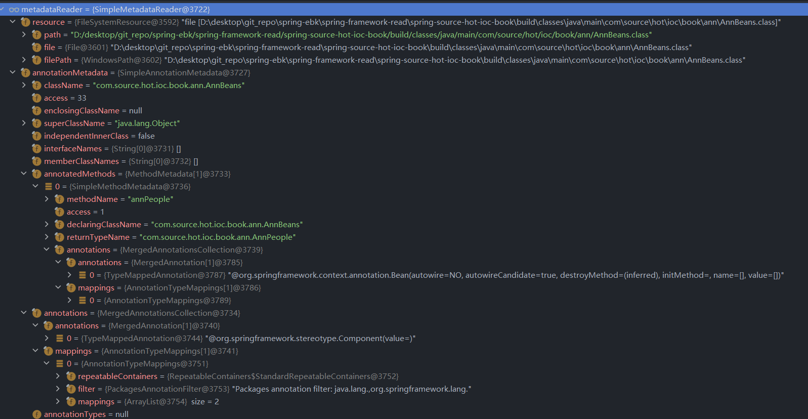 

我们现在得到的 `metadataReader` 在下面的操作中很重要，它可以帮我们转换成 Bean Definition，同时也可以帮助我们判断是否可以进行转换等一些操作。那么我们就跟着源码先来看第一个步骤：是否是 `Component`

- `isCandidateComponent` 方法详情

```java
protected boolean isCandidateComponent(MetadataReader metadataReader) throws IOException {
   for (TypeFilter tf : this.excludeFilters) {
      if (tf.match(metadataReader, getMetadataReaderFactory())) {
         return false;
      }
   }
   for (TypeFilter tf : this.includeFilters) {
      if (tf.match(metadataReader, getMetadataReaderFactory())) {
         return isConditionMatch(metadataReader);
      }
   }
   return false;
}
```

在这里涉及到两个列表

1. 第一：`includeFilters`，需要的类型过滤器
2. 第二：`excludeFilters`，排除的类型过滤器

在这两个列表中 `includeFilters` 中存放了 `Component` 注解的类型过滤器，先来看 `includeFilters` 的相关内容

- `includeFilters` 数据信息

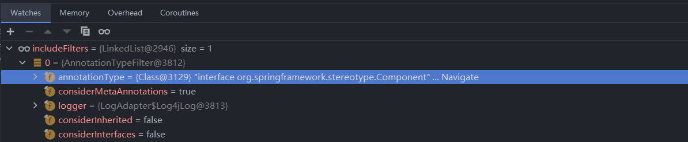

看过了`includeFilters` 的数据内容后，我们来看 `MetadataReaderFactory` 的数据信息

- `MetadataReaderFactory` 数据信息

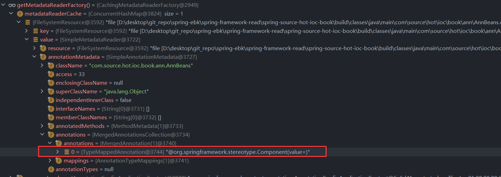


通过两张图的比较我们可以发现：**被检测对象包含 `Component` 注解**，到这里就是 `tf.match(metadataReader, getMetadataReaderFactory())` 方法的分析了，在完成这段代码后会进行第二层操作：**注解 `Conditional` 的验证**。我们在测试用例中没有标记该注解因此这段代码就不进入分析，那么没有 `Conditional` 注解会直接返回 `true`。

当我们完成了上述操作后也就是完成了 `ClassPathScanningCandidateComponentProvider#scanCandidateComponents` 方法中 `isCandidateComponent(metadataReader)` 的判断，现在我们可以开始 Bean Definition 的创建了，在这里我们创建的 Bean Definition 具体是 `ScannedGenericBeanDefinition` 下面我们来看基本数据设置后的结果。

- `ScannedGenericBeanDefinition` 数据信息

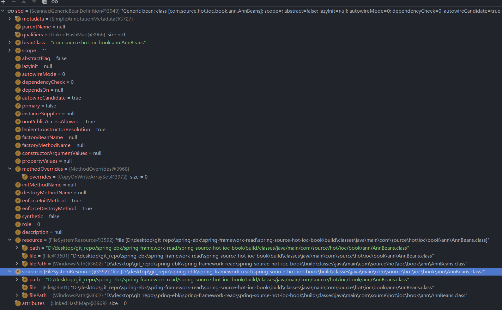

现在我们拥有了 Bean Definition 还需要做最后一件事：**判断是否候选**，只有通过候选判断的 Bean Definition 才可以放入候选集合最后返回。下面我们来看候选方法的内容。

- `isCandidateComponent` 方法详情

```java
protected boolean isCandidateComponent(AnnotatedBeanDefinition beanDefinition) {
   // 从 注解的bean定义中获取注解元信息
   AnnotationMetadata metadata = beanDefinition.getMetadata();
   // 1. 是否独立
   // 2. 是否可以创建
   // 3. 是否 abstract 修饰
   // 4. 是否有 Lookup 注解
   return (metadata.isIndependent() && (metadata.isConcrete() ||
         (metadata.isAbstract() && metadata.hasAnnotatedMethods(Lookup.class.getName()))));
}
```

判断项目：

1. 第一项：`isIndependent()`，判断是否属于独立类，独立类的概念是指该类不存在父类（Object 除外），该类不是某个类的内部类。
2. 第二项：`isConcrete`，判断是否可以创建，是否可以创建的判断是判断该类是否是接口，是否是 `Abstract` 修饰的类。
3. 第三项：`isAbstract()`，判断该类是否是 `Abstract` 修饰。
4. 第四项：`hasAnnotatedMethods(Lookup.class.getName())`，判断该类是否存在 `Lookup` 注解 。

通过 `isCandidateComponent` 中的判断后就会被加入到 Bean Definition 容器中最后返回出去。

- 最终得到的 Bean Definition 集合


在这个阶段的处理中我们遇到了下面这些接口

1. `ResourcePatternResolver` ，具体实现类 `PathMatchingResourcePatternResolver`
2. `MetadataReaderFactory`，具体实现类 `CachingMetadataReaderFactory`
3. `MetadataReader`

有关这三个接口的分析笔者会在第十八到第二十章中进行分析。


##### 17.2.2.2.2 `addCandidateComponentsFromIndex` 方法分析

前文我们了解了 `scanCandidateComponents` 方法的处理流程下面我们要来看 `addCandidateComponentsFromIndex` ，我们直接来进行源代码阅读

- `addCandidateComponentsFromIndex` 详细内容

```java
private Set<BeanDefinition> addCandidateComponentsFromIndex(CandidateComponentsIndex index, String basePackage) {
   // 候选 BeanDefinition
   Set<BeanDefinition> candidates = new LinkedHashSet<>();
   try {
      // 类型列表
      Set<String> types = new HashSet<>();
      // 导入的类型过滤器
      for (TypeFilter filter : this.includeFilters) {
         String stereotype = extractStereotype(filter);
         if (stereotype == null) {
            throw new IllegalArgumentException("Failed to extract stereotype from " + filter);
         }
         // 从组件索引中获取通过的类型放入容器
         types.addAll(index.getCandidateTypes(basePackage, stereotype));
      }
      boolean traceEnabled = logger.isTraceEnabled();
      boolean debugEnabled = logger.isDebugEnabled();
      // 类型处理
      for (String type : types) {
         MetadataReader metadataReader = getMetadataReaderFactory().getMetadataReader(type);
         // 是否是候选组件
         if (isCandidateComponent(metadataReader)) {
            AnnotatedGenericBeanDefinition sbd = new AnnotatedGenericBeanDefinition(
                  metadataReader.getAnnotationMetadata());

            // 是否是候选组件
            if (isCandidateComponent(sbd)) {
               if (debugEnabled) {
                  logger.debug("Using candidate component class from index: " + type);
               }
               candidates.add(sbd);
            }
            else {
               if (debugEnabled) {
                  logger.debug("Ignored because not a concrete top-level class: " + type);
               }
            }
         }
         else {
            if (traceEnabled) {
               logger.trace("Ignored because matching an exclude filter: " + type);
            }
         }
      }
   }
   catch (IOException ex) {
      throw new BeanDefinitionStoreException("I/O failure during classpath scanning", ex);
   }
   return candidates;
}
```

通过这段代码的阅读我们可以发现和 `scanCandidateComponents` 方法的差异就只有一点：**承载 Bean Definition 的对象不同**

1. `scanCandidateComponents` 中 Bean Defintion 的承载对象是 `ScannedGenericBeanDefinition`
2. `addCandidateComponentsFromIndex` 中 Bean Definition 的承载对象是 `AnnotatedGenericBeanDefinition`

除开这一个差异外其他的处理流程方法和 `scanCandidateComponents` 方法的处理相同，笔者不在此进行过多的叙述。


#### 17.2.2.3 单个 Bean Definition 的处理

通过 `findCandidateComponents` 方法我们已经获得了多个 Bean Definiton 下面我们就要将这些 Bean Definition 进一步进行处理

```java
for (BeanDefinition candidate : candidates) {
    // 获取 作用域元数据
    ScopeMetadata scopeMetadata = this.scopeMetadataResolver.resolveScopeMetadata(candidate);
    // 设置作用域
    candidate.setScope(scopeMetadata.getScopeName());
    // beanName 生成
    String beanName = this.beanNameGenerator.generateBeanName(candidate, this.registry);
    // 类型判断 AbstractBeanDefinition
    if (candidate instanceof AbstractBeanDefinition) {
        // bean 定义的后置处理
        postProcessBeanDefinition((AbstractBeanDefinition) candidate, beanName);
    }
    // 类型判断 AnnotatedBeanDefinition
    if (candidate instanceof AnnotatedBeanDefinition) {
        // 通用注解的处理
        AnnotationConfigUtils.processCommonDefinitionAnnotations((AnnotatedBeanDefinition) candidate);
    }
    // 候选检测
    if (checkCandidate(beanName, candidate)) {
        BeanDefinitionHolder definitionHolder = new BeanDefinitionHolder(candidate, beanName);
        // 作用于属性应用
        definitionHolder =
            AnnotationConfigUtils.applyScopedProxyMode(scopeMetadata, definitionHolder, this.registry);
        beanDefinitions.add(definitionHolder);
        // 注册 bean定义
        registerBeanDefinition(definitionHolder, this.registry);
    }
}

```


##### 17.2.2.3.1 处理1：Scope 相关处理。

处理 Scope 会将数据填写到 `scope` 字敦中

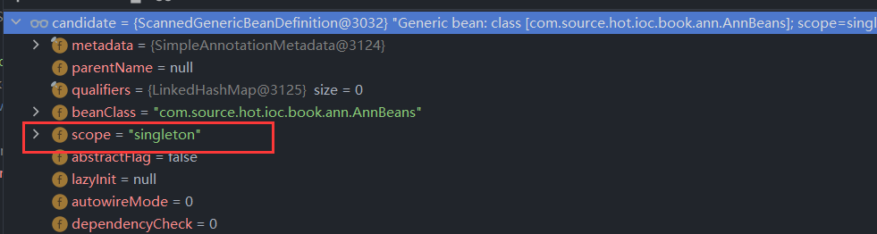

笔者将 `ScopeMetadataResolver` 的分析放在第二十一章中进行


##### 17.2.2.3.2 处理2：Bean Name 相关处理

通过 `BeanNameGenerator` 进行生成，这里具体操作的对象是 `AnnotationBeanNameGenerator` ，处理代码如下

```java
@Override
public String generateBeanName(BeanDefinition definition, BeanDefinitionRegistry registry) {
   if (definition instanceof AnnotatedBeanDefinition) {
      // 从注解中获取 beanName
      // 获取注解的value属性值
      String beanName = determineBeanNameFromAnnotation((AnnotatedBeanDefinition) definition);
      if (StringUtils.hasText(beanName)) {
         // Explicit bean name found.
         // 如果存在直接返回
         return beanName;
      }
   }
   // Fallback: generate a unique default bean name.
   // 默认beanName
   // 类名,首字母小写
   return buildDefaultBeanName(definition, registry);
}
```

在这个生成 Bean Name 的方法中有两个获取方式

1. 第一种：从 Spring 的注解中获取 value 数据作为 Bean Name
2. 第二种：将类名首字母小写返回

在了解了处理方式后我们来看对象的处理结果

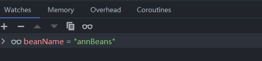


关于注解模式下的 Bean Name 获取笔者将在第二十二章中和各位做更多的分析。


##### 17.2.2.3.3 处理3.1：Bean Definiton 默认值处理

有关 Bean Name 的处理已经完成下面我们要进行 Bean Definition 中的部分成员变量的默认值填充。首先我们来看填充默认值之前的 Bean Definition 对象

- 填充前 Bean Definition 数据

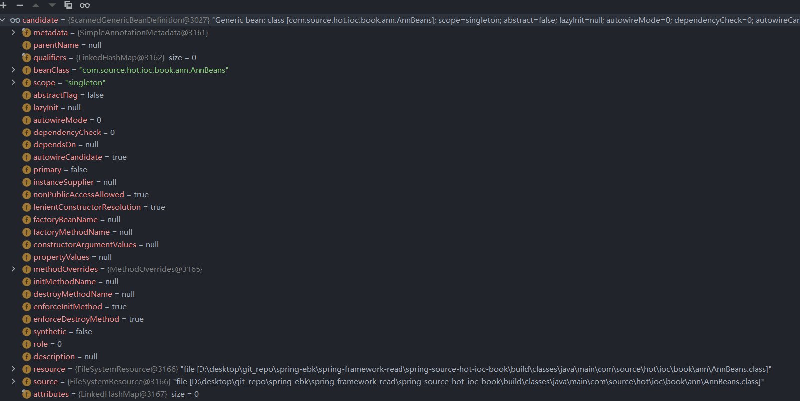


- 填充后 Bean Definition 数据

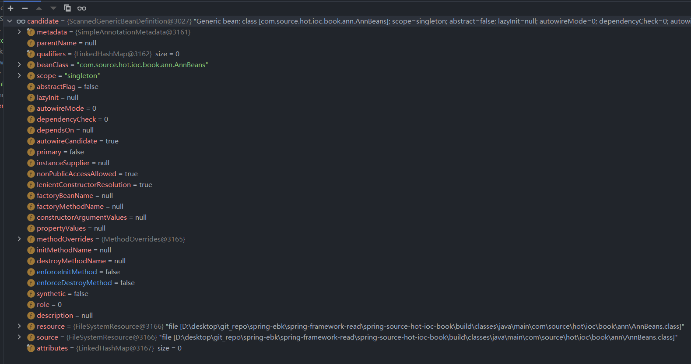 

从执行前后对比来看似乎没有多少数据被填充额外数据。下面我们来看 `postProcessBeanDefinition` 方法中的代码来确定到底哪些数据会被填充。

```java
protected void postProcessBeanDefinition(AbstractBeanDefinition beanDefinition, String beanName) {
   // 应用默认值
   beanDefinition.applyDefaults(this.beanDefinitionDefaults);
   if (this.autowireCandidatePatterns != null) {
      // 设置 autowireCandidate 模式
      // AUTOWIRE_BY_TYPE 或者 AUTOWIRE_BY_NAME
      beanDefinition.setAutowireCandidate(PatternMatchUtils.simpleMatch(this.autowireCandidatePatterns, beanName));
   }
}
```

第一个被填充的是从 Bean Definition 中进行的，对应的填充数据代码如下

```java
public void applyDefaults(BeanDefinitionDefaults defaults) {
   Boolean lazyInit = defaults.getLazyInit();
   if (lazyInit != null) {
      setLazyInit(lazyInit);
   }
   setAutowireMode(defaults.getAutowireMode());
   setDependencyCheck(defaults.getDependencyCheck());
   setInitMethodName(defaults.getInitMethodName());
   setEnforceInitMethod(false);
   setDestroyMethodName(defaults.getDestroyMethodName());
   setEnforceDestroyMethod(false);
}
```

在这段代码中我们可以看到填充的数据有

1. `lazyInit`
2. `autowireMode`
3. `dependencyCheck`
4. `initMethodName`
5. `enforceInitMethod`
6. `destroyMethodName`
7. `enforceDestroyMethod`

除了这些填充以外在方法 `postProcessBeanDefinition` 中还会对 `autowireCandidate` 属性进行补充。


##### 17.2.2.3.4 处理3.2：Spring 中通用注解的处理

在补充完成 Bean Definition 的一些基础属性后会进入 Spring 注解模式下的注解值解析设置属性的阶段。主要处理方法是 `AnnotationConfigUtils.processCommonDefinitionAnnotations((AnnotatedBeanDefinition) candidate)`，下面我们来看具体的处理内容

- `processCommonDefinitionAnnotations` 核心方法

```java
static void processCommonDefinitionAnnotations(AnnotatedBeanDefinition abd, AnnotatedTypeMetadata metadata) {
   AnnotationAttributes lazy = attributesFor(metadata, Lazy.class);
   if (lazy != null) {
      abd.setLazyInit(lazy.getBoolean("value"));
   }
   else if (abd.getMetadata() != metadata) {
      lazy = attributesFor(abd.getMetadata(), Lazy.class);
      if (lazy != null) {
         abd.setLazyInit(lazy.getBoolean("value"));
      }
   }

   if (metadata.isAnnotated(Primary.class.getName())) {
      abd.setPrimary(true);
   }
   AnnotationAttributes dependsOn = attributesFor(metadata, DependsOn.class);
   if (dependsOn != null) {
      abd.setDependsOn(dependsOn.getStringArray("value"));
   }

   AnnotationAttributes role = attributesFor(metadata, Role.class);
   if (role != null) {
      abd.setRole(role.getNumber("value").intValue());
   }
   AnnotationAttributes description = attributesFor(metadata, Description.class);
   if (description != null) {
      abd.setDescription(description.getString("value"));
   }
}
```

在这段代码中我们可以看到它处理了 Spring 注解模式下的一些注解，这些注解有 `Lazy`DependsOn 、`Role` 和 `Description`


##### 17.2.2.3.5 处理4：代理相关的 Scope 设置

在处理完成 Spring 中的常用注解后，Spring 会创建 Scope Proxy Bean Definition 。在创建之前会有两层验证。

1. 第一层：`checkCandidate` ，当前 Bean Name 和 Bean Definiton 对象是否是候选关系。 
2. 第二层：`scopedProxyMode.equals(ScopedProxyMode.NO)` ，ScopedProxyMode 属性是否是 NO ，如果是 NO 就直接返回


我们先来看 `checkCandidate` 方法

- `checkCandidate` 方法详情

```java
protected boolean checkCandidate(String beanName, BeanDefinition beanDefinition) throws IllegalStateException {
   // 当前注册器中是否包含 beanName
   if (!this.registry.containsBeanDefinition(beanName)) {
      return true;
   }
   // 注册器中的 beanName 的 beanInstance
   BeanDefinition existingDef = this.registry.getBeanDefinition(beanName);
   BeanDefinition originatingDef = existingDef.getOriginatingBeanDefinition();
   if (originatingDef != null) {
      existingDef = originatingDef;
   }
   // 两个对象是否兼容
   if (isCompatible(beanDefinition, existingDef)) {
      return false;
   }
   throw new ConflictingBeanDefinitionException("Annotation-specified bean name '" + beanName +
         "' for bean class [" + beanDefinition.getBeanClassName() + "] conflicts with existing, " +
         "non-compatible bean definition of same name and class [" + existingDef.getBeanClassName() + "]");
}
protected boolean isCompatible(BeanDefinition newDefinition, BeanDefinition existingDefinition) {
		// 1. 是否是 ScannedGenericBeanDefinition 类型
		// 2. source 是否相同
		// 3. 参数是否相同
    return (!(existingDefinition instanceof ScannedGenericBeanDefinition) ||  // explicitly registered overriding bean
            (newDefinition.getSource() != null && newDefinition.getSource().equals(existingDefinition.getSource())) ||  // scanned same file twice
            newDefinition.equals(existingDefinition));  // scanned equivalent class twice
}
```

该方法的租用是判断容器中 Bean Name 对应的 Bean Definition 和 当前需要进行验证的 Bean Definition作用域是否相同，两个 Bean Definition 的 `equals` 方法是否相同

通过 `checkCandidate` 方法验证后我们来看 `applyScopedProxyMode` 方法处理细节。

- `applyScopedProxyMode` 方法详情

```java
static BeanDefinitionHolder applyScopedProxyMode(
      ScopeMetadata metadata, BeanDefinitionHolder definition, BeanDefinitionRegistry registry) {

   ScopedProxyMode scopedProxyMode = metadata.getScopedProxyMode();
   if (scopedProxyMode.equals(ScopedProxyMode.NO)) {
      return definition;
   }
   boolean proxyTargetClass = scopedProxyMode.equals(ScopedProxyMode.TARGET_CLASS);
   return ScopedProxyCreator.createScopedProxy(definition, registry, proxyTargetClass);
}
```

这里对于是否需要进行代理对象的创建(创建存在代理标记的 Bean Definition Holder 对象)表示的很明确：作用域解析结果不是`NO` 就进行代理对象创建。下面我们来看代理对象创建的方法

- 代理 Bean Definition Holder 的创建过程

```java
public static BeanDefinitionHolder createScopedProxy(BeanDefinitionHolder definition,
		BeanDefinitionRegistry registry, boolean proxyTargetClass) {

	// 提取原始的 Bean Name
	String originalBeanName = definition.getBeanName();
	// 从 Bean Definition Holder 中获取 Bean Defintion
	BeanDefinition targetDefinition = definition.getBeanDefinition();
	// 计算 BeanName
	String targetBeanName = getTargetBeanName(originalBeanName);

	// 创建代理的 Bean Definition 对象，数据会从原始的 Bean Definition 中迁移部分
	RootBeanDefinition proxyDefinition = new RootBeanDefinition(ScopedProxyFactoryBean.class);
	proxyDefinition.setDecoratedDefinition(new BeanDefinitionHolder(targetDefinition, targetBeanName));
	proxyDefinition.setOriginatingBeanDefinition(targetDefinition);
	proxyDefinition.setSource(definition.getSource());
	proxyDefinition.setRole(targetDefinition.getRole());

	// 添加属性：targetBeanName
	proxyDefinition.getPropertyValues().add("targetBeanName", targetBeanName);
	if (proxyTargetClass) {
		targetDefinition.setAttribute(AutoProxyUtils.PRESERVE_TARGET_CLASS_ATTRIBUTE, Boolean.TRUE);
		// ScopedProxyFactoryBean's "proxyTargetClass" default is TRUE, so we don't need to set it explicitly here.
	}
	else {
		proxyDefinition.getPropertyValues().add("proxyTargetClass", Boolean.FALSE);
	}

	proxyDefinition.setAutowireCandidate(targetDefinition.isAutowireCandidate());
	proxyDefinition.setPrimary(targetDefinition.isPrimary());
	if (targetDefinition instanceof AbstractBeanDefinition) {
		proxyDefinition.copyQualifiersFrom((AbstractBeanDefinition) targetDefinition);
	}

	targetDefinition.setAutowireCandidate(false);
	targetDefinition.setPrimary(false);

	// 将当前代理的对象注册到容器中
	registry.registerBeanDefinition(targetBeanName, targetDefinition);

	// 创建返回对象
	return new BeanDefinitionHolder(proxyDefinition, originalBeanName, definition.getAliases());
}

```

在这个创建代理的 Bean Definition Holder 过程中各位可以比较清晰的看到这里操作是将原始 Bean Definiiton 和目标 Bean Definition 的属性拷贝的过程。


##### 17.2.2.3.6 处理5：注册到容器

现在我们拥有了 Bean Definition Holder 对象，下面就是将该对象注册到 Spring 容器中。

- `BeanDefinitionReaderUtils#registerBeanDefinition` 方法详情

```java
public static void registerBeanDefinition(
      BeanDefinitionHolder definitionHolder, BeanDefinitionRegistry registry)
      throws BeanDefinitionStoreException {

   // Register bean definition under primary name.
   // 获取 beanName
   String beanName = definitionHolder.getBeanName();
   // 注册bean definition
   registry.registerBeanDefinition(beanName, definitionHolder.getBeanDefinition());

   // Register aliases for bean name, if any.
   // 别名列表
   String[] aliases = definitionHolder.getAliases();
   // 注册别名列表
   if (aliases != null) {
      for (String alias : aliases) {
         registry.registerAlias(beanName, alias);
      }
   }
}
```

对于 Bean Definition 的注册操作这一点和Spring XML 模式中是一模一样，在这里笔者不在做分析了，具体各位可以参考第七章-BeanDefinition注册。

通过这一层层的处理我们终于看完了 Spring 在注解模式下通过 `basePackages` 模式启动上下文的过程，下面我们来看看 Spring 容器中现在存在什么数据。

- 解析后的上下文数据

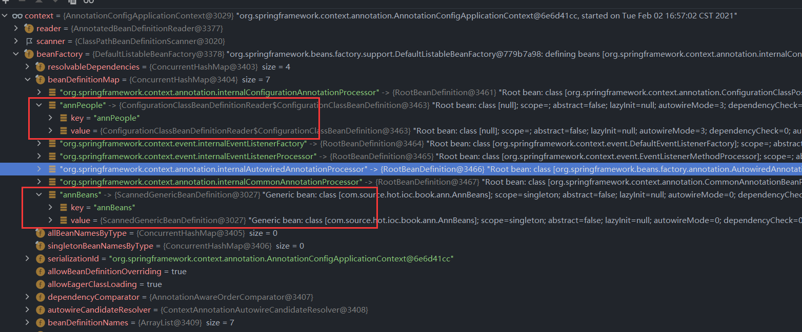

这张图片的数据是在`new AnnotationConfigApplicationContext` 之后得到的，我们在 `scan` 阶段得到的数据只有 `annBeans` 这个 Bean Definition。

- `scan` 执行后的数据信息

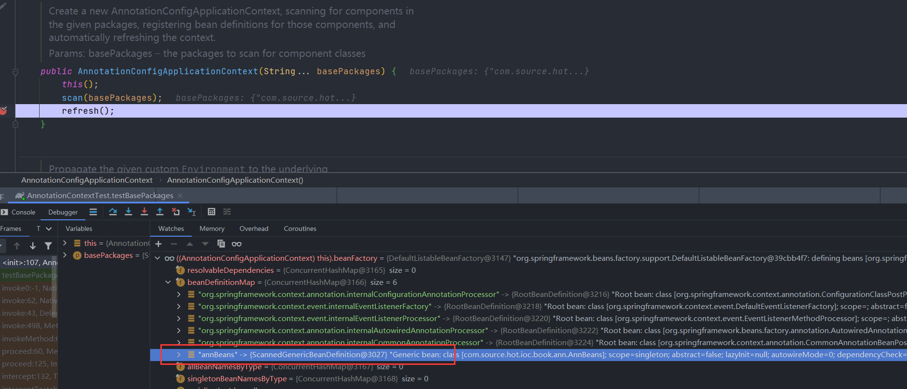

通过这两个对比我们发现 Bean Definition 的设置应该是在 `refresh` 中，在 `refresh` 方法中有一个处理 `BeanFactoryPostProcessor` 的方法（处理方法：`invokeBeanFactoryPostProcessors(beanFactory)`），也就是在这个方法执行之后我们可以看到出现了`annPeople` 的 Bean Definition 描述，下面我们将断点放在该方法之后来看看数据信息。

- `invokeBeanFactoryPostProcessors(beanFactory)` 调用后的数据

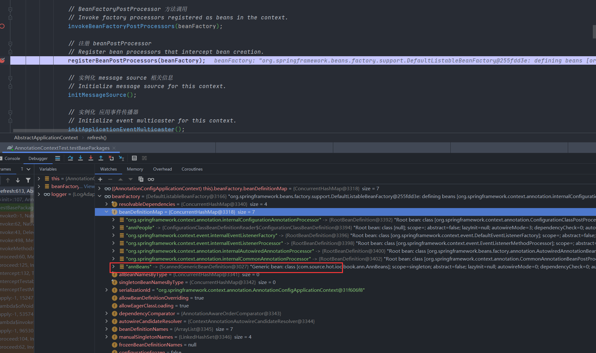

在这里我们需要关注 `org.springframework.context.annotation.ConfigurationClassPostProcessor` 对象的一些处理方式。关于这个对象的分析笔者将在第二十三章中进行分析。现在我们就只需要知道通过 `ConfigurationClassPostProcessor` 类的处理可以将 Spring 的 `@Bean` 注入到 Spring 容器中即可。


## 17.3 `componentClasses` 模式启动 

在前文笔者和各位一起分析了 `basePackages` 模式，下面我们将进入 `componentClasses` 模式的源码分析，我们先来看这种模式的构造函数。

- `componentClasses` 模式的构造器

```java
public AnnotationConfigApplicationContext(Class<?>... componentClasses) {
   this();
   register(componentClasses);
   refresh();
}
```

- `this()` 这一段代码的目的是为了创建 `AnnotatedBeanDefinitionReader` 和 `ClassPathBeanDefinitionScanner` 


### 17.3.1 `register` 方法分析

下面我们来看这里比较重要的方法 `register` 中的代码实现

- `register` 方法详情

```java
@Override
public void register(Class<?>... componentClasses) {
   Assert.notEmpty(componentClasses, "At least one component class must be specified");
   this.reader.register(componentClasses);
}
```

光看这样一段代码可以看到的信息不是那么多我们需要进一步往下搜索代码，通过搜索我们可以找到处理单个类的方法是 `org.springframework.context.annotation.AnnotatedBeanDefinitionReader#doRegisterBean`，这个方法也是我们对于 `register` 方法分析的重点，请各位读者先进行源代码阅读。

- `register` 中单个类的处理

```java
private <T> void doRegisterBean(Class<T> beanClass, @Nullable String name,
      @Nullable Class<? extends Annotation>[] qualifiers, @Nullable Supplier<T> supplier,
      @Nullable BeanDefinitionCustomizer[] customizers) {

   // 带有注解的泛型bean定义
   AnnotatedGenericBeanDefinition abd = new AnnotatedGenericBeanDefinition(beanClass);
   // 和条件注解相关的函数
   if (this.conditionEvaluator.shouldSkip(abd.getMetadata())) {
      return;
   }

   // 设置实例提供者
   abd.setInstanceSupplier(supplier);
   // 解析 注解的 beanDefinition 的作用域元数据
   ScopeMetadata scopeMetadata = this.scopeMetadataResolver.resolveScopeMetadata(abd);
   // 设置 作用域元数据
   abd.setScope(scopeMetadata.getScopeName());
   // beanName 处理
   String beanName = (name != null ? name : this.beanNameGenerator.generateBeanName(abd, this.registry));

   // 通用注解的处理
   AnnotationConfigUtils.processCommonDefinitionAnnotations(abd);
   if (qualifiers != null) {
      for (Class<? extends Annotation> qualifier : qualifiers) {
         if (Primary.class == qualifier) {
            abd.setPrimary(true);
         }
         else if (Lazy.class == qualifier) {
            abd.setLazyInit(true);
         }
         else {
            abd.addQualifier(new AutowireCandidateQualifier(qualifier));
         }
      }
   }
   // 自定义的beanDefinition处理
   if (customizers != null) {
      for (BeanDefinitionCustomizer customizer : customizers) {
         customizer.customize(abd);
      }
   }

   // 创建 beanDefinition Holder 后进行注册
   BeanDefinitionHolder definitionHolder = new BeanDefinitionHolder(abd, beanName);
   // 应用作用域代理
   definitionHolder = AnnotationConfigUtils.applyScopedProxyMode(scopeMetadata, definitionHolder, this.registry);
   BeanDefinitionReaderUtils.registerBeanDefinition(definitionHolder, this.registry);
}
```

可以看到这个方法的处理时限是比较多的，下面我们先来整理这个方法中处理了那些事项：

1. 第一项：将 beanClass 转换成 `AnnotatedGenericBeanDefinition`
2. 第二项：条件注解（`@Conditional`） 的判断
3. 第三项：scope 元数据解析
4. 第四项：注解模式下的 Bean Name 处理
5. 第五项：Spring 注解模式下通用注解处理
6. 第六项：注解 `@Qualifier` 的处理
7. 第七项：自定义的 Bean Definition 处理
8. 第八项：Bean Definition 关于 scope 代理处理
9. 第九项：注册Bean Definition Holder

在着九项操作中笔者在分析 `basepackages` 模式的时候也有部分提到这里不在展开叙述。第二项中关于条件注解的分析笔者会在第二十四章和各位读者一起讨论。现在我们来看第一项中的代码

- 通过 Bean Class 构造一个最小元素的 Bean Definition

```java
public AnnotatedGenericBeanDefinition(Class<?> beanClass) {
   setBeanClass(beanClass);
   this.metadata = AnnotationMetadata.introspect(beanClass);
}
```

在这段代码中我们可以看到 `AnnotationMetadata` 类，该类在注解模式下承担了及其重要的工作：**整合注解数据**，下面我们来看我们测试用例中的数据处理结果。


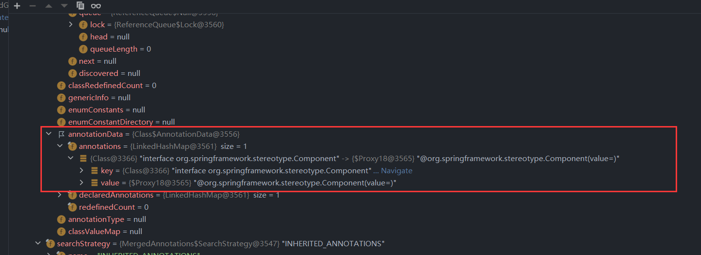

在这张图中我们可以简单的看到一些相对敏感的一些数据，这些内容笔者会在后续章节中一点点拨开，现在我们只需要知道 `metadata` 存了Bean Class 和 Spring 的注解信息就可以了。

通过这里整个方法的处理我们就会得到 Bean Definition Holder ，下面我们来简单看看当前的 Bean Definition Holder 的数据情况

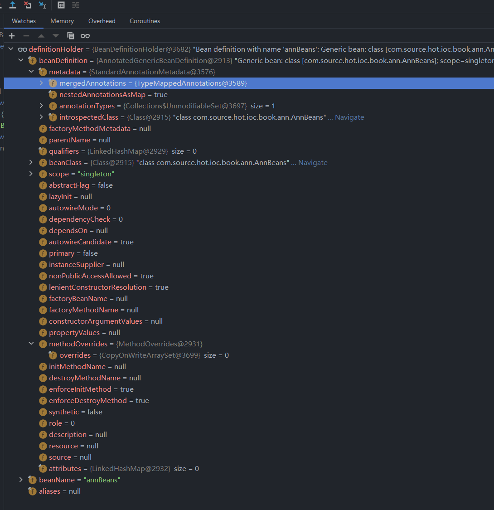

通过这样的方式就可以进行 `@Component` 标记的类注册到 Spring 容器中了，当我们完成了 `register` 方法后就会进入 `refresh` 方法，在整个`refresh` 方法中处理模式和 Spring XML 大同小异，这里我们会重点关注前文提到的 `ConfigurationClassPostProcessor` 对象。


## 17.4 总结

至此笔者对于 Spring 注解模式下的处理有了一个全局的分析和流程整理，下面我们来总结一下。

Spring 在注解模式下提供了两种不同的启动方式（上下文对象创建的两种方式），第一种是通过包路径进行处理，第二种是通过传入指定的 Bean Class。Spring 为了处理这两种方式分别提供了两个不同的处理对象，处理第一种的对象是 `ClassPathBeanDefinitionScanner` ，处理第二种的对象是 `AnnotatedBeanDefinitionReader`，针对这两种不同的处理方式还有两个不同的 Bean Definition ，`ScannedGenericBeanDefinition` 和 `AnnotatedGenericBeanDefinition`，再进一步往下两者的处理方式都会回到我们熟悉的 `refresh` 方法中，说熟悉是这个方法我们在 Spring XML 分析中有了解，但是这个方法又不是那么熟悉，在其中有关于 `BeanFactoryPostProcessor` 的处理我们看到了一些新的内容，同时在本章中衍生除了很多类和接口，这些内容都会在后续章节中和各位一一解密。