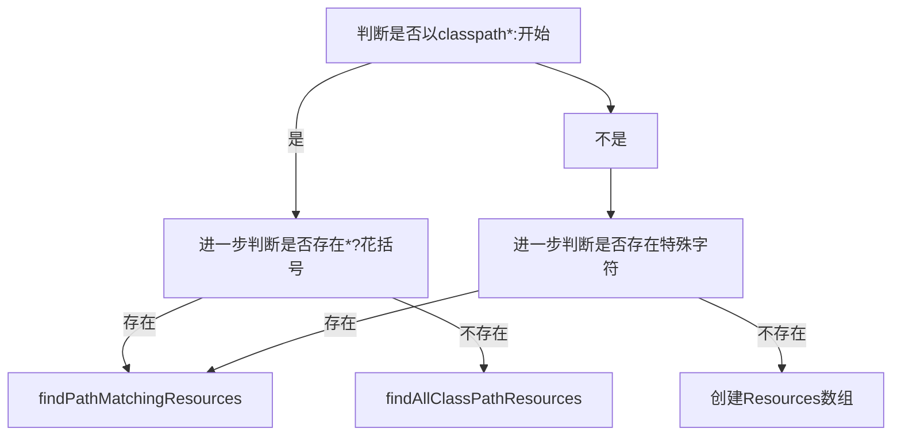

# 第十八章 资源解析器

在这一章笔者将和各位读者一起讨论资源解析器 `ResourcePatternResolver` 相关的一些源码内容。


## 18.1 测试环境搭建

为了对 `ResourcePatternResolver` 进行解析我们先来进行测试环境的搭建过程，这里我们搭建测试环境会使用 Spring 注解模式下的一些代码作为参考。

我们在 `org.springframework.context.annotation.ClassPathScanningCandidateComponentProvider#scanCandidateComponents` 方法中可以连续的看到这样的代码

```java
String packageSearchPath = ResourcePatternResolver.CLASSPATH_ALL_URL_PREFIX +
      resolveBasePackage(basePackage) + '/' + this.resourcePattern;
Resource[] resources = getResourcePatternResolver().getResources(packageSearchPath);
```

根据这里的代码和笔者在第十七章做的一些分析，笔者整理出下面这段代码

```java
public class ResourcePatternResolverTest {
	@Test
	void testResourcePatternResolver() throws IOException {
		ResourcePatternResolver resourcePatternResolver = new PathMatchingResourcePatternResolver();
		String basePackage = "com.source.hot.ioc.book.ioc";
		String packageSearchPath = ResourcePatternResolver.CLASSPATH_ALL_URL_PREFIX +
				resolveBasePackage(basePackage) + "/" + "**/*.class";
		Resource[] resources = resourcePatternResolver.getResources(packageSearchPath);
		System.out.println();
	}


	@Test
	void testGetResource(){
		ResourcePatternResolver resourcePatternResolver = new PathMatchingResourcePatternResolver();
		String basePackage = resolveBasePackage("com.source.hot.ioc.book.ioc.ResourcePatternResolverTest.class");
		String packageSearchPath = ResourcePatternResolver.CLASSPATH_ALL_URL_PREFIX +
				basePackage;
		Resource resource = resourcePatternResolver.getResource(packageSearchPath);
		System.out.println();
	}

	private String resolveBasePackage(String basePackage){
		return basePackage.replace(".", "/");
	}
}
```

通过这样一段代码我们就可以来进行资源解析器的源代码分析工作。


## 18.2 类图分析

首先我们来对 `ResourcePatternResolver` 的类图进行查看，通过类图先来了解一些基本关系。


在 Spring 中除了 `PathMatchingResourcePatternResolver` 和 `ServletContextResourcePatternResolver` 以外还有一些 `ApplicationContext` 也同时继承了 `ResourcePatternResolver` 这里笔者就不列出来了。在 Spring IoC 中主要使用到的是 `PathMatchingResourcePatternResolver`。下面我们来看 `ResourceLoader` 和 `ResourcePatternResolver` 的代码细节。


首先我们来看 `ResourceLoader`

```java
public interface ResourceLoader {

   String CLASSPATH_URL_PREFIX = “classpath:”;

   Resource getResource(String location);

   @Nullable
   ClassLoader getClassLoader();

}
```

其次我们来看 `ResourcePatternResolver`

```java
public interface ResourcePatternResolver extends ResourceLoader {

   String CLASSPATH_ALL_URL_PREFIX = "classpath*:";

   Resource[] getResources(String locationPattern) throws IOException;

}
```


现在我们知道了这两个接口中的方法定义下面我们来看 `PathMatchingResourcePatternResolver` 对它们的具体实现是怎么处理的。


## 18.2 `PathMatchingResourcePatternResolver` 构造器

一个类需要使用必不可少的一个操作是创建该对象，那么在 `PathMatchingResourcePatternResolver` 的构造器中做了什么呢，下面我们就来看看具体的代码。

- `PathMatchingResourcePatternResolver` 构造器

```java
public PathMatchingResourcePatternResolver() {
   this.resourceLoader = new DefaultResourceLoader();
}
```

在这段代码中它想要创造出 `ResourceLoader` 对象，这里创建的对象是 `DefaultResourceLoader` 下面我们来看看这个对象的一些成员变量和继承关系。


### 18.2.1 `DefaultResourceLoader` 中的成员变量

在 `DefaultResourceLoader` 中有三个成员变量关于它们的说明请查看下方的表格

| 变量名称            | 变量类型                          | 变量说明                                                     |
| ------------------- | --------------------------------- | ------------------------------------------------------------ |
| `classLoader`       | `ClassLoader`                     | 类加载器                                                     |
| `protocolResolvers` | `Set<ProtocolResolver>`           | 协议解析器集合，`ProtocolResolver` 定义了从字符串到`Resource`的解析函数，`ProtocolResolver` 是一个接口。 |
| `resourceCaches`    | `Map<Class<?>, Map<Resource, ?>>` | 资源缓存                                                     |


### 18.2.2 `DefaultResourceLoader` 类图

下面我们来看 `DefaultResourceLoader` 的类图


从这张图上我们可以看到 Spring 中对资源解析实现类的关系，在这里我们看到了几个熟悉的对象比如 `ClassPathXmlApplicationContext` 等，这里我们也不去深究每个资源解析器的实现了。


## 18.3 `getResource` 方法分析

构造器我们已经了解其内部的具体操作，下面我们来看 `getResource` 的代码实现。

- `PathMatchingResourcePatternResolver#getResource` 方法详情

```java
public Resource getResource(String location) {
   return getResourceLoader().getResource(location);
}
```

这里我们可以看到它使用的是 `ResourceLoader` 做具体的解析操作，在此之前我们通过构造函数了解到 `ResourceLoader` 具体是 `DefaultResourceLoader` ，现在我们找到了分析目标，笔者将 `DefaultResourceLoader` 中处理 `getResource` 的方法贴出


- `DefaultResourceLoader#getResource` 方法详情

```java
@Override
public Resource getResource(String location) {
   Assert.notNull(location, "Location must not be null");

   // 获取协议解析器列表 循环
   for (ProtocolResolver protocolResolver : getProtocolResolvers()) {
      Resource resource = protocolResolver.resolve(location, this);
      if (resource != null) {
         return resource;
      }
   }

   // 路径地址是 / 开头
   if (location.startsWith("/")) {
      return getResourceByPath(location);
   }
   // 地址路径是 classpath: 开头
   else if (location.startsWith(CLASSPATH_URL_PREFIX)) {
      return new ClassPathResource(location.substring(CLASSPATH_URL_PREFIX.length()), getClassLoader());
   }
   else {
      try {
         // Try to parse the location as a URL...
         // 尝试将 location 转换成 url 进行读取
         URL url = new URL(location);
         return (ResourceUtils.isFileURL(url) ? new FileUrlResource(url) : new UrlResource(url));
      }
      catch (MalformedURLException ex) {
         // No URL -> resolve as resource path.
         return getResourceByPath(location);
      }
   }
}
```

在这个方法中我们可以看到四种处理方式

1. 第一种：依靠协议解析接口(`ProtocolResolver`)进行处理

2. 第二种：待解析的资源路径是以 `/` 开头的处理，创建 `ClassPathContextResource` 对象返回

3. 第三种：待解析的资源路径是以 `classpath:` 开头的处理，创建 `ClassPathResource` 对象返回

4. 第四种：尝试创建 `URL` 对象

   创建成功：如果 `URL` 对象是文件类型的就返回 `FileUrlResource` 对象，否则就返回 `UrlResource` 对象

   创建失败：返回 `ClassPathContextResource` 对象

下面带入我们的测试用例，可以发现我们的测试用例中传递的数据是 `classpath*:com/source/hot/ioc/book/ioc/ResourcePatternResolverTest/class`，这个参数会被前面所有处理跳过进入第四种处理方式中的失败阶段得到 `ClassPathContextResource` 对象，下面我们来看执行后的数据情况 。

- 处理结果


## 18.4`getResources` 方法分析

下面我们来看 `getResources` 中的实现过程

- `PathMatchingResourcePatternResolver#getResources` 方法详情

```java
@Override
public Resource[] getResources(String locationPattern) throws IOException {
   Assert.notNull(locationPattern, "Location pattern must not be null");
   // 是否 classpath*: 开头
   if (locationPattern.startsWith(CLASSPATH_ALL_URL_PREFIX)) {
      // a class path resource (multiple resources for same name possible)
      // 正则验证是否通过
      // 判断是否包含 * 和 ？
      if (getPathMatcher().isPattern(locationPattern.substring(CLASSPATH_ALL_URL_PREFIX.length()))) {
         // a class path resource pattern
         // 解析 locationPattern 转换成资源接口
         return findPathMatchingResources(locationPattern);
      }
      else {
         // all class path resources with the given name
         // 寻找所有资源路径
         return findAllClassPathResources(locationPattern.substring(CLASSPATH_ALL_URL_PREFIX.length()));
      }
   }
   else {
      // Generally only look for a pattern after a prefix here,
      // and on Tomcat only after the "*/" separator for its "war:" protocol.
      // 前缀寻找模式
      // 查询 war * : 三种
      int prefixEnd = (locationPattern.startsWith("war:") ? locationPattern.indexOf("*/") + 1 :
            locationPattern.indexOf(':') + 1);
      if (getPathMatcher().isPattern(locationPattern.substring(prefixEnd))) {
         // a file pattern
         // 寻找匹配的资源路径
         return findPathMatchingResources(locationPattern);
      }
      else {
         // a single resource with the given name
         // 通过 ResourceLoader 解析得到这资源列表
         return new Resource[] {getResourceLoader().getResource(locationPattern)};
      }
   }
}
```

在阅读这段代码之后笔者将这段代码的处理流程整理出来，后续在对其中的一些细节方法进行分析。



- tips: 特殊字符是指 `war:`、`*/`和 `:`

在这个流程中我们需要先来认识 `PathMatcher` 的具体实现是那个类，在 Spring 中只有一个实现，这个实现就是 `AntPathMatcher`，下面我们来看在我们代码中出现的 `isPattern` 具体实现。

```java
@Override
public boolean isPattern(@Nullable String path) {
   if (path == null) {
      return false;
   }
   boolean uriVar = false;
   for (int i = 0; i < path.length(); i++) {
      char c = path.charAt(i);
      if (c == '*' || c == '?') {
         return true;
      }
      if (c == '{') {
         uriVar = true;
         continue;
      }
      if (c == '}' && uriVar) {
         return true;
      }
   }
   return false;
}
```

从这段代码中我们可以明确如果参数存在 `*` 、`?`、`{`和`}`就返回 `true`


### 18.4.1 `findPathMatchingResources` 方法分析

下面我们来看 `findPathMatchingResources` 中是如何处理 `locationPattern` 转换成 `Resource` 对象的

- `findPathMatchingResources` 方法详情

```java
protected Resource[] findPathMatchingResources(String locationPattern) throws IOException {
   // 确定 root 路径地址
   String rootDirPath = determineRootDir(locationPattern);
   // 切掉root地址留下真实地址
   String subPattern = locationPattern.substring(rootDirPath.length());

   // 第二部分
   // 获取 root 下的资源
   Resource[] rootDirResources = getResources(rootDirPath);
   Set<Resource> result = new LinkedHashSet<>(16);
   // 循环处理 root 下的资源对象
   for (Resource rootDirResource : rootDirResources) {
      // 解析资源
      // 目前而言spring没有做额外处理. 属于预留方法
      rootDirResource = resolveRootDirResource(rootDirResource);
      URL rootDirUrl = rootDirResource.getURL();
      /// 判断协议 是否是 bundle
      if (equinoxResolveMethod != null && rootDirUrl.getProtocol().startsWith("bundle")) {
         // equinoxResolveMethod 方法执行
         URL resolvedUrl = (URL) ReflectionUtils.invokeMethod(equinoxResolveMethod, null, rootDirUrl);
         if (resolvedUrl != null) {
            rootDirUrl = resolvedUrl;
         }
         // 解成 UrlResource 对象
         rootDirResource = new UrlResource(rootDirUrl);
      }
      // 协议是否是 vfs
      if (rootDirUrl.getProtocol().startsWith(ResourceUtils.URL_PROTOCOL_VFS)) {
         // 添加 vfs 相关资源
         result.addAll(VfsResourceMatchingDelegate.findMatchingResources(rootDirUrl, subPattern, getPathMatcher()));
      }
      // 协议是否是 jar
      else if (ResourceUtils.isJarURL(rootDirUrl) || isJarResource(rootDirResource)) {
         // 添加 jar 相关资源
         result.addAll(doFindPathMatchingJarResources(rootDirResource, rootDirUrl, subPattern));
      }
      else {
         // 文件协议处理
         result.addAll(doFindPathMatchingFileResources(rootDirResource, subPattern));
      }
   }
   if (logger.isTraceEnabled()) {
      logger.trace("Resolved location pattern [" + locationPattern + "] to resources " + result);
   }
   return result.toArray(new Resource[0]);
}
```

首先我们要来看最开始的两行代码

1. 确定`root` 路径，处理方法 `determineRootDir`。
2. 切掉root地址留下真实地址，这里的真实地址可以是要给匹配符号也可以是一个实际地址。

首先我们来看确定前置路径的代码 

- `determineRootDir` 方法详情

```java
protected String determineRootDir(String location) {
   int prefixEnd = location.indexOf(':') + 1;
   int rootDirEnd = location.length();
   while (rootDirEnd > prefixEnd && getPathMatcher().isPattern(location.substring(prefixEnd, rootDirEnd))) {
      rootDirEnd = location.lastIndexOf('/', rootDirEnd - 2) + 1;
   }
   if (rootDirEnd == 0) {
      rootDirEnd = prefixEnd;
   }
   return location.substring(0, rootDirEnd);
}
```

在这段代码中我们又看到了熟悉的方法 `isPattern`，各位如果遗忘了可以往前翻一翻回顾一下。

`determineRootDir` 处理的形式简单概括：字符串切割，具体操作流程如下

1. 切割`:`前的内容
2. 重复进行切分操作：将 `/` 符号一直切切到`/`后面的符号是 `*` 或者 `?` 停止

根据我们的测试用例我们可以来看现在的切分结果

- `locationPattern`：`classpath*:com/source/hot/ioc/book/ioc/**/*.class`
- `rootDirPath`：`classpath*:com/source/hot/ioc/book/ioc/`
- `subPattern`：`**/*.class`


在得到 `rootDirResources`后会将其转换为多个 `Resource` 这里会回到我们正在分析的 `getResources` 中，这里直接来看处理结果


在得到 `rootDirPath` 对应的资源列表后会进行单个资源的处理，这里对单个资源的处理是我们最关心的代码

- 单个资源的解析

```java
{
   // 解析资源
   // 目前而言spring没有做额外处理. 属于预留方法
   rootDirResource = resolveRootDirResource(rootDirResource);
   URL rootDirUrl = rootDirResource.getURL();
   /// 判断协议 是否是 bundle
   if (equinoxResolveMethod != null && rootDirUrl.getProtocol().startsWith("bundle")) {
      // equinoxResolveMethod 方法执行
      URL resolvedUrl = (URL) ReflectionUtils.invokeMethod(equinoxResolveMethod, null, rootDirUrl);
      if (resolvedUrl != null) {
         rootDirUrl = resolvedUrl;
      }
      // 解成 UrlResource 对象
      rootDirResource = new UrlResource(rootDirUrl);
   }
   // 协议是否是 vfs
   if (rootDirUrl.getProtocol().startsWith(ResourceUtils.URL_PROTOCOL_VFS)) {
      // 添加 vfs 相关资源
      result.addAll(VfsResourceMatchingDelegate.findMatchingResources(rootDirUrl, subPattern, getPathMatcher()));
   }
   // 协议是否是 jar
   else if (ResourceUtils.isJarURL(rootDirUrl) || isJarResource(rootDirResource)) {
      // 添加 jar 相关资源
      result.addAll(doFindPathMatchingJarResources(rootDirResource, rootDirUrl, subPattern));
   }
   else {
      // 文件协议处理
      result.addAll(doFindPathMatchingFileResources(rootDirResource, subPattern));
   }
}
```

在这段代码中我们可以看到两组操作

第一种：数据对象的前置准备

在这个阶段中处理代码只有两行

```java
rootDirResource = resolveRootDirResource(rootDirResource);
URL rootDirUrl = rootDirResource.getURL();
```

在现在的 Spring 版本中 (5.2.3.release) `resolveRootDirResource` 是一个直接将入参返回的方法，现在我们通过 `Resource` 接口提供的方法可以获得 `URL` 对象，在得到这个 `URL` 对象后我们就会进入到各个协议的处理。


第二种：各类协议的处理

在这里总共处理下面四类协议

1. `bundle`
2. `vfs`
3. jar 相关协议
4. 其他


现在我们了解了这四类协议我们要进一步了解每个协议的处理，首先我们来看 `bundle` 协议的处理


#### 18.4.1.1 bundle 协议处理

我们来看 `bundle` 协议的处理代码

```java
if (equinoxResolveMethod != null && rootDirUrl.getProtocol().startsWith("bundle")) {
   // equinoxResolveMethod 方法执行
   URL resolvedUrl = (URL) ReflectionUtils.invokeMethod(equinoxResolveMethod, null, rootDirUrl);
   if (resolvedUrl != null) {
      rootDirUrl = resolvedUrl;
   }
   // 解成 UrlResource 对象
   rootDirResource = new UrlResource(rootDirUrl);
}
```

在这段代码中我们看到了一个不认识的变量 `equinoxResolveMethod` ，我们需要先来认识该对象。在 `PathMatchingResourcePatternResolver` 中的静态代码块中有对该方法的定义。


```java
@Nullable
private static Method equinoxResolveMethod;

static {
   try {
      // Detect Equinox OSGi (e.g. on WebSphere 6.1)
      Class<?> fileLocatorClass = ClassUtils.forName("org.eclipse.core.runtime.FileLocator",
            PathMatchingResourcePatternResolver.class.getClassLoader());
      equinoxResolveMethod = fileLocatorClass.getMethod("resolve", URL.class);
      logger.trace("Found Equinox FileLocator for OSGi bundle URL resolution");
   }
   catch (Throwable ex) {
      equinoxResolveMethod = null;
   }
}
```

在这个静态代码块中回去寻找具体的 `Method` 赋值给 `equinoxResolveMethod`，这里不一定每次都会寻找到。假设我们现在有 `equinoxResolveMethod` 对象那么在处理 `bundle` 协议的时候会将这个方法反射调用得到 `URL` 对象并赋值给 `rootDirUrl` 同时创建新的 `rootDirResource` 对象。


#### 18.4.1.2 vfs 协议处理

下面我们来看 `vfs` 协议的处理，首先我们阅读处理代码

- `vfs` 协议处理

```java
if (rootDirUrl.getProtocol().startsWith(ResourceUtils.URL_PROTOCOL_VFS)) {
   // 添加 vfs 相关资源
   result.addAll(VfsResourceMatchingDelegate.findMatchingResources(rootDirUrl, subPattern, getPathMatcher()));
}
```

通过这段代码我们可以找到具体负责处理的方法是 `VfsResourceMatchingDelegate.findMatchingResources`，找到这段代码我们来进行源码阅读

```java
private static class VfsResourceMatchingDelegate {

   public static Set<Resource> findMatchingResources(
         URL rootDirURL, String locationPattern, PathMatcher pathMatcher) throws IOException {

      Object root = VfsPatternUtils.findRoot(rootDirURL);
      PatternVirtualFileVisitor visitor =
            new PatternVirtualFileVisitor(VfsPatternUtils.getPath(root), locationPattern, pathMatcher);
      VfsPatternUtils.visit(root, visitor);
      return visitor.getResources();
   }
}
```

在处理 `vfs` 协议中重点对象是 `PatternVirtualFileVisitor`和 `VfsPatternUtils` 在这个处理过程中我们可以简单理解在 `PatternVirtualFileVisitor` 中藏有我们需要的资源对象列表。具体的获取方式是通过反射获取，方法细节如下

```java
static void visit(Object resource, InvocationHandler visitor) throws IOException {
   Object visitorProxy = Proxy.newProxyInstance(
         VIRTUAL_FILE_VISITOR_INTERFACE.getClassLoader(),
         new Class<?>[] {VIRTUAL_FILE_VISITOR_INTERFACE}, visitor);
   invokeVfsMethod(VIRTUAL_FILE_METHOD_VISIT, resource, visitorProxy);
}
```

关于 `vfs` 的分析就到此结束了，笔者在这里对 `vfs` 的分析没有做到特别彻底，在继续往下走还会有不同的分支处理，这里就留给各位读者自行探索了。


#### 18.4.1.3 "jar" 协议处理

下面我们来看 "jar" 协议的处理操作

```java
// 协议是否是 jar
else if (ResourceUtils.isJarURL(rootDirUrl) || isJarResource(rootDirResource)) {
   // 添加 jar 相关资源
   result.addAll(doFindPathMatchingJarResources(rootDirResource, rootDirUrl, subPattern));
}
```

在这个处理过程中我们首当其冲要了解的内容就是那些是 `jar` 协议，回答这个问题的关键在 `isJarURL` 方法中

- `isJarURL` 方法详情

```java
public static boolean isJarURL(URL url) {
   String protocol = url.getProtocol();
   return (URL_PROTOCOL_JAR.equals(protocol) || URL_PROTOCOL_WAR.equals(protocol) ||
         URL_PROTOCOL_ZIP.equals(protocol) || URL_PROTOCOL_VFSZIP.equals(protocol) ||
         URL_PROTOCOL_WSJAR.equals(protocol));
}
```

在 `isJarURL` 方法中我们可以确定协议是那些情况的时候就会被 Spring 判断为属于 `jar` 协议。`jar` 、`war`、`zip`、 `vfszip` 和 `wsjar`。

了解了那些协议会被归属于 `jar` 协议后我们来看处理该类协议的方法 `doFindPathMatchingJarResources`。

在这个处理最终需要的 `jar` 类资源是围绕这样一个步骤进行：

1. 第一步：将 `URL` 对象转换成 `JarFile` 对象
2. 第二步：将 `JarFile` 下的所有资源提取出来（提取出来的对象是`JarEntry`），对每个 `JarEntry` 进行判断，判断是否和切分后的真实路径相匹配
3. 第三步：在第二步中匹配通过的创建出资源对象 `Resource`

`doFindPathMatchingJarResources` 方法详情

```java
protected Set<Resource> doFindPathMatchingJarResources(Resource rootDirResource, URL rootDirURL, String subPattern)
      throws IOException {

   URLConnection con = rootDirURL.openConnection();
   JarFile jarFile;
   String jarFileUrl;
   String rootEntryPath;
   boolean closeJarFile;

   // 是否是 jar 连接
   if (con instanceof JarURLConnection) {
      // Should usually be the case for traditional JAR files.
      JarURLConnection jarCon = (JarURLConnection) con;
      ResourceUtils.useCachesIfNecessary(jarCon);
      jarFile = jarCon.getJarFile();
      jarFileUrl = jarCon.getJarFileURL().toExternalForm();
      JarEntry jarEntry = jarCon.getJarEntry();
      rootEntryPath = (jarEntry != null ? jarEntry.getName() : "");
      closeJarFile = !jarCon.getUseCaches();
   }
   else {
      // No JarURLConnection -> need to resort to URL file parsing.
      // We'll assume URLs of the format "jar:path!/entry", with the protocol
      // being arbitrary as long as following the entry format.
      // We'll also handle paths with and without leading "file:" prefix.
      String urlFile = rootDirURL.getFile();
      try {
         // 确定是否是 war
         int separatorIndex = urlFile.indexOf(ResourceUtils.WAR_URL_SEPARATOR);
         if (separatorIndex == -1) {
            // 确定是否是 jar
            separatorIndex = urlFile.indexOf(ResourceUtils.JAR_URL_SEPARATOR);
         }
         // jar war 都不是的处理
         // 将 url 直接转换成 jarFile 对象
         if (separatorIndex != -1) {
            jarFileUrl = urlFile.substring(0, separatorIndex);
            rootEntryPath = urlFile.substring(separatorIndex + 2);  // both separators are 2 chars
            jarFile = getJarFile(jarFileUrl);
         }
         else {
            jarFile = new JarFile(urlFile);
            jarFileUrl = urlFile;
            rootEntryPath = "";
         }
         closeJarFile = true;
      }
      catch (ZipException ex) {
         if (logger.isDebugEnabled()) {
            logger.debug("Skipping invalid jar classpath entry [" + urlFile + "]");
         }
         return Collections.emptySet();
      }
   }

   try {
      if (logger.isTraceEnabled()) {
         logger.trace("Looking for matching resources in jar file [" + jarFileUrl + "]");
      }
      if (!"".equals(rootEntryPath) && !rootEntryPath.endsWith("/")) {
         // Root entry path must end with slash to allow for proper matching.
         // The Sun JRE does not return a slash here, but BEA JRockit does.
         rootEntryPath = rootEntryPath + "/";
      }
      Set<Resource> result = new LinkedHashSet<>(8);
      // 循环 jar file 得到资源对象
      for (Enumeration<JarEntry> entries = jarFile.entries(); entries.hasMoreElements();) {
         JarEntry entry = entries.nextElement();
         String entryPath = entry.getName();
         if (entryPath.startsWith(rootEntryPath)) {
            String relativePath = entryPath.substring(rootEntryPath.length());
            if (getPathMatcher().match(subPattern, relativePath)) {
               result.add(rootDirResource.createRelative(relativePath));
            }
         }
      }
      return result;
   }
   finally {
      if (closeJarFile) {
         jarFile.close();
      }
   }
}
```

在这段代码中我们可以分两段代码看，分别是两个 `try` 包裹的内容，第一个 `try` 是为了创建 `JarFile` 对象，第二个 `try` 是为了得到 `JarFile` 中对应的资源对象。


在前文笔者提到了在这个方法中的处理方式，下面笔者将这段代码做一个缩小版的 `JarFile` 的资源对象搜索

```java
	@Test
	void testJarFile() throws IOException {
		File f = new File("D:\\jar_repo\\org\\springframework\\spring-core\\5.2.3.RELEASE\\spring-core-5.2.3.RELEASE.jar");

		JarFile jarFile = new JarFile(f);

		for (Enumeration<JarEntry> entries = jarFile.entries(); entries.hasMoreElements(); ) {
			JarEntry entry = entries.nextElement();
			String entryPath = entry.getName();
			if (match(entryPath)) {
				System.out.println(entryPath);
			}
		}
	}

	private boolean match(String entryPath) {
		return entryPath.endsWith(".class");
	}

```

在这里笔者采用 `File` 来创建 `JarFile` 在 Spring 源码中使用的是 `URL` ，通过 `match` 方法来判断是否符合资源匹配要求，在笔者的例子中只要是以 `.class` 结尾就是符合的，在 Spring 中对于 `match` 存在两层判断，第一层：前置路径符合，第二层：后置路径符合，前置路径和后置路径分别对应 `findPathMatchingResources` 处理过程中最开始的两个变量 `rootDirPath` 和 `subPattern`，通过这两层判断就会被加入资源集合中。


#### 18.4.1.4 其他协议处理

当正在处理的 `URL` 对象的协议既不是 `vfs` 协议也不是 `jar` 类协议的时候会进入其他协议的处理，下面我们来看处理代码

- 其他协议处理

```java
else {
   result.addAll(doFindPathMatchingFileResources(rootDirResource, subPattern));
}
```

具体处理逻辑在 `doFindPathMatchingFileResources` 中我们继续向下追踪代码

```java
protected Set<Resource> doFindPathMatchingFileResources(Resource rootDirResource, String subPattern)
      throws IOException {

   File rootDir;
   try {
      // 绝对路径文件
      rootDir = rootDirResource.getFile().getAbsoluteFile();
   }
   catch (FileNotFoundException ex) {
      if (logger.isDebugEnabled()) {
         logger.debug("Cannot search for matching files underneath " + rootDirResource +
               " in the file system: " + ex.getMessage());
      }
      return Collections.emptySet();
   }
   catch (Exception ex) {
      if (logger.isInfoEnabled()) {
         logger.info("Failed to resolve " + rootDirResource + " in the file system: " + ex);
      }
      return Collections.emptySet();
   }
   // 查询匹配的文件系统资源
   return doFindMatchingFileSystemResources(rootDir, subPattern);
}
```

在这个方法中我们还要继续往下追踪代码。我们在继续往下追踪代码之前我们来看看 `rootDir` 是什么。

- `rootDir` 数据


在了解了 `rootDir` 中的数据后我们进一步往下看 `doFindMatchingFileSystemResources` 代码

- `doFindMatchingFileSystemResources` 方法详情

```java
protected Set<Resource> doFindMatchingFileSystemResources(File rootDir, String subPattern) throws IOException {
   if (logger.isTraceEnabled()) {
      logger.trace("Looking for matching resources in directory tree [" + rootDir.getPath() + "]");
   }
   // 搜索匹配文件
   Set<File> matchingFiles = retrieveMatchingFiles(rootDir, subPattern);
   Set<Resource> result = new LinkedHashSet<>(matchingFiles.size());
   for (File file : matchingFiles) {
      // 系统文件资源添加到结果容器
      result.add(new FileSystemResource(file));
   }
   return result;
}
```

在 `doFindMatchingFileSystemResources` 方法中做两件事

1. 第一件：将 `rootDir` 和 `subPattern` 进行匹配得到匹配的文件列表
2. 第二件：将匹配的文件列表转换成 `Resource` 具体是 `FileSystemResource`


下面我们来着重阅读匹配过程

```java
protected Set<File> retrieveMatchingFiles(File rootDir, String pattern) throws IOException {
   // 目录不存在
   if (!rootDir.exists()) {
      // Silently skip non-existing directories.
      if (logger.isDebugEnabled()) {
         logger.debug("Skipping [" + rootDir.getAbsolutePath() + "] because it does not exist");
      }
      return Collections.emptySet();
   }
   // 不是目录
   if (!rootDir.isDirectory()) {
      // Complain louder if it exists but is no directory.
      if (logger.isInfoEnabled()) {
         logger.info("Skipping [" + rootDir.getAbsolutePath() + "] because it does not denote a directory");
      }
      return Collections.emptySet();
   }
   // 不可读
   if (!rootDir.canRead()) {
      if (logger.isInfoEnabled()) {
         logger.info("Skipping search for matching files underneath directory [" + rootDir.getAbsolutePath() +
               "] because the application is not allowed to read the directory");
      }
      return Collections.emptySet();
   }
   // 转换成全路径
   String fullPattern = StringUtils.replace(rootDir.getAbsolutePath(), File.separator, "/");
   if (!pattern.startsWith("/")) {
      fullPattern += "/";
   }
   // 转换成全路径
   fullPattern = fullPattern + StringUtils.replace(pattern, File.separator, "/");

   // 最终结果容器
   Set<File> result = new LinkedHashSet<>(8);
   // 搜索匹配的文件
   doRetrieveMatchingFiles(fullPattern, rootDir, result);
   return result;
}
```

在这个匹配过程中我们可以看到有下面这些情况

1. 第一：文件不存在返回空集合
2. 第二：文件不是目录返回空集合
3. 第三：文件不可读返回空集合
4. 第四：解析全路径后进行匹配

我们主要关注第四点，下面我们来看代码中 `fullPattern` 的转换过程

1. 第一步：提取当前`rootDir` 的绝对地址。
2. 第二步：将绝对地址中的文件文件分隔符替换成 `/`。
3. 第三步：将 `pattern` (实际上就是 `subParttern`) 中的文件文件分隔符替换成 `/`。
4. 第四步：将第二步和第四步的结果相加得到完整的匹配符号

下面我们将测试用例的数据带入来看处理结果

第一步和第二步的结果：`D:/desktop/git_repo/spring-ebk/spring-framework-read/spring-source-hot-ioc-book/build/classes/java/test/com/source/hot/ioc/book/ioc`

第三步和第四步的结果：`D:/desktop/git_repo/spring-ebk/spring-framework-read/spring-source-hot-ioc-book/build/classes/java/test/com/source/hot/ioc/book/ioc/**/*.class`


现在数据准备工作完成了我们要进入真正意义上的匹配方法 `doRetrieveMatchingFiles` 的分析了，先来看代码

- `doRetrieveMatchingFiles` 方法详情

```java
protected void doRetrieveMatchingFiles(String fullPattern, File dir, Set<File> result) throws IOException {
   if (logger.isTraceEnabled()) {
      logger.trace("Searching directory [" + dir.getAbsolutePath() +
            "] for files matching pattern [" + fullPattern + "]");
   }
   // 循环文件夹下的所有文件
   for (File content : listDirectory(dir)) {
      // 当前需要处理的文件路径
      String currPath = StringUtils.replace(content.getAbsolutePath(), File.separator, "/");
      // 当前文件 是否是目录
      // 当前文件是否是以 根路径开头
      if (content.isDirectory() && getPathMatcher().matchStart(fullPattern, currPath + "/")) {
         if (!content.canRead()) {
            if (logger.isDebugEnabled()) {
               logger.debug("Skipping subdirectory [" + dir.getAbsolutePath() +
                     "] because the application is not allowed to read the directory");
            }
         }
         else {
            // 递归查询文件夹下的文件
            doRetrieveMatchingFiles(fullPattern, content, result);
         }
      }
      // 匹配放入数据
      if (getPathMatcher().match(fullPattern, currPath)) {
         result.add(content);
      }
   }
}
```

在这里我们着重关注的是 `match` 这个方法，该方法是我们判断当前文件路径是否符合匹配路径的重点。真正的处理方法：`org.springframework.util.AntPathMatcher#doMatch` 这里的字符串匹配算法需要各位读者进入自行理解，笔者下面来阐述一下比较过程(该过程和 `AntPathMatcher` 中的匹配过程存在差异)

- `fullPattern` ：`D:/desktop/git_repo/spring-ebk/spring-framework-read/spring-source-hot-ioc-book/build/classes/java/test/com/source/hot/ioc/book/ioc/**/*.class`
- `currPath`：`D:/desktop/git_repo/spring-ebk/spring-framework-read/spring-source-hot-ioc-book/build/classes/java/test/com/source/hot/ioc/book/ioc/A.class`

第一步：将`fullPattern` 中存在通配符的切割出来得到 `D:/desktop/git_repo/spring-ebk/spring-framework-read/spring-source-hot-ioc-book/build/classes/java/test/com/source/hot/ioc/book/ioc/` 和 `**/*.class`

第二步：将 `currPath` 切分成两组，切分依据是第一步得到的结果  `D:/desktop/git_repo/spring-ebk/spring-framework-read/spring-source-hot-ioc-book/build/classes/java/test/com/source/hot/ioc/book/ioc/` ，切分后成功会得到  `D:/desktop/git_repo/spring-ebk/spring-framework-read/spring-source-hot-ioc-book/build/classes/java/test/com/source/hot/ioc/book/ioc/` 和 `A.class` ，在这个切分结果中我们主要比较的是第二部分，在这里 `*` 会忽略比较直到出现非 `*` 字符，在这个例子中我们的字符是 `.` 匹配到 `A.class` 中的 `.` 在继续往下比较`class` 此时通过比较就是符合匹配条件的数据，反之不是符合条件的数据。 


通过匹配和文件转换我们就得到了 `Resource` 集合。也就是我们调用 `ResourcePatternResolver#getResources` 的结果了


### 18.4.2 `findAllClassPathResources` 方法分析

下面我们来看另一种获取 `Resource` 的方式 ：`findAllClassPathResources`

- `findAllClassPathResources` 方法详情

```java
protected Resource[] findAllClassPathResources(String location) throws IOException {
   String path = location;
   // 是否是 / 开头. 如果是去掉第一个/
   if (path.startsWith("/")) {
      path = path.substring(1);
   }
   // 查询方法
   Set<Resource> result = doFindAllClassPathResources(path);
   if (logger.isTraceEnabled()) {
      logger.trace("Resolved classpath location [" + location + "] to resources " + result);
   }
   return result.toArray(new Resource[0]);
}
```

在 `findAllClassPathResources` 方法中的重点是 `doFindAllClassPathResources` ，在做该数据处理前会做一个 `/` 为首的切割，即去掉第一个 `/` 符号。

下面我们来看 `doFindAllClassPathResources` 方法的细节

- `doFindAllClassPathResources` 方法详情

```java
protected Set<Resource> doFindAllClassPathResources(String path) throws IOException {
   // 结果对象
   Set<Resource> result = new LinkedHashSet<>(16);
   // 获取类加载器
   ClassLoader cl = getClassLoader();
   // 将 path 解析成 URL
   Enumeration<URL> resourceUrls = (cl != null ? cl.getResources(path) : ClassLoader.getSystemResources(path));
   while (resourceUrls.hasMoreElements()) {
      URL url = resourceUrls.nextElement();
      // url 对象转换成 UrlResource 放入结果集合
      result.add(convertClassLoaderURL(url));
   }
   if ("".equals(path)) {
      // The above result is likely to be incomplete, i.e. only containing file system references.
      // We need to have pointers to each of the jar files on the classpath as well...
      // jar 相关资源处理
      addAllClassLoaderJarRoots(cl, result);
   }
   return result;
}
```

在 `doFindAllClassPathResources` 存在两种 `Resource` 的处理方式

1. 第一种：将资源地址种的数据解析成为 `UrlResource` 
2. 第二种：资源地址为空字符串的情况下处理成为 `UrlResource`

第一种处理方式的核心方法是 `convertClassLoaderURL` 该方法的本质是 `new UrlResource(url)`

第二种处理方式的本质也是 `new UrlResource` 但是传入的参数不一样

- 第二种处理方式种关于 `UrlResource` 的创建

```
UrlResource jarResource = (ResourceUtils.URL_PROTOCOL_JAR.equals(url.getProtocol()) ?
      new UrlResource(url) :
      new UrlResource(ResourceUtils.JAR_URL_PREFIX + url + ResourceUtils.JAR_URL_SEPARATOR));
```

 第二种处理方式中还有另外一种 `UrlResource` 的创建，需要进行这种模式创建需要满足下面条件，当前`classLoader ` 和 Spring 中提供的系统类加载器相同。

- `UrlResource` 创建方式

```java
UrlResource jarResource = new UrlResource(ResourceUtils.JAR_URL_PREFIX +
      ResourceUtils.FILE_URL_PREFIX + filePath + ResourceUtils.JAR_URL_SEPARATOR);
```

 

通过这些方式我们就会得到 `Resource` 集合，在这里我们明确了具体的对象是 `UrlResource`


### 18.4.3 创建 `Resoruce` 数组

下面我们来看创建 `Resource` 的实现方式。

```java
new Resource[] {getResourceLoader().getResource(locationPattern)}
```

通过阅读上面这段代码和前文提到的`getResource` 方法的分析，我们很好理解这段代码的作用了，这里比展开描述了，如果忘记了各位可以往前在翻一翻前文的分析。


## 18.5 总结

在这一章节中笔者和各位一起探讨了在 Spring 中对于资源解析器的实现方式，主要介绍 `PathMatchingResourcePatternResolver` 中的实现，在对它的分析中我们了解了一些协议和对应协议的处理方式，以及间接了解到了 `Resource` 的一些实现类。