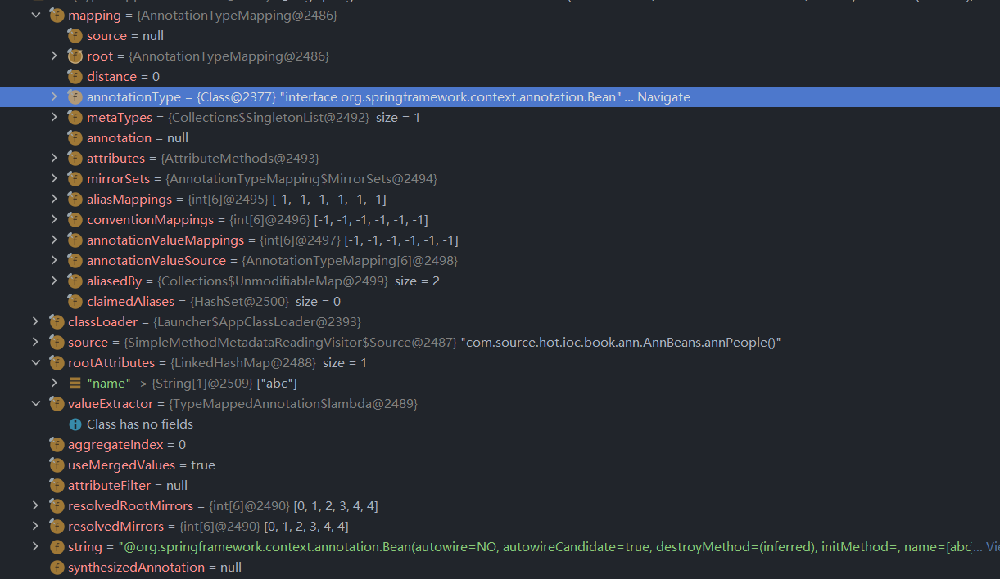

# 第二十章 注解元数据读取器

在这一章节中笔者将和各位一起讨论注解元数据读取器 `MetadataReader` 接口。


## 20.1 初识 `MetadataReader`

`MetadataReader` 接口是用来读取元数据的接口，它可以读取这两类元数据，第一类：`ClassMetadata` 类元数据，第二类：`AnnotationMetadata` 注解元数据。`MetadataReader` 在 Spring 中只有一个实现类 `SimpleMetadataReader` 我们的分析目标就是它。

我们先来阅读 `SimpleMetadataReader` 成员变量

```java
private static final int PARSING_OPTIONS = ClassReader.SKIP_DEBUG
      | ClassReader.SKIP_CODE | ClassReader.SKIP_FRAMES;

private final Resource resource;

private final AnnotationMetadata annotationMetadata;
```

在成员变量中我们可以看到存在三个属性，在这三个属性中的后两个属性就是我们所需要分析的方法返回值。

- 三个方法

```java
@Override
public Resource getResource() {
   return this.resource;
}

@Override
public ClassMetadata getClassMetadata() {
   return this.annotationMetadata;
}

@Override
public AnnotationMetadata getAnnotationMetadata() {
   return this.annotationMetadata;
}
```


我们对于 `SimpleMetadataReader` 的分析重点应该是在构造器中，我们来看构造器

```java
SimpleMetadataReader(Resource resource, @Nullable ClassLoader classLoader) throws IOException {
    SimpleAnnotationMetadataReadingVisitor visitor = new SimpleAnnotationMetadataReadingVisitor(classLoader);
    getClassReader(resource).accept(visitor, PARSING_OPTIONS);
    this.resource = resource;
    this.annotationMetadata = visitor.getMetadata();
}
```


在这个构造函数中我们可以直观的看到具体负责处理的对象是 `SimpleAnnotationMetadataReadingVisitor` , 下面我来看看该对象的一些细节。


##  20.2 `SimpleAnnotationMetadataReadingVisitor` 成员变量

- `SimpleAnnotationMetadataReadingVisitor` 成员变量表


| 变量名称 | 变量类型 | 变量说明 |
| -------- | -------- | -------- |
|   `classLoader`     | `ClassLoader` | 类加载器 |
|   `className`     | `String` | 类名 |
|   `access`     | `int` |          |
|   `superClassName`     | `String` | 父类名称 |
|   `interfaceNames`     | `String[]` | 实现的接口名称列表 |
|   `enclosingClassName`     | `String` | Return the name of the enclosing class of the underlying class, or null if the underlying class is a top-level class<br /> |
|   `independentInnerClass`     | `boolean` |          |
|   `memberClassNames`     | `Set<String>` | 成员类列表，内部类名称列表 |
|   `annotations`     | `List<MergedAnnotation<?>>` | 合并后的注解数据列表 |
|   `annotatedMethods`     | `List<SimpleMethodMetadata>` | 方法元数据列表 |
|   `metadata`   | `SimpleAnnotationMetadata` | 注解元数据 |
|   `source`     | `Source` | 源对象，存储`className` |


## 20.3 `SimpleAnnotationMetadata` 成员变量

- `SimpleAnnotationMetadata` 成员变量

| 变量名称 | 变量类型 | 变量说明 |
| -------- | -------- | -------- |
|    `className`    | `String` | 类名 |
|     `access`     | `int` |          |
|     `enclosingClassName`     | `String` | Return the name of the enclosing class of the underlying class, or null if the underlying class is a top-level class<br /> |
|     `superClassName`     | `String` | 父类名称 |
|     `independentInnerClass`     | `boolean` |          |
|     `interfaceNames`     | `String[]` | 实现的接口名称列表 |
|     `memberClassNames`     | `String[]` | 成员类列表，内部类名称列表 |
|     `annotatedMethods`     | `MethodMetadata[]` | 方法元数据 |
|     `annotations`     | `MergedAnnotations` | 合并的注解接口 |
|     `annotationTypes`     | `Set<String>` | 注解类型 |


## 20.4 `SimpleMethodMetadata` 成员变量

- `SimpleMethodMetadata` 成员变量

| 变量名称 | 变量类型 | 变量说明 |
| -------- | -------- | -------- |
|     `methodName`     | `String` | 方法名称 |
|     `access`     | `int` |          |
|     `declaringClassName`     | `String` | 类名 |
|     `returnTypeName`     | `String` | 返回值类型，返回值类全名称 |
|     `annotations`     | `MergedAnnotations` | 合并的注解 |


## 20.5 `MergedAnnotationsCollection` 成员变量


| 变量名称      | 变量类型                   | 变量说明                 |
| ------------- | -------------------------- | ------------------------ |
| `annotations` | `MergedAnnotation<?>[]`    | 合并的注解列表           |
| `mappings`    | `AnnotationTypeMappings[]` | 注解和类型的映射关系列表 |


## 20.6 `TypeMappedAnnotation` 成员变量

-  `TypeMappedAnnotation` 成员变量

| 变量名称 | 变量类型 | 变量说明 |
| -------- | -------- | -------- |
|     `mapping`     | `AnnotationTypeMapping` | 注解和类型的映射关系 |
|     `classLoader`     | `ClassLoader` | 类加载器 |
|     `source`     | `Object` | 元数据 |
|     `rootAttributes`     | `Object` | 根属性，注解的属性表 |
|     `valueExtractor`     | `BiFunction<Method, Object, Object>` |          |
|     `aggregateIndex`     | `int` |          |
|     `useMergedValues`     | `boolean` |          |
|     `attributeFilter`     | `Predicate<String>` |          |
|     `resolvedRootMirrors`     | `int[]` |          |
|     `resolvedMirrors`     | `int[]` |          |
|     `string`     | `String` | 注解的全量数据 |

下面笔者使用一个例子类将具体的数据对应关系表示出来

```java
@Bean(name = "abc")
public AnnPeople annPeople() {
   AnnPeople annPeople = new AnnPeople();
   annPeople.setName("people");
   return annPeople;
}
```



这里我们来看 `rootAttributes` 中的数据，它用来存储我们在`@Bean` 注解中的数据信息，我们这里主要关注这项数据就可以了其他的不是很重要。


## 20.7 `AnnotationTypeMappings` 成员变量

- `AnnotationTypeMappings` 成员变量

| 变量名称 | 变量类型 | 变量说明 |
| -------- | -------- | -------- |
|    `repeatableContainers`    | `RepeatableContainers` | 可重复容器 |
|    `filter`    | `AnnotationFilter` | 注解过滤器 |
|    `mappings`    | `List<AnnotationTypeMapping>` | 注解和类型的映射集合 |


## 20.8 `ClassMetadataReadingVisitor` 成员变量

- `ClassMetadataReadingVisitor` 成员变量

| 变量名称 | 变量类型 | 变量说明 |
| -------- | -------- | -------- |
|    `className`    | `String` | 类名 |
|   `isInterface`   | `boolean` | 是否是接口 |
|   `isAnnotation`   | `boolean` | 是否是注解 |
|   `isAbstract`   | `boolean` | 是否是 `abstract` 修饰 |
|   `isFinal`   | `boolean` | 是否是 `final` 修饰 |
|   `enclosingClassName`   | `String` | Return the name of the enclosing class of the underlying class, or null if the underlying class is a top-level class<br /> |
|   `independentInnerClass`   | `boolean` |          |
|   `superClassName`   | `String` | 父类名称 |
|   `interfaces`   | `String[]` | 实现的接口名称列表 |
|   `memberClassNames`   | `Set<String>` | 内部类列表 |


## 20.9 `AnnotationMetadataReadingVisitor` 成员变量

-  `AnnotationMetadataReadingVisitor` 成员变量

| 变量名称 | 变量类型 | 变量说明 |
| -------- | -------- | -------- |
| `classLoader`       | `ClassLoader` | 类加载器 |
| `annotationSet`       | `Set<String>` | 注解名称列表 |
| `metaAnnotationMap`       | `Map<String, Set<String>>` | key：注解名称<br />value：注解属性集合 |
| `attributesMap`       | `LinkedMultiValueMap<String, AnnotationAttributes>` | key：注解名称<br />value：注解属性对象 |
| `methodMetadataSet`       | `Set<MethodMetadata>` | 方法元数据 |

