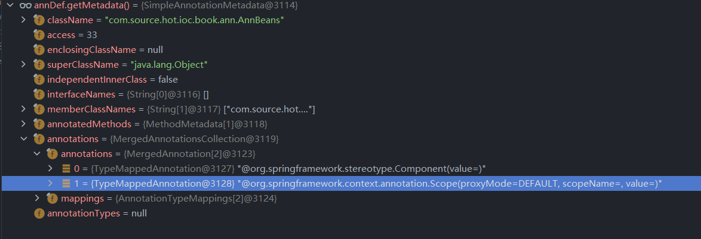
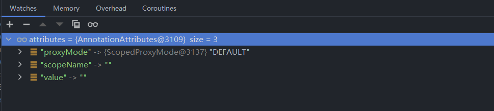

# 第二十一章 Scope元数据解析

本节笔者将和各位一起探讨关于 `ScopeMetadataResolver` 接口的作用及其源码


## 21.1 `ScopeMetadataResolver` 分析

我们直接来看 `ScopeMetadataResolver` 接口中的方法定义

- `ScopeMetadataResolver` 接口详情

```java
@FunctionalInterface
public interface ScopeMetadataResolver {

   ScopeMetadata resolveScopeMetadata(BeanDefinition definition);

}
```

该接口的作用是从 Bean Definition 中提取 `ScopeMetadata` 对象，下面我们先来了解 `ScopeMetadata` 对象


### 21.1.1 `ScopeMetadata` 分析

`ScopeMetadata` 是一个简单的 Java 对象，他不具备一些特别方法。

- `ScopeMetadata` 成员变量

```java
private String scopeName = BeanDefinition.SCOPE_SINGLETON;

private ScopedProxyMode scopedProxyMode = ScopedProxyMode.NO;
```


在 `ScopeMetadata` 中不存在有参构造，其他方法都是 `getter` 和 `setter` 方法，那么我们可以进一步理解 `ScopeMetadataResolver` 的作用，解析 Bean Definiton 中的属性然后创建 `ScopeMetadata` 


### 21.1.2 `AnnotationScopeMetadataResolver` 中的解析

下面我们来看注解环境中对 `ScopeMetadata` 的解析代码

- `AnnotationScopeMetadataResolver#resolveScopeMetadata` 方法详情

```java
@Override
public ScopeMetadata resolveScopeMetadata(BeanDefinition definition) {
   ScopeMetadata metadata = new ScopeMetadata();
   if (definition instanceof AnnotatedBeanDefinition) {
      AnnotatedBeanDefinition annDef = (AnnotatedBeanDefinition) definition;
      AnnotationAttributes attributes = AnnotationConfigUtils.attributesFor(
            annDef.getMetadata(), this.scopeAnnotationType);
      if (attributes != null) {
         metadata.setScopeName(attributes.getString("value"));
         ScopedProxyMode proxyMode = attributes.getEnum("proxyMode");
         if (proxyMode == ScopedProxyMode.DEFAULT) {
            proxyMode = this.defaultProxyMode;
         }
         metadata.setScopedProxyMode(proxyMode);
      }
   }
   return metadata;
}
```


这里我们需要关注一个注解 `@Scope`，只有这个注解中的数据才是我们需要的数据，换句话说 `Scope` 注解的属性对应的实体类是 `ScopeMetadata`，下面我们来看 `Scope` 注解的代码

- `Scope` 注解详情

```java
@Target({ElementType.TYPE, ElementType.METHOD})
@Retention(RetentionPolicy.RUNTIME)
@Documented
public @interface Scope {

   @AliasFor("scopeName")
   String value() default "";

   @AliasFor("value")
   String scopeName() default "";

   ScopedProxyMode proxyMode() default ScopedProxyMode.DEFAULT;

}
```


相信各位可以发现在 `resolveScopeMetadata` 方法中提取数据的几个属性就是 `Scope` 中的方法，我们来看下面这段方法

```java
AnnotationAttributes attributes = AnnotationConfigUtils.attributesFor(
      annDef.getMetadata(), this.scopeAnnotationType);
```

理解这段代码我们需要先来认识 `scopeAnnotationType` 变量，该变量表示 `Scope.class` 。为了理解这段代码我们编写下面这样一个 Bean 


```java
@Component
@Scope
public class AnnBeans {
}

```

在这个 Bean 定义中我们可以看到它拥有了两个注解，那这两个注解的数据会被放在 `metadata` 中，通过 `AnnotationConfigUtils.attributesFor` 方法我们可以单独提取我们需要的注解属性值，下面我们进入 DEBUG 阶段


- `annDef.getMetadata()` 数据



- 提取后的数据




当我们拥有 `attributes` 对象后我们就可以进行数据设置了。


## 21.1 总结

在这一章笔者和各位一起阅读了`ScopeMetadataResolver` 注解模式下的解析过程，在解析中我们了解了一个解析方法，这个解析方法是一个相对通用的方法。

- 解析方法

    1. 第一步：提取 Bean Definition 的注解元数据
    2. 第二步：从注解元数据中过滤需要的注解
    3. 第三步：数据设置