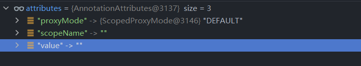

# 第二十二章 BeanName 生成策略

在这一章中笔者将和各位一起探讨关于 Bean Name 的生成策略。


## 22.1 `AnnotationBeanNameGenerator` 分析

我们本章的主要目标是分析注解模式下 Bean Name 的生成策略，我们需要通过 `BeanNameGenerator` 接口找到负责处理注解模式下 Bean Name 生成策略的具体对象。我们先来看看 `BeanNameGenerator` 类图。


在这个类途中我们可以找到可能的对象是 `AnnotationBeanNameGenerator`，下面我们来看其中的处理方法

- `AnnotationBeanNameGenerator#generateBeanName`

```java
@Override
public String generateBeanName(BeanDefinition definition, BeanDefinitionRegistry registry) {
   if (definition instanceof AnnotatedBeanDefinition) {
      // 从注解中获取 beanName
      // 获取注解的value属性值
      String beanName = determineBeanNameFromAnnotation((AnnotatedBeanDefinition) definition);
      if (StringUtils.hasText(beanName)) {
         // Explicit bean name found.
         // 如果存在直接返回
         return beanName;
      }
   }
   // Fallback: generate a unique default bean name.
   // 默认beanName
   // 类名,首字母小写
   return buildDefaultBeanName(definition, registry);
}
```


在这段代码中我们可以看到两种处理情况

1. 第一种：Bean Definition 是 `AnnotatedBeanDefinition` 类型
2. 第二种：Bean Definition 不是 `AnnotatedBeanDefinition` 类型 或者 第一种处理情况得不到 Bean Name 


###  22.1.1 `AnnotatedBeanDefinition` 类型的 Bean Name 处理

下面我们先来看 Bean Definition 属于 `AnnotatedBeanDefinition` 类型的分析，在这个情况下处理 Bean Name 主要依靠 `determineBeanNameFromAnnotation` 方法，我们来看这个方法的细节代码

- `determineBeanNameFromAnnotation` 方法详情

```java
@Nullable
protected String determineBeanNameFromAnnotation(AnnotatedBeanDefinition annotatedDef) {
   // 获取注解信息
   AnnotationMetadata amd = annotatedDef.getMetadata();
   // 所有注解
   Set<String> types = amd.getAnnotationTypes();
   String beanName = null;
   for (String type : types) {
      // 注解属性map对象
      AnnotationAttributes attributes = AnnotationConfigUtils.attributesFor(amd, type);
      if (attributes != null && isStereotypeWithNameValue(type, amd.getMetaAnnotationTypes(type), attributes)) {
         Object value = attributes.get("value");
         if (value instanceof String) {
            String strVal = (String) value;
            if (StringUtils.hasLength(strVal)) {
               if (beanName != null && !strVal.equals(beanName)) {
                  throw new IllegalStateException("Stereotype annotations suggest inconsistent " +
                        "component names: '" + beanName + "' versus '" + strVal + "'");
               }
               beanName = strVal;
            }
         }
      }
   }
   return beanName;
}
```

`determineBeanNameFromAnnotation` 方法的处理流程如下

1. 第一步：提取 Bean Definition 中的注解元数据
2. 第二步：从注解元数据中提取所有的注解类名
3. 第三步：循环注解类名，从注解元数据中提取对应的注解属性
4. 第四步：注解属性中尝试获取 `value` 对应的值
5. 第五步：将 `value` 对应值判断是否是 `String` 类型，如果是那么就会被作为 Bean Name


下面我们来用一些测试用例来解读这段代码中的各个操作，首先我们定义一个Bean对象

```java
@Component
@Scope
public class AnnBeans {
}

```

- `amd` 数据信息


得到 `amd` 对象后我们就需要分类提取数据了，通过 `AnnotationConfigUtils.attributesFor(amd, type)` 方法可以获取数据，这个操作其实就是将注解的数据提取出来，我们先来看 `AnnotationAttributes` 对象

- `AnnotationAttributes` 类信息

```java
public class AnnotationAttributes extends LinkedHashMap<String, Object> {

   private static final String UNKNOWN = "unknown";

   @Nullable
   private final Class<? extends Annotation> annotationType;

   final String displayName;

   boolean validated = false;
}
```

阅读上面这段代码我们可以知道 `AnnotationAttributes` 是一个 `Map` 结构的对象，并在其中存有了一个注解类信息字段 `annotationType` 这个字段数据不会显示存在是允许为空的，下面我们使用 `@Component` 举例，`AnnotationAttributes` 会存储那些内容呢？

- `AnnotationAttributes` 存储内容


如果我们使用 `@Scope` 注解那么他会得到这样一个数据




简而言之 `AnnotationAttributes` 存储了单个注解的所有属性。

当我们拥有了 `AnnotationAttributes` 数据之后我们就需要从注解属性中提取 `value` 对应的数据值，获取后将其返回，如果`value` 对应的数据不是空字符串那么将其当作 Bean Name。


###  22.1.2 非 `AnnotatedBeanDefinition` 类型的 Bean Name 处理

在前文我们了解了关于通过注解获取 Bean Name 的方式，但是在获取过程中 `value` 存在空字符串的情况以及 Bean Definition 不属于 `AnnotatedBeanDefinition` 类型，面对这两种情况我们来看 Spring 是如何进行操作的。

- 具体操作代码

```java
protected String buildDefaultBeanName(BeanDefinition definition) {
   // 获取 class name、
   String beanClassName = definition.getBeanClassName();
   Assert.state(beanClassName != null, "No bean class name set");
   // 获取短类名
   String shortClassName = ClassUtils.getShortName(beanClassName);
   // 首字母小写
   return Introspector.decapitalize(shortClassName);
}
```

在这段代码中做了三件事

1. 第一件：提取全类名。
2. 第二件：全类名中提取类名称(短名)。
3. 第三件：短名首字母小写处理。

在这三件事处理完成后就是我们需要的 Bean Name 这种策略也是默认策略。


## 22.2 `FullyQualifiedAnnotationBeanNameGenerator` 分析

前文我们了解了 `AnnotationBeanNameGenerator` 中对于 Bean Name 的处理方式，下面我们来看看它的子类 `FullyQualifiedAnnotationBeanNameGenerator` 是如何处理 Bean Name 的。

在`FullyQualifiedAnnotationBeanNameGenerator` 中重写了方法 `buildDefaultBeanName`，在这个重写方法中它直接将全类名作为 Bean Name 进行返回，具体代码如下

- `FullyQualifiedAnnotationBeanNameGenerator#buildDefaultBeanName`

```java
@Override
protected String buildDefaultBeanName(BeanDefinition definition) {
   String beanClassName = definition.getBeanClassName();
   Assert.state(beanClassName != null, "No bean class name set");
   return beanClassName;
}
```


## 22.3 `DefaultBeanNameGenerator` 分析

在 `BeanNameGenerator` 接口实现类中还有另外一种处理方式 `DefaultBeanNameGenerator` 。在 `DefaultBeanNameGenerator` 中对 Bean Name 的处理依靠 `BeanDefinitionReaderUtils#generateBeanName(org.springframework.beans.factory.config.BeanDefinition, org.springframework.beans.factory.support.BeanDefinitionRegistry)` 方法，一直往下追踪源代码可以查找到下面代码。


```java
public static String generateBeanName(
    BeanDefinition definition, BeanDefinitionRegistry registry, boolean isInnerBean)
    throws BeanDefinitionStoreException {

    // 获取 bean class 的名称
    // Class.getName()
    String generatedBeanName = definition.getBeanClassName();
    if (generatedBeanName == null) {
        // 父类名称是否存在
        if (definition.getParentName() != null) {
            generatedBeanName = definition.getParentName() + "$child";
        }
        // 工厂 beanName 是否为空
        else if (definition.getFactoryBeanName() != null) {
            generatedBeanName = definition.getFactoryBeanName() + "$created";
        }
    }
    if (!StringUtils.hasText(generatedBeanName)) {
        throw new BeanDefinitionStoreException("Unnamed bean definition specifies neither " +
                                               "'class' nor 'parent' nor 'factory-bean' - can't generate bean name");
    }

    String id = generatedBeanName;
    if (isInnerBean) {
        // Inner bean: generate identity hashcode suffix.
        // 组装名称
        // 生成名称 + # + 16 进制的一个字符串
        id = generatedBeanName + GENERATED_BEAN_NAME_SEPARATOR + ObjectUtils.getIdentityHexString(definition);
    }
    else {
        // Top-level bean: use plain class name with unique suffix if necessary.
        // 唯一beanName设置
        // // beanName + # + 序号
        return uniqueBeanName(generatedBeanName, registry);
    }
    return id;
}

```

通过这段代码的阅读我们可以将 Bean Name 的生成策略逻辑如下


## 22.4 总结

在本节中笔者和各位一起讨论了 Bean Name 的生成策略接口 `BeanNameGenerator`，从源码的角度我们了解了三种 `BeanNameGenerator` 的实现类，并且进入到三种实现类的内部深入了解了三种实现类对Bean Name 的处理方式。