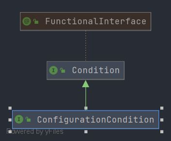

# 第二十四章 条件注解

在这一章笔者将和各位一起探讨 Spring 中的条件注解。


## 24.1 测试环境搭建

为了进行条件注解相关的源码分析我们需要先来制作一个测试环境。首先我们需要定义一个接口

```java
public interface InterFunc {
   String data();
}
```

接着我们来编写两个 `Condition` 

- `LinuxCondition` 详细信息

```java
public class LinuxCondition implements Condition {
 
   @Override
   public boolean matches(ConditionContext context, AnnotatedTypeMetadata metadata) {
      return context.getEnvironment().getProperty("os.name").contains("Linux");
   }
 
}
```

- `WindowsCondition` 详细信息

```java
public class WindowsCondition implements Condition {

   @Override
   public boolean matches(ConditionContext context, AnnotatedTypeMetadata metadata) {
      return context.getEnvironment().getProperty("os.name").contains("Windows");
   }
}
```

最后我们来编写注解配置类

```java
@Configuration
public class ConditionBeans {

   @Bean
   @Conditional(LinuxCondition.class)
   public InterFunc linux() {
      return new InterFunc() {
         @Override
         public String data() {
            return "linux";
         }
      };
   }

   @Bean
   @Conditional(WindowsCondition.class)
   public InterFunc windows() {
      return new InterFunc() {
         @Override
         public String data() {
            return "windows";
         }
      };
   }

}
```

现在准备工作都完成了，我们来编写测试用例


```java
public class ConditionTest {
   @Test
   void testCondition() {
      AnnotationConfigApplicationContext context = new AnnotationConfigApplicationContext(ConditionBeans.class);
      InterFunc bean = context.getBean(InterFunc.class);
      assert bean.data().equals("windows");
   }
}
```


## 24.2 条件注解分析

不知道各位是否还记得在Spring的注解模式启动环节中我们在阅读 `doRegisterBean` 方法的时候笔者在当时告诉各位有一个关于条件注解相关的处理操作，具体代码如下

- `doRegisterBean` 中关于条件注解的解析

```java
// 和条件注解相关的函数
if (this.conditionEvaluator.shouldSkip(abd.getMetadata())) {
   return;
}
```


`doRegisterBean` 操作是针对 Spring Configuration Bean 进行的，那么对于普遍的 Bean Spring 是如何对其进行处理的呢？我们可以在 `loadBeanDefinitionsForConfigurationClass` 方法中寻找到这样一些代码

- `loadBeanDefinitionsForBeanMethod` 方法详情

```java
private void loadBeanDefinitionsForBeanMethod(BeanMethod beanMethod) {
    ConfigurationClass configClass = beanMethod.getConfigurationClass();
    MethodMetadata metadata = beanMethod.getMetadata();
    String methodName = metadata.getMethodName();

    // Do we need to mark the bean as skipped by its condition?
    if (this.conditionEvaluator.shouldSkip(metadata, ConfigurationPhase.REGISTER_BEAN)) {
        configClass.skippedBeanMethods.add(methodName);
        return;
    }
    if (configClass.skippedBeanMethods.contains(methodName)) {
        return;
    }
    // 神略后续代码
}
```

`loadBeanDefinitionsForBeanMethod` 方法进入层级关系如下

1. `org.springframework.context.annotation.ConfigurationClassBeanDefinitionReader#loadBeanDefinitions`
   1. `org.springframework.context.annotation.ConfigurationClassBeanDefinitionReader#loadBeanDefinitionsForConfigurationClass`
      1. `org.springframework.context.annotation.ConfigurationClassBeanDefinitionReader#loadBeanDefinitionsForBeanMethod`


在 `loadBeanDefinitionsForBeanMethod` 中我们找到了我们需要分析的方法是 `this.conditionEvaluator.shouldSkip(metadata, ConfigurationPhase.REGISTER_BEAN)`，在`doRegisterBean` 中我们找到了我们需要分析的方法是 `this.conditionEvaluator.shouldSkip(abd.getMetadata())`，不难发现这里都是用的是 `conditionEvaluator` 其真实类名是 `org.springframework.context.annotation.ConditionEvaluator`。

下面我们吸纳来翻阅 `doRegisterBean` 中关于条件注解解析的代码

- `doRegisterBean` 中调用的条件解析代码详情

```java
public boolean shouldSkip(AnnotatedTypeMetadata metadata) {
    return shouldSkip(metadata, null);
}
```

这个方法它调用了内部方法，这个内部方法的调用和`loadBeanDefinitionsForBeanMethod` 调用的方法相同，这样我们可以确定我们真正需要分析的方法签名是 `org.springframework.context.annotation.ConditionEvaluator#shouldSkip(org.springframework.core.type.AnnotatedTypeMetadata, org.springframework.context.annotation.ConfigurationCondition.ConfigurationPhase)` ，下面请各位先来阅读源码。

- `shouldSkip` 方法详情

```java
public boolean shouldSkip(@Nullable AnnotatedTypeMetadata metadata, @Nullable ConfigurationPhase phase) {
   // 注解元数据不存在或者注解元数据中不包含Conditional注解
   if (metadata == null || !metadata.isAnnotated(Conditional.class.getName())) {
      return false;
   }

   // 配置解析阶段处理
   if (phase == null) {
      if (metadata instanceof AnnotationMetadata &&
            ConfigurationClassUtils.isConfigurationCandidate((AnnotationMetadata) metadata)) {
         return shouldSkip(metadata, ConfigurationPhase.PARSE_CONFIGURATION);
      }
      return shouldSkip(metadata, ConfigurationPhase.REGISTER_BEAN);
   }

   // 需要处理的 Condition , 数据从注解 Conditional 中来
   List<Condition> conditions = new ArrayList<>();
   // 获取注解 Conditional 的属性值
   for (String[] conditionClasses : getConditionClasses(metadata)) {
      for (String conditionClass : conditionClasses) {
         // 将注解中的数据转换成 Condition 接口
         // 从 class 转换成实例
         Condition condition = getCondition(conditionClass, this.context.getClassLoader());
         // 插入注解列表
         conditions.add(condition);
      }
   }

   // 对 Condition 进行排序
   AnnotationAwareOrderComparator.sort(conditions);

   // 执行 Condition 得到验证结果
   for (Condition condition : conditions) {
      ConfigurationPhase requiredPhase = null;
      // 如果类型是 ConfigurationCondition
      if (condition instanceof ConfigurationCondition) {
         requiredPhase = ((ConfigurationCondition) condition).getConfigurationPhase();
      }

      // matches 进行验证
      if ((requiredPhase == null || requiredPhase == phase) && !condition.matches(this.context, metadata)) {
         return true;
      }
   }

   return false;
}
```


在这个方法中我们先来理解参数

| 参数名称   | 参数类型                | 参数说明                                                     |
| ---------- | ----------------------- | ------------------------------------------------------------ |
| `metadata` | `AnnotatedTypeMetadata` | 注解元数据，存储了注解的数据信息                             |
| `phase`    | `ConfigurationPhase`    | 配置解析阶段枚举存在两种状态：<br />第一种：`PARSE_CONFIGURATION` 配置解析阶段<br />第二种：`REGISTER_BEAN` Bean 注册阶段 |


参数理解后我们来看整体的处理逻辑

1. 注解元数据不存在或者注解元数据中不存在 `Conditional` 注解，返回 `false`

2. 阶段信息的补充，如果阶段信息为空需要做如下操作

   1. 如果注解元数据的类型是 `AnnotationMetadata` 并且注解元数据中存在 `Bean`、 `Component` 、`ComponentScan` 、`Import` 和 `ImportResource` 注解将设置阶段信息为 `PARSE_CONFIGURATION`，表示配置解析阶段，反之则将阶段信息设置为 `REGISTER_BEAN`，表示 Bean 注册阶段。

      这两个阶段我们可以从代码中很好的得到结果。

      `doRegister` 中我们传递的是 `null` 但是我们的注解元数据解析符合条件会被设置为 `PARSE_CONFIGURATION` ，当进入到 `loadBeanDefinitionsForBeanMethod`  方法后我们是对单个 Bean 的注册，传递的是一个明确的变量 `ConfigurationPhase.REGISTER_BEAN`

3. 提取注解 `Conditional` 中 `value` 的属性并将其转换成实例对象，得到当前 `Conditional` 中所有的 `Condition` 后进行排序，排序与 `Ordered` 有关。

4. 执行排序后的 `Condition` 如果满足下面条件就会返回 `true`

   条件一：`requiredPhase` 不存在或者 `requiredPhase` 的数据等于参数 `phase`

   条件二：`!condition.matches(this.context, metadata)` 执行结果为 `true` 


条件一中 `requiredPhase` 数据的获取是通过 `ConfigurationCondition` 接口获取的，该接口也是 `Condition` 的子接口，类图如下



条件二是执行 `Condition` 接口中提供的 `matches` 方法，这部分方法是我们开发者自行编写的，在我们的测试用例中会执行 `LinuxCondition` 或者 `WindowsCondition`。


当同时符合条件一和条件二那么就会返回最后的结果`true` 反之返回 `false`


## 24.3 总结

在这一章节中笔者和各位围绕条件注解 `Conditional` ，一起学习了该注解的相关使用和 Spring 对条件注解的处理。