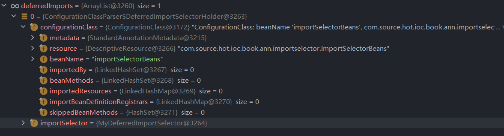
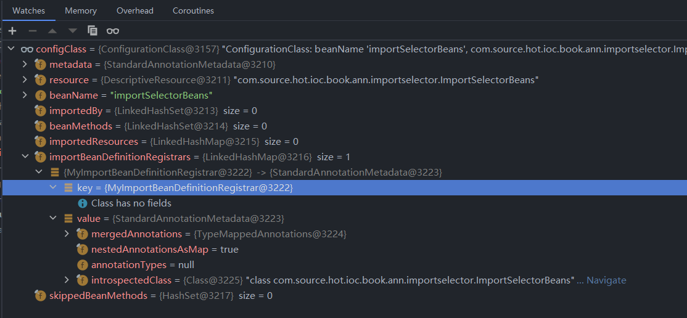

# 第二十七章 DeferredImportSelectorHandler

在这一章笔者将和各位读者从 `DeferredImportSelectorHandler` 出发了解在 `DeferredImportSelectorHandler` 中出现的各类处理操作。


## 27.1 初识 DeferredImportSelectorHandler

不知道各位是否还记得我们在那个地方见到过这个类，各位如果不记得的话可以看下面这段代码。

- `ConfigurationClassParser#parse(java.util.Set<org.springframework.beans.factory.config.BeanDefinitionHolder>)`

```java
public void parse(Set<BeanDefinitionHolder> configCandidates) {
   for (BeanDefinitionHolder holder : configCandidates) {
      BeanDefinition bd = holder.getBeanDefinition();
      try {
         if (bd instanceof AnnotatedBeanDefinition) {
            parse(((AnnotatedBeanDefinition) bd).getMetadata(), holder.getBeanName());
         }
         else if (bd instanceof AbstractBeanDefinition && ((AbstractBeanDefinition) bd).hasBeanClass()) {
            parse(((AbstractBeanDefinition) bd).getBeanClass(), holder.getBeanName());
         }
         else {
            parse(bd.getBeanClassName(), holder.getBeanName());
         }
      }
      catch (BeanDefinitionStoreException ex) {
         throw ex;
      }
      catch (Throwable ex) {
         throw new BeanDefinitionStoreException(
               "Failed to parse configuration class [" + bd.getBeanClassName() + "]", ex);
      }
   }

   this.deferredImportSelectorHandler.process();
}
```

在 `ConfigurationClassParser` 的 `parse` 方法中我们可以看到有使用 `deferredImportSelectorHandler` 进行方法调用，`deferredImportSelectorHandler` 就是我们这里需要展开分析的对象了。


下面我们找到 `DeferredImportSelectorHandler` 类先来对它的成员变量做一个简单了解。


### 27.1.1 `DeferredImportSelectorHandler` 成员变量

在 `DeferredImportSelectorHandler` 中只有一个成员变量，该成员变量主要存储 `DeferredImportSelectorHolder` 对象，`DeferredImportSelectorHolder` 对象存储配置类和接口 `DeferredImportSelector`，具体关系如下。 

- `DeferredImportSelectorHandler` 

```java
private class DeferredImportSelectorHandler {

   @Nullable
   private List<DeferredImportSelectorHolder> deferredImportSelectors = new ArrayList<>();
}
```

- `DeferredImportSelectorHolder`

```java
private static class DeferredImportSelectorHolder {

   private final ConfigurationClass configurationClass;

   private final DeferredImportSelector importSelector;
}
```


## 27.2 测试环境搭建

下面我们先来编写一个可供调试的程序代码。

- `DeferredImportSelector` 实现类

```java
public class MyDeferredImportSelector implements DeferredImportSelector {

	@Override
	public String[] selectImports(AnnotationMetadata importingClassMetadata) {
		System.out.println("in MyDeferredImportSelector");
		return new String[0];
	}
}
```

- `ImportBeanDefinitionRegistrar` 实现类

```java
public class MyImportBeanDefinitionRegistrar implements ImportBeanDefinitionRegistrar {
   @Override
   public void registerBeanDefinitions(AnnotationMetadata importingClassMetadata, BeanDefinitionRegistry registry,
         BeanNameGenerator importBeanNameGenerator) {

   }

   @Override
   public void registerBeanDefinitions(AnnotationMetadata importingClassMetadata, BeanDefinitionRegistry registry) {

   }
}
```

- `ImportSelector` 实现类

```java
public class MyImportSelector implements ImportSelector {
   @Override
   public String[] selectImports(AnnotationMetadata importingClassMetadata) {
      System.out.println("in MyImportSelector");
      return new String[0];
   }
}
```

接下来编写 Spring 注解环境的配置类

```java
@Component
@Import(
		value = {
				MyDeferredImportSelector.class,
				MyImportBeanDefinitionRegistrar.class,
				MyImportSelector.class
		}
)
@Configuration
public class ImportSelectorBeans {

}

```

最后编写一个测试类

```java
public class ImportSelectTest {
   @Test
   void testImportSelect() {
      AnnotationConfigApplicationContext context =
            new AnnotationConfigApplicationContext(ImportSelectorBeans.class);
   }
}
```

运行该测试类得到如下输出结果

```
in MyDeferredImportSelector
```


测试用例准备完毕下面我们开始进入分析阶段。


## 27.3 `handle` 方法分析

首先我们先来看我们的入口方法 `process` 

```java
public void process() {
   List<DeferredImportSelectorHolder> deferredImports = this.deferredImportSelectors;
   this.deferredImportSelectors = null;
   try {
      if (deferredImports != null) {
         DeferredImportSelectorGroupingHandler handler = new DeferredImportSelectorGroupingHandler();
         deferredImports.sort(DEFERRED_IMPORT_COMPARATOR);
         deferredImports.forEach(handler::register);
         handler.processGroupImports();
      }
   }
   finally {
      this.deferredImportSelectors = new ArrayList<>();
   }
}
```

在这个方法中第一行代码是提取 `DeferredImportSelectorHolder` 数据，通过前文对成员变量的分析我们知道在 `DeferredImportSelectorHolder` 中有 `DeferredImportSelector` 接口的实现类，下面我们来看这第一行代码的数据内容。

- `deferredImports` 数据信息




现在我们可以看到数据已经存在了，但是数据是什么时候被加载到这个对象中的呢？这个数据的产生是通过 `handler` 方法将数据初始化。下面我们来看这个初始化方法的代码。

- `handle` 方法详情

```java
public void handle(ConfigurationClass configClass, DeferredImportSelector importSelector) {
   DeferredImportSelectorHolder holder = new DeferredImportSelectorHolder(
         configClass, importSelector);
   if (this.deferredImportSelectors == null) {
      DeferredImportSelectorGroupingHandler handler = new DeferredImportSelectorGroupingHandler();
      handler.register(holder);
      handler.processGroupImports();
   }
   else {
      this.deferredImportSelectors.add(holder);
   }
}
```

在这段代码中我们需要引入另一个对象 `DeferredImportSelectorGroupingHandler`，在引入这个对象前我们需要知道的是 `deferredImportSelectors` 为空才会创建 `DeferredImportSelectorGroupingHandler` 对象。否则就会直接在 `deferredImportSelectors` 中将数据加入进去。现在我们知道了 `DeferredImportSelector` 会被加入到 `deferredImportSelectors` 。


## 27.4 DeferredImportSelectorGroupingHandler

下面我们来了解 `DeferredImportSelectorGroupingHandler` 对象的成员变量和方法。首先我们来看成员变量

```java
private final Map<Object, DeferredImportSelectorGrouping> groupings = new LinkedHashMap<>();

private final Map<AnnotationMetadata, ConfigurationClass> configurationClasses = new HashMap<>();
```

先来介绍 `groupings` 的存储结构，在 `groupings` 存储中 `key` 是 `Object` 它存在两种情况

1. 第一种：`Class<? extends Group>`，该数据从 `DeferredImportSelector` 接口的 `getImportGroup` 方法中获取
2. 第二种：`DeferredImportSelectorHolder`，该数据就是 `DeferredImportSelectorHolder`

了解了 `key` 的可能性后我们来看 `value` 的结构，这里 `value` 是一个明确类型 `DeferredImportSelectorGrouping`，下面我们来看看 `DeferredImportSelectorGrouping` 的成员变量

- `DeferredImportSelectorGrouping` 成员变量

```java
private static class DeferredImportSelectorGrouping {

   private final DeferredImportSelector.Group group;

   private final List<DeferredImportSelectorHolder> deferredImports = new ArrayList<>();
}
```

在这个成员变量中我们可以看到它是一个分组操作，一个 `Group` 对应一组 `DeferredImportSelectorHolder`


第一个成员变量 `groupings` 的介绍到此结束，下面我们来看第二个成员变量 `configurationClasses`，这个成员变量的数据我们就很熟悉了，`key` 表示注解元数据，`value` 表示配置类(Spring Cofiguration Bean)


在这个类中存在啷个方法

1. `register`：将`DeferredImportSelectorHolder` 转换成成员变量
2. `processGroupImports`：处理容器中的 `ImportSelector` 接口


## 27.5 `processImports` 方法分析

现在我们在回到 `process` 方法中，我们可以看到两个熟悉的方法名称，具体如下。

```java
deferredImports.forEach(handler::register);
handler.processGroupImports();
```

这里我们可以看到它使用的是 `DeferredImportSelectorGroupingHandler` 类，兜兜转转我们又回到了它上面，下面我们向下追踪源码找到最终的处理方法 `org.springframework.context.annotation.ConfigurationClassParser#processImports`，找到了我们需要进行分析的目标方法后，我们来看代码。

```java
private void processImports(ConfigurationClass configClass, SourceClass currentSourceClass,
      Collection<SourceClass> importCandidates, boolean checkForCircularImports) {

   // 判断是否存在需要处理的 ImportSelector 集合, 如果不需要则不处理直接返回
   if (importCandidates.isEmpty()) {
      return;
   }

   // 判断是否需要进行import循环检查
   // 判断但钱配置类是否在 importStack 中
   if (checkForCircularImports && isChainedImportOnStack(configClass)) {
      this.problemReporter.error(new CircularImportProblem(configClass, this.importStack));
   }
   else {
      // 向 importStack 中加入当前正在处理的配置类
      this.importStack.push(configClass);
      try {
         // 循环处理参数传递过来的 importSelector
         for (SourceClass candidate : importCandidates) {

            // 判断
            if (candidate.isAssignable(ImportSelector.class)) {
               // Candidate class is an ImportSelector -> delegate to it to determine imports
               Class<?> candidateClass = candidate.loadClass();
               // 将 class 转换成对象
               ImportSelector selector = ParserStrategyUtils.instantiateClass(candidateClass, ImportSelector.class,
                     this.environment, this.resourceLoader, this.registry);
               // 如果类型是 DeferredImportSelector
               if (selector instanceof DeferredImportSelector) {
                  this.deferredImportSelectorHandler.handle(configClass, (DeferredImportSelector) selector);
               }
               else {
                  // 获取需要导入的类
                  String[] importClassNames = selector.selectImports(currentSourceClass.getMetadata());
                  // 将需要导入的类从字符串转换成 SourceClass
                  Collection<SourceClass> importSourceClasses = asSourceClasses(importClassNames);
                  // 递归处理需要导入的类
                  processImports(configClass, currentSourceClass, importSourceClasses, false);
               }
            }

            // 处理类型是 ImportBeanDefinitionRegistrar 的情况
            else if (candidate.isAssignable(ImportBeanDefinitionRegistrar.class)) {
               // Candidate class is an ImportBeanDefinitionRegistrar ->
               // delegate to it to register additional bean definitions
               Class<?> candidateClass = candidate.loadClass();
               ImportBeanDefinitionRegistrar registrar =
                     ParserStrategyUtils.instantiateClass(candidateClass, ImportBeanDefinitionRegistrar.class,
                           this.environment, this.resourceLoader, this.registry);
               configClass.addImportBeanDefinitionRegistrar(registrar, currentSourceClass.getMetadata());
            }
            // 其他情况
            else {
               // Candidate class not an ImportSelector or ImportBeanDefinitionRegistrar ->
               // process it as an @Configuration class
               this.importStack.registerImport(
                     currentSourceClass.getMetadata(), candidate.getMetadata().getClassName());
               processConfigurationClass(candidate.asConfigClass(configClass));
            }
         }
      }
      catch (BeanDefinitionStoreException ex) {
         throw ex;
      }
      catch (Throwable ex) {
         throw new BeanDefinitionStoreException(
               "Failed to process import candidates for configuration class [" +
               configClass.getMetadata().getClassName() + "]", ex);
      }
      finally {
         // 从 importStack 删除配置类
         this.importStack.pop();
      }
   }
}
```


`processImports` 方法内容比较多我们先来整理完整的处理流程。

1. **判断参数 `importCandidates` 是否存在数据，如果不存在数据就不进行后续处理。**

2. **判断参数 `checkForCircularImports` 是否为 `true`，同时验证 `importStack` 中是否存在当前参数 `configClass`。**

   **如果 `checkForCircularImports` 为 `true` 同时验证通过就会抛出异常。**

3. **处理 `importCandidates` 集合中的每个 `ImportSelector` 对象，处理方式如下：**

   1. **处理一：类型是 `ImportSelector`**

      **将 `SourceClass` 转换成 `ImportSelector` 对象，得到 `ImportSelector` 后分两种情况处理**

      1. **第一种：类型是 `DeferredImportSelector`**

         **重复 `handler` 的操作**

      2. **第二种：类型不是 `DeferredImportSelector`**

         **调用 `ImportSelector#selectImports` 方法得到需要导入的类，将类名转换成 `SourceClass` ，最后解析每个 `SourceClass` 处理方法是本方法(`processImports`) ，递归调用。**

   2. **处理二：类型是 `ImportBeanDefinitionRegistrar`**

      **将 `SourceClass` 转换成 `ImportBeanDefinitionRegistrar` 实例，将这个实例放入 `importBeanDefinitionRegistrars` 容器。**

   3. **处理三：类型既不是 `ImportSelector` 也不是 `ImportBeanDefinitionRegistrar`**


- `configClass` 属性信息




到此对于 Spring 中 `ImportSelector` 的处理已经分析完毕。


## 27.6 总结

在这一章节中笔者和介绍了在 Spring 中对 `Import` 类型的处理，主要围绕三个接口 `DeferredImportSelector` 、`ImportBeanDefinitionRegistrar` 和 `ImportSelector` 展开，了解了它们的处理方法及处理细节。