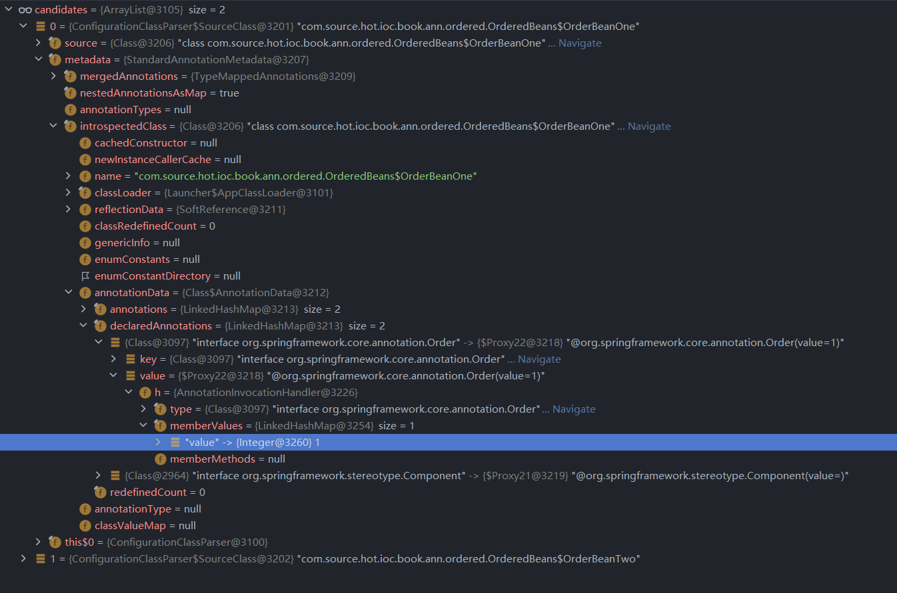
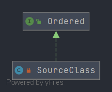

# 第三十章 Spring 排序注解
在这一章节中笔者将和各位共同探讨 Spring 中注解排序相关的处理。


## 30.1 测试环境搭建

本章将围绕 Spring 注解 `@Order` 做出一个基本的测试用例

下面我们编写一个为了测试 `org.springframework.context.annotation.ConfigurationClassParser#processMemberClasses` 方法中的一个方法 `OrderComparator.sort(candidates)`  的用例，这个方法就是注解模式下的一个排序方法也是我们需要分析的重点。

- 编写上下文

```java
@Configuration
@ComponentScan(basePackageClasses = {OrderedBeans.OrderBeanOne.class, OrderedBeans.OrderBeanTwo.class})
public class OrderedBeans {
	@Order(2)
	@Component
	public class OrderBeanTwo {
	}

	@Order(1)
	@Component
	public class OrderBeanOne {
	}

}

```

最后我们来编写测试类

```java
public class OrderedTest {
   @Test
   void orderedTest() {
      AnnotationConfigApplicationContext context = new AnnotationConfigApplicationContext(OrderedBeans.class);
      context.close();
   }
}
```


## 30.2 `OrderComparator.sort` 分析

笔者在前文提到了我们的分析入口

- 分析入口

```java
private void processMemberClasses(ConfigurationClass configClass, SourceClass sourceClass) throws IOException {
   // 找到当前配置类中存在的成员类
   Collection<SourceClass> memberClasses = sourceClass.getMemberClasses();
   // 成员类列表不为空
   if (!memberClasses.isEmpty()) {
      List<SourceClass> candidates = new ArrayList<>(memberClasses.size());
      for (SourceClass memberClass : memberClasses) {
         // 成员类是否符合配置类候选标准 Component ComponentScan Import ImportResource 注解是否存在
         // 成员类是否和配置类同名
         if (ConfigurationClassUtils.isConfigurationCandidate(memberClass.getMetadata()) &&
               !memberClass.getMetadata().getClassName().equals(configClass.getMetadata().getClassName())) {

            candidates.add(memberClass);
         }
      }
      // 排序候选类
      OrderComparator.sort(candidates);
    
       // 省略其他
   }
```

我们首先来看这里的排序参数 `candidates` 

- `candidates` 数据信息



在这里我们可以找到我们填写的 `Order` 数据，

下面我们进入 `OrderComparator.sort` 方法来阅读这个方法中的代码

- `OrderComparator.sort` 方法详情

```java
public static void sort(List<?> list) {
   if (list.size() > 1) {
      list.sort(INSTANCE);
   }
}
```

在这段代码中我们需要往上看传入的参数 `INSTANCE`，这里传递的是一个比较器 `java.util.Comparator` ，那么根据 `Comparator` 接口的实现我们下一步需要找到 `compare` 方法

- `org.springframework.core.OrderComparator#compare` 方法详情

```java
@Override
public int compare(@Nullable Object o1, @Nullable Object o2) {
   return doCompare(o1, o2, null);
}
```

进一步往下我们来看 `doCompare` 的实现

- `org.springframework.core.OrderComparator#doCompare` 方法详情

```java
private int doCompare(@Nullable Object o1, @Nullable Object o2, @Nullable OrderSourceProvider sourceProvider) {
   boolean p1 = (o1 instanceof PriorityOrdered);
   boolean p2 = (o2 instanceof PriorityOrdered);
   if (p1 && !p2) {
      return -1;
   }
   else if (p2 && !p1) {
      return 1;
   }

   int i1 = getOrder(o1, sourceProvider);
   int i2 = getOrder(o2, sourceProvider);
   return Integer.compare(i1, i2);
}
```

在这里我们看到两种比较模式

1. 第一种：是否实现了 `PriorityOrdered`
2. 第二种：仅仅实现了 `Ordered` 

在 Spring 中对于排序接口的定义有下面三种情况

1. 实现接口 `Ordered` 
2. 实现接口 `PriorityOrdered`
3. 使用注解 `@Order`

下面我们重点看 `getOrder` 方法，读者可以先大概猜测一下这里在做什么操作。这里的操作是为了获取注解或者接口的 `order` 数据值 


```java
private int getOrder(@Nullable Object obj, @Nullable OrderSourceProvider sourceProvider) {
   Integer order = null;
   if (obj != null && sourceProvider != null) {
      Object orderSource = sourceProvider.getOrderSource(obj);
      if (orderSource != null) {
         if (orderSource.getClass().isArray()) {
            Object[] sources = ObjectUtils.toObjectArray(orderSource);
            for (Object source : sources) {
               order = findOrder(source);
               if (order != null) {
                  break;
               }
            }
         }
         else {
            order = findOrder(orderSource);
         }
      }
   }
   return (order != null ? order : getOrder(obj));
}
```


这一段代码定义了一个处理流程单最终对于数据的获取本质上依靠的是 `findOrder` 方法

- `findOrder` 方法详情

```java
@Nullable
protected Integer findOrder(Object obj) {
   return (obj instanceof Ordered ? ((Ordered) obj).getOrder() : null);
}
```

我们在这个方法中可以看到他会判断 `obj` 是否是 `Ordered` 接口的实现类，如果是就调用 `getOrder` 将数据取出。


回到我们的入口方法，

我们的入口方法是 `List<SourceClass> candidates = new ArrayList<>(memberClasses.size());` 它传递了`SourceClass` ，我们现在在做 `findOrder` 的时候我们需要用到这个对象，我们来看看它有没有实现 `Ordered` 接口

- SourceClass 类图



下面我们来看 `SourceClass` 对 `Ordered` 的实现


```java
@Override
public int getOrder() {
   Integer order = ConfigurationClassUtils.getOrder(this.metadata);
   return (order != null ? order : Ordered.LOWEST_PRECEDENCE);
}
```

从这段代码中我们可以一眼看出这里第一句话就是从元数据中提取 `Order` 数据

- 提取 `Order` 数据方式

```java
@Nullable
public static Integer getOrder(AnnotationMetadata metadata) {
   Map<String, Object> orderAttributes = metadata.getAnnotationAttributes(Order.class.getName());
   return (orderAttributes != null ? ((Integer) orderAttributes.get(AnnotationUtils.VALUE)) : null);
}
```

可以很清晰的看到这里从注解元数据中提取了关于注解 `Order` 的数据集合，并从中获取 `value` 数据将其返回。


通过这样的一层层操作我们就可以得到 `order` 的数据了，最后就是一个 `Integer` 的比较就完成了 Spring 中关于排序的处理。