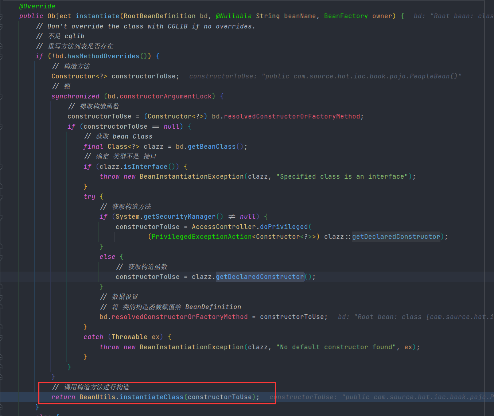

# Java Beans

在这一章章节中笔者将和各位一起探讨关于 Java Beans 相关的内容。本章主要围绕 `java.beans` 这个包路径下的代码进行一些说明。

在 Spring 中我们可以看到 `BeanInfoFactory` 该接口可以用来获取 `Class` 对应的 `BeanInfo` 对象，在 `CachedIntrospectionResults` 中也有相关的成员变量作为信息存储，其他地方还有笔者就不再这里都去搜索了，各位可以自行查阅。

- `BeanInfoFactory`

    ```java
    public interface BeanInfoFactory {
   @Nullable
       BeanInfo getBeanInfo(Class<?> beanClass) throws IntrospectionException;
    
    }
   ```

- `CachedIntrospectionResults`

  ```java
  public final class CachedIntrospectionResults {
  	private final BeanInfo beanInfo;
  }
  ```


对于 Spring 来说操作 Bean 本身的内容其实是操作各类属性及其提供的方法。从笔者的角度来看 Bean 这个对象我觉得可以分成这三种，第一种是关于 Bean 属性的，第二种是关于属性操作的方法，第三种是提供外部操作的方法。就比如说现在有一个 `People` 对象，存在多个属性，我们在对这个 Bean 对象定义的时候正常情况下我们会放入 `private` 修饰的属性名，然后在提供 `get` 和 `set` 方法，如果有需要我们可以在通过非属性操作相关的方法。本章就暂时是对前两者的一个讨论。

首先我们来定义一个基本的 Java Bean 

```java
public class Student {
   private String name;

   public String getName() {
      return name;
   }

   public void setName(String name) {
      this.name = name;
   }
}
```

现在我们用了一个名字叫做 `Student` 的 Java 对象，我们来看这个对象的解释

1. 在 `Student` 对象中具有属性 `name` 
2. 在 `Student` 对象中存在字段 `name`

我们通常情况下会有这两种对象的定义解释，那么这个定义解释在 Java 中是如何对其进行定义的呢。在 Java 中有一个接口叫做 `java.beans.BeanInfo` 这个接口是用来描述 Java Bean 的接口，下面我们来看这个接口中存在的方法


- `BeanInfo` 方法信息

```java
public interface BeanInfo {

    BeanDescriptor getBeanDescriptor();

    EventSetDescriptor[] getEventSetDescriptors();

    int getDefaultEventIndex();

    PropertyDescriptor[] getPropertyDescriptors();

    int getDefaultPropertyIndex();

    MethodDescriptor[] getMethodDescriptors();

    BeanInfo[] getAdditionalBeanInfo();
}
```

- `getBeanDescriptor` ：返回 Bean 的描述信息
- `getEventSetDescriptors`：返回 Bean 相关的事件信息
- `getDefaultEventIndex`：返回 Bean 默认事件索引
- `getPropertyDescriptors`：返回 Bean 属性描述
- `getDefaultPropertyIndex`：返回 Bean 默认的属性索引
- `getMethodDescriptors`：返回 Bean 方法描述
- `getAdditionalBeanInfo` ：返回其他的 Bean Info 信息


下面我们先来对接口中的返回值做一些介绍

- `BeanDescriptor` 成员变量表

| 变量名称             | 变量类型                        | 变量说明   |
| -------------------- | ------------------------------- | ---------- |
| `beanClassRef`       | `Reference<? extends Class<?>>` | bean 的类  |
| `customizerClassRef` | `Reference<? extends Class<?>>` | 自定义的类 |


- `PropertyDescriptor` 成员变量表

| 变量名称                 | 变量类型                        | 变量说明     |
| ------------------------ | ------------------------------- | ------------ |
| `propertyTypeRef`        | `Reference<? extends Class<?>>` | 属性类型     |
| `readMethodRef`          | `MethodRef`                     | 读方法       |
| `writeMethodRef`         | `MethodRef`                     | 写方法       |
| `propertyEditorClassRef` | `Reference<? extends Class<?>>` | 属性编辑类型 |
| `bound`                  | `boolean`                       |              |
| `constrained`            | `boolean`                       |              |
| `baseName`               | `String`                        |              |
| `writeMethodName`        | `String`                        | 写方法名称   |
| `readMethodName`         | `String`                        | 读方法名称   |


- `MethodDescriptor` 成员变量表

| 变量名称               | 变量类型                        | 变量说明 |
| ---------------------- | ------------------------------- | -------- |
| `methodRef`            | `MethodRef`                     | 方法     |
| `paramNames`           | `String[]`                      | 参数名称 |
| `params`               | `List<WeakReference<Class<?>>>` | 参数信息 |
| `parameterDescriptors` | `ParameterDescriptor`           | 参数描述 |


在了解了上述三个对象后我们来编写一个测试用例，该测试用例主要用来获取 `BeanInfo` 接口数据

- `BeanInfo` 测试用例

```java
@Test
void classTest() throws IntrospectionException {
   Class clazz  = Student.class;
   BeanInfo beanInfo = Introspector.getBeanInfo(clazz);
   System.out.println();
}
```

- `BeanInfo` 信息


我们现在对 `BeanInfo`  有了一定的了解，接下来我们要通过 `BeanInfo`  来创建一个对象，并给该对象进行数据赋值，下面我们来写代码


```java
@NotNull
private <T> T getObject(Class<T> clazz, Map<String, Object> prop) throws Exception {
   // 获取 BeanInfo 接口
   BeanInfo beanInfo = Introspector.getBeanInfo(clazz);
   // 获取 Bean Class
   Class<?> beanClass = beanInfo.getBeanDescriptor().getBeanClass();
   // 获取所有的构造函数
   Constructor<?>[] declaredConstructors = beanClass.getDeclaredConstructors();
   // 确认构造函数: 直接取无参构造
   Constructor constructor = confirmConstructor(declaredConstructors);
   // 通过构造函数获取对象
   Object bean = constructor.newInstance();
   // 为对象设置属性
   // 提取属性描述
   PropertyDescriptor[] propertyDescriptors = beanInfo.getPropertyDescriptors();
   for (PropertyDescriptor propertyDescriptor : propertyDescriptors) {
      // 属性名称
      String name = propertyDescriptor.getName();
      if (prop.containsKey(name)) {

         // 写函数
         Method writeMethod = propertyDescriptor.getWriteMethod();
         // 从属性表中获取属性名称对应的属性值
         Object proValue = prop.get(name);
         writeMethod.invoke(bean, proValue);
      }
   }
   return (T) bean;
}
```

编写这段代码的主要逻辑如下

1. 通过 `Class` 获取 `BeanInfo` 接口
2. 通过 `BeanInfo` 获取 `beanClass` 
3. 通过 `beanClass` 提取构造函数列表，从构造函数列表中选择一个具体的构造函数(这里采用无参构造的方式)
4. 获取属性描述对象进行属性设置

编写完成后我们来写测试用例

```java
@Test
void beanInfoCreateBean() throws Exception {

   Class<Student> clazz = Student.class;
   // 设置属性表
   Map<String, Object> prop = new HashMap<>(8);
   prop.put("name", "student_name");

   Student bean = getObject(clazz, prop);
   assert bean.getName().equals("student_name");
}
```


这样我们就完成了数据赋值，在上述过程中我们对于 `beanClass` 的获取可以直接使用参数传递的 `clazz` 直接使用，可以不需要通过 `BeanInfo` 接口进行二次调度。


下面我们来谈一谈 Spring 和 `BeanInfo` 的一些关联。

相信各位在使用 Spring XML 模式的时候会编写下面这样的内容。

```java
<bean id="people" class="com.source.hot.ioc.book.pojo.PeopleBean">
    <property name="name" value="zhangsan"/>
</bean>
```

这里我们抛开 Spring 中 Bean 生命周期相关的一些接口、占位符解析等内容，我们就简单的来看这个 `<bean>` 标签，这个标签定义了一个 `class` 属性 和子标签 `property` ，我们可以通过一些 XML 解析工具得到这两个对象，Spring 在这会将 `class` 属性通过 `ClassLoader` 转换成 `Class` 会将 `property` 转换成对象 `PropertyValue` ，然后通过反射将对象创建出来。那么这段说明和我们所编写的通过 `BeanInfo` 创建 Bean 有什么关系呢？我们可以思考下面几个问题

1. 知道了 `BeanClass` 如何才能创建对象呢？
2. 知道属性名称和属性值如何给对象赋值呢？

这两个问题的答案很简单就是通过 Java 反射机制来进行处理，那么具体怎么做呢？这个问题的答案其实就是我们前面所编写的那段创建对象的代码。回过头我们来看这两个问题

1. 第一个问题的答案：创建对象其本质是寻找构造函数并调用
2. 第二个问题的答案：通过找到写方法将数据写入

- Spring 中无参构造函数的调用




- 有参构造的推论过程


在这里做出了两种构造函数的推论，当完成推论构造函数后就可以进行对象创建及属性赋值了。

属性赋值相关的代码就不在截图了各位可以自行查找。


当我们有了 `getObject` 这样一个方法后，我们再来看一些生命周期，Spring 当中的各类生命周期其实就是围绕者这段代码的前后来做各种补充操作，

比如 `InitializingBean` 这个接口的调用时在 Bean 创建完成后，那么我们可以在具体的位置上补充这样一段

- 修改后的 `getObject`

```java
@NotNull
private <T> T getObject(Class<T> clazz, Map<String, Object> prop) throws Exception {
   // 获取 BeanInfo 接口
   BeanInfo beanInfo = Introspector.getBeanInfo(clazz);
   // 获取 Bean Class
   Class<?> beanClass = beanInfo.getBeanDescriptor().getBeanClass();
   // 获取所有的构造函数
   Constructor<?>[] declaredConstructors = beanClass.getDeclaredConstructors();
   // 确认构造函数: 直接取无参构造
   Constructor constructor = confirmConstructor(declaredConstructors);
   // 通过构造函数获取对象
   Object bean = constructor.newInstance();
   // 为对象设置属性
   // 提取属性描述
   PropertyDescriptor[] propertyDescriptors = beanInfo.getPropertyDescriptors();
   for (PropertyDescriptor propertyDescriptor : propertyDescriptors) {
      // 属性名称
      String name = propertyDescriptor.getName();
      if (prop.containsKey(name)) {

         // 写函数
         Method writeMethod = propertyDescriptor.getWriteMethod();
         // 从属性表中获取属性名称对应的属性值
         Object proValue = prop.get(name);
         writeMethod.invoke(bean, proValue);
      }
   }
   if (bean instanceof InitializingBean) {
      ((InitializingBean) bean).afterPropertiesSet();
   }
   return (T) bean;
}
```

其他的一些生命周期接口也是可以通过类似的处理方式进行补充，笔者就不在这里进行展开了。


