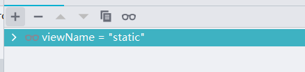

# HandlerAdapter 分析
本章将对 HandlerAdapter 接口（org.springframework.web.servlet.HandlerAdapter）进行分析.


## 初识 HandlerAdapter

在SpringMVC中HandlerAdapter是一个接口，具体定义如下：

```java
public interface HandlerAdapter {

   boolean supports(Object handler);

   @Nullable
   ModelAndView handle(HttpServletRequest request, HttpServletResponse response, Object handler) throws Exception;

   
   long getLastModified(HttpServletRequest request, Object handler);

}
```

上述三个方法的含义分别如下：

supports方法作用：判断当前适配器是否支持当前handler的处理。

handle方法作用：处理请求。

getLastModified方法作用：获取最后的文件修改时间


在`spring-webmvc/src/main/resources/org/springframework/web/servlet/DispatcherServlet.properties`文件中关于HandlerAdapter的数据设置有如下信息：

```properties
org.springframework.web.servlet.HandlerAdapter=org.springframework.web.servlet.mvc.HttpRequestHandlerAdapter,\
   org.springframework.web.servlet.mvc.SimpleControllerHandlerAdapter,\
   org.springframework.web.servlet.mvc.method.annotation.RequestMappingHandlerAdapter,\
   org.springframework.web.servlet.function.support.HandlerFunctionAdapter
```

在配置文件中可以看到HandlerAdpter有四个对应实现类它们分别是HttpRequestHandlerAdapter、SimpleControllerHandlerAdapter、RequestMappingHandlerAdapter和HandlerFunctionAdapter，在这四个类中比较常见的是前面三个，下面将对上述类进行说明：

- HttpRequestHandlerAdapter是HTTP请求处理器适配器，主要处理对象是HttpRequestHandler接口的实现类。
- SimpleControllerHandlerAdapter是简单控制器处理器适配器，主要处理对象是Controller接口的实现类。
- RequestMappingHandlerAdapter是注解方法处理器适配器，主要处理的对象是具有@RequestMapping注解的类或方法，包括@GetMapping、@PostMapping注解。
- HandlerFunctionAdapter是用于处理实现HandlerFunction接口的实现类。

上述这些类和HandlerAdapter的关系如图所示：


## 初始化 HandlerAdapter

本节将介绍 HandlerAdapters的初始化，具体处理方法签名为org.springframework.web.servlet.DispatcherServlet#initHandlerAdapters，具体处理方法如下：

```java
private void initHandlerAdapters(ApplicationContext context) {
   this.handlerAdapters = null;

   // 是否只加载 beanName为handlerAdapter的对象
   // detectAllHandlerAdapters 表示是了加载方式, true 按类型,falss按BeanName+类型加载
   if (this.detectAllHandlerAdapters) {
      // Find all HandlerAdapters in the ApplicationContext, including ancestor contexts.
      Map<String, HandlerAdapter> matchingBeans =
            BeanFactoryUtils.beansOfTypeIncludingAncestors(context, HandlerAdapter.class, true, false);
      if (!matchingBeans.isEmpty()) {
         this.handlerAdapters = new ArrayList<>(matchingBeans.values());
         // We keep HandlerAdapters in sorted order.
         AnnotationAwareOrderComparator.sort(this.handlerAdapters);
      }
   }
   else {
      try {
         HandlerAdapter ha = context.getBean(HANDLER_ADAPTER_BEAN_NAME, HandlerAdapter.class);
         this.handlerAdapters = Collections.singletonList(ha);
      }
      catch (NoSuchBeanDefinitionException ex) {
         // Ignore, we'll add a default HandlerAdapter later.
      }
   }

   // Ensure we have at least some HandlerAdapters, by registering
   // default HandlerAdapters if no other adapters are found.
   if (this.handlerAdapters == null) {
      this.handlerAdapters = getDefaultStrategies(context, HandlerAdapter.class);
      if (logger.isTraceEnabled()) {
         logger.trace("No HandlerAdapters declared for servlet '" + getServletName() +
               "': using default strategies from DispatcherServlet.properties");
      }
   }
}
```

在这段方法中需要重点关注detectAllHandlerAdapters变量，该变量是一个布尔值，当它为true时会根据类型在容器中进行搜索，搜索的内容是HandlerAdapter接口的实现类，当它为false时会根据BeanName+类型进行搜索，BeanName是handlerAdapter，这个值默认为true。在这段方法中可以分为两段代码进行分析，第一段代码是第一组if else，在第一段代码中主要目的是为了将handlerAdapters数据初始化，第二段代码是当第一段代码获取handlerAdapters失败后的补救措施。

如果进入第一段代码可以得到如下数据：


第一段中的处理方法都和SpringIoC有关，本质上就是从Map结构中获取数据。

### getDefaultStrategies 方法分析

下面将对第二段代码进行分析，主要处理方法是getDefaultStrategies，具体处理方法如下：

```java
@SuppressWarnings("unchecked")
protected <T> List<T> getDefaultStrategies(ApplicationContext context, Class<T> strategyInterface) {
   // 获取类名
   String key = strategyInterface.getName();
   // 获取属性值
   String value = defaultStrategies.getProperty(key);
   if (value != null) {
      // 将属性值进行拆分
      String[] classNames = StringUtils.commaDelimitedListToStringArray(value);
      List<T> strategies = new ArrayList<>(classNames.length);
      for (String className : classNames) {
         try {
            // 反射获取类
            Class<?> clazz = ClassUtils.forName(className, DispatcherServlet.class.getClassLoader());
            // 创建对象
            Object strategy = createDefaultStrategy(context, clazz);
            strategies.add((T) strategy);
         }
         catch (ClassNotFoundException ex) {
            throw new BeanInitializationException(
                  "Could not find DispatcherServlet's default strategy class [" + className +
                        "] for interface [" + key + "]", ex);
         }
         catch (LinkageError err) {
            throw new BeanInitializationException(
                  "Unresolvable class definition for DispatcherServlet's default strategy class [" +
                        className + "] for interface [" + key + "]", err);
         }
      }
      return strategies;
   }
   else {
      return new LinkedList<>();
   }
}
```

在这段方法中可以关注defaultStrategies变量的数据内容，它的数据内容来自于`spring-webmvc/src/main/resources/org/springframework/web/servlet/DispatcherServlet.properties`文件，目前需要进行初始化的对象类型是`HandlerAdapter`类型，通过这段代码会将下面对象进行实例化，具体实例化方法是`org.springframework.web.servlet.DispatcherServlet#createDefaultStrategy`，该方法的底层其实是getBean的调用。

```properties
org.springframework.web.servlet.mvc.HttpRequestHandlerAdapter,\
   org.springframework.web.servlet.mvc.SimpleControllerHandlerAdapter,\
   org.springframework.web.servlet.mvc.method.annotation.RequestMappingHandlerAdapter,\
   org.springframework.web.servlet.function.support.HandlerFunctionAdapter
```


当经过初始化HandlerAdapter数据后具体数据如同所示：


## 获取 HandlerAdapter

本节将介绍HandlerAdapter的获取，具体处理方法签名为org.springframework.web.servlet.DispatcherServlet#getHandlerAdapter，具体处理代码如下：

```java
protected HandlerAdapter getHandlerAdapter(Object handler) throws ServletException {
   if (this.handlerAdapters != null) {
      for (HandlerAdapter adapter : this.handlerAdapters) {
         if (adapter.supports(handler)) {
            return adapter;
         }
      }
   }
   throw new ServletException("No adapter for handler [" + handler +
         "]: The DispatcherServlet configuration needs to include a HandlerAdapter that supports this handler");
}
```

在这段方法中可以看到通过supports方法来进行判断是否支持处理，如果该方法的返回为true就会将handlerAdapter对象返回，该方法整体处理难度不高。

## HttpRequestHandlerAdapter 分析

下面将对HttpRequestHandlerAdapter类进行分析，首先查看完整代码，具体代码如下：

```java
public class HttpRequestHandlerAdapter implements HandlerAdapter {

   @Override
   public boolean supports(Object handler) {
      return (handler instanceof HttpRequestHandler);
   }

   @Override
   @Nullable
   public ModelAndView handle(HttpServletRequest request, HttpServletResponse response, Object handler)
         throws Exception {

      ((HttpRequestHandler) handler).handleRequest(request, response);
      return null;
   }

   @Override
   public long getLastModified(HttpServletRequest request, Object handler) {
      if (handler instanceof LastModified) {
         return ((LastModified) handler).getLastModified(request);
      }
      return -1L;
   }

}
```

在这段方法中可以看到HttpRequestHandlerAdapter的处理对象是围绕HttpRequestHandler接口进行的，如果需要调试这段代码可以编写HttpRequestHandler接口的实现类。本例实现类类名为HttpRequestHandlerFirst，具体代码如下：

```java
public class HttpRequestHandlerFirst implements HttpRequestHandler {
   @Override
   public void handleRequest(HttpServletRequest request, HttpServletResponse response) throws ServletException, IOException {
      PrintWriter writer = response.getWriter();
      writer.write("HttpRequestHandlerFirst");
   }
}
```

在这段代码中对请求的处理是直接写出HttpRequestHandlerFirst数据作为返回值，在完成实现类编写后需要将其注册到Spring中，即编写bean标签，修改`spring-source-mvc-demo/src/main/webapp/WEB-INF/applicationContext.xml`文件，在文件中添加如下内容：

```java
<bean name="/hrh" class="com.source.hot.mvc.httpRequestHandler.HttpRequestHandlerFirst" />
```

编写上述内容后进行网络请求，具体请求信息如下：

```HTTP
GET http://localhost:8080/hrh

HTTP/1.1 200 
Vary: Origin
Vary: Access-Control-Request-Method
Vary: Access-Control-Request-Headers
Content-Length: 23
Date: Tue, 30 Mar 2021 01:00:40 GMT
Keep-Alive: timeout=20
Connection: keep-alive

HttpRequestHandlerFirst
```

下面将对该请求的处理流程进行分析，首先当请求发起后进入到SpringMVC中会进入DispatcherServlet#doDispatch方法，在该方法中会有下面代码：

```java
HandlerAdapter ha = getHandlerAdapter(mappedHandler.getHandler());
```

SpringMVC需要通过上述代码在Spring容器中寻找对应的HandlerAdapter实现类，在本例中ha的数据信息如图所示：


在得到ha对象后需要执行的主要操作是handle方法的调用，及调用org.springframework.web.servlet.mvc.HttpRequestHandlerAdapter#handle方法，在该方法中需要关注handler对象的类型，在本例中handler数据信息如图所示：


从上图中可以确认此时会进入到测试类HttpRequestHandlerFirst中，具体处理方法就是前文所编写的内容，方法执行完成后即可看到请求的返回值。


### HttpRequestHandler分析

在前文分析HttpRequestHandlerAdapter对象时采用的方式是独立编写HttpRequestHandler接口从而进行简单分析，但是在SpringMVC中关于HttpRequestHandler接口的实现是有很多内容，具体类列表如图所示：


在这些实现类中最为频繁使用的实现类是DefaultServletHttpRequestHandler，当一个SpringMVC项目启动后访问index页面就会使用到这个实现类，下面将对这个实现类中的处理细节进行分析，具体处理方法代码如下：

```java
@Override
public void handleRequest(HttpServletRequest request, HttpServletResponse response)
      throws ServletException, IOException {

   Assert.state(this.servletContext != null, "No ServletContext set");
   // 从 servlet上下文中根据ServletName获取RequestDispatcher对象
   RequestDispatcher rd = this.servletContext.getNamedDispatcher(this.defaultServletName);
   if (rd == null) {
      throw new IllegalStateException("A RequestDispatcher could not be located for the default servlet '" +
            this.defaultServletName + "'");
   }
   // RequestDispatcher 进行处理请求
   rd.forward(request, response);
}
```

在上述方法中主要目的是为了找到RequestDispatcher对象，该对象是一个接口，具体实现会由servlet容器实现，比如本例中使用的servlet容器是tomcat，这里关于tomcat的细节实现不做展开，可以简单理解将请求处理处理后通过HttpServletResponse对象将数据返回。


## SimpleControllerHandlerAdapter 分析

下面将对SimpleControllerHandlerAdapter 类进行分析，首先查看完整代码，具体代码如下：

```java
public class SimpleControllerHandlerAdapter implements HandlerAdapter {

   @Override
   public boolean supports(Object handler) {
      return (handler instanceof Controller);
   }

   @Override
   @Nullable
   public ModelAndView handle(HttpServletRequest request, HttpServletResponse response, Object handler)
         throws Exception {

      return ((Controller) handler).handleRequest(request, response);
   }

   @Override
   public long getLastModified(HttpServletRequest request, Object handler) {
      if (handler instanceof LastModified) {
         return ((LastModified) handler).getLastModified(request);
      }
      return -1L;
   }

}
```

在这段方法中可以看到SimpleControllerHandlerAdapter的处理对象是围绕Controller接口进行的，如果需要调试这段代码可以编写Controller接口的实现类，本例实现类类名为ControllerImpl，具体代码如下：

```java
public class ControllerImpl implements Controller {
   @Override
   public ModelAndView handleRequest(HttpServletRequest request, HttpServletResponse response) throws Exception {
      ModelAndView modelAndView = new ModelAndView();
      modelAndView.setStatus(HttpStatus.OK);
      return modelAndView;
   }
}
```

完成Controller接口实现类的编写后需要将其注入到Spring容器中，修改`spring-source-mvc-demo/src/main/webapp/WEB-INF/applicationContext.xml`文件，在文件中添加如下内容：

```xml
<bean id="controllerImpl" class="com.source.hot.mvc.ctr.ControllerImpl"/>
<bean class="org.springframework.web.servlet.handler.SimpleUrlHandlerMapping">
    <property name="order" value="1"/>
    <property name="mappings">
        <value>
            /hello=controllerImpl
        </value>
    </property>
</bean>

```

编写上述内容后进行网络请求，具体请求信息如下：

```HTTP
GET http://localhost:8080/hello

HTTP/1.1 200 
Set-Cookie: JSESSIONID=AEE2E40AF9D62DB53F68A039B7F64EEF; Path=/; HttpOnly
Content-Type: text/html;charset=UTF-8
Content-Language: zh-CN
Content-Length: 92
Date: Thu, 01 Apr 2021 02:20:51 GMT
Keep-Alive: timeout=20
Connection: keep-alive

<html>
<head>
  <title>Title</title>
</head>
<body>
<h3>hello-jsp</h3>

</body>
</html>
```

当发起该请求时SpringMVC会做如下几个操作：

1. 接收请求，将请求转换成handler对象，本例中得到的handler对象数据如下：

   

2. 根据handler对象找到HandlerAdapter对象，本例中HandlerAdapter对象的数据信息如下：

   

3. 调用HandlerAdapter对象的handler方法，此时的HandlerAdapter对象是SimpleControllerHandlerAdapter类型，调用的方法其实是调用Controller接口实现类的方法。


## Controller 接口分析

在前文介绍了Controller接口的直接实现在SpringMVC中的处理过程，下面将对Controller接口的其他实现类进行分析，关于Controller接口的实现类信息如图所示：


### ServletForwardingController 分析

接下来将对Controller接口的ServletForwardingController 实现类进行分析，开始进行分析前需要编写测试用例。

第一步：编写Servlet对象，编写该对象的目的是为了各个Servlet环境隔离，类名为ServletForwardingControllerServlet，具体代码如下：

```java
public class ServletForwardingControllerServlet extends HttpServlet {
   private static final long serialVersionUID = 1L;

   @Override
   protected void doGet(HttpServletRequest req,
         HttpServletResponse resp) throws ServletException, IOException {
      resp.getWriter().print("ServletForwardingControllerServlet!");
   }
}
```

注意：本例主要目标是用例演示并不是实际使用，因此只做get方法的处理。

第二步：编写SpringXML配置文件，注意此时的配置文件不能在原有的applicationContext.xml文件中修改，需要创建servlet-forwarding-dispatcher-servlet.xml名字的文件，该文件与web.xml是同级文件，文件内容如下：

```xml
<?xml version="1.0" encoding="UTF-8"?>
<beans xmlns="http://www.springframework.org/schema/beans"
   xmlns:xsi="http://www.w3.org/2001/XMLSchema-instance"
   xsi:schemaLocation="http://www.springframework.org/schema/beans 
   http://www.springframework.org/schema/beans/spring-beans-4.3.xsd">

   <bean class="org.springframework.web.servlet.handler.SimpleUrlHandlerMapping">
      <property name="mappings">
         <props>
            <prop key="/">servletForwardingController</prop>
         </props>
      </property>
   </bean>

   <bean id="servletForwardingController"
      class="org.springframework.web.servlet.mvc.ServletForwardingController">
      <property name="servletName">
         <value>ServletForwardingControllerServlet</value>
      </property>
   </bean>
</beans>
```

第三步：修改web.xml，本次修改的主要目的是将第一步编写的Servlet进行注册，添加的代码如下：

```xml
<servlet>
   <servlet-name>ServletForwardingControllerServlet</servlet-name>
   <servlet-class>com.source.hot.mvc.servlet.ServletForwardingControllerServlet</servlet-class>
</servlet>

<servlet>
   <servlet-name>servlet-forwarding-dispatcher</servlet-name>
   <servlet-class>org.springframework.web.servlet.DispatcherServlet</servlet-class>
   <load-on-startup>1</load-on-startup>
</servlet>
<servlet-mapping>
   <servlet-name>servlet-forwarding-dispatcher</servlet-name>
   <url-pattern>/servlet-forwarding/*</url-pattern>
</servlet-mapping>
```

第四步：发起请求，具体请求信息如下：

```http
GET http://localhost:8080/servlet-forwarding/

HTTP/1.1 200 
Content-Length: 35
Date: Thu, 01 Apr 2021 06:05:59 GMT
Keep-Alive: timeout=20
Connection: keep-alive

ServletForwardingControllerServlet!
```

准备工作完成后需要进行调试操作，在SimpleControllerHandlerAdapter#handle方法上进行调试，首先关注handler参数，具体信息如图所示：


从上图中可以发现此时handler是ServletForwardingController类型，下面对handler操作进行分析。ServletForwardingController对象是AbstractController的子类，核心入口是org.springframework.web.servlet.mvc.AbstractController#handleRequest方法，具体处理方法如下：

```java
public ModelAndView handleRequest(HttpServletRequest request, HttpServletResponse response)
      throws Exception {

   // 请求方式验证
   if (HttpMethod.OPTIONS.matches(request.getMethod())) {
      response.setHeader("Allow", getAllowHeader());
      return null;
   }

   // Delegate to WebContentGenerator for checking and preparing.
   // 检查请求
   checkRequest(request);
   // 准备返回结果
   prepareResponse(response);

   // Execute handleRequestInternal in synchronized block if required.
   // 是否需要同步执行
   if (this.synchronizeOnSession) {
      HttpSession session = request.getSession(false);
      if (session != null) {
         Object mutex = WebUtils.getSessionMutex(session);
         synchronized (mutex) {
            // 处理请求
            return handleRequestInternal(request, response);
         }
      }
   }

   // 处理请求
   return handleRequestInternal(request, response);
}
```

在上述方法中的主要处理流程有下面四项：

第一项：对请求方式进行验证，如果是OPTIONS会直接返回null。

第二项：检查请求，检查内容有两个，第一个是对请求类型是否支持的验证，第二个是对Session的验证。

第三项：准备返回结果。

第四项：处理请求。

在上述四项操作中，第四项操作会进入到子类的方法中，也就是执行下面这段代码：

```java
@Override
protected ModelAndView handleRequestInternal(HttpServletRequest request, HttpServletResponse response)
      throws Exception {

   ServletContext servletContext = getServletContext();
   Assert.state(servletContext != null, "No ServletContext");
   RequestDispatcher rd = servletContext.getNamedDispatcher(this.servletName);
   if (rd == null) {
      throw new ServletException("No servlet with name '" + this.servletName + "' defined in web.xml");
   }

   // If already included, include again, else forward.
   if (useInclude(request, response)) {
      rd.include(request, response);
      if (logger.isTraceEnabled()) {
         logger.trace("Included servlet [" + this.servletName +
               "] in ServletForwardingController '" + this.beanName + "'");
      }
   }
   else {
      rd.forward(request, response);
      if (logger.isTraceEnabled()) {
         logger.trace("Forwarded to servlet [" + this.servletName +
               "] in ServletForwardingController '" + this.beanName + "'");
      }
   }

   return null;
}
```

在上述方法中核心目标是提取RequestDispatcher对象并进行请求处理，具体处理方法是include或者forward，这两个方法的属于接口方法，具体实现代码在Servlet容器中。


### ParameterizableViewController 分析

接下来将对Controller接口的ParameterizableViewController 实现类进行分析，开始进行分析前需要编写测试用例。

第一步：定义一个新的Servlet，这里可以直接通过web.xml文件的servlet相关标签进行配置，具体配置信息如下：

```xml
	<servlet>
		<servlet-name>parameterizable-view-dispatcher</servlet-name>
		<servlet-class>org.springframework.web.servlet.DispatcherServlet</servlet-class>
		<load-on-startup>1</load-on-startup>
	</servlet>
	<servlet-mapping>
		<servlet-name>parameterizable-view-dispatcher</servlet-name>
		<url-pattern>/parameterizable-view/*</url-pattern>
	</servlet-mapping>
```

第二步：创建一个JSP文件，该文件主要目的是用于显示内容，文件路径为spring-source-mvc-demo/src/main/webapp/WEB-INF/parameterizable-view/static.jsp，文件内容如下：

```jsp
<!DOCTYPE html>
<html>
<head>
<title>ParameterizableViewController</title>
</head>
<body>
   <h1>org.springframework.web.servlet.mvc.ParameterizableViewController</h1>
</body>
</html>
```

第三步：创建parameterizable-view-dispatcher.xml文件，该文件和web.xml同级，具体代码如下：

```java
<?xml version="1.0" encoding="UTF-8"?>
<beans xmlns="http://www.springframework.org/schema/beans"
   xmlns:xsi="http://www.w3.org/2001/XMLSchema-instance"
   xsi:schemaLocation="http://www.springframework.org/schema/beans 
   http://www.springframework.org/schema/beans/spring-beans-4.3.xsd">

   <bean id="viewResolver"
      class="org.springframework.web.servlet.view.InternalResourceViewResolver">
      <property name="prefix">
         <value>/WEB-INF/parameterizable-view/</value>
      </property>
      <property name="suffix">
         <value>.jsp</value>
      </property>
   </bean>

   <bean class="org.springframework.web.servlet.handler.SimpleUrlHandlerMapping">
      <property name="mappings">
         <props>
            <prop key="/">parameterizableViewController</prop>
         </props>
      </property>
   </bean>

   <bean id="parameterizableViewController"
      class="org.springframework.web.servlet.mvc.ParameterizableViewController">
      <property name="viewName" value="static" />
   </bean>
</beans>
```

第四步：发送请求，具体请求信息如下：

```http
GET http://localhost:8080/parameterizable-view/

HTTP/1.1 200 
Set-Cookie: JSESSIONID=A61288673DB2AD1BC322387878A9B6A2; Path=/; HttpOnly
Content-Type: text/html;charset=ISO-8859-1
Content-Language: zh-CN
Content-Length: 189
Date: Thu, 01 Apr 2021 06:51:17 GMT
Keep-Alive: timeout=20
Connection: keep-alive

<!DOCTYPE html>
<html>
<head>
  <title>ParameterizableViewController</title>
</head>
<body>
<h1>org.springframework.web.servlet.mvc.ParameterizableViewController</h1>
</body>
</html>
```

通过对ServletForwardingController对象的分析可以知道继承AbstractController类的子类主要入口在父类（方法签名：org.springframework.web.servlet.mvc.AbstractController#handleRequest），具体处理的差异细节是handleRequestInternal方法，ParameterizableViewController中具体实现代码如下：

```java
@Override
protected ModelAndView handleRequestInternal(HttpServletRequest request, HttpServletResponse response)
      throws Exception {

   // 获取视图名称
   String viewName = getViewName();

   // 状态相关处理
   if (getStatusCode() != null) {
      if (getStatusCode().is3xxRedirection()) {
         request.setAttribute(View.RESPONSE_STATUS_ATTRIBUTE, getStatusCode());
      }
      else {
         response.setStatus(getStatusCode().value());
         if (getStatusCode().equals(HttpStatus.NO_CONTENT) && viewName == null) {
            return null;
         }
      }
   }

   if (isStatusOnly()) {
      return null;
   }

   // 组装 ModelAndView 对象
   ModelAndView modelAndView = new ModelAndView();
   modelAndView.addAllObjects(RequestContextUtils.getInputFlashMap(request));
   if (viewName != null) {
      modelAndView.setViewName(viewName);
   }
   else {
      modelAndView.setView(getView());
   }
   return modelAndView;
}
```

在上述方法中主要处理操作有三项：

第一项：获取视图名称。viewName数据是通过parameterizable-view-dispatcher-servlet.xml文件进行配置，具体数据如图所示：



第二项：处理状态相关内容，第一将状态数据设置给request或者response，第二对statusOnly属性是否为true的判断。本例中有两个数据很关键，第一个是statusCode，第二个是statusOnly，这两项数据同样可以通过parameterizable-view-dispatcher-servlet.xml文件进行配置，数据信息如下：


第三项：组装ModelAndViews对象。在本例中ModelAndViews的数据信息如图所示：


当ModelAndViews数据组装完成就会数据返回完成本次请求的处理。


### ServletWrappingController 分析

接下来将对Controller接口的ServletWrappingController实现类进行分析，开始进行分析前需要编写测试用例。

第一步：编写Servlet对象，编写该对象的目的是为了各个Servlet环境隔离，类名为ServletWrappingControllerServlet，具体代码如下：

```
public class ServletWrappingControllerServlet extends HttpServlet {
   private static final long serialVersionUID = 1L;

   @Override
   protected void doGet(HttpServletRequest req,
         HttpServletResponse resp) throws ServletException, IOException {
      resp.getWriter().print("ServletWrappingControllerServlet!");
   }
}
```

第二步：编写SpringXML配置文件，注意此时的配置文件不能在原有的applicationContext.xml文件中修改，需要创建servlet-wrapping-dispatcher-servlet.xml名字的文件，该文件与web.xml是同级文件，文件内容如下：

```xml
<?xml version="1.0" encoding="UTF-8"?>
<beans xmlns="http://www.springframework.org/schema/beans"
   xmlns:xsi="http://www.w3.org/2001/XMLSchema-instance"
   xsi:schemaLocation="http://www.springframework.org/schema/beans 
   http://www.springframework.org/schema/beans/spring-beans-4.3.xsd">

   <bean class="org.springframework.web.servlet.handler.SimpleUrlHandlerMapping">
      <property name="mappings">
         <props>
            <prop key="/">servletWrappingController</prop>
         </props>
      </property>
   </bean>

   <bean id="servletWrappingController"
      class="org.springframework.web.servlet.mvc.ServletWrappingController">
      <property name="servletClass">
         <value>
            com.source.hot.mvc.servlet.ServletWrappingControllerServlet
         </value>
      </property>
   </bean>
</beans>
```

第三步：定义一个新的Servlet，这里可以直接通过web.xml文件的servlet相关标签进行配置，具体配置信息如下：

```xml
<servlet>
   <servlet-name>servlet-wrapping-dispatcher</servlet-name>
   <servlet-class>org.springframework.web.servlet.DispatcherServlet</servlet-class>
   <load-on-startup>1</load-on-startup>
</servlet>
<servlet-mapping>
   <servlet-name>servlet-wrapping-dispatcher</servlet-name>
   <url-pattern>/servlet-wrapping/*</url-pattern>
</servlet-mapping>
```

第四步：发送请求，具体请求信息如下：

```http
GET http://localhost:8080/servlet-wrapping/

HTTP/1.1 200 
Content-Length: 33
Date: Thu, 01 Apr 2021 07:29:01 GMT
Keep-Alive: timeout=20
Connection: keep-alive

ServletWrappingControllerServlet!
```

在ServletWrappingController对象中需要关注的方法有两个，第一个是由InitializingBean接口提供的afterPropertiesSet方法，第二个是父类需要子类实现的handleRequestInternal方法，首先查看afterPropertiesSet方法，具体代码如下：

```java
@Override
public void afterPropertiesSet() throws Exception {
   if (this.servletClass == null) {
      throw new IllegalArgumentException("'servletClass' is required");
   }
   if (this.servletName == null) {
      this.servletName = this.beanName;
   }
   this.servletInstance = ReflectionUtils.accessibleConstructor(this.servletClass).newInstance();
   this.servletInstance.init(new DelegatingServletConfig());
}
```

在这个方法中主要目标是进行Servlet对象的实例化操作，在本例中通过配置文件配置的Servlet对象是com.source.hot.mvc.servlet.ServletWrappingControllerServlet，通过调试查看servletClass、servletName和servletInstance的数据信息：


当servletInstance对象完成创建后进行init方法执行后就会完成Servlet的基本初始化。初始化完成后会等待请求进入，在测试用例中发送了"http://localhost:8080/servlet-wrapping/"请求，该请求进入到SpringMVC后会进入ServletWrappingController#handleRequestInternal方法，具体处理代码如下：

```java
@Override
protected ModelAndView handleRequestInternal(HttpServletRequest request, HttpServletResponse response)
      throws Exception {

   Assert.state(this.servletInstance != null, "No Servlet instance");
   this.servletInstance.service(request, response);
   return null;
}
```

通过前文的分析知道servletInstance是ServletWrappingControllerServlet类型具体service的方法也在ServletWrappingControllerServlet对象之中，具体实现代码就是前文编写的ServletWrappingControllerServlet#doGet方法。


### UrlFilenameViewController

接下来将对Controller接口的UrlFilenameViewController实现类进行分析，开始进行分析前需要编写测试用例。

第一步：定义一个新的Servlet，这里可以直接通过web.xml文件的servlet相关标签进行配置，具体配置信息如下：

```xml
<servlet>
   <servlet-name>url-filename-view-dispatcher</servlet-name>
   <servlet-class>org.springframework.web.servlet.DispatcherServlet</servlet-class>
   <load-on-startup>1</load-on-startup>
</servlet>
<servlet-mapping>
   <servlet-name>url-filename-view-dispatcher</servlet-name>
   <url-pattern>/url-filename-view/*</url-pattern>
</servlet-mapping>
```

第二步：创建一个JSP文件，该文件主要目的是用于显示内容，文件路径为spring-source-mvc-demo/src/main/webapp/WEB-INF/url-filename-view/static.jsp，文件内容如下：

```jsp
<!DOCTYPE html>
<html>
<head>
<title>UrlFilenameViewController</title>
</head>
<body>

   <h1>org.springframework.web.servlet.mvc.UrlFilenameViewController</h1>

</body>
</html>
```

第三步：创建url-filename-view-dispatcher-servlet.xml文件，该文件和web.xml同级，具体代码如下：

```xml
<?xml version="1.0" encoding="UTF-8"?>
<beans xmlns="http://www.springframework.org/schema/beans"
   xmlns:xsi="http://www.w3.org/2001/XMLSchema-instance"
   xsi:schemaLocation="http://www.springframework.org/schema/beans 
   http://www.springframework.org/schema/beans/spring-beans-4.3.xsd">

   <bean id="viewResolver"
      class="org.springframework.web.servlet.view.InternalResourceViewResolver">
      <property name="prefix">
         <value>/WEB-INF/url-filename-view/</value>
      </property>
      <property name="suffix">
         <value>.jsp</value>
      </property>
   </bean>

   <bean class="org.springframework.web.servlet.handler.SimpleUrlHandlerMapping">
      <property name="mappings">
         <props>
            <prop key="/static">urlFilenameViewController</prop>
         </props>
      </property>
   </bean>

   <bean id="urlFilenameViewController"
      class="org.springframework.web.servlet.mvc.UrlFilenameViewController" />
</beans>
```

第四步：发送请求，具体请求信息如下：

```http
GET http://localhost:8080/url-filename-view/static

HTTP/1.1 200 
Set-Cookie: JSESSIONID=DEC6391E8F56C5C3BDEC0AF01E598E9C; Path=/; HttpOnly
Content-Type: text/html;charset=ISO-8859-1
Content-Language: zh-CN
Content-Length: 185
Date: Fri, 02 Apr 2021 02:40:56 GMT
Keep-Alive: timeout=20
Connection: keep-alive

<!DOCTYPE html>
<html>
<head>
  <title>UrlFilenameViewController</title>
</head>
<body>

<h1>org.springframework.web.servlet.mvc.UrlFilenameViewController</h1>

</body>
</html>

```

下面进入UrlFilenameViewController对象的分析，在UrlFilenameViewController对象之中关键的方法是getViewNameForRequest，该方法的作用是从请求中提取视图名称，具体处理代码如下：

```java
@Override
protected String getViewNameForRequest(HttpServletRequest request) {
   // 获取 uri
   String uri = extractOperableUrl(request);
   // 获取视图名称
   return getViewNameForUrlPath(uri);
}
```

在getViewNameForRequest方法中会通过两个操作获取视图名称：

1. 提取uri数据，具体处理代码如下：

   ```java
   protected String extractOperableUrl(HttpServletRequest request) {
      // 提取 HandlerMapping.PATH_WITHIN_HANDLER_MAPPING_ATTRIBUTE 对应的数据信息
      String urlPath = (String) request.getAttribute(HandlerMapping.PATH_WITHIN_HANDLER_MAPPING_ATTRIBUTE);
      if (!StringUtils.hasText(urlPath)) {
         // 解析正真的url地址
         urlPath = getUrlPathHelper().getLookupPathForRequest(request, HandlerMapping.LOOKUP_PATH);
      }
      return urlPath;
   }
   ```

   通过上述代码可以知道具体处理操作有两个：

   1. 从请求对象中提取HandlerMapping.PATH_WITHIN_HANDLER_MAPPING_ATTRIBUTE 对应的数据信息。

   2. 第一个操作中无法得到数据依靠UrlPathHelper对象对请求进行处理得到urlPath数据。

      在本例中request对象的属性信息如图所示：

      

      在上图中需要关注org.springframework.web.servlet.HandlerMapping.pathWithinHandlerMapping所对应的数据"/static"，此时第一个操作即可获取数据。urlPath的数据为”/static“

      

2. 从uri中提取视图名称，具体会从视图缓存或者uri解析得到具体处理代码如下：

   ```java
   protected String getViewNameForUrlPath(String uri) {
      // 视图缓存中获取
      String viewName = this.viewNameCache.get(uri);
      if (viewName == null) {
         // 从url中提取文件名称
         viewName = extractViewNameFromUrlPath(uri);
         // 处理文件名,处理方式: 前缀+viewName+后缀
         viewName = postProcessViewName(viewName);
         this.viewNameCache.put(uri, viewName);
      }
      return viewName;
   }
   ```

   在上述代码中具体处理流程如下：

   1. 从视图缓存中获取视图名称。
   2. 从uri中寻找对应的视图名称，总共分为三个处理细节：
      1. 从uri数据中提取视图名称。
      2. 将uri中得到的视图名称和前缀后缀相加，相加公式为：前缀+视图名称+后缀。
      3. 放入试视图缓存。

现在对于getViewNameForRequest方法分析完成，下面需要往父类找该方法的调用位置，父类的调用位置是一个熟悉的方法handleRequestInternal，具体处理代码如下：

```java
@Override
protected ModelAndView handleRequestInternal(HttpServletRequest request,
                                             HttpServletResponse response) {
    // 从请求中获取视图名称
    String viewName = getViewNameForRequest(request);
    if (logger.isTraceEnabled()) {
        logger.trace("Returning view name '" + viewName + "'");
    }
    // 创建 ModelAndView
    return new ModelAndView(viewName, RequestContextUtils.getInputFlashMap(request));
}

```

在这个方法中主要处理流程有两个：

1. 从请求中获取视图名称。
2. 创建ModelAndView对象。

通过上述两个操作将返回对象完成组装从而可以看到请求结果。


## RequestMappingHandlerAdapter 分析

下面将对RequestMappingHandlerAdapter 类进行分析，首先查看它的类图，具体类图如图所示：


在类图上可以发现它实现了InitializingBean接口，该接口的实现方法是需要分析的几个方法之一，它的处理代码如下：

```java
@Override
public void afterPropertiesSet() {
   // Do this first, it may add ResponseBody advice beans
   // 初始化 ControllerAdviceCache 相关内容
   initControllerAdviceCache();

   // 部分成员变量初始化
   if (this.argumentResolvers == null) {
      List<HandlerMethodArgumentResolver> resolvers = getDefaultArgumentResolvers();
      this.argumentResolvers = new HandlerMethodArgumentResolverComposite().addResolvers(resolvers);
   }
   if (this.initBinderArgumentResolvers == null) {
      List<HandlerMethodArgumentResolver> resolvers = getDefaultInitBinderArgumentResolvers();
      this.initBinderArgumentResolvers = new HandlerMethodArgumentResolverComposite().addResolvers(resolvers);
   }
   if (this.returnValueHandlers == null) {
      List<HandlerMethodReturnValueHandler> handlers = getDefaultReturnValueHandlers();
      this.returnValueHandlers = new HandlerMethodReturnValueHandlerComposite().addHandlers(handlers);
   }
}
```

在afterPropertiesSet方法中主要处理事项有两个：

1. 初始化ControllerAdvice注解相关数据。
2. 设置部分成员变量。

下文将对initControllerAdviceCache方法、getDefaultArgumentResolvers方法、getDefaultInitBinderArgumentResolvers方法和getDefaultReturnValueHandlers方法进行分析。

### initControllerAdviceCache 方法分析

接下来将对initControllerAdviceCache方法进行分析，首先查看方法源代码：

```java
private void initControllerAdviceCache() {
   if (getApplicationContext() == null) {
      return;
   }

   // 在容器中寻找具有 ControllerAdvice 注解的对象
   List<ControllerAdviceBean> adviceBeans = ControllerAdviceBean.findAnnotatedBeans(getApplicationContext());

   List<Object> requestResponseBodyAdviceBeans = new ArrayList<>();

   // 循环黑醋栗 ControllerAdviceBean
   for (ControllerAdviceBean adviceBean : adviceBeans) {
      Class<?> beanType = adviceBean.getBeanType();
      if (beanType == null) {
         throw new IllegalStateException("Unresolvable type for ControllerAdviceBean: " + adviceBean);
      }
      // 在ControllerAdviceBean对应的原始类中找到符合 MODEL_ATTRIBUTE_METHODS 过滤器的数据
      Set<Method> attrMethods = MethodIntrospector.selectMethods(beanType, MODEL_ATTRIBUTE_METHODS);
      if (!attrMethods.isEmpty()) {
         this.modelAttributeAdviceCache.put(adviceBean, attrMethods);
      }
      // 在ControllerAdviceBean对应的原始类中找到符合 INIT_BINDER_METHODS 过滤器的数据
      Set<Method> binderMethods = MethodIntrospector.selectMethods(beanType, INIT_BINDER_METHODS);
      if (!binderMethods.isEmpty()) {
         this.initBinderAdviceCache.put(adviceBean, binderMethods);
      }
      if (RequestBodyAdvice.class.isAssignableFrom(beanType) ||
            ResponseBodyAdvice.class.isAssignableFrom(beanType)) {
         requestResponseBodyAdviceBeans.add(adviceBean);
      }
   }

   // 设置 ControllerAdvice 对象数据给 requestResponseBodyAdvice
   if (!requestResponseBodyAdviceBeans.isEmpty()) {
      this.requestResponseBodyAdvice.addAll(0, requestResponseBodyAdviceBeans);
   }

   // 日志输出
   if (logger.isDebugEnabled()) {
      int modelSize = this.modelAttributeAdviceCache.size();
      int binderSize = this.initBinderAdviceCache.size();
      int reqCount = getBodyAdviceCount(RequestBodyAdvice.class);
      int resCount = getBodyAdviceCount(ResponseBodyAdvice.class);
      if (modelSize == 0 && binderSize == 0 && reqCount == 0 && resCount == 0) {
         logger.debug("ControllerAdvice beans: none");
      }
      else {
         logger.debug("ControllerAdvice beans: " + modelSize + " @ModelAttribute, " + binderSize +
               " @InitBinder, " + reqCount + " RequestBodyAdvice, " + resCount + " ResponseBodyAdvice");
      }
   }
}
```

在开始分析上述方法之前需要编写一个具备ControllerAdvice注解的Controller类，类名为CustomExceptionHandler，具体代码如下：

```java
@ControllerAdvice
public class CustomExceptionHandler {
   @ResponseBody
   @ExceptionHandler(value = Exception.class)
   public Map<String, Object> errorHandler(Exception ex) {
      Map<String, Object> map = new HashMap<>();
      map.put("code", 400);
      map.put("msg", ex.getMessage());
      return map;
   }
}
```

完成测试代码编写后进行initControllerAdviceCache方法分析，在该方法中主要处理内容如下：

1. 在Spring容器中寻找具有ControllerAdvice注解的Bean对象，将其转换成ControllerAdviceBean对象。本例中转换后的数据对象如图所示：

   


2. 对第一步中得到的数据进行处理，主要处理的内容有两个

   - 在ControllerAdviceBean的原始类型中寻找符合MODEL_ATTRIBUTE_METHODS条件的函数，将这些函数放在modelAttributeAdviceCache对象中。

   - 在ControllerAdviceBean的原始类型中寻找符合INIT_BINDER_METHODS条件的函数，将这些函数放在initBinderAdviceCache对象中。

   - 如果ControllerAdviceBean的原始类型是RequestBodyAdvice的实现或者是ResponseBodyAdvice的实现将其放入到requestResponseBodyAdviceBeans集合中。

     原始类型是指被ControllerAdvice注解标记的类，在本例中所使用的类并不符合这些条件对应三个变量的数据信息如图所示：

     

3. 为requestResponseBodyAdvice集合设置属性。


### 部分成员变量初始化

在afterPropertiesSet方法中除了initControllerAdviceCache方法的调用以外还有getDefaultArgumentResolvers方法、getDefaultInitBinderArgumentResolvers方法和getDefaultReturnValueHandlers方法的调用，这些方法的目的都是进行数据初始化，在这些数据初始化方法中都是进行new关键字的调用，实际操作难度和理解难度不高，处理后的数据信息如图所示：


### handleInternal 方法分析

在RequestMappingHandlerAdapter对象中还有一个需要关注的方法，这个方法是handleInternal ，该方法的职责是进行请求处理，将请求转换成ModelAndView对象，具体处理代码如下：

```java
@Override
protected ModelAndView handleInternal(HttpServletRequest request,
      HttpServletResponse response, HandlerMethod handlerMethod) throws Exception {

   ModelAndView mav;
   // 检查请求
   checkRequest(request);

   // Execute invokeHandlerMethod in synchronized block if required.
   // 是否需要在同步代码快中执行
   if (this.synchronizeOnSession) {
      HttpSession session = request.getSession(false);
      if (session != null) {
         Object mutex = WebUtils.getSessionMutex(session);
         synchronized (mutex) {
            mav = invokeHandlerMethod(request, response, handlerMethod);
         }
      }
      else {
         // No HttpSession available -> no mutex necessary
         mav = invokeHandlerMethod(request, response, handlerMethod);
      }
   }
   else {
      // No synchronization on session demanded at all...
      mav = invokeHandlerMethod(request, response, handlerMethod);
   }

   // 请求头中包含Cache-Control数据的处理
   if (!response.containsHeader(HEADER_CACHE_CONTROL)) {
      // 获取 session属性
      if (getSessionAttributesHandler(handlerMethod).hasSessionAttributes()) {
         // 应用缓存的有效时间
         applyCacheSeconds(response, this.cacheSecondsForSessionAttributeHandlers);
      }
      else {
         // 返回值准备
         prepareResponse(response);
      }
   }

   return mav;
}
```

在这段代码中的主要执行流程有如下几个步骤：

1. 对请求进行检查，检查内容有请求方式的检查和Session的检查。
2. 执行handler对象的方法。
3. 处理请求头中未出现Cache-Control的操作，处理操作有缓存的有效期处理和返回值的准备。

在上述流程处理中需要关注的方法有三个它们分别是invokeHandlerMethod、applyCacheSeconds和prepareResponse，在这三个方法中相对重要的方法是invokeHandlerMethod。


#### invokeHandlerMethod 分析

在开始invokeHandlerMethod方法的调试及源码分析之前需要先进行基本测试环境的搭建，该环境返回值采用json进行返回，不返回视图模型对象。

1. 首先需要引入jackson-databind依赖，修改build.gradle文件，向其中添加如下内容：

```groovy
compile 'com.fasterxml.jackson.core:jackson-databind:2.9.6'
```

2. 修改web.xml文件添加一个新的Servlet标签用来处理返回json的情况，添加的代码如下：

   ```xml
   <servlet>
      <servlet-name>servlet-annotation-dispatcher</servlet-name>
      <servlet-class>org.springframework.web.servlet.DispatcherServlet</servlet-class>
      <load-on-startup>1</load-on-startup>
   </servlet>
   <servlet-mapping>
      <servlet-name>servlet-annotation-dispatcher</servlet-name>
      <url-pattern>/servlet-annotation/*</url-pattern>
   </servlet-mapping>
   ```

3. 在web.xml的同级目录下创建servlet-annotation-dispatcher-servlet.xml文件，向该文件内添加如下代码：

   ```xml
   <?xml version="1.0" encoding="UTF-8"?>
   <beans xmlns="http://www.springframework.org/schema/beans"
         xmlns:xsi="http://www.w3.org/2001/XMLSchema-instance" xmlns:mvc="http://www.springframework.org/schema/mvc"
         xmlns:context="http://www.springframework.org/schema/context" xmlns:p="http://www.springframework.org/schema/p"
         xsi:schemaLocation="http://www.springframework.org/schema/beans http://www.springframework.org/schema/beans/spring-beans.xsd http://www.springframework.org/schema/mvc https://www.springframework.org/schema/mvc/spring-mvc.xsd http://www.springframework.org/schema/context https://www.springframework.org/schema/context/spring-context.xsd">
      <context:component-scan base-package="com.source.hot.mvc.ann.ctr"/>
   
      <mvc:annotation-driven/>
      <bean class="org.springframework.web.servlet.mvc.method.annotation.RequestMappingHandlerAdapter"
           p:ignoreDefaultModelOnRedirect="true" >
         <property name="messageConverters">
            <list>
               <bean class="org.springframework.http.converter.json.MappingJackson2HttpMessageConverter"/>
            </list>
         </property>
      </bean>
   </beans>
   ```

4. 发送请求，具体请求信息如下：

   ```http
   GET http://localhost:8080/servlet-annotation/json
   
   HTTP/1.1 200 
   Content-Type: application/json
   Transfer-Encoding: chunked
   Date: Tue, 06 Apr 2021 01:28:58 GMT
   Keep-Alive: timeout=20
   Connection: keep-alive
   
   {
     "demo": "demo"
   }
   ```

在完成上述测试用例编写后需要进行方法的分析，首先查看代码：

```java
@Nullable
protected ModelAndView invokeHandlerMethod(HttpServletRequest request,
      HttpServletResponse response, HandlerMethod handlerMethod) throws Exception {

   // 创建 ServletWebRequest
   ServletWebRequest webRequest = new ServletWebRequest(request, response);
   try {
      // 数据绑定工厂
      WebDataBinderFactory binderFactory = getDataBinderFactory(handlerMethod);
      // 获取模型工厂
      ModelFactory modelFactory = getModelFactory(handlerMethod, binderFactory);

      // 请求处理器
      ServletInvocableHandlerMethod invocableMethod = createInvocableHandlerMethod(handlerMethod);
      // 设置参数解析类
      if (this.argumentResolvers != null) {
         invocableMethod.setHandlerMethodArgumentResolvers(this.argumentResolvers);
      }
      // 设置返回值解析类
      if (this.returnValueHandlers != null) {
         invocableMethod.setHandlerMethodReturnValueHandlers(this.returnValueHandlers);
      }
      // 设置数据绑定工厂
      invocableMethod.setDataBinderFactory(binderFactory);
      // 设置参数名称发现器
      invocableMethod.setParameterNameDiscoverer(this.parameterNameDiscoverer);

      // 数据传递对象,数据上下文
      ModelAndViewContainer mavContainer = new ModelAndViewContainer();
      // 添加属性表
      mavContainer.addAllAttributes(RequestContextUtils.getInputFlashMap(request));
      // 初始化模型对象
      modelFactory.initModel(webRequest, mavContainer, invocableMethod);
      // 设置重定向时是否需要忽略原有默认数据模型
      mavContainer.setIgnoreDefaultModelOnRedirect(this.ignoreDefaultModelOnRedirect);

      // 创建异步请求对象
      AsyncWebRequest asyncWebRequest = WebAsyncUtils.createAsyncWebRequest(request, response);
      // 设置超时时间
      asyncWebRequest.setTimeout(this.asyncRequestTimeout);

      // 管理异步的网络请求
      WebAsyncManager asyncManager = WebAsyncUtils.getAsyncManager(request);
      // 设置执行器
      asyncManager.setTaskExecutor(this.taskExecutor);
      // 设置异步请求
      asyncManager.setAsyncWebRequest(asyncWebRequest);
      // 设置可调用拦截器列表
      asyncManager.registerCallableInterceptors(this.callableInterceptors);
      // 注册延迟结果处理拦截器列表
      asyncManager.registerDeferredResultInterceptors(this.deferredResultInterceptors);

      if (asyncManager.hasConcurrentResult()) {
         // 获取处理结果
         Object result = asyncManager.getConcurrentResult();
         // 获取处理的数据上下文
         mavContainer = (ModelAndViewContainer) asyncManager.getConcurrentResultContext()[0];
         // 清空数据
         asyncManager.clearConcurrentResult();
         LogFormatUtils.traceDebug(logger, traceOn -> {
            String formatted = LogFormatUtils.formatValue(result, !traceOn);
            return "Resume with async result [" + formatted + "]";
         });
         // 包装返回对象
         invocableMethod = invocableMethod.wrapConcurrentResult(result);
      }

      // 执行处理器方法
      invocableMethod.invokeAndHandle(webRequest, mavContainer);
      if (asyncManager.isConcurrentHandlingStarted()) {
         return null;
      }

      // 获取视图对象
      return getModelAndView(mavContainer, modelFactory, webRequest);
   }
   finally {
      // 发出请求处理完成通知
      webRequest.requestCompleted();
   }
}
```

在invokeHandlerMethod方法执行过程中主要的处理操作流程有如下内容：

1. 创建ServletWebRequest对象。
2. 获取数据绑定工厂。
3. 获取模型工厂。
4. 创建请求处理器对象，设置请求处理器对象的参数解析对象、设置返回值解析对象、设置参数绑定工厂、设置参数名称发现器。
5. 创建数据传递对象（数据上下文对象），为数据传递对象添加属性表、初始化模型对象、设置重定向时是否需要忽略原有的默认模型（默认为false，即不忽略）。
6. 创建异步请求对象，为异步请求对象设置处理超时时间。
7. 创异步请求建管理对象，为其设置执行器，设置异步请求处理对象，设置可调用拦截器列表，设置延迟结果处理拦截器列表。
8. 判断是否存在异步处理结果，如果存在则进行如下操作：
   1. 从异步请求管理对象中获取处理结果。
   2. 从异步请求管理对象中获取数据上下文。
   3. 清空异步请求管理对象中的返回值。
   4. 包装返回值对象。
9. 执行处理器方法，通常执行的是Controller方法。
10. 获取视图对象。
11. 发出请求处理完成的通知。

上述十一个操作流程就是invokeHandlerMethod方法的核心处理逻辑，其中还有一些细节方法和对象需要进一步探索。首先简单概述在这段代码中出现的一些对象的作用：

1. ServletWebRequest：封装了request和response的对象。
2. WebDataBinderFactory：数据绑定工厂，用于绑定请求数据，工厂生成WebDataBinder对象，该对象是数据绑定结果。
3. ModelFactory：模型工厂，主要包含两个能力：第一个是初始化Model，第二个是将Model中的参数更新到SessionAttributes中。
4. ServletInvocableHandlerMethod：请求处理器，用于处理HTTP请求。
5. ModelAndViewContainer：用户传递数据的对象。
6. AsyncWebRequest：异步请求对象。
7. WebAsyncManager：异步请求管理对象。

上述七个对象大部分都是直接交互的数据对象，而ModelAndViewContainer中的数据对象在该方法中难以直接查看因此对ModelAndViewContainer的成员变量进行说明

| 变量名称 | 变量类型 | 变量含义 |
| -------- | -------- | -------- |
|    `ignoreDefaultModelOnRedirect`    | `boolean` | 重定向时是否需要忽略原有默认数据模型。 |
|     `view`     | `Object` | 视图对象。 |
|     `defaultModel`     | `ModelMap` | 默认数据模型。 |
|     `redirectModel`     | `ModelMap` | 重定向时需要使用的模型。 |
|     `redirectModelScenario`     | `boolean` | 标记是否返回重定向模型。 |
|     `status`     | `HttpStatus` | HTTP状态码。 |
|     `noBinding`     | `Set<String>` | 没有绑定的数据。 |
|     `bindingDisabled`     | `Set<String>` | 不进行绑定的数据。 |
|     `sessionStatus`     | `SessionStatus` | 该对象用来发出会话处理完毕的信号。 |
|     `requestHandled`     | `boolean` | 标记是否完成处理。 |


#### modelFactory.initModel 分析

根据invokeHandlerMethod方法的执行流程可以看到有一段关于模型工厂的初始化代码：

```java
modelFactory.initModel(webRequest, mavContainer, invocableMethod)
```

进一步查阅initModel方法，具体代码如下：

```java
public void initModel(NativeWebRequest request, ModelAndViewContainer container, HandlerMethod handlerMethod)
      throws Exception {

   // 获取session属性表
   Map<String, ?> sessionAttributes = this.sessionAttributesHandler.retrieveAttributes(request);
   // 数据上下文中的数据和session属性表进行合并
   container.mergeAttributes(sessionAttributes);
   // ModelAttribute注解处理
   invokeModelAttributeMethods(request, container);

   // 处理 ModelAttribute 和 session 属性表中存在的数据
   for (String name : findSessionAttributeArguments(handlerMethod)) {
      if (!container.containsAttribute(name)) {
         Object value = this.sessionAttributesHandler.retrieveAttribute(request, name);
         if (value == null) {
            throw new HttpSessionRequiredException("Expected session attribute '" + name + "'", name);
         }
         // 向数据上下文添加属性
         container.addAttribute(name, value);
      }
   }
}
```

在initModel方法处理过程中存在如下处理操作：

1. 从session属性持有器中通过request获取session属性表。
2. 将数据上下文中的数据和session属性表进行合并。
3. 对注解ModelAttribute进行处理。
4. 处理使用注解ModelAttribute和存在于属性持有器中同时存在的数据，处理方式是将符合的数据放入到数据上下文对象中。

tips: 属性持有器存储的数据是注解SessionAttributes的数据。

在这段代码中出现了两个注解SessionAttributes和ModelAttribute，在前文所创建的测试用例中并没有进行使用，因此在上述代码执行流程中sessionAttributes变量和container变量都可以理解为空数据，具体信息如图所示：


#### invokeAndHandle 分析

接下来将对invokeAndHandle方法进行分析，主要处理代码如下：

```java
public void invokeAndHandle(ServletWebRequest webRequest, ModelAndViewContainer mavContainer,
      Object... providedArgs) throws Exception {

   // 处理请求
   Object returnValue = invokeForRequest(webRequest, mavContainer, providedArgs);
   // 设置返回对象的状态
   setResponseStatus(webRequest);

   if (returnValue == null) {
      if (isRequestNotModified(webRequest) || getResponseStatus() != null || mavContainer.isRequestHandled()) {
         // 进行缓存禁用的处理
         disableContentCachingIfNecessary(webRequest);
         mavContainer.setRequestHandled(true);
         return;
      }
   }
   else if (StringUtils.hasText(getResponseStatusReason())) {
      mavContainer.setRequestHandled(true);
      return;
   }

   // 设置是否处理完成
   mavContainer.setRequestHandled(false);
   Assert.state(this.returnValueHandlers != null, "No return value handlers");
   try {
      // 返回对象处理
      this.returnValueHandlers.handleReturnValue(
            returnValue, getReturnValueType(returnValue), mavContainer, webRequest);
   }
   catch (Exception ex) {
      if (logger.isTraceEnabled()) {
         logger.trace(formatErrorForReturnValue(returnValue), ex);
      }
      throw ex;
   }
}
```

在这段代码中主要处理流程有如下四个步骤：

1. 处理请求。
2. 返回值对象不存在的处理，判断请求是否未修改或者状态码不为空或者请求已处理，满足这些条件中的某一个就进行缓存禁用处理，同时设置处理状态为true。
3. 处理ResponseStatus注解中reason数据存在的情况，将处理状态设置为true返回。
4. 返回值二次处理。

在这四个处理步骤中需要重点关注的步骤是第一个，具体处理方法是invokeForRequest，具体代码如下：

```java
@Nullable
public Object invokeForRequest(NativeWebRequest request, @Nullable ModelAndViewContainer mavContainer,
      Object... providedArgs) throws Exception {

   // 获取请求参数
   Object[] args = getMethodArgumentValues(request, mavContainer, providedArgs);
   if (logger.isTraceEnabled()) {
      logger.trace("Arguments: " + Arrays.toString(args));
   }
   // 执行处理方法
   return doInvoke(args);
}
```

在invokeForRequest方法执行过程中有两个操作：

1. 获取请求参数。
2. 执行方法。

在目前的测试用例中第一个操作所获得的数据对象是空数组对象（没有任何元素），主体核心目前先放在执行方法上，执行方法的核心代码如下：

```java
return getBridgedMethod().invoke(getBean(), args);
```

在这段代码中主要关注bridgedMethod（桥接函数），具体数据对象如图所示：


除了bridgedMethod对象以外还需要关注getBean的对象，根据Java反射执行函数的参数可以知道getBean返回的是方法所在的类，具体信息如图所示：


以此各项数据准备已经完成，下面就进入反射调用，即可得到返回值，处理结果如图所示：


得到上图所示的数据表示方法已经执行完成，接下来将对getMethodArgumentValues方法进行分析，首先编写一个测试用的Controller方法，具体代码如下：

```java
@GetMapping("/data_param")
public Object dataParam(
      String data
) {
   return data;
}
```

对上述编写代码进行模拟请求，具体请求信息如下：

```http
GET http://localhost:8080/data_param?data=123

HTTP/1.1 200 
Vary: Origin
Vary: Access-Control-Request-Method
Vary: Access-Control-Request-Headers
Content-Type: text/plain;charset=ISO-8859-1
Content-Length: 3
Date: Tue, 06 Apr 2021 05:11:29 GMT
Keep-Alive: timeout=20
Connection: keep-alive

123
```

测试用例准备完毕，下面先查看getMethodArgumentValues方法的完整内容：

```java
protected Object[] getMethodArgumentValues(NativeWebRequest request, @Nullable ModelAndViewContainer mavContainer,
      Object... providedArgs) throws Exception {
   // 获取方法参数集合
   MethodParameter[] parameters = getMethodParameters();
   // 判断是否是空数组
   if (ObjectUtils.isEmpty(parameters)) {
      return EMPTY_ARGS;
   }

   // 数据结果对象
   Object[] args = new Object[parameters.length];
   for (int i = 0; i < parameters.length; i++) {
      // 方法参数对象
      MethodParameter parameter = parameters[i];
      // 初始化参数发现器
      parameter.initParameterNameDiscovery(this.parameterNameDiscoverer);
      // 设置属性对象
      args[i] = findProvidedArgument(parameter, providedArgs);
      if (args[i] != null) {
         continue;
      }
      if (!this.resolvers.supportsParameter(parameter)) {
         throw new IllegalStateException(formatArgumentError(parameter, "No suitable resolver"));
      }
      try {
         // 设置属性对象
         args[i] = this.resolvers.resolveArgument(parameter, mavContainer, request, this.dataBinderFactory);
      }
      catch (Exception ex) {
         // Leave stack trace for later, exception may actually be resolved and handled...
         if (logger.isDebugEnabled()) {
            String exMsg = ex.getMessage();
            if (exMsg != null && !exMsg.contains(parameter.getExecutable().toGenericString())) {
               logger.debug(formatArgumentError(parameter, exMsg));
            }
         }
         throw ex;
      }
   }
   return args;
}
```

在getMethodArgumentValues方法中主要处理流程如下：

1. 获取当前需要执行方法的参数列表。
2. 对参数列表进行空数组判断，如果不存在参数列表则返回空数组。
3. 参数列表存在进行请求参数的提取并按照顺序（方法的参数顺序）进行放置。

在上述三个处理流程中首先关注方法参数列表，测试用例中对应的数据如图所示：


在得到parameters对象之后需要进行参数值提取，在这个方法中提供了两个方式进行操作：

1. findProvidedArgument方法。该方法会进行值数据的类型比较，如果当前值的类型和参数类型相同则将其作为返回值，具体处理代码如下：

```java
@Nullable
protected static Object findProvidedArgument(MethodParameter parameter, @Nullable Object... providedArgs) {
   if (!ObjectUtils.isEmpty(providedArgs)) {
      for (Object providedArg : providedArgs) {
         // 获取参数类型, 当前数据值是否是该类型
         if (parameter.getParameterType().isInstance(providedArg)) {
            return providedArg;
         }
      }
   }
   return null;
}
```

在本例中providedArgs数据对象不存在因此返回值为null。

2. this.resolvers.resolveArgument方法。该方法的主要操作有两个：

   1. 在已知的HandlerMethodArgumentResolver集合中寻找到一个可以处理当前参数的对象。
   2. 通过第一个操作中得到的对象进行参数解析。

   上述具体操作代码如下：

   ```java
   @Override
   @Nullable
   public Object resolveArgument(MethodParameter parameter, @Nullable ModelAndViewContainer mavContainer,
         NativeWebRequest webRequest, @Nullable WebDataBinderFactory binderFactory) throws Exception {
   
      // 获取参数解析器
      HandlerMethodArgumentResolver resolver = getArgumentResolver(parameter);
      if (resolver == null) {
         throw new IllegalArgumentException("Unsupported parameter type [" +
               parameter.getParameterType().getName() + "]. supportsParameter should be called first.");
      }
      // 参数解析器进行参数解析
      return resolver.resolveArgument(parameter, mavContainer, webRequest, binderFactory);
   }
   ```

   在本例中resolver对象的实际类型是RequestParamMethodArgumentResolver，具体提供该方法的类是AbstractNamedValueMethodArgumentResolver，具体处理代码如下：


```java
@Override
@Nullable
public final Object resolveArgument(MethodParameter parameter, @Nullable ModelAndViewContainer mavContainer,
      NativeWebRequest webRequest, @Nullable WebDataBinderFactory binderFactory) throws Exception {

   // 方法参数名称信息
   NamedValueInfo namedValueInfo = getNamedValueInfo(parameter);
   // 获取嵌套的方法参数
   MethodParameter nestedParameter = parameter.nestedIfOptional();

   // 进行参数名称解析
   Object resolvedName = resolveStringValue(namedValueInfo.name);
   if (resolvedName == null) {
      throw new IllegalArgumentException(
            "Specified name must not resolve to null: [" + namedValueInfo.name + "]");
   }

   // 进行数据值解析
   Object arg = resolveName(resolvedName.toString(), nestedParameter, webRequest);
   if (arg == null) {
      if (namedValueInfo.defaultValue != null) {
         arg = resolveStringValue(namedValueInfo.defaultValue);
      }
      else if (namedValueInfo.required && !nestedParameter.isOptional()) {
         handleMissingValue(namedValueInfo.name, nestedParameter, webRequest);
      }
      arg = handleNullValue(namedValueInfo.name, arg, nestedParameter.getNestedParameterType());
   }
   else if ("".equals(arg) && namedValueInfo.defaultValue != null) {
      arg = resolveStringValue(namedValueInfo.defaultValue);
   }

   // 数据绑定工厂存在时的处理
   if (binderFactory != null) {
      WebDataBinder binder = binderFactory.createBinder(webRequest, null, namedValueInfo.name);
      try {
         arg = binder.convertIfNecessary(arg, parameter.getParameterType(), parameter);
      }
      catch (ConversionNotSupportedException ex) {
         throw new MethodArgumentConversionNotSupportedException(arg, ex.getRequiredType(),
               namedValueInfo.name, parameter, ex.getCause());
      }
      catch (TypeMismatchException ex) {
         throw new MethodArgumentTypeMismatchException(arg, ex.getRequiredType(),
               namedValueInfo.name, parameter, ex.getCause());
      }
   }

   // 数据值解析后的处理
   handleResolvedValue(arg, namedValueInfo.name, parameter, mavContainer, webRequest);

   return arg;
}
```

在resolveArgument方法中主要处理流程如下：

1. 获取方法参数名称相关信息。
2. 获取嵌套的方法参数对象。
3. 进行参数名称解析。
4. 进行数据值解析，此项需要依赖参数名称的解析结果。
5. 数据绑定工厂存在时的处理，通过数据绑定工程将数据绑定结果进行创建，通过数据绑定对象将数据值进行解析。
6. 数据值解析后进行handleResolvedValue方法调用，目前该方法的子类实现是PathVariableMethodArgumentResolver。

在上述6个处理流程中首先查看方法参数名称相关信息，数据信息如图所示：


#### resolveStringValue 分析


在得到方法参数名称后需要进行参数名的确认，具体处理方法是resolveStringValue，在这个方法中会使用SpringEL相关的技术内容，由于本例的name并不存在符合SpringEL的处理因此得到的数据信息为data。在得到参数名称之后就需要从请求中获取对应的数据值，该方法是一个抽象方法，具体实现类是RequestParamMethodArgumentResolver，具体处理代码如下：

```java
@Override
@Nullable
protected Object resolveName(String name, MethodParameter parameter, NativeWebRequest request) throws Exception {
   // 获取 HttpServletRequest
   HttpServletRequest servletRequest = request.getNativeRequest(HttpServletRequest.class);

   if (servletRequest != null) {
      // 解析 MultipartFile 相关参数
      Object mpArg = MultipartResolutionDelegate.resolveMultipartArgument(name, parameter, servletRequest);
      if (mpArg != MultipartResolutionDelegate.UNRESOLVABLE) {
         return mpArg;
      }
   }

   Object arg = null;
   // 对 MultipartRequest 请求进行处理
   MultipartRequest multipartRequest = request.getNativeRequest(MultipartRequest.class);
   if (multipartRequest != null) {
      List<MultipartFile> files = multipartRequest.getFiles(name);
      if (!files.isEmpty()) {
         arg = (files.size() == 1 ? files.get(0) : files);
      }
   }
   if (arg == null) {
      // 从请求中获取 name 对应的数值
      String[] paramValues = request.getParameterValues(name);
      if (paramValues != null) {
         arg = (paramValues.length == 1 ? paramValues[0] : paramValues);
      }
   }
   return arg;
}
```

在这段代码中主要处理行为有3个

1. 处理HttpServletRequest请求，在这个处理过程中会直接获取请求中的MultipartFile对象，将其作为该方法的返回值。
2. 处理MultipartRequest请求，在这个处理过程中会通过name直接从请求中获取MultipartFile对象，将其作为该方法的返回值。
3. 通过处理一和处理二还未得到请求参数的处理，在这个处理过程中会直接通过name获取请求中对应的数据，将其作为该方法的返回值。

本例中通过该方法获得的数据内容如图所示：


在该方法执行后如果的到的arg是null还会进行如下处理：

1. 默认值处理。

2. 数据要求必填且默认值为空的处理。

3. 空值处理

   

在namedValueInfo数据对象中有defaultValue数据，该数据是一个默认值，通常可以通过下面这种方式为GET请求进行默认值设置@RequestParam(defaultValue = "default_value")，如果默认值数据存在会将默认值进行解析，解析所使用的技术是SpringEL。

将Cotnroller进行修改，修改后代码如下：

```java
@GetMapping("/data_param")
public Object dataParam(
   @RequestParam(defaultValue = "default_value") String data
) {
   return data;
}
```

在这段代码中发送请求，请求详情如下：

```http
GET http://localhost:8080/servlet-annotation/data_param

HTTP/1.1 200 
Content-Type: text/plain;charset=ISO-8859-1
Content-Length: 13
Date: Tue, 06 Apr 2021 06:09:35 GMT
Keep-Alive: timeout=20
Connection: keep-alive

default_value
```

在发送上述请求时namedValueInfo的数据信息如图所示：


在这个请求中并未通过url进行参数传递，因此在外层的解析结果为null，从而进入if代码块。在这个处理过完成之后会对必填项进行检查，如果没有必填此时会抛出如下异常：

```java
protected void handleMissingValue(String name, MethodParameter parameter) throws ServletException {
   throw new ServletRequestBindingException("Missing argument '" + name +
         "' for method parameter of type " + parameter.getNestedParameterType().getSimpleName());
}
```

最后还需要进行空值的处理，具体处理代码如下：

```java
@Nullable
private Object handleNullValue(String name, @Nullable Object value, Class<?> paramType) {
   if (value == null) {
      if (Boolean.TYPE.equals(paramType)) {
         return Boolean.FALSE;
      }
      else if (paramType.isPrimitive()) {
         throw new IllegalStateException("Optional " + paramType.getSimpleName() + " parameter '" + name +
               "' is present but cannot be translated into a null value due to being declared as a " +
               "primitive type. Consider declaring it as object wrapper for the corresponding primitive type.");
      }
   }
   return value;
}
```

在这段代码操作中会有2个处理：

1. 如果类型为Boolean，此时会将默认值设置为False。
2. 如果类型是原始类型（int,long,double,float）将抛出异常。


此外对于参数获取还有另一种处理情况，即请求中传递了参数但未传递数据值会进入下面这段代码：

```java
else if ("".equals(arg) && namedValueInfo.defaultValue != null) {
   arg = resolveStringValue(namedValueInfo.defaultValue);
}
```

这段代码的模拟请求信息如下：

```
GET http://localhost:8080/servlet-annotation/data_param?data=

HTTP/1.1 200 
Content-Type: text/plain;charset=ISO-8859-1
Content-Length: 13
Date: Tue, 06 Apr 2021 06:17:36 GMT
Keep-Alive: timeout=20
Connection: keep-alive

default_value
```

在这个例子中会进入默认值解析操作。


#### 数据绑定工厂处理

在进行数据绑定工程处理操作时主要操作代码如下：

```java
WebDataBinder binder = binderFactory.createBinder(webRequest, null, namedValueInfo.name);

arg = binder.convertIfNecessary(arg, parameter.getParameterType(), parameter);
```

在这段代码中有两个处理操作：

1. 通过数据绑定工厂创建数据绑定对象。
2. 通过数据绑定对象解析数据。

在解析数据的底层所涉及到的内容是Spring中的转换服务。


#### getModelAndView 分析

接下来将对getModelAndView方法进行分析，具体处理代码如下：

```java
@Nullable
private ModelAndView getModelAndView(ModelAndViewContainer mavContainer,
      ModelFactory modelFactory, NativeWebRequest webRequest) throws Exception {

   // 更新模型工厂
   modelFactory.updateModel(webRequest, mavContainer);
   // 是否处理完毕
   if (mavContainer.isRequestHandled()) {
      return null;
   }
   // 模型对象
   ModelMap model = mavContainer.getModel();
   // 模型和视图对象创建
   ModelAndView mav = new ModelAndView(mavContainer.getViewName(), model, mavContainer.getStatus());
   // 视图对象相关设置
   if (!mavContainer.isViewReference()) {
      mav.setView((View) mavContainer.getView());
   }
   // 模型对象是否是RedirectAttributes类型
   if (model instanceof RedirectAttributes) {
      Map<String, ?> flashAttributes = ((RedirectAttributes) model).getFlashAttributes();
      HttpServletRequest request = webRequest.getNativeRequest(HttpServletRequest.class);
      if (request != null) {
         // 请求上下文直接写出,重定向
         RequestContextUtils.getOutputFlashMap(request).putAll(flashAttributes);
      }
   }
   return mav;
}
```

在上述代码中主要执行的处理操作有如下几个步骤：

1. 更新模型工厂，主要更新内容包括sessionAttributesHandler和model对象。
2. 判断是否处理完毕，如果处理未完成将返回null。
3. 获取模型对象和模型视图对象，为模型视图对象进行视图设置。
4. 如果模型对象的类型是RedirectAttributes类型，将进行数据更新操作。


## HandlerFunctionAdapter 分析

下面将对HandlerFunctionAdapter 类进行分析，在这个类中需要关注的方法是handle，具体处理代码如下：

```java
@Nullable
@Override
public ModelAndView handle(HttpServletRequest servletRequest,
                           HttpServletResponse servletResponse,
                           Object handler) throws Exception {

    HandlerFunction<?> handlerFunction = (HandlerFunction<?>) handler;

    ServerRequest serverRequest = getServerRequest(servletRequest);
    ServerResponse serverResponse = handlerFunction.handle(serverRequest);

    return serverResponse.writeTo(servletRequest, servletResponse,
                                  new ServerRequestContext(serverRequest));
}

```

在上述代码中主要操作流程如下：

1. handler对象转换为HandlerFunction类型。
2. 获取ServerRequest对象。
3. handler对象进行处理。
4. 处理值写出。

在这段方法中关于获取ServerRequest对象的操作本质是从servletRequest中提取RouterFunctions.REQUEST_ATTRIBUTE属性名的对象。接下来对写出操作进行分析，负责写出的代码内容如下：

```java
@Override
public ModelAndView writeTo(HttpServletRequest request, HttpServletResponse response,
      Context context) throws ServletException, IOException {

   try {
      // 设置状态、头信息和cookie信息
      writeStatusAndHeaders(response);

      long lastModified = headers().getLastModified();
      ServletWebRequest servletWebRequest = new ServletWebRequest(request, response);
      HttpMethod httpMethod = HttpMethod.resolve(request.getMethod());
      if (SAFE_METHODS.contains(httpMethod) &&
            servletWebRequest.checkNotModified(headers().getETag(), lastModified)) {
         return null;
      }
      else {
         // 写出
         return writeToInternal(request, response, context);
      }
   }
   catch (Throwable throwable) {
      // 异常处理
      return handleError(throwable, request, response, context);
   }
}
```

在这段代码中主要处理事项有如下几个操作：

1. 设置请求状态，设置头信息和设置cookie相关内容。
2. 对请求方法进行判断，如果是GET请求和HEAD请求并且时间信息检查通过抛出异常。
3. 写出数据。
4. 异常信息写出。


## doDispatch 中HandlerAdapter相关处理

前文介绍了HandlerAdapter接口的四个实现类中的细节处理操作，还未对外层的使用进行分析，本节将对外层处理进行分析，在SpringMVC中doDispatch方法中有具体的处理代码，详细代码如下：

```java
HandlerAdapter ha = getHandlerAdapter(mappedHandler.getHandler());

// Process last-modified header, if supported by the handler.
String method = request.getMethod();
boolean isGet = "GET".equals(method);
if (isGet || "HEAD".equals(method)) {
   long lastModified = ha.getLastModified(request, mappedHandler.getHandler());
   if (new ServletWebRequest(request, response).checkNotModified(lastModified) && isGet) {
      return;
   }
}

// 处理HandlerInterceptor
if (!mappedHandler.applyPreHandle(processedRequest, response)) {
   return;
}

// Actually invoke the handler.
// 执行 HandlerAdapter的handle方法
mv = ha.handle(processedRequest, response, mappedHandler.getHandler());
```

上述代码是doDispatch中的一部分，这部分是和HandlerAdapter处理相关的内容，整体处理流程如下：

1. 获取handler对应的HandlerAdapter对象。
2. 对GET请求和HEAD请求最后修改时间的验证，如果检查失败会抛出异常。
3. 处理handler中可能出现的拦截器，如果拦截器中有一个检查失败将结束处理。
4. 执行HandlerAdapter的handle方法。

在这四个步骤中进入handle方法后就会进入四个实现类中的其中一个然后进行处理得到模型和视图对象。


## HandlerAdapter 总结

本章对HandlerAdapter接口进行了相关分析，在该接口中最为重要的有两个方法，第一个方法是判断是否可以进行处理，第二个方法是处理，处理其本质是调用控制器的方法。在分析过程中对一些情况的模拟做了测试用例的编写，以便更好的进行调试分析和理解源码的处理。