# HandlerExceptionResolver 分析

本章将对 HandlerExceptionResolver 接口进行分析, HandlerExceptionResolver 的作用是解析对请求做处理的过程中产生的异常，但是渲染时所产生的异常不归它管。


## 初识HandlerExceptionResolver 

在SpringMVC中HandlerExceptionResolver是一个接口，具体定义如下：


```java
public interface HandlerExceptionResolver {
   @Nullable
   ModelAndView resolveException(
         HttpServletRequest request, HttpServletResponse response, @Nullable Object handler, Exception ex);

}
```

在HandlerExceptionResolver接口中只有一个方法，该方法的作用是解析对请求做处理的过程中产生的异常，但是渲染时所产生的异常不归它管。

在`spring-webmvc/src/main/resources/org/springframework/web/servlet/DispatcherServlet.properties`文件中关于HandlerExceptionResolver 的数据设置有如下信息：

```properties
org.springframework.web.servlet.HandlerExceptionResolver=org.springframework.web.servlet.mvc.method.annotation.ExceptionHandlerExceptionResolver,\
   org.springframework.web.servlet.mvc.annotation.ResponseStatusExceptionResolver,\
   org.springframework.web.servlet.mvc.support.DefaultHandlerExceptionResolver
```

在配置文件中可以看到HandlerExceptionResolver有三个对应实现类它们分别是ExceptionHandlerExceptionResolver、ResponseStatusExceptionResolver和DefaultHandlerExceptionResolver，下面将对上述类进行说明：

1. ExceptionHandlerExceptionResolver：处理注解ExceptionHandler的异常信息。
2. ResponseStatusExceptionResolver：用来解析注解ResponseStatus标注的异常类。
3. DefaultHandlerExceptionResolver：SpringMVC中默认的异常解析类。

上述三个HandlerExceptionResolver对象是存在优先级关系的，在这三个对象中最高优先级是ExceptionHandlerExceptionResolver，其次是ResponseStatusExceptionResolver，最后是DefaultHandlerExceptionResolver。在SpringMVC中关于HTTP异常的定义信息有如下内容：

| Exception                                 | HTTP Status Code             |
| ----------------------------------------- | ---------------------------- |
| `BindException`                           | 400 (Bad Request)            |
| `ConversionNotSupportedException`         | 500 (Internal Server Error)  |
| `HttpMediaTypeNotAcceptableException`     | 406 (Not Acceptable)         |
| `HttpMediaTypeNotSupportedException`      | 415 (Unsupported Media Type) |
| `HttpMessageNotReadableException`         | 400 (Bad Request)            |
| `HttpMessageNotWritableException`         | 500 (Internal Server Error)  |
| `HttpRequestMethodNotSupportedException`  | 405 (Method Not Allowed)     |
| `MethodArgumentNotValidException`         | 400 (Bad Request)            |
| `MissingServletRequestParameterException` | 400 (Bad Request)            |
| `MissingServletRequestPartException`      | 400 (Bad Request)            |
| `NoHandlerFoundException`                 | 404 (Not Found)              |
| `NoSuchRequestHandlingMethodException`    | 404 (Not Found)              |
| `TypeMismatchException`                   | 400 (Bad Request)            |


## 统一异常处理

本节将介绍SpringMVC中HandlerExceptionResolver的统一处理。在DispatcherServlet类中有一个名叫processHandlerException的方法，该方法的作用就是进行统一异常处理，具体代码如下：

```java
@Nullable
protected ModelAndView processHandlerException(HttpServletRequest request, HttpServletResponse response,
      @Nullable Object handler, Exception ex) throws Exception {

   // 移除属性
   // Success and error responses may use different content types
   request.removeAttribute(HandlerMapping.PRODUCIBLE_MEDIA_TYPES_ATTRIBUTE);

   // Check registered HandlerExceptionResolvers...
   ModelAndView exMv = null;
   if (this.handlerExceptionResolvers != null) {
      // HandlerExceptionResolver 列表循环处理
      for (HandlerExceptionResolver resolver : this.handlerExceptionResolvers) {
         exMv = resolver.resolveException(request, response, handler, ex);
         if (exMv != null) {
            break;
         }
      }
   }
   if (exMv != null) {
      if (exMv.isEmpty()) {
         // 设置异常堆栈
         request.setAttribute(EXCEPTION_ATTRIBUTE, ex);
         return null;
      }
      // We might still need view name translation for a plain error model...
      // 是否存在视图名称
      if (!exMv.hasView()) {
         // 获取默认视图名称
         String defaultViewName = getDefaultViewName(request);
         if (defaultViewName != null) {
            // 设置视图名称
            exMv.setViewName(defaultViewName);
         }
      }
      if (logger.isTraceEnabled()) {
         logger.trace("Using resolved error view: " + exMv, ex);
      }
      else if (logger.isDebugEnabled()) {
         logger.debug("Using resolved error view: " + exMv);
      }
      // 暴露异常信息
      WebUtils.exposeErrorRequestAttributes(request, ex, getServletName());
      return exMv;
   }

   throw ex;
}
```

在上述代码中主要进行的处理有如下几个步骤：

1. 移除request中的HandlerMapping.PRODUCIBLE_MEDIA_TYPES_ATTRIBUTE属性。
2. 执行容器中存在的HandlerExceptionResolver所提供的方法，将方法返回值进行保留。
3. 对步骤二中得到的返回值进行异常堆栈的属性设置。
4. 进行是否存在视图判断，如果存在视图则进行视图名称设置。
5. 暴露异常信息。

在整个处理过程中需要关注的是handlerExceptionResolvers对象的数据，根据SpringMVC中的DispatcherServlet.properties文件可以知道它是三个对象，具体信息如图所示：

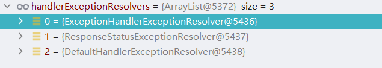

在上图中所看到的三个类就是需要进行详细分析的类，在它们的方法列表中有各自的处理方式从而来对异常进行处理得到异常处理结果。


## HandlerExceptionResolver 初始化

在前文对统一异常处理的分析时看到了handlerExceptionResolvers数据包含了三个对象，这三个对象的基础狮虎和DispatcherServlet.properties文件存在关联，下面将对这三个对象的初始化进行分析，负责该行为的方法是initHandlerExceptionResolvers，具体代码如下：

```java
private void initHandlerExceptionResolvers(ApplicationContext context) {
   this.handlerExceptionResolvers = null;

   if (this.detectAllHandlerExceptionResolvers) {
      // Find all HandlerExceptionResolvers in the ApplicationContext, including ancestor contexts.
      Map<String, HandlerExceptionResolver> matchingBeans = BeanFactoryUtils
            .beansOfTypeIncludingAncestors(context, HandlerExceptionResolver.class, true, false);
      if (!matchingBeans.isEmpty()) {
         this.handlerExceptionResolvers = new ArrayList<>(matchingBeans.values());
         // We keep HandlerExceptionResolvers in sorted order.
         AnnotationAwareOrderComparator.sort(this.handlerExceptionResolvers);
      }
   }
   else {
      try {
         HandlerExceptionResolver her =
               context.getBean(HANDLER_EXCEPTION_RESOLVER_BEAN_NAME, HandlerExceptionResolver.class);
         this.handlerExceptionResolvers = Collections.singletonList(her);
      }
      catch (NoSuchBeanDefinitionException ex) {
         // Ignore, no HandlerExceptionResolver is fine too.
      }
   }

   // Ensure we have at least some HandlerExceptionResolvers, by registering
   // default HandlerExceptionResolvers if no other resolvers are found.
   if (this.handlerExceptionResolvers == null) {
      this.handlerExceptionResolvers = getDefaultStrategies(context, HandlerExceptionResolver.class);
      if (logger.isTraceEnabled()) {
         logger.trace("No HandlerExceptionResolvers declared in servlet '" + getServletName() +
               "': using default strategies from DispatcherServlet.properties");
      }
   }
}
```

在上述代码中提供了三种初始化HandlerExceptionResolver对象的方式：

1. 在Spring容器中通过类型进行搜索，将类型是HandlerExceptionResolver的对象提取后排序赋值给成员变量handlerExceptionResolvers。
2. 在Spring容器中通过名称和类型进行搜索，名称是handlerExceptionResolver，将得到的数据赋值给成员变量handlerExceptionResolvers。
3. 通过读取DispatcherServlet.properties中org.springframework.web.servlet.HandlerExceptionResolver键值数据将值数据通过反射的方式进行实例化，将实例化后的结果赋值给成员变量handlerExceptionResolvers。

## ExceptionHandlerExceptionResolver

下面将对ExceptionHandlerExceptionResolver类进行分析，首先查看它的类图，具体信息如图所示：

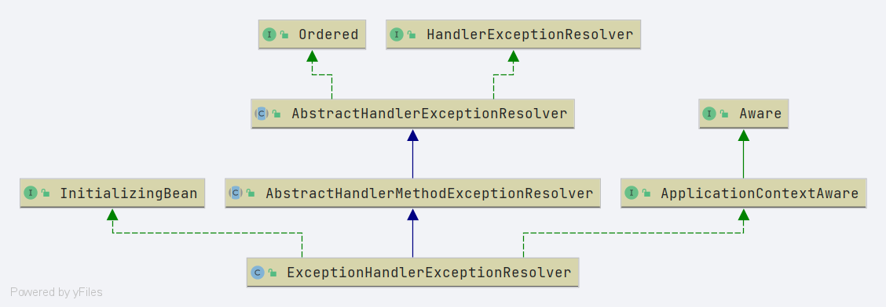


### afterPropertiesSet分析

在ExceptionHandlerExceptionResolver类图中可以直观的看到它实现了InitializingBean接口，该接口的实现方法是分析重点，具体实现代码如下：

```java
@Override
public void afterPropertiesSet() {
   // Do this first, it may add ResponseBodyAdvice beans
   initExceptionHandlerAdviceCache();

   if (this.argumentResolvers == null) {
      List<HandlerMethodArgumentResolver> resolvers = getDefaultArgumentResolvers();
      this.argumentResolvers = new HandlerMethodArgumentResolverComposite().addResolvers(resolvers);
   }
   if (this.returnValueHandlers == null) {
      List<HandlerMethodReturnValueHandler> handlers = getDefaultReturnValueHandlers();
      this.returnValueHandlers = new HandlerMethodReturnValueHandlerComposite().addHandlers(handlers);
   }
}
```

在上述代码中主要进行的处理操作有有三个：

1. 初始化异常建议缓存。
2. 设置参数解析器。
3. 设置返回值解析器。

在这三个处理操作中重点关注第一个操作，具体处理代码如下：

```java
private void initExceptionHandlerAdviceCache() {
   // 上下文为空不做任何处理
   if (getApplicationContext() == null) {
      return;
   }

   // 寻找 ControllerAdviceBean 对象
   List<ControllerAdviceBean> adviceBeans = ControllerAdviceBean.findAnnotatedBeans(getApplicationContext());
   // 循环处理每个ControllerAdviceBean
   for (ControllerAdviceBean adviceBean : adviceBeans) {
      // 获取类型
      Class<?> beanType = adviceBean.getBeanType();
      if (beanType == null) {
         throw new IllegalStateException("Unresolvable type for ControllerAdviceBean: " + adviceBean);
      }
      // 异常处理方法解析器
      ExceptionHandlerMethodResolver resolver = new ExceptionHandlerMethodResolver(beanType);
      // 是否存在映射方法
      if (resolver.hasExceptionMappings()) {
         // 缓存设置
         this.exceptionHandlerAdviceCache.put(adviceBean, resolver);
      }
      if (ResponseBodyAdvice.class.isAssignableFrom(beanType)) {
         this.responseBodyAdvice.add(adviceBean);
      }
   }

   if (logger.isDebugEnabled()) {
      int handlerSize = this.exceptionHandlerAdviceCache.size();
      int adviceSize = this.responseBodyAdvice.size();
      if (handlerSize == 0 && adviceSize == 0) {
         logger.debug("ControllerAdvice beans: none");
      }
      else {
         logger.debug("ControllerAdvice beans: " +
               handlerSize + " @ExceptionHandler, " + adviceSize + " ResponseBodyAdvice");
      }
   }
}
```

在responseBodyAdvice方法中主要执行的处理流程有如下步骤：

1. 对上下文是否存在进行判断，如果上下文不存在则不做任何处理。
2. 在容器中寻找具备ControllerAdvice注解对象，这类对象会被转换为ControllerAdviceBean对象。
3. 处理第二步中得到的ControllerAdviceBean集合，将ControllerAdviceBean和ExceptionHandlerMethodResolver的关系进行绑定设置到异常建议缓存（exceptionHandlerAdviceCache）中，如果当前处理的类型是ResponseBodyAdvice需要将ControllerAdviceBean对象放入到返回值建议容器（responseBodyAdvice）中。
4. 日志输出。

在了解responseBodyAdvice方法的处理流程后下面将编写测试用例来对该流程中的部分数据进行调试查看，首先编写一个类，类名为CustomExceptionHandler，具体代码如下：

```java
@ControllerAdvice
public class CustomExceptionHandler {
   @ResponseBody
   @ExceptionHandler(value = Exception.class)
   public Map<String, Object> errorHandler(Exception ex) {
      Map<String, Object> map = new HashMap<>();
      map.put("code", 400);
      map.put("msg", ex.getMessage());
      return map;
   }
}
```

编写完成CustomExceptionHandler类后进行调试，首先查看adviceBeans的数据，详细内容如图所示：

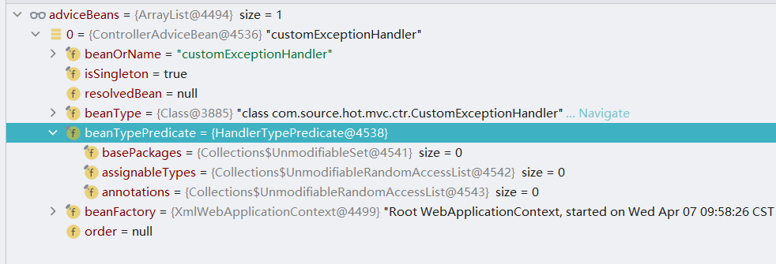

目前在项目中只有一个具有ControllerAdvice注解的类因此查询结果只有一个。在得到数据集合后需要对集合中的数据进行处理，首先需要创建ExceptionHandlerMethodResolver对象，在将数据放入到缓存中，完成这些操作的数据如图所示：

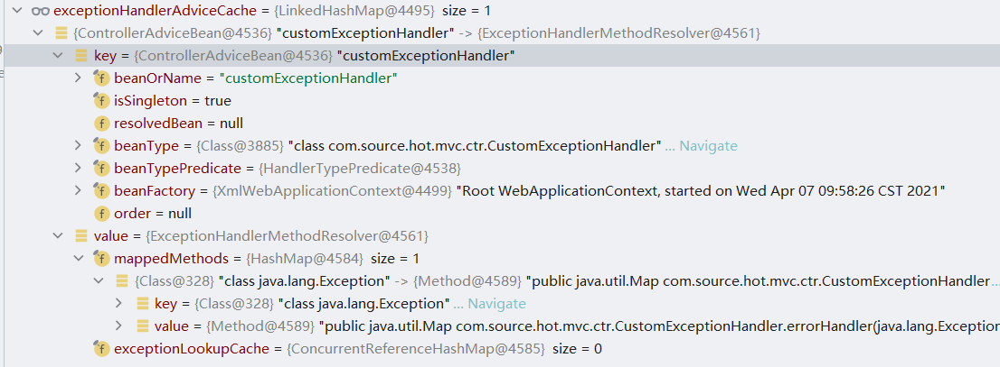


在处理单个ControllerAdviceBean对象时还需要关注ExceptionHandlerMethodResolver的构造方法，具体代码如下：

```java
public ExceptionHandlerMethodResolver(Class<?> handlerType) {
   // 通过方法过滤器寻找具有 ExceptionHandler 注解的方法
   for (Method method : MethodIntrospector.selectMethods(handlerType, EXCEPTION_HANDLER_METHODS)) {
      // 获取ExceptionHandler中的异常
      for (Class<? extends Throwable> exceptionType : detectExceptionMappings(method)) {
         // 向 mappedMethods 容器更新缓存
         addExceptionMapping(exceptionType, method);
      }
   }
}
```

在这段代码中主要处理流程如下：

1. 在传入类中寻找具备ExceptionHandler注解的方法。
2. 将第一步得到的方法列表进行单个处理，具体处理逻辑如下：
   1. 在当前方法中提取Method上的ExceptionHandler注解中的数据，具体数据是异常类列表。
   2. 将异常数据和当前处理的Method放入mappedMethods中。

在前文的测试用例中mappedMethods的数据信息如图所示：

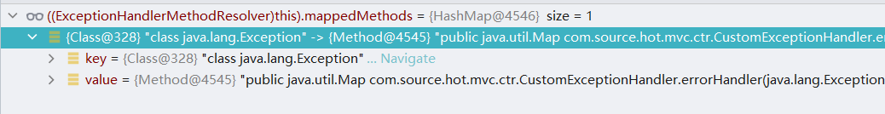


### doResolveHandlerMethodException 分析

接下来对doResolveHandlerMethodException方法进行分析，该方法是ExceptionHandlerExceptionResolver类中另一个重要的方法，具体处理代码如下：

```java
@Override
@Nullable
protected ModelAndView doResolveHandlerMethodException(HttpServletRequest request,
      HttpServletResponse response, @Nullable HandlerMethod handlerMethod, Exception exception) {

   // 根据处理方法和异常寻找ServletInvocableHandlerMethod对象
   ServletInvocableHandlerMethod exceptionHandlerMethod = getExceptionHandlerMethod(handlerMethod, exception);
   if (exceptionHandlerMethod == null) {
      return null;
   }

   // 设置参数解析器
   if (this.argumentResolvers != null) {
      exceptionHandlerMethod.setHandlerMethodArgumentResolvers(this.argumentResolvers);
   }
   // 设置返回值解析器
   if (this.returnValueHandlers != null) {
      exceptionHandlerMethod.setHandlerMethodReturnValueHandlers(this.returnValueHandlers);
   }

   // 创建 ServletWebRequest
   ServletWebRequest webRequest = new ServletWebRequest(request, response);
   // 创建数据传递对象
   ModelAndViewContainer mavContainer = new ModelAndViewContainer();

   try {
      if (logger.isDebugEnabled()) {
         logger.debug("Using @ExceptionHandler " + exceptionHandlerMethod);
      }
      // 异常对象获取
      Throwable cause = exception.getCause();
      if (cause != null) {
         // Expose cause as provided argument as well
         // 执行handler方法
         exceptionHandlerMethod.invokeAndHandle(webRequest, mavContainer, exception, cause, handlerMethod);
      }
      else {
         // Otherwise, just the given exception as-is
         // 执行handler方法
         exceptionHandlerMethod.invokeAndHandle(webRequest, mavContainer, exception, handlerMethod);
      }
   }
   catch (Throwable invocationEx) {
      // Any other than the original exception (or its cause) is unintended here,
      // probably an accident (e.g. failed assertion or the like).
      if (invocationEx != exception && invocationEx != exception.getCause() && logger.isWarnEnabled()) {
         logger.warn("Failure in @ExceptionHandler " + exceptionHandlerMethod, invocationEx);
      }
      // Continue with default processing of the original exception...
      return null;
   }

   if (mavContainer.isRequestHandled()) {
      return new ModelAndView();
   }
   else {
      ModelMap model = mavContainer.getModel();
      HttpStatus status = mavContainer.getStatus();
      ModelAndView mav = new ModelAndView(mavContainer.getViewName(), model, status);
      mav.setViewName(mavContainer.getViewName());
      // 视图处理
      if (!mavContainer.isViewReference()) {
         mav.setView((View) mavContainer.getView());
      }
      // 跳转处理
      if (model instanceof RedirectAttributes) {
         Map<String, ?> flashAttributes = ((RedirectAttributes) model).getFlashAttributes();
         RequestContextUtils.getOutputFlashMap(request).putAll(flashAttributes);
      }
      return mav;
   }
}
```

上述方法的主要执行流程有如下几个步骤：

1. 根据处理方法和异常在容器中寻找ServletInvocableHandlerMethod对象，该对象具有处理能力，即调用异常处理方法。
2. 设置参数解析器和返回值解析器。
3. 创建ServletWebRequest对象和数据传递对象
4. 提取异常信息执行真正的异常处理方法。
5. 返回值模型和视图对象的处理。

在上述五个处理中需要关注第一个操作和第四个操作，首先对第一个操作进行分析，在该方法中提供了两种获取ServletInvocableHandlerMethod：

1. 从异常处理缓存（exceptionHandlerCache）中进行数据提取，具体获取方式是通过处理类在异常处理缓存中获取解析对象，通过解析对象解析得到最终的处理方法，在得到方法后将其分装为ServletInvocableHandlerMethod对象完成处理。
2. 从异常建议缓存（exceptionHandlerAdviceCache）中进行数据提取，具体提取方式是判断缓存的key是否和处理类对应，如果对应则进行解析，解析目的是为了得到具体的处理方法，在得到方法后将其分装为ServletInvocableHandlerMethod对象完成处理。

在本例中没有编写exceptionHandlerCache相关的处理类因此该缓存是空数据，本例中会进入第二种获取方式，具体得到的数据内容如图所示：

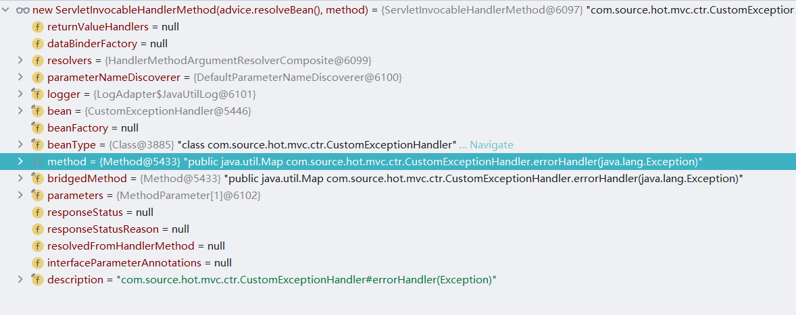

如果需要查看exceptionHandlerCache对象中的数据信息可以对CustomExceptionHandler方法进行修改，修改代码如下：

```java
@ControllerAdvice
public class CustomExceptionHandler {
   @ResponseBody
   @ExceptionHandler(value = Exception.class)
   @ResponseStatus(value = HttpStatus.BAD_GATEWAY, reason = "ResponseStatusEx")
   public Map<String, Object> errorHandler(Exception ex) {
      Map<String, Object> map = new HashMap<>();
      map.put("code", 400);
      map.put("msg", ex.getMessage());
      return map;
   }
}
```

此时经过该方法后会进行数据设置，数据设置结果如图所示：

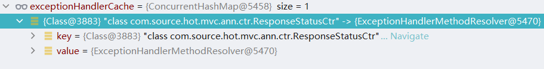

此时如果访问一个具备异常的接口并且抛出了异常会得到如下处理结果：

```http
GET http://localhost:8080/responseStatus

HTTP/1.1 502 
Vary: Origin
Vary: Access-Control-Request-Method
Vary: Access-Control-Request-Headers
Content-Type: text/html;charset=utf-8
Content-Language: zh-CN
Content-Length: 698
Date: Wed, 07 Apr 2021 05:38:35 GMT
Keep-Alive: timeout=20
Connection: keep-alive

<!doctype html>
<html lang="zh">
<head><title>HTTP状态 502 - 坏网关</title>
    <style type="text/css">body {
        font-family: Tahoma, Arial, sans-serif;
    }

    h1, h2, h3, b {
        color: white;
        background-color: #525D76;
    }

    h1 {
        font-size: 22px;
    }

    h2 {
        font-size: 16px;
    }

    h3 {
        font-size: 14px;
    }

    p {
        font-size: 12px;
    }

    a {
        color: black;
    }

    .line {
        height: 1px;
        background-color: #525D76;
        border: none;
    }</style>
</head>
<body><h1>HTTP状态 502 - 坏网关</h1>
<hr class="line"/>
<p><b>类型</b> 状态报告</p>
<p><b>消息</b> ResponseStatusEx</p>
<p><b>描述</b> 服务器在充当网关或代理时, 在尝试完成请求时, 从它访问的入站服务器收到无效响应。</p>
<hr class="line"/>
<h3>Apache Tomcat/9.0.37</h3></body>
</html>
```


回到doResolveHandlerMethodException方法中现在已经得到了ServletInvocableHandlerMethod数据，接下来就需要使用该方法进行异常处理方法的执行了，具体调度方法是org.springframework.web.method.support.InvocableHandlerMethod#invokeForRequest，具体代码如下：

```
@Nullable
public Object invokeForRequest(NativeWebRequest request, @Nullable ModelAndViewContainer mavContainer,
      Object... providedArgs) throws Exception {

   // 获取请求参数
   Object[] args = getMethodArgumentValues(request, mavContainer, providedArgs);
   if (logger.isTraceEnabled()) {
      logger.trace("Arguments: " + Arrays.toString(args));
   }
   // 执行处理方法
   return doInvoke(args);
}
```

下面将对该方法执行过程中几个关键对象进行数据展示，args的数据信息如图所示：

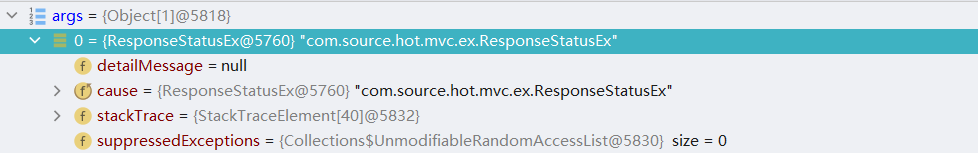

方法doInvoke(args)执行结果如图所示：

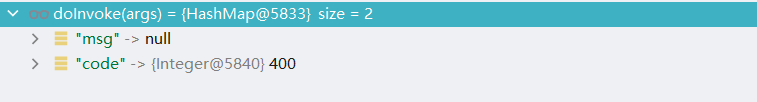


上图的数据内容也就是最终请求的返回内容，具体返回信息如下：

```http
GET http://localhost:8080/responseStatus

HTTP/1.1 200 
Vary: Origin
Vary: Access-Control-Request-Method
Vary: Access-Control-Request-Headers
Content-Type: application/json
Transfer-Encoding: chunked
Date: Wed, 07 Apr 2021 05:47:43 GMT
Keep-Alive: timeout=20
Connection: keep-alive

{
  "msg": null,
  "code": 400
}
```


## ResponseStatusExceptionResolver

下面将对ResponseStatusExceptionResolver类进行分析，首先查看它的类图，具体信息如图所示：

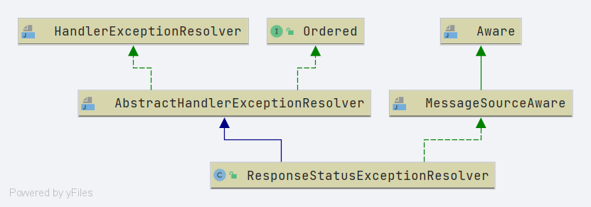

对比ResponseStatusExceptionResolver和ExceptionHandlerExceptionResolver的类图中前者从类图中可以找到的信息十分的有限，只能通过阅读代码来了解其中的一些处理，在ResponseStatusExceptionResolver类中重要的方法是doResolveException，具体处理代码如下：

```java
@Override
@Nullable
protected ModelAndView doResolveException(
      HttpServletRequest request, HttpServletResponse response, @Nullable Object handler, Exception ex) {

   try {
      if (ex instanceof ResponseStatusException) {
         return resolveResponseStatusException((ResponseStatusException) ex, request, response, handler);
      }

      ResponseStatus status = AnnotatedElementUtils.findMergedAnnotation(ex.getClass(), ResponseStatus.class);
      if (status != null) {
         return resolveResponseStatus(status, request, response, handler, ex);
      }

      if (ex.getCause() instanceof Exception) {
         return doResolveException(request, response, handler, (Exception) ex.getCause());
      }
   }
   catch (Exception resolveEx) {
      if (logger.isWarnEnabled()) {
         logger.warn("Failure while trying to resolve exception [" + ex.getClass().getName() + "]", resolveEx);
      }
   }
   return null;
}
```

在上述代码中可以看到三个处理操作：

1. 异常类型是ResponseStatusException的处理。
2. 异常类上存在ResponseStatus注解。
3. 异常的case对象还是异常将重复这三个操作，如果在递归处理中无法解决将返回null。

在了解了这三个处理操作后接下来将对前两个处理操作进行测试用例编写和源码分析。在进行测试用例编写前需要先将CustomExceptionHandler类注释，如果该类没有注释所有异常都将由它进行处理。首先编写一个具有ResponseStatus注解的异常类，具体代码如下：

```java
@ResponseStatus(value = HttpStatus.BAD_GATEWAY, reason = "ResponseStatusEx")
public class ResponseStatusEx extends RuntimeException {

   private static final long serialVersionUID = 828516526031958140L;
}
```

完成异常类定义后进一步编写Controller对象，具体代码如下：

```java
@RestController
public class ResponseStatusCtr {
	@GetMapping("/responseStatus")
	public Object responseStatus() {
		throw new ResponseStatusEx();
	}


	@GetMapping("/responseEx")
	public Object responseEx() throws Exception {
		throw new UnsupportedMediaTypeStatusException("test-ex");
	}

}
```

在本例中有两个接口这两个接口分别用来测试doResolveException方法的两种情况，接口responseStatus用来测试异常类上使用ResponseStatus注解，接口responseEx用来测试异常属于ResponseStatusException类，这两个接口的模拟请求信息如下：

1. 接口responseEx的请求报文信息如下：

```
GET http://localhost:8080/responseEx

HTTP/1.1 415 
Vary: Origin
Vary: Access-Control-Request-Method
Vary: Access-Control-Request-Headers
Content-Type: text/html;charset=utf-8
Content-Language: zh-CN
Content-Length: 703
Date: Wed, 07 Apr 2021 06:21:37 GMT
Keep-Alive: timeout=20
Connection: keep-alive

<!doctype html>
<html lang="zh">
<head><title>HTTP状态 415 - 不支持的媒体类型</title>
    <style type="text/css">body {
        font-family: Tahoma, Arial, sans-serif;
    }

    h1, h2, h3, b {
        color: white;
        background-color: #525D76;
    }

    h1 {
        font-size: 22px;
    }

    h2 {
        font-size: 16px;
    }

    h3 {
        font-size: 14px;
    }

    p {
        font-size: 12px;
    }

    a {
        color: black;
    }

    .line {
        height: 1px;
        background-color: #525D76;
        border: none;
    }</style>
</head>
<body><h1>HTTP状态 415 - 不支持的媒体类型</h1>
<hr class="line"/>
<p><b>类型</b> 状态报告</p>
<p><b>消息</b> test-ex</p>
<p><b>描述</b> 源服务器拒绝服务请求，因为有效负载的格式在目标资源上此方法不支持。</p>
<hr class="line"/>
<h3>Apache Tomcat/9.0.37</h3></body>
</html>

```

2. 接口responseStatus的请求报文信息如下：

```
GET http://localhost:8080/responseStatus

HTTP/1.1 502 
Vary: Origin
Vary: Access-Control-Request-Method
Vary: Access-Control-Request-Headers
Content-Type: text/html;charset=utf-8
Content-Language: zh-CN
Content-Length: 698
Date: Wed, 07 Apr 2021 06:24:19 GMT
Keep-Alive: timeout=20
Connection: keep-alive

<!doctype html>
<html lang="zh">
<head><title>HTTP状态 502 - 坏网关</title>
    <style type="text/css">body {
        font-family: Tahoma, Arial, sans-serif;
    }

    h1, h2, h3, b {
        color: white;
        background-color: #525D76;
    }

    h1 {
        font-size: 22px;
    }

    h2 {
        font-size: 16px;
    }

    h3 {
        font-size: 14px;
    }

    p {
        font-size: 12px;
    }

    a {
        color: black;
    }

    .line {
        height: 1px;
        background-color: #525D76;
        border: none;
    }</style>
</head>
<body><h1>HTTP状态 502 - 坏网关</h1>
<hr class="line"/>
<p><b>类型</b> 状态报告</p>
<p><b>消息</b> ResponseStatusEx</p>
<p><b>描述</b> 服务器在充当网关或代理时, 在尝试完成请求时, 从它访问的入站服务器收到无效响应。</p>
<hr class="line"/>
<h3>Apache Tomcat/9.0.37</h3></body>
</html>
```


测试用例和测试请求准备完毕下面就进入源码分析阶段，首先将resolveResponseStatusException方法和resolveResponseStatus方法一起提取查看他们的处理细节，具体代码如下：

```java
protected ModelAndView resolveResponseStatusException(ResponseStatusException ex,
                                                      HttpServletRequest request, HttpServletResponse response, @Nullable Object handler) throws Exception {

    int statusCode = ex.getStatus().value();
    String reason = ex.getReason();
    return applyStatusAndReason(statusCode, reason, response);
}

protected ModelAndView resolveResponseStatus(ResponseStatus responseStatus, HttpServletRequest request,
                                             HttpServletResponse response, @Nullable Object handler, Exception ex) throws Exception {

    int statusCode = responseStatus.code().value();
    String reason = responseStatus.reason();
    return applyStatusAndReason(statusCode, reason, response);
}
```

通过观察上述两个方法可以发现最终的处理方法都指向了applyStatusAndReason方法，下面对两个方法进行分类说明：

1. 在resolveResponseStatus方法中提取的数据信息是从注解ResponseStatus中获取，提取code和reason作为后续方法的参数。
2. 在resolveResponseStatusException方法中提取的数据信息是从异常对象中获取，提取异常的satus和reason作为后续方法的参数。

下面对applyStatusAndReason方法进行分析，该方法的处理代码如下：

```java
protected ModelAndView applyStatusAndReason(int statusCode, @Nullable String reason, HttpServletResponse response)
      throws IOException {

   if (!StringUtils.hasLength(reason)) {
      response.sendError(statusCode);
   }
   else {
      String resolvedReason = (this.messageSource != null ?
            this.messageSource.getMessage(reason, null, reason, LocaleContextHolder.getLocale()) :
            reason);
      response.sendError(statusCode, resolvedReason);
   }
   return new ModelAndView();
}
```

在上述代码中有如下3个细节操作：

1. 如果异常消息不存在发送一个异常状态码。
2. 如果异常消息存在发送异常状态码和异常消息，注意异常消息会被SpringMessageSource进行解析。
3. 创建返回对象。


## DefaultHandlerExceptionResolver

下面将对DefaultHandlerExceptionResolver类进行分析，首先查看它的类图，具体信息如图所示：

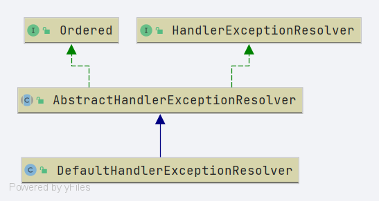

对象DefaultHandlerExceptionResolver和ResponseStatusExceptionResolver一样在类图中比较难以推测一些处理方式，只能通过阅读代码来了解其中的一些处理，在DefaultHandlerExceptionResolver类中重要的方法是doResolveException，具体处理代码如下：

```java
@Override
@Nullable
protected ModelAndView doResolveException(
    HttpServletRequest request, HttpServletResponse response, @Nullable Object handler, Exception ex) {

    try {
        if (ex instanceof HttpRequestMethodNotSupportedException) {
            return handleHttpRequestMethodNotSupported(
                (HttpRequestMethodNotSupportedException) ex, request, response, handler);
        }
        else if (ex instanceof HttpMediaTypeNotSupportedException) {
            return handleHttpMediaTypeNotSupported(
                (HttpMediaTypeNotSupportedException) ex, request, response, handler);
        }
        else if (ex instanceof HttpMediaTypeNotAcceptableException) {
            return handleHttpMediaTypeNotAcceptable(
                (HttpMediaTypeNotAcceptableException) ex, request, response, handler);
        }
        else if (ex instanceof MissingPathVariableException) {
            return handleMissingPathVariable(
                (MissingPathVariableException) ex, request, response, handler);
        }
        else if (ex instanceof MissingServletRequestParameterException) {
            return handleMissingServletRequestParameter(
                (MissingServletRequestParameterException) ex, request, response, handler);
        }
        else if (ex instanceof ServletRequestBindingException) {
            return handleServletRequestBindingException(
                (ServletRequestBindingException) ex, request, response, handler);
        }
        else if (ex instanceof ConversionNotSupportedException) {
            return handleConversionNotSupported(
                (ConversionNotSupportedException) ex, request, response, handler);
        }
        else if (ex instanceof TypeMismatchException) {
            return handleTypeMismatch(
                (TypeMismatchException) ex, request, response, handler);
        }
        else if (ex instanceof HttpMessageNotReadableException) {
            return handleHttpMessageNotReadable(
                (HttpMessageNotReadableException) ex, request, response, handler);
        }
        else if (ex instanceof HttpMessageNotWritableException) {
            return handleHttpMessageNotWritable(
                (HttpMessageNotWritableException) ex, request, response, handler);
        }
        else if (ex instanceof MethodArgumentNotValidException) {
            return handleMethodArgumentNotValidException(
                (MethodArgumentNotValidException) ex, request, response, handler);
        }
        else if (ex instanceof MissingServletRequestPartException) {
            return handleMissingServletRequestPartException(
                (MissingServletRequestPartException) ex, request, response, handler);
        }
        else if (ex instanceof BindException) {
            return handleBindException((BindException) ex, request, response, handler);
        }
        else if (ex instanceof NoHandlerFoundException) {
            return handleNoHandlerFoundException(
                (NoHandlerFoundException) ex, request, response, handler);
        }
        else if (ex instanceof AsyncRequestTimeoutException) {
            return handleAsyncRequestTimeoutException(
                (AsyncRequestTimeoutException) ex, request, response, handler);
        }
    }
    catch (Exception handlerEx) {
        if (logger.isWarnEnabled()) {
            logger.warn("Failure while trying to resolve exception [" + ex.getClass().getName() + "]", handlerEx);
        }
    }
    return null;
}
```

在上述代码中主要处理了不同异常的返回值，这些方法可以简单理解为response.sendError方法调用，在上述代码中所用到的方法不做一一解释。


## AbstractHandlerExceptionResolver

在SpringMVC中关于HandlerExceptionResolver接口的三个实现类中都继承了AbstractHandlerExceptionResolver类，本节将对它进行相关分析。AbstractHandlerExceptionResolver做为三个实现类的父类直接实现了HandlerExceptionResolver接口的方法，具体处理代码如下：

```java
@Override
@Nullable
public ModelAndView resolveException(
    HttpServletRequest request, HttpServletResponse response, @Nullable Object handler, Exception ex) {

    // 是否可以支持异常处理
    if (shouldApplyTo(request, handler)) {
        // 准备返回对象
        prepareResponse(ex, response);
        // 进行异常解析
        ModelAndView result = doResolveException(request, response, handler, ex);
        if (result != null) {
            // Print debug message when warn logger is not enabled.
            if (logger.isDebugEnabled() && (this.warnLogger == null || !this.warnLogger.isWarnEnabled())) {
                logger.debug("Resolved [" + ex + "]" + (result.isEmpty() ? "" : " to " + result));
            }
            // 日志输出
            // Explicitly configured warn logger in logException method.
            logException(ex, request);
        }
        return result;
    }
    else {
        return null;
    }
}

```

在上述代码中主要处理流程如下：

1. 判断当前handler对象是否可以处理该异常请求。
2. 准备返回对象，返回对象是response并不是一个方法的返回对象。
3. 异常解析得到返回值。
4. 异常日志输出。
5. 返回异常解析得到的结果。

在这五个操作流程中主要关注的方法有两个，第一个方法是shouldApplyTo，该方法对应第一个处理流程，第二个方法是doResolveException，该方法对应第二个处理流程，注意该方法是一个抽象方法实现过程在子类中，在本节之前对三个HandlerExceptionResolver接口实现类中都多第二个方法做了相关分析，本节将不对三个实现类的实现方法进行相关分析。下面对shouldApplyTo方法进行分析，具体处理代码如下：

```java
protected boolean shouldApplyTo(HttpServletRequest request, @Nullable Object handler) {
   if (handler != null) {
      // mappedHandlers中存在handler数据
      if (this.mappedHandlers != null && this.mappedHandlers.contains(handler)) {
         return true;
      }

      if (this.mappedHandlerClasses != null) {
         // mappedHandlerClasses中有handler的父接口
         for (Class<?> handlerClass : this.mappedHandlerClasses) {
            if (handlerClass.isInstance(handler)) {
               return true;
            }
         }
      }
   }
   // Else only apply if there are no explicit handler mappings.
   return (this.mappedHandlers == null && this.mappedHandlerClasses == null);
}
```

方法shouldApplyTo的作用是用来判断handler是否能够支持当前处理，具体的判断方式有三种：

1. 对象mappedHandlers中是否包含当前handler对象，如果包含说明能够进行处理。
2. 对象mappedHandlerClasses中的类是否是当前handler对象实现的接口，如果是说明能够进行处理。
3. 对象mappedHandlers为空并且对象mappedHandlerClasses为空说明能够机械能处理。


### AbstractHandlerMethodExceptionResolver

在SpringMVC中AbstractHandlerExceptionResolver类有一个直接子类，它是AbstractHandlerMethodExceptionResolver，它重写了父类的shouldApplyTo方法，具体实现代码如下：

```java
@Override
protected boolean shouldApplyTo(HttpServletRequest request, @Nullable Object handler) {
   if (handler == null) {
      return super.shouldApplyTo(request, null);
   }
   else if (handler instanceof HandlerMethod) {
      HandlerMethod handlerMethod = (HandlerMethod) handler;
      handler = handlerMethod.getBean();
      return super.shouldApplyTo(request, handler);
   }
   else {
      return false;
   }
}
```

上述方法在原有父类的处理逻辑上对类型做出了另一个处理逻辑：

1. 对handler进行类型判断如果类型是HandlerMethod，将bean数据从中提取在进行父类方法的调用逻辑。


## SimpleMappingExceptionResolver

在本节之前对HandlerExceptionResolver的5个关键实现对象进行了相关分析，他们分别是AbstractHandlerExceptionResolver、AbstractHandlerMethodExceptionResolver、ExceptionHandlerExceptionResolver、DefaultHandlerExceptionResolver和ResponseStatusExceptionResolver。这些内容是可以通过SpringMVC中的DispatcherServlet.properties文件直接或间接了解到的内容，在这些类以外还有一个类也是具备异常处理能力，它是SimpleMappingExceptionResolver，本节将对它做相关分析。

在SimpleMappingExceptionResolver类中关键方法是doResolveException，具体处理代码如下：

```java
@Override
@Nullable
protected ModelAndView doResolveException(
      HttpServletRequest request, HttpServletResponse response, @Nullable Object handler, Exception ex) {

   // Expose ModelAndView for chosen error view.
   // 确认视图名称
   String viewName = determineViewName(ex, request);
   if (viewName != null) {
      // Apply HTTP status code for error views, if specified.
      // Only apply it if we're processing a top-level request.
      // 确认状态码
      Integer statusCode = determineStatusCode(request, viewName);
      if (statusCode != null) {
         // 应用状态码
         applyStatusCodeIfPossible(request, response, statusCode);
      }
      // 获取模型和视图对象
      return getModelAndView(viewName, ex, request);
   }
   else {
      return null;
   }
}
```

在上述代码中主要处理的操作如下：

1. 确认视图名称。
2. 确认状态码，如果状态码存在则应用状态码。
3. 获取模型和视图对象。

下面对确认视图名称的方法determineViewName进行分析，具体处理代码如下：

```java
@Nullable
protected String determineViewName(Exception ex, HttpServletRequest request) {
   String viewName = null;
   // 异常类列表
   if (this.excludedExceptions != null) {
      for (Class<?> excludedEx : this.excludedExceptions) {
         if (excludedEx.equals(ex.getClass())) {
            return null;
         }
      }
   }
   // 在exceptionMappings集合中搜索视图名称
   if (this.exceptionMappings != null) {
      viewName = findMatchingViewName(this.exceptionMappings, ex);
   }
   // 默认视图名称处理
   if (viewName == null && this.defaultErrorView != null) {
      if (logger.isDebugEnabled()) {
         logger.debug("Resolving to default view '" + this.defaultErrorView + "'");
      }
      viewName = this.defaultErrorView;
   }
   return viewName;
}
```

在determineViewName方法中主要处理流程如下：

1. 在异常类列表存在的情况下，在异常类列表中如果有一个异常类和当前的异常是相同的类将返回null。
2. 在exceptionMappings集合中寻找视图名称，将异常对应的视图名称作为返回值。
3. 在第二个操作基础上如果视图名称获取失败并且存在默认视图名称将默认视图名称作为返回值。

完成视图名称的结果获取后需要进行状态码的推论，具体获取规则如下：

1. 从状态码集合中获取。
2. 返回默认的状态码。

在这两个获取操作过程中需要关注状态码集合，状态码集合是一个Map对象，key表示视图名称，value表示状态码，具体定义代码如下：

```java
private Map<String, Integer> statusCodes = new HashMap<>();
```

在状态码获取成功后需要进行状态码应用操作，具体处理代码如下：

```java
protected void applyStatusCodeIfPossible(HttpServletRequest request, HttpServletResponse response, int statusCode) {
   if (!WebUtils.isIncludeRequest(request)) {
      if (logger.isDebugEnabled()) {
         logger.debug("Applying HTTP status " + statusCode);
      }
      response.setStatus(statusCode);
      request.setAttribute(WebUtils.ERROR_STATUS_CODE_ATTRIBUTE, statusCode);
   }
}
```

关于状态码应用主要处理操作是将状态码设置给两个对象，这两个对象是请求对象和返回对象：

1. 为返回对象设置状态码。
2. 为请求对象设置属性，具体属性名为"javax.servlet.error.status_code"。

在状态码应用处理完成后需要进行模型和视图对象的获取，核心处理代码如下：

```java
protected ModelAndView getModelAndView(String viewName, Exception ex) {
   ModelAndView mv = new ModelAndView(viewName);
   if (this.exceptionAttribute != null) {
      mv.addObject(this.exceptionAttribute, ex);
   }
   return mv;
}
```

在上述代码中对于模型和视图对象的获取其实是创建对象，创建ModelAndView对象是将视图名称作为参数传入，并且添加异常属性对象，完成后将ModelAndView对象返回。


## HandlerExceptionResolver  总结

本章围绕HandlerExceptionResolver  接口做了分析，在SpringMVC中这个接口的顶级实现类是AbstractHandlerExceptionResolver，常用的实现类有ExceptionHandlerExceptionResolver、ResponseStatusExceptionResolver和DefaultHandlerExceptionResolver，在本章中对三个核心实现类做了充分的分析，对各处理细节做了详尽的讨论，此外也对统一异常处理的处理进行了分析，在统一异常处理中会真正用到三个核心实现类的处理操作。