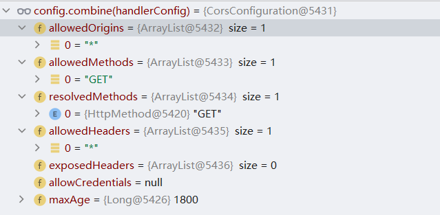
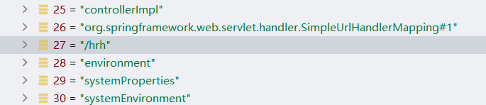
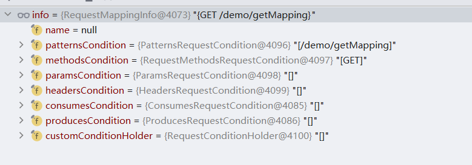

# HandlerMapping 分析

本章将对 HandlerMapping 接口进行分析, HandlerMapping的作用是根据request找到相应的处理器Handler和Interceptors。


在`HandlerMapping`接口中只有一个方法，具体代码如下：

```java
public interface HandlerMapping {
   @Nullable
   HandlerExecutionChain getHandler(HttpServletRequest request) throws Exception;

}
```

在`getHandler`方法中主要目的是通过`HttpServletRequest`对象找到`HandlerExecutionChain` 对象。


## 注册HandlerMapping

通过阅读`HandlerMapping`接口确定了这是一个获取的动作，在Java开发过程中获取一般分为两种形式，第一种是在获取时进行创建对象，第二种是从容器中获取，相比而言第二种从容器中获取数据的效率会高一些，在SpringMVC中关于HandlerMpping对象的获取采用的是第二种方式，接下来将对HandlerMapping的注册进行分析。在SpringMVC启动阶段会创建`SimpleUrlHandlerMapping`对象，同时还有其他对象的创建，具体信息如图所示


在`SimpleUrlHandlerMapping`类中包含了HandlerMapping注册方法，首先查看类图，通过类图进一步的了解SimpleUrlHandlerMapping的执行过程


从类图上可以发现`SimpleUrlHandlerMapping`对象继承了`ApplicationObjectSupport`对象实现了`ApplicationContextAware`接口，这两个方法就是进行注册的入口，查看`ApplicationObjectSupport#setApplicationContext`方法代码后可以确认真正的核心方法是`ApplicationObjectSupport#initApplicationContext(org.springframework.context.ApplicationContext)`，该方法的实现方法在`org.springframework.web.context.support.WebApplicationObjectSupport#initApplicationContext`中，具体处理代码如下：

```java
@Override
protected void initApplicationContext(ApplicationContext context) {
   // 处理父类的 initApplicationContext 方法
   super.initApplicationContext(context);
   if (this.servletContext == null && context instanceof WebApplicationContext) {
      this.servletContext = ((WebApplicationContext) context).getServletContext();
      if (this.servletContext != null) {
         // 初始化ServletContext
         initServletContext(this.servletContext);
      }
   }
}
```

在这个方法中需要进一步回到父类`ApplicationObjectSupport`中查看处理代码，具体代码如下：

```java
protected void initApplicationContext(ApplicationContext context) throws BeansException {
   initApplicationContext();
}
protected void initApplicationContext() throws BeansException {
}
```

在上述两个方法中子类需要实现`initApplicationContext`方法，实现该方法可以对父类进行增强，在SpringMVC中关于这个方法的执行流程如下：

1. `org.springframework.context.support.ApplicationObjectSupport#initApplicationContext(org.springframework.context.ApplicationContext)`
2. `org.springframework.context.support.ApplicationObjectSupport#initApplicationContext()`
3. `org.springframework.web.servlet.handler.AbstractHandlerMapping#initApplicationContext`
4. `org.springframework.web.servlet.handler.SimpleUrlHandlerMapping#initApplicationContext`

当寻找到上述四个执行流程后就可以找到`org.springframework.web.servlet.handler.SimpleUrlHandlerMapping#registerHandlers`方法，这个方法可以进行url和handler对象的关系绑定处理，处理的入口代码如下：

```java
	// org.springframework.web.servlet.handler.SimpleUrlHandlerMapping#initApplicationContext
	@Override
	public void initApplicationContext() throws BeansException {
		super.initApplicationContext();
		registerHandlers(this.urlMap);
	}
```

在这段方法中分析目标是`registerHandlers`方法，具体处理代码如下：

```java
protected void registerHandlers(Map<String, Object> urlMap) throws BeansException {
   if (urlMap.isEmpty()) {
      logger.trace("No patterns in " + formatMappingName());
   }
   else {
      // 循环处理 urlMap
      urlMap.forEach((url, handler) -> {
         // Prepend with slash if not already present.
         if (!url.startsWith("/")) {
            url = "/" + url;
         }
         // Remove whitespace from handler bean name.
         if (handler instanceof String) {
            handler = ((String) handler).trim();
         }
         registerHandler(url, handler);
      });
      if (logger.isDebugEnabled()) {
         List<String> patterns = new ArrayList<>();
         if (getRootHandler() != null) {
            patterns.add("/");
         }
         if (getDefaultHandler() != null) {
            patterns.add("/**");
         }
         patterns.addAll(getHandlerMap().keySet());
         logger.debug("Patterns " + patterns + " in " + formatMappingName());
      }
   }
}
```

在registerHandlers方法中需要先理解方法参数，该方法的参数是map结构，key表示url，value表示handler对象，注意key是String类型，value是Object类型，在这里value的类型可能是String类型也可能是Object（HttpRequestHandler），处理单个url和handler关系的方法如下：

```java
protected void registerHandler(String urlPath, Object handler) throws BeansException, IllegalStateException {
   Assert.notNull(urlPath, "URL path must not be null");
   Assert.notNull(handler, "Handler object must not be null");
   Object resolvedHandler = handler;

   // Eagerly resolve handler if referencing singleton via name.
   if (!this.lazyInitHandlers && handler instanceof String) {
      String handlerName = (String) handler;
      ApplicationContext applicationContext = obtainApplicationContext();
      if (applicationContext.isSingleton(handlerName)) {
         // 从容器中获取 handler 对象
         resolvedHandler = applicationContext.getBean(handlerName);
      }
   }

   // 尝试从handlerMap中获取对象
   Object mappedHandler = this.handlerMap.get(urlPath);
   if (mappedHandler != null) {
      if (mappedHandler != resolvedHandler) {
         throw new IllegalStateException(
               "Cannot map " + getHandlerDescription(handler) + " to URL path [" + urlPath +
               "]: There is already " + getHandlerDescription(mappedHandler) + " mapped.");
      }
   }
   // 容器中不存在的处理情况
   else {
      if (urlPath.equals("/")) {
         if (logger.isTraceEnabled()) {
            logger.trace("Root mapping to " + getHandlerDescription(handler));
         }
         setRootHandler(resolvedHandler);
      }
      else if (urlPath.equals("/*")) {
         if (logger.isTraceEnabled()) {
            logger.trace("Default mapping to " + getHandlerDescription(handler));
         }
         setDefaultHandler(resolvedHandler);
      }
      else {
         this.handlerMap.put(urlPath, resolvedHandler);
         if (logger.isTraceEnabled()) {
            logger.trace("Mapped [" + urlPath + "] onto " + getHandlerDescription(handler));
         }
      }
   }
}
```

在`registerHandler` 方法中分为两步操作，第一步操作是类型的转换，第二步操作是将类型转换后的结果放入到容器中。在第一步操作中会进行一组判断：判断是否是懒加载和判断handler对象是否是字符串类型，如果符合这个条件则进行对象获取，具体方式是getBean方法调用。第二步是从容器中获取对象如果对象不为空并且类型和第一步处理得到的对象不相同则抛出异常，如果容器中搜索不到该对象则会进行三种不同的操作，操作一url是`/`将第一步处理结果设置为`rootHandler`，操作二url是/*将第一步处理结果设置为`defaultHandler`，操作三url不符合前两种情况放入handlerMap对象中。经过处理后此时`handlerMap`中的数据内容如图所示


### urlMap 数据的来源

可以发现在`registerHandler` 方法处理过程中它依靠urlMap这个数据对象，它的来源尤为关键，在SpringMVC使用过程中通常会在`applicationContext.xml`文件中编写`<mvc:default-servlet-handler/>`代码，这段代码就是urlMap的数据来源。关于这个标签的处理需要找到`org.springframework.web.servlet.config.MvcNamespaceHandler`类，在这个类中继续搜索可以看到下面代码：

```java
registerBeanDefinitionParser("default-servlet-handler", new DefaultServletHandlerBeanDefinitionParser())
```

这段代码的作用是注册XML标签的解析处理对象，继续深入`DefaultServletHandlerBeanDefinitionParser`对象，可以在它的parse方法中看到urlMap的处理，具体代码如下：

```java
@Override
@Nullable
public BeanDefinition parse(Element element, ParserContext parserContext) {
   Object source = parserContext.extractSource(element);

   String defaultServletName = element.getAttribute("default-servlet-name");
   RootBeanDefinition defaultServletHandlerDef = new RootBeanDefinition(DefaultServletHttpRequestHandler.class);
   defaultServletHandlerDef.setSource(source);
   defaultServletHandlerDef.setRole(BeanDefinition.ROLE_INFRASTRUCTURE);
   if (StringUtils.hasText(defaultServletName)) {
      defaultServletHandlerDef.getPropertyValues().add("defaultServletName", defaultServletName);
   }
   String defaultServletHandlerName = parserContext.getReaderContext().generateBeanName(defaultServletHandlerDef);
   parserContext.getRegistry().registerBeanDefinition(defaultServletHandlerName, defaultServletHandlerDef);
   parserContext.registerComponent(new BeanComponentDefinition(defaultServletHandlerDef, defaultServletHandlerName));

   Map<String, String> urlMap = new ManagedMap<>();
   urlMap.put("/**", defaultServletHandlerName);

   RootBeanDefinition handlerMappingDef = new RootBeanDefinition(SimpleUrlHandlerMapping.class);
   handlerMappingDef.setSource(source);
   handlerMappingDef.setRole(BeanDefinition.ROLE_INFRASTRUCTURE);
   handlerMappingDef.getPropertyValues().add("urlMap", urlMap);

   String handlerMappingBeanName = parserContext.getReaderContext().generateBeanName(handlerMappingDef);
   parserContext.getRegistry().registerBeanDefinition(handlerMappingBeanName, handlerMappingDef);
   parserContext.registerComponent(new BeanComponentDefinition(handlerMappingDef, handlerMappingBeanName));

   // Ensure BeanNameUrlHandlerMapping (SPR-8289) and default HandlerAdapters are not "turned off"
   MvcNamespaceUtils.registerDefaultComponents(parserContext, source);

   return null;
}
```

在这段代码中urlMap的对象信息如图所示：


从urlMap的数据图中和handlerMap的数据图中可以发现他们之间的关系是字符串和对象实体的关系，总结关于注册HandlerMapping方法，其目的是将`org.springframework.web.servlet.resource.DefaultServletHttpRequestHandler`转换成对象。


### 注册HandlerMapping 小结

在SpringMVC使用过程中需要在applicationContext.xml文件中配置`<mvc:default-servlet-handler/>`信息，该信息定义了默认的Servlet处理器，具体的处理对象是`DefaultServletHttpRequestHandler`，通过改配置将数据准备完成，在启动时会进行HandlerMapping的注册操作，该操作的目的是将urlMap对象中的数据进行实例化并放入到handlerMap对象中。


## getHandler 寻找处理器

通过注册HandlerMapping方法不难知道容器中会存在一些`HandlerMapping`接口的实现类，这些实现类存储在`org.springframework.web.servlet.DispatcherServlet#handlerMappings`中，具体的存储对象定义如下：

```java
/** List of HandlerMappings used by this servlet. */
@Nullable
private List<HandlerMapping> handlerMappings;
```

在容器启动完成后该对象的数据信息如图所示：


getHandler方法的作用是根据请求找到对应的处理器(Controller对象)，它需要通过请求进入到寻找阶段，具体的入口处理过程如下：

1. 浏览器访问某个接口地址
2. 进入到`org.springframework.web.servlet.FrameworkServlet#service`方法
3. 进入到`org.springframework.web.servlet.DispatcherServlet#doDispatch`方法

在`DispatcherServlet#doDispatch`方法中可以看到`mappedHandler = getHandler(processedRequest)`代码，这段代码就是分析的核心目标，进入到这个方法查看具体代码：

```java
@Nullable
protected HandlerExecutionChain getHandler(HttpServletRequest request) throws Exception {
   if (this.handlerMappings != null) {
      for (HandlerMapping mapping : this.handlerMappings) {
         HandlerExecutionChain handler = mapping.getHandler(request);
         if (handler != null) {
            return handler;
         }
      }
   }
   return null;
}
```

在`getHandler`方法中会循环`handlerMappings`容器，该容器中会有三个数据对象分别是

1. `org.springframework.web.servlet.mvc.method.annotation.RequestMappingHandlerMapping`
2. `org.springframework.web.servlet.handler.BeanNameUrlHandlerMapping`
3. `org.springframework.web.servlet.handler.SimpleUrlHandlerMapping`

一般情况下能够找到`HandlerExecutionChain`对象的是`SimpleUrlHandlerMapping`对象，需要注意负责寻找的方法上述三个对象是共用的，具体处理方法是`org.springframework.web.servlet.handler.AbstractHandlerMapping#getHandler`，整体处理代码如下：

```java
@Override
@Nullable
public final HandlerExecutionChain getHandler(HttpServletRequest request) throws Exception {
   // 将 request 进行搜索找到对应的 handler 对象
   Object handler = getHandlerInternal(request);
   if (handler == null) {
      // 获取默认的 handler
      handler = getDefaultHandler();
   }
   if (handler == null) {
      return null;
   }
   // Bean name or resolved handler?
   // handler 是否是 String 类型
   if (handler instanceof String) {
      // handler 是字符串类型从容器中获取对象
      String handlerName = (String) handler;
      handler = obtainApplicationContext().getBean(handlerName);
   }

   // 获取 HandlerExecutionChain 对象
   HandlerExecutionChain executionChain = getHandlerExecutionChain(handler, request);

   if (logger.isTraceEnabled()) {
      logger.trace("Mapped to " + handler);
   }
   else if (logger.isDebugEnabled() && !request.getDispatcherType().equals(DispatcherType.ASYNC)) {
      logger.debug("Mapped to " + executionChain.getHandler());
   }

   // 跨域处理
   if (hasCorsConfigurationSource(handler) || CorsUtils.isPreFlightRequest(request)) {
      CorsConfiguration config = (this.corsConfigurationSource != null ? this.corsConfigurationSource.getCorsConfiguration(request) : null);
      CorsConfiguration handlerConfig = getCorsConfiguration(handler, request);
      config = (config != null ? config.combine(handlerConfig) : handlerConfig);
      executionChain = getCorsHandlerExecutionChain(request, executionChain, config);
   }

   return executionChain;
}
```


在这段代码中首先需要关注`getHandlerInternal`方法，该方法能够通过`HttpServletRequest`找到对应的处理方法，该方法可以理解为Controller类中的方法。`getHandlerInternal`代码如下：

```java
@Override
protected HandlerMethod getHandlerInternal(HttpServletRequest request) throws Exception {
   // 获取当前请求路径
   String lookupPath = getUrlPathHelper().getLookupPathForRequest(request);
   // 设置属性
   request.setAttribute(LOOKUP_PATH, lookupPath);
   // 上锁
   this.mappingRegistry.acquireReadLock();
   try {
      // 寻找 handler method
      HandlerMethod handlerMethod = lookupHandlerMethod(lookupPath, request);
      return (handlerMethod != null ? handlerMethod.createWithResolvedBean() : null);
   }
   finally {
      // 释放锁
      this.mappingRegistry.releaseReadLock();
   }
}
```

在`getHandlerInternal`方法中会做两步操作，第一步操作是提取请求的路由地址（url），第二步是通过url寻找对应的处理器。这里主要分析第二步寻找处理器的过程，具体方法是`lookupHandlerMethod`，具体处理代码如下：

```java
@Nullable
protected HandlerMethod lookupHandlerMethod(String lookupPath, HttpServletRequest request) throws Exception {
   List<Match> matches = new ArrayList<>();
   // 从 路由映射表 获取
   List<T> directPathMatches = this.mappingRegistry.getMappingsByUrl(lookupPath);
   // 如果url对应的数据不为空
   if (directPathMatches != null) {
      // 添加匹配映射
      addMatchingMappings(directPathMatches, matches, request);
   }
   if (matches.isEmpty()) {
      // No choice but to go through all mappings...
      // 添加匹配映射
      addMatchingMappings(this.mappingRegistry.getMappings().keySet(), matches, request);
   }

   if (!matches.isEmpty()) {
      // 比较对象
      Comparator<Match> comparator = new MatchComparator(getMappingComparator(request));
      // 排序
      matches.sort(comparator);
      // 获取第一个 match 对象
      Match bestMatch = matches.get(0);
      if (matches.size() > 1) {
         if (logger.isTraceEnabled()) {
            logger.trace(matches.size() + " matching mappings: " + matches);
         }

         // 是否跨域请求
         if (CorsUtils.isPreFlightRequest(request)) {
            return PREFLIGHT_AMBIGUOUS_MATCH;
         }
         // 取出第二个元素.
         Match secondBestMatch = matches.get(1);
         // 如果比较结果相同
         if (comparator.compare(bestMatch, secondBestMatch) == 0) {
            // 第二个元素和第一个元素的比较过程
            Method m1 = bestMatch.handlerMethod.getMethod();
            Method m2 = secondBestMatch.handlerMethod.getMethod();
            String uri = request.getRequestURI();
            throw new IllegalStateException(
                  "Ambiguous handler methods mapped for '" + uri + "': {" + m1 + ", " + m2 + "}");
         }
      }
      // 设置属性
      request.setAttribute(BEST_MATCHING_HANDLER_ATTRIBUTE, bestMatch.handlerMethod);
      // 处理匹配的结果
      handleMatch(bestMatch.mapping, lookupPath, request);
      return bestMatch.handlerMethod;
   }
   else {
      // 处理没有匹配的结果
      return handleNoMatch(this.mappingRegistry.getMappings().keySet(), lookupPath, request);
   }
}
```

在`lookupHandlerMethod`方法中主要处理过程如下：

步骤一：从注册表中获取url对应的数据，具体查询注册表中`urlLookup`容器的数据

​	如果步骤一得到的数据不为空进行步骤一的结果和请求进行关系绑定

​	如果步骤一得到的数据为空将注册表中的`mappingLookup`对象和请求进行关系绑定

​	上述两关系绑定的本质是创建`Match`对象

步骤二：Match容器中存在数据的情况下会先进行比较对象的获取和排序操作。注意:如果Match容器存在多个的情况下会进行验证操作，该验证操作的目的是判断第一个元素和第二个元素的是否相同，如果相同会抛出异常。如果不出现异常或者没有多个Match对象的情况下就可以金返回处理，返回值是`org.springframework.web.servlet.handler.AbstractHandlerMethodMapping.Match#handlerMethod`

步骤三：匹配容器中不存在数据，在`AbstractHandlerMethodMapping#handleNoMatch`方法中直接返回null，但是子类`RequestMappingInfoHandlerMapping`中对其实现做了补充。


通过`getHandlerInternal`方法将得到一个对象，该对象是Object类型，如果这个对象为空会获取默认的Handler对象，如果handler类型是String类型需要通过容器进行获取handler对象，当handler对象准备完成后会进行`HandlerExecutionChain`对象的创建，在创建`HandlerExecutionChain`对象之后会进行跨域处理，当跨域处理完成后就可以将该对象放回结束该方法的调用。


### Match 异常模拟

接下来将对`lookupHandlerMethod`方法中的异常进行模拟，这部分的异常是指一个url解析后得到了多个Method对象，因此抛出该异常，需要模拟该异常可以通过url传参的形式进行模拟，具体模拟代码如下：

```java
@GetMapping("/a/{title}")
public String title(
      @PathVariable("title") String title
) {
   return title;
}

@GetMapping("/a/{title2}")
public String title2(@PathVariable("title2") String title2) {
   return "title";
}
```

编写上述测试代码后可以访问`http://localhost:8080/a/demo`接口，此时`matches`对象数据如下：


在得到matches数据后会进行第一个元素和第二个元素的比较，具体比较的数据是`org.springframework.web.servlet.handler.AbstractHandlerMethodMapping.Match#mapping`，在这里他们是相同点不能北title和title2这两个字面量迷惑，要注意这里的比较会进行占位符处理，更进一步的处理是`org.springframework.web.servlet.mvc.method.RequestMappingInfo#compareTo`方法。

通过这部分异常模拟可以知道SpringMVC对于URL的验证是比较严格的，如果出现模糊值它抛出异常，同时作为SpringMVC使用者对于URL的定义需要尽可能做到唯一。


### handleNoMatch

接下来将对handleNoMatch方法进行分析，首先这个方法签名是`org.springframework.web.servlet.handler.AbstractHandlerMethodMapping#handleNoMatch`，在这个方法中返回值是null，但是在SpringMVC中有一个子类实现了该方法，这个子类是`RequestMappingInfoHandlerMapping`，该方法的作用是处理没有找到Match列表的情况下，对于这个方法的模拟可以在浏览器中随意输入一个url，当发起这个请求后，该请求并不属于当前项目中定义的请求时就会进入到`RequestMappingInfoHandlerMapping#handleNoMatch`方法中。在这个方法中会循环`RequestMappingInfo`列表进行url匹配比较，不同的比较会抛出不同的异常。具体处理代码如下：

```java
@Override
protected HandlerMethod handleNoMatch(
      Set<RequestMappingInfo> infos, String lookupPath, HttpServletRequest request) throws ServletException {

   // 创建对象 PartialMatchHelper
   PartialMatchHelper helper = new PartialMatchHelper(infos, request);
   if (helper.isEmpty()) {
      return null;
   }

   // http 请求方式
   if (helper.hasMethodsMismatch()) {
      Set<String> methods = helper.getAllowedMethods();
      // 请求方式比较
      if (HttpMethod.OPTIONS.matches(request.getMethod())) {
         // handler 转换
         HttpOptionsHandler handler = new HttpOptionsHandler(methods);
         // 构建 handler method
         return new HandlerMethod(handler, HTTP_OPTIONS_HANDLE_METHOD);
      }
      throw new HttpRequestMethodNotSupportedException(request.getMethod(), methods);
   }

   // 可消费的 Content-Type 错误
   if (helper.hasConsumesMismatch()) {
      Set<MediaType> mediaTypes = helper.getConsumableMediaTypes();
      MediaType contentType = null;
      if (StringUtils.hasLength(request.getContentType())) {
         try {
            // 字符串转换成对象
            contentType = MediaType.parseMediaType(request.getContentType());
         }
         catch (InvalidMediaTypeException ex) {
            throw new HttpMediaTypeNotSupportedException(ex.getMessage());
         }
      }
      throw new HttpMediaTypeNotSupportedException(contentType, new ArrayList<>(mediaTypes));
   }

   // 可生产的 Content-Type 错误
   if (helper.hasProducesMismatch()) {
      Set<MediaType> mediaTypes = helper.getProducibleMediaTypes();
      throw new HttpMediaTypeNotAcceptableException(new ArrayList<>(mediaTypes));
   }

   // 参数错误
   if (helper.hasParamsMismatch()) {
      List<String[]> conditions = helper.getParamConditions();
      throw new UnsatisfiedServletRequestParameterException(conditions, request.getParameterMap());
   }

   return null;
}
```


首先模拟`HttpRequestMethodNotSupportedException`异常，编写一个Controller对象在这个对象中填写下面代码：

```java
@RequestMapping(value = "/getMapping",method = RequestMethod.GET)
public String getMapping() {
   return "data";
}
```

当拥有这个代码后通过POSTMAN这个软件进行访问，访问方式使用POST进行访问`POST http://localhost:8080/getMapping `，此时这个方法方式是POST方式，Controller对象中定义的方式是GET方式此时比较会失败从而抛出`HttpRequestMethodNotSupportedException`异常。

接下来模拟`HttpMediaTypeNotSupportedException`异常，编写一个Controller函数，该函数代码如下：

```java
@PostMapping(value = "/postMapping",consumes = {MediaType.APPLICATION_JSON_VALUE},produces = {})
public Object postMapping(
      @RequestBody Map<String, String> map
) {
   return "";
}
```

在这个函数中添加了注解`PostMapping`并约束了`consumes`类型为`application/json`，需要模拟`HttpMediaTypeNotSupportedException`异常可以采用下面的请求方式：

```http
POST http://localhost:8080/postMapping
Content-Type: application/x-www-form-urlencoded
```

在模拟该异常时只需要将Content-Tpye的类型和接口定义上的类型不相同就会抛出异常。


接下来模拟`HttpMediaTypeNotAcceptableException`异常，在postMapping方法的基础上修改代码，修改后内容如下：

```java
@PostMapping(value = "/postMapping", consumes = {MediaType.APPLICATION_JSON_VALUE}, produces = {"text/plain"})
public Object postMapping(
      @RequestBody Map<String, String> map
) {
   return "";
}
```

在原有的postMapping上增加了produces属性，该属性表示返回的类型，需要模拟`HttpMediaTypeNotAcceptableException`异常可以采用下面的请求方式：

```http
POST http://localhost:8080/postMapping
Content-Type: application/json
Accept: application/json
```

在模拟该异常时只需要将Accept的类型和接口上定义的类型不相同就会抛出异常。

最后模拟`UnsatisfiedServletRequestParameterException`异常，在Controller类中添加一个方法，具体代码如下：

```java
@GetMapping(value = "/getMapping2", params = {"va"})
public String getMapping2(
      @RequestParam("va") String va
) {
   return va;
}
```

当这个方法编写完成后进行网络请求，请求方式如下：

```java
GET http://localhost:8080/getMapping2
```

通过上述请求即可模拟`UnsatisfiedServletRequestParameterException`异常。

下面将整理`handleNoMatch`方法的异常处理：

1. url不存在的异常
2. HTTP请求方式的异常，抛出`HttpRequestMethodNotSupportedException`
3. HTTP请求中的Content-Type与Controller中定义的接口不对应，具体检查的数据是`consumes`，抛出`HttpMediaTypeNotSupportedException`异常
4. HTTP请求中的Accept与Controller中定义的接口不对应，具体检查的数据是`produces` ，抛出`HttpMediaTypeNotAcceptableException`异常
5. HTTP请求中的参数名称和Cotnroller中的参数名称不对应会抛出`UnsatisfiedServletRequestParameterException`异常


### addMatchingMappings 方法分析

接下来将对`addMatchingMappings`方法进行分析，下面是方法源代码：

```java
private void addMatchingMappings(Collection<T> mappings, List<Match> matches, HttpServletRequest request) {
   for (T mapping : mappings) {
      // 抽象方法
      // 通过抽象方法获取 match 结果
      T match = getMatchingMapping(mapping, request);
      // 是否为空
      if (match != null) {
         // 从 mappingLookup 获取结果并且插入到matches中
         matches.add(new Match(match, this.mappingRegistry.getMappings().get(mapping)));
      }
   }
}
```

在`addMatchingMappings`方法中需要关注参数列表：

参数一：`mappings`表示多个RequestMappingInfo对象的集合，数据来源是`org.springframework.web.servlet.handler.AbstractHandlerMethodMapping.MappingRegistry#mappingLookup`。

参数二：`matches`用来存储匹配结果。

参数三：`request` 表示HTTP请求。

这个方法的目的是从mapping列表中找到和请求对应的数据信息并加入到matches集合中。根据这个操作目的在该方法中最核心的方法是`getMatchingMapping`，它是一个抽象方法具体实现方法在`RequestMappingInfoHandlerMapping`中，具体代码如下：

```java
@Override
protected RequestMappingInfo getMatchingMapping(RequestMappingInfo info, HttpServletRequest request) {
   return info.getMatchingCondition(request);
}
```

在这个方法中需要关注info的数据信息，它是确定最终数据的关键对象，详细信息如图所示：


通过阅读info对象的数据可以发现这个对象对应的注解是ReuqestMapping，继续向下深入getMatchingCondition方法，该方法会对上述对象和请求对象进行比对，如果全部比对通过就会将对象进行重组创建`RequestMappingInfo`对象返回。在返回结果后会进行空值判断，如果不为空则创建`Match`对象将其放入到Matche容器中。


### 创建HandlerExecutionChain对象

接下来将对`getHandlerExecutionChain`方法进行分析，方法签名是`org.springframework.web.servlet.handler.AbstractHandlerMapping#getHandlerExecutionChain`，该方法的目的是获取HandlerExecutionChain对象。当完成`getHandlerInternal`方法的处理后并且存在返回值的情况下就会进入`HandlerExecutionChain`的创建，具体代码如下：

```java
protected HandlerExecutionChain getHandlerExecutionChain(Object handler, HttpServletRequest request) {
		// 判断 handler 对象的类型是否是 HandlerExecutionChain, 如果不是会进行对象创建,如果是会进行强制转换
		HandlerExecutionChain chain = (handler instanceof HandlerExecutionChain ?
				(HandlerExecutionChain) handler : new HandlerExecutionChain(handler));

		// 提取请求的地址
		String lookupPath = this.urlPathHelper.getLookupPathForRequest(request, LOOKUP_PATH);
		// 拦截器处理
		for (HandlerInterceptor interceptor : this.adaptedInterceptors) {
			if (interceptor instanceof MappedInterceptor) {
				MappedInterceptor mappedInterceptor = (MappedInterceptor) interceptor;
				// 验证url地址是否是需要进行拦截,如果需要就加入
				if (mappedInterceptor.matches(lookupPath, this.pathMatcher)) {
					chain.addInterceptor(mappedInterceptor.getInterceptor());
				}
			}
			else {
				chain.addInterceptor(interceptor);
			}
		}
		return chain;
	}
```

在getHandlerExecutionChain方法中可以看到HandlerExecutionChain对象的创建过程，这个创建过程可以分为下面两步：

第一步：对handler对象进行类型判断，如果类型是HandlerExecutionChain进行强制转换，如果类型不是HandlerExecutionChain会进行对象创建，具体创建代码如下：

```java
public HandlerExecutionChain(Object handler, @Nullable HandlerInterceptor... interceptors) {
   if (handler instanceof HandlerExecutionChain) {
      HandlerExecutionChain originalChain = (HandlerExecutionChain) handler;
      this.handler = originalChain.getHandler();
      this.interceptorList = new ArrayList<>();
      CollectionUtils.mergeArrayIntoCollection(originalChain.getInterceptors(), this.interceptorList);
      CollectionUtils.mergeArrayIntoCollection(interceptors, this.interceptorList);
   }
   else {
      this.handler = handler;
      this.interceptors = interceptors;
   }
}
```

第二步：处理拦截器对象，循环当前容器中的拦截器列表，如果当前拦截器的类型是MappedInterceptor会对该拦截器的拦截url和当前访问的url进行比较，此处是一个匹配性质的比较，并非字符串相等比较。如果比较结果相同这个拦截器会加入到HandlerExecutionChain的拦截器列表中，如果类型不是MappedInterceptor就直接加入到HandlerExecutionChain的拦截器列表中。

接下来将模拟这段处理流程，首先编写HandlerInterceptor接口的实现类，类名为AllHandlerInterceptor，具体代码如下：

```java
public class AllHandlerInterceptor implements HandlerInterceptor {
   @Override
   public boolean preHandle(HttpServletRequest request, HttpServletResponse response, Object handler) throws Exception {
      System.out.println("in AllHandlerInterceptor");
      return true;
   }

   @Override
   public void postHandle(HttpServletRequest request, HttpServletResponse response, Object handler, ModelAndView modelAndView) throws Exception {

   }

   @Override
   public void afterCompletion(HttpServletRequest request, HttpServletResponse response, Object handler, Exception ex) throws Exception {

   }
}
```


完成拦截器编写后需要对SpringXML文件进行修改，本例修改的配置文件位于`spring-source-mvc-demo/src/main/webapp/WEB-INF/applicationContext.xml`，在该文件中添加SpringMVC拦截器相关标签，具体添加代码如下：

```java
<mvc:interceptors>
   <mvc:interceptor>
      <mvc:mapping path="/**" />
      <bean id="AllHandlerInterceptor" class="com.source.hot.mvc.handlerInterceptor.AllHandlerInterceptor"/>
   </mvc:interceptor>
</mvc:interceptors>
```

在本例中添加的拦截器将会拦截所有url，下面在getHandlerExecutionChain方法上打断点进行调试，主要观察`adaptedInterceptors`数据，具体数据如图所示：


在上图中可以看到`adaptedInterceptors`列表中的第二个元素就是我们所编写的拦截器，经过该方法的处理得到的数据对象如图所示：


### 跨域处理

接下来将进入到跨域处理的分析，具体处理代码如下：

```java
// 跨域处理
// 对handler的跨域判断
// 对请求的跨域判断
if (hasCorsConfigurationSource(handler) || CorsUtils.isPreFlightRequest(request)) {
    // 从请求中获取跨域配置
    CorsConfiguration config = (this.corsConfigurationSource != null ? this.corsConfigurationSource.getCorsConfiguration(request) : null);
    // 从 handler中获取跨域配置
    CorsConfiguration handlerConfig = getCorsConfiguration(handler, request);
    // 确定最终的跨域配置
    config = (config != null ? config.combine(handlerConfig) : handlerConfig);
    // executionChain 对象添加跨域配置
    executionChain = getCorsHandlerExecutionChain(request, executionChain, config);
}

```

在`getHandler`方法中关于跨域处理操作有下面几个步骤：

步骤一：判断是否需要进行跨域处理，具体判断方式有两个，第一个是通过handler进行判断是否需要处理，第二个是通过请求判断是否需要进行跨域处理。

步骤二：从请求中获取跨域配置对象。

步骤三：从handler中获取跨域配置对象。

步骤四：推论具体的跨域配置，如果请求的跨域配置存在会将请求跨域配置和handler的跨域配置进行合并，如果不存在会直接采用handler的跨域配置。


`hasCorsConfigurationSource`分析

接下来将对`hasCorsConfigurationSource`方法进行分析，该方法是判断handler对象是否需要进行跨域处理，具体代码如下：

```java
protected boolean hasCorsConfigurationSource(Object handler) {
   if (handler instanceof HandlerExecutionChain) {
      handler = ((HandlerExecutionChain) handler).getHandler();
   }
   return (handler instanceof CorsConfigurationSource || this.corsConfigurationSource != null);
}
```

该方法的主要判断有两个，第一个判断是handler对象是否是`CorsConfigurationSource`类型，第二个判断是判断`corsConfigurationSource`是否存在。在这个处理过程中handler对象本质是Controller对象，如果要符合第一个判断可以修改SpringXML配置文件，本例文件位于`spring-source-mvc-demo/src/main/webapp/WEB-INF/applicationContext.xml`，向该文件添加下面代码：

```xml
<mvc:cors>
   <mvc:mapping path="/**"/>
</mvc:cors>
```

当添加这段代码后会将corsConfigurationSource对象变为非空对象，具体信息如图所示：


如果需要满足handler对象的判断条件可以让Controller类实现`CorsConfigurationSource`接口，具体代码就不做演示了。


`CorsUtils.isPreFlightRequest(request)` 分析

接下来将对请求的跨域处理进行分析，具体处理代码如下：

```java
public static boolean isPreFlightRequest(HttpServletRequest request) {
   return (HttpMethod.OPTIONS.matches(request.getMethod()) &&
         request.getHeader(HttpHeaders.ORIGIN) != null &&
         request.getHeader(HttpHeaders.ACCESS_CONTROL_REQUEST_METHOD) != null);
}
```

在判断请求是否符合跨域请求时会做下面几个判断，下面的判断都需要同时满足：

1. 请求方式是`options`。
2. 请求头中携带`Origin`数据。
3. 请求头中携带`Access-Control-Request-Method`数据。

关于这部分的模拟可以采用下面的请求方式：

```http
OPTIONS http://localhost:8080/demo
Origin: "localhost"
Access-Control-Request-Method: GET
```


跨域配置相关处理

通过前文可以知道跨域配置会有两个来源，第一个来源是handler对象，第二个来源是请求对象，关于第一个来源的跨域配置对象如图所示，关于第二个来源的跨域配置对象如图所示


- 第二个跨域配置


- 第一个跨域配置


在得到两个跨域配置信息后会进行合并操作，合并后的对象如图所示



最后跨域配置信息完成后会将该对象放入到executionChain对象中，放入后数据如下：


## AbstractUrlHandlerMapping 中的HandlerMapping分析

接下来将对另一种Controller的编写方式，实现Controller接口中关于HandlerMapping的处理进行分析。对这种方式的分析需要先编写一个Controller的实现类，实现类类名为`ControllerImpl`，具体代码如下：

```java
public class ControllerImpl implements Controller {
   @Override
   public ModelAndView handleRequest(HttpServletRequest request, HttpServletResponse response) throws Exception {
      ModelAndView modelAndView = new ModelAndView();
      modelAndView.setStatus(HttpStatus.OK);
      return modelAndView;
   }
}
```

完成实现类的编写后需要修改SpringXML文件，文件位于`spring-source-mvc-demo/src/main/webapp/WEB-INF/applicationContext.xml`，向该文件添加如下内容：

```xml
<bean id="controllerImpl" class="com.source.hot.mvc.ctr.ControllerImpl"/>

<bean class="org.springframework.web.servlet.handler.SimpleUrlHandlerMapping">
   <property name="order" value="1"/>
   <property name="mappings">
      <value>
         /hello=controllerImpl
      </value>
   </property>
</bean>
```

完成上述代码编写后可以发送一个请求，请求为`http://localhost:8080/hello`，此时就会进入到 `org.springframework.web.servlet.handler.AbstractUrlHandlerMapping#getHandlerInternal`方法，具体处理代码如下：

```java
@Override
@Nullable
protected Object getHandlerInternal(HttpServletRequest request) throws Exception {
   // 提取请求地址
   String lookupPath = getUrlPathHelper().getLookupPathForRequest(request);
   // 设置请求地址
   request.setAttribute(LOOKUP_PATH, lookupPath);
   // 查询 handler 对象
   Object handler = lookupHandler(lookupPath, request);
   if (handler == null) {
      // We need to care for the default handler directly, since we need to
      // expose the PATH_WITHIN_HANDLER_MAPPING_ATTRIBUTE for it as well.
      Object rawHandler = null;
      // 对于访问路径是 / 的处理
      if ("/".equals(lookupPath)) {
         // 获取根Handler对象
         rawHandler = getRootHandler();
      }
      // handler 还是空
      if (rawHandler == null) {
         // 获取默认的Handler对象
         rawHandler = getDefaultHandler();
      }
      // rawHandler 不为空
      if (rawHandler != null) {
         // Bean name or resolved handler?
         // 类型是String从容器中获取
         if (rawHandler instanceof String) {
            String handlerName = (String) rawHandler;
            rawHandler = obtainApplicationContext().getBean(handlerName);
         }
         // 验证 handler
         validateHandler(rawHandler, request);
         // 构建 handler 对象
         handler = buildPathExposingHandler(rawHandler, lookupPath, lookupPath, null);
      }
   }
   return handler;
}
```

在上述方法中主要处理过程如下：

1. 提取请求地址，将请求地址放入到request的属性表中。
2. 通过请求地址和请求对象搜索handler对象，如果搜索成功会直接放回，搜索失败会进入下面的操作：
   1. 确定`rawHandler`对象，确定方式第一步会判断请求地址是否是"/"如果是rawHandler对象会采用根Handler对象，如果此时获取rawHandler失败会将默认的Handler对象设置给rawHandler对象。
   2. 在确定完成rawHandler对象后会进行返回值对象的创建，在创建之前需要对rawHandler变量进行处理，处理一当rawHandler类型是String是从Spring容器中获取Bean实例，处理二验证rawHandler对象，当通过验证就会进行创建。

在上述方法中主要的处理方法由三个，第一个方法是`lookupHandler`该方法使用来寻找对应handler对象，第二个方法是`validateHandler`该方法是用来进行handler对象的验证，第三个方法是`buildPathExposingHandler`该方法用来创建handler对象。

### lookupHandler 分析

接下来将对AbstractUrlHandlerMapping#lookupHandler方法进行分析，该方法的作用是通过url找到对应的handler对象，在这个方法中可以分为三部分进行分析。下面是第一部分的处理代码：

```java
Object handler = this.handlerMap.get(urlPath);
// 不为空的处理情况
if (handler != null) {
   // Bean name or resolved handler?
   if (handler instanceof String) {
      String handlerName = (String) handler;
      handler = obtainApplicationContext().getBean(handlerName);
   }
   // 验证handler对象
   validateHandler(handler, request);
   // 创建 handler 对象
   return buildPathExposingHandler(handler, urlPath, urlPath, null);
}
```

在第一部分代码中会尝试从handlerMap容器中根据url进行获取handler对象，可以先观察handlerMap的数据内容，具体信息如图所示：


在本例中可以发现handlerMap数据存在并且value并不是字符串，在这两个条件至下会进行handler验证和handler对象创建，如果handler是字符串会进行对象创建（容器中获取）

接下来查看第二部分代码：

```java
// 第二部分
// Pattern match?
// url 正则匹配集合
List<String> matchingPatterns = new ArrayList<>();
// 循环处理handlerMap的key列表，将符合正则表达式的数据放入到容器中
for (String registeredPattern : this.handlerMap.keySet()) {
   if (getPathMatcher().match(registeredPattern, urlPath)) {
      matchingPatterns.add(registeredPattern);
   }
   else if (useTrailingSlashMatch()) {
      if (!registeredPattern.endsWith("/") && getPathMatcher().match(registeredPattern + "/", urlPath)) {
         matchingPatterns.add(registeredPattern + "/");
      }
   }
}
```

在第二部分代码中会进行url路由匹配的处理，将符合路由匹配标准的数据放入到`matchingPatterns`容器中，匹配类是AntPathMatcher。

最后是第三部分代码的分析，在第二部分基础上会进行如下处理：

第一步：将第二步中的matchingPatterns数据集合进行排序操作，获取第一个元素作为后续的推论数据。

第二步：通过第一步得到的推论数据bestMatch变量后从handlerMap中获取handler对象。

第三步：处理matchingPatterns数量大于1的情况，进行url比对，如果url比对成功会将比较结果放入uriTemplateVariables容器。

第四步：创建返回对象。

上述四步对应的处理代码如下：

```java
// 第三部分
String bestMatch = null;
// 第一步 容器排序
// 创建url比较器
Comparator<String> patternComparator = getPathMatcher().getPatternComparator(urlPath);
if (!matchingPatterns.isEmpty()) {
   matchingPatterns.sort(patternComparator);
   if (logger.isTraceEnabled() && matchingPatterns.size() > 1) {
      logger.trace("Matching patterns " + matchingPatterns);
   }
   bestMatch = matchingPatterns.get(0);
}
// 需要进行匹配的对象存在的情况
if (bestMatch != null) {
   // 第二步: 通过最佳匹配的url获取对应的handler对象
   handler = this.handlerMap.get(bestMatch);
   if (handler == null) {
      if (bestMatch.endsWith("/")) {
         handler = this.handlerMap.get(bestMatch.substring(0, bestMatch.length() - 1));
      }
      if (handler == null) {
         throw new IllegalStateException(
               "Could not find handler for best pattern match [" + bestMatch + "]");
      }
   }
   // Bean name or resolved handler?
   if (handler instanceof String) {
      String handlerName = (String) handler;
      handler = obtainApplicationContext().getBean(handlerName);
   }
   validateHandler(handler, request);
   String pathWithinMapping = getPathMatcher().extractPathWithinPattern(bestMatch, urlPath);

   // There might be multiple 'best patterns', let's make sure we have the correct URI template variables
   // for all of them
   // 第三步: matchingPatterns 数量超过1个的情况处理
   Map<String, String> uriTemplateVariables = new LinkedHashMap<>();
   for (String matchingPattern : matchingPatterns) {
      if (patternComparator.compare(bestMatch, matchingPattern) == 0) {
         Map<String, String> vars = getPathMatcher().extractUriTemplateVariables(matchingPattern, urlPath);
         Map<String, String> decodedVars = getUrlPathHelper().decodePathVariables(request, vars);
         uriTemplateVariables.putAll(decodedVars);
      }
   }
   if (logger.isTraceEnabled() && uriTemplateVariables.size() > 0) {
      logger.trace("URI variables " + uriTemplateVariables);
   }
   return buildPathExposingHandler(handler, bestMatch, pathWithinMapping, uriTemplateVariables);
}
```


### validateHandler 分析

目前在SpringMVC中`org.springframework.web.servlet.handler.AbstractUrlHandlerMapping#validateHandler`方法是一个空方法。

### buildPathExposingHandler 分析

接下来将对 org.springframework.web.servlet.handler.AbstractUrlHandlerMapping#buildPathExposingHandler 方法进行分析，该方法的作用是创建HandlerExecutionChain对象，具体创建代码如下：

```java
protected Object buildPathExposingHandler(Object rawHandler, String bestMatchingPattern,
      String pathWithinMapping, @Nullable Map<String, String> uriTemplateVariables) {

   // 通过 handler对象创建 HandlerExecutionChain
   HandlerExecutionChain chain = new HandlerExecutionChain(rawHandler);
   // 添加 PathExposingHandlerInterceptor 拦截器
   chain.addInterceptor(new PathExposingHandlerInterceptor(bestMatchingPattern, pathWithinMapping));
   if (!CollectionUtils.isEmpty(uriTemplateVariables)) {
      // 添加 UriTemplateVariablesHandlerInterceptor 拦截器
      chain.addInterceptor(new UriTemplateVariablesHandlerInterceptor(uriTemplateVariables));
   }
   return chain;
}
```

在buildPathExposingHandler方法中主要目的是添加两个拦截器，第一个拦截器是PathExposingHandlerInterceptor，第二个拦截器是UriTemplateVariablesHandlerInterceptor。


## HandlerMapping 初始化

下面将介绍HandlerMapping初始化相关内容，在SpringMVC中负责处理这段代码的方法是org.springframework.web.servlet.DispatcherServlet#initHandlerMappings，具体处理代码如下：

```java
private void initHandlerMappings(ApplicationContext context) {
   this.handlerMappings = null;

   if (this.detectAllHandlerMappings) {
      // Find all HandlerMappings in the ApplicationContext, including ancestor contexts.
      Map<String, HandlerMapping> matchingBeans =
            BeanFactoryUtils.beansOfTypeIncludingAncestors(context, HandlerMapping.class, true, false);
      if (!matchingBeans.isEmpty()) {
         this.handlerMappings = new ArrayList<>(matchingBeans.values());
         // We keep HandlerMappings in sorted order.
         AnnotationAwareOrderComparator.sort(this.handlerMappings);
      }
   }
   else {
      try {
         HandlerMapping hm = context.getBean(HANDLER_MAPPING_BEAN_NAME, HandlerMapping.class);
         this.handlerMappings = Collections.singletonList(hm);
      }
      catch (NoSuchBeanDefinitionException ex) {
         // Ignore, we'll add a default HandlerMapping later.
      }
   }

   // Ensure we have at least one HandlerMapping, by registering
   // a default HandlerMapping if no other mappings are found.
   if (this.handlerMappings == null) {
      this.handlerMappings = getDefaultStrategies(context, HandlerMapping.class);
      if (logger.isTraceEnabled()) {
         logger.trace("No HandlerMappings declared for servlet '" + getServletName() +
               "': using default strategies from DispatcherServlet.properties");
      }
   }
}
```

在这段代码中需要关注detectAllHandlerMappings变量的含义，该变量的数据类型是布尔值（boolean），当该数据为true时会在Spring容器中根据类型（类型是HandlerMapping接口）寻找存在的数据，当该数据为false时会在Spring容器中根据BeanName和类型获取一个唯一的Bean。此外如果通过上述两个获取操作还不能够获取数据SpringMVC会从`DispatcherServlet.properties`文件中读取数据并将这些数据进行实例化并交给Spring管理，在SpringMVC中关于HandlerMapping的默认配置有下面内容：

```properties
org.springframework.web.servlet.HandlerMapping=org.springframework.web.servlet.handler.BeanNameUrlHandlerMapping,\
   org.springframework.web.servlet.mvc.method.annotation.RequestMappingHandlerMapping,\
   org.springframework.web.servlet.function.support.RouterFunctionMapping
```

在DispatcherServlet.properties文件中可以看到三个类这三个类会被存储在org.springframework.web.servlet.DispatcherServlet#handlerMappings中，这个数据会在getHandler方法调用时提供帮助。接下来回对上述三个类进行细节分析。

## BeanNameUrlHandlerMapping

接下来将对BeanNameUrlHandlerMapping类进行分析，首先需要观察类图通过类图了解整体结构，类图如图所示：


在类图中需要关注的重点类有AbstractDetectingUrlHandlerMapping和AbstractUrlHandlerMapping，下面从BeanNameUrlHandlerMapping类出发向上搜索来找到这些类的处理逻辑，查看BeanNameUrlHandlerMapping类的代码，在BeanNameUrlHandlerMapping类中只有一个方法，该方法的具体代码如下：

```java
@Override
protected String[] determineUrlsForHandler(String beanName) {
   // url 列表
   List<String> urls = new ArrayList<>();
   if (beanName.startsWith("/")) {
      urls.add(beanName);
   }
   // 获取 beanName的别名
   String[] aliases = obtainApplicationContext().getAliases(beanName);
   for (String alias : aliases) {
      if (alias.startsWith("/")) {
         urls.add(alias);
      }
   }
   return StringUtils.toStringArray(urls);
}
```

在determineUrlsForHandler方法中其实是根据参数beanName在Spring容器中寻找带有斜杠的别名列表将这些数据放入到返回结果集合中。分析完成determineUrlsForHandler方法后寻找它的调用位置，在父类org.springframework.web.servlet.handler.AbstractDetectingUrlHandlerMapping#detectHandlers方法中会进行该方法的调用，具体处理方法如下：

```java
protected void detectHandlers() throws BeansException {
   // 提取上下文
   ApplicationContext applicationContext = obtainApplicationContext();
   // 获取所有所有的BeanName
   String[] beanNames = (this.detectHandlersInAncestorContexts ?
         BeanFactoryUtils.beanNamesForTypeIncludingAncestors(applicationContext, Object.class) :
         applicationContext.getBeanNamesForType(Object.class));

   // Take any bean name that we can determine URLs for.
   // 循环处理BeanName 找到以/开头的数据
   for (String beanName : beanNames) {
      String[] urls = determineUrlsForHandler(beanName);
      if (!ObjectUtils.isEmpty(urls)) {
         // URL paths found: Let's consider it a handler.
         // 注册处理器
         registerHandler(urls, beanName);
      }
   }

   if ((logger.isDebugEnabled() && !getHandlerMap().isEmpty()) || logger.isTraceEnabled()) {
      logger.debug("Detected " + getHandlerMap().size() + " mappings in " + formatMappingName());
   }
}
```

在detectHandlers方法中可以看到具体操作有下面两个：

1. 从Spring容器中获取所有的BeanName。
2. 将BeanName集合进行处理，如果BeanName是以"/"字符串开头的就会被采集并进行注册操作。

在detectHandlers方法中需要关注registerHandler方法，该方法的作用是进行注册，具体处理方法如下：

```java
protected void registerHandler(String[] urlPaths, String beanName) throws BeansException, IllegalStateException {
   Assert.notNull(urlPaths, "URL path array must not be null");
   for (String urlPath : urlPaths) {
      registerHandler(urlPath, beanName);
   }
}
```

在上述代码中可以看到同名方法registerHandler，这个方法才是最终进行单个url和handler的注册核心。做完上述分析后接下来将对这段代码进行测试用例模拟，首先编写HttpRequestHandler接口的实现类，具体代码如下：

```java
public class HttpRequestHandlerFirst implements HttpRequestHandler {
   @Override
   public void handleRequest(HttpServletRequest request, HttpServletResponse response) throws ServletException, IOException {
      PrintWriter writer = response.getWriter();
      writer.write("HttpRequestHandlerFirst");
   }
}
```

在完成实现类编写后将其注册到Spring容器中，修改applicationContext.xml文件添加如下代码：

```xml
<bean name="/hrh" class="com.source.hot.mvc.httpRequestHandler.HttpRequestHandlerFirst" />
```

完成测试环境搭建后进行调试，首先关注beanNames数据，信息如图所示：



从图中可以看到"/hrh"信息这个数据是需要持续关注的数据，在handlerMap中也会出现，信息如图所示：


从上图可以发现"/hrh"和HttpRequestHandlerFirst对象的关系已经建立完成。

类BeanNameUrlHandlerMapping的处理目标是将BeanName以"/"开头的数据提取，提取内容包括BeanName和别名列表，将BeanName和别名列表和对应的Bean进行绑定，数据存储在handlerMap中。


## RequestMappingHandlerMapping

接下来对RequestMappingHandlerMapping类进行分析，首先需要阅读它的类图，具体类图如下：


在这个类图中需要重点关注的类是InitializingBean，下面将对该接口的实现方法进行分析，首先查看RequestMappingHandlerMapping类的实现方法，具体代码如下：

```java
@Override
public void afterPropertiesSet() {
   this.config = new RequestMappingInfo.BuilderConfiguration();
   this.config.setUrlPathHelper(getUrlPathHelper());
   this.config.setPathMatcher(getPathMatcher());
   this.config.setSuffixPatternMatch(this.useSuffixPatternMatch);
   this.config.setTrailingSlashMatch(this.useTrailingSlashMatch);
   this.config.setRegisteredSuffixPatternMatch(this.useRegisteredSuffixPatternMatch);
   this.config.setContentNegotiationManager(getContentNegotiationManager());

   super.afterPropertiesSet();
}
```

在RequestMappingHandlerMapping类中对于InitializingBean接口的实现主要目的是初始化config对象，初始化的内容有下面几个

1. UrlPathHelper：url地址解析器。
2. PathMatcher：地址匹配器。
3. suffixPatternMatch：是否使用后缀模式匹配，假设现在有一个地址是"/test"，将该数据设置为true会将"/test.a"，"/test.b"映射到"/test"中，如果设置为false则不会进行映射。
4. trailingSlashMatch：设置路径后是否包含"/"，假设现在有一个地址是"/test"，将该数据设置为true会处理"/test"和"/test/"的请求，如果设置为false则只会处理"/test"请求。
5. registeredSuffixPatternMatch：是否使用注册的后缀匹配。
6. ContentNegotiationManager：内容协商管理器。

如果需要进行上述数据的设置可以参考下面配置信息进行自定义设置：

```xml
<mvc:annotation-driven>
   <mvc:path-matching path-helper="" path-matcher="" registered-suffixes-only="" suffix-pattern="" trailing-slash=""/>
</mvc:annotation-driven>
```

介绍了config的初始化内容后下面需要关注此时配置对象的数据内容，详细如图所示:


在完成config的配置信息处理后就会进入到父类的处理方法中，父类的处理方法如下：

```java
@Override
public void afterPropertiesSet() {
   initHandlerMethods();
}
protected void initHandlerMethods() {
    for (String beanName : getCandidateBeanNames()) {
        if (!beanName.startsWith(SCOPED_TARGET_NAME_PREFIX)) {
            processCandidateBean(beanName);
        }
    }
    handlerMethodsInitialized(getHandlerMethods());
}
```

在父类AbstractHandlerMethodMapping中的处理核心是initHandlerMethod方法，该方法会将handlerMethod对象进行初始化，具体存储的地方是org.springframework.web.servlet.handler.AbstractHandlerMethodMapping.MappingRegistry对象。在initHandlerMethods的处理过程中分为下面两个操作步骤：

步骤一：提取容器中存在的Bean对象，如果BeanName不是"scopedTarget."开头的会进行单个对象的处理操作，具体操作是processCandidateBean方法负责。

步骤二：handlerMethodsInitialized方法执行，该方法的主要目的是进行日志输出，


下面将对processCandidateBean方法进行分析，具体处理代码如下：

```java
protected void processCandidateBean(String beanName) {
   Class<?> beanType = null;
   try {
      // 获取 BeanName 对应的Bean类型
      beanType = obtainApplicationContext().getType(beanName);
   }
   catch (Throwable ex) {
      // An unresolvable bean type, probably from a lazy bean - let's ignore it.
      if (logger.isTraceEnabled()) {
         logger.trace("Could not resolve type for bean '" + beanName + "'", ex);
      }
   }
   // 判断类型是否是 handler对象
   // 主要判断是否具备Controller 或者 RequestMapping 注解
   if (beanType != null && isHandler(beanType)) {
      // 确定 handlerMethod
      detectHandlerMethods(beanName);
   }
}
```

在processCandidateBean方法中核心方法是detectHandlerMethods，在执行detectHandlerMethods方法之前需要对数据进行判断，判断内容有两个，第一个判断是beanName对应的beanType是否存在，第二个是判断beanType是否是handler对象，第二个判断的处理方法是isHandler，具体实现类是RequestMappingHandlerMapping，详细代码如下：

```java
@Override
protected boolean isHandler(Class<?> beanType) {
   return (AnnotatedElementUtils.hasAnnotation(beanType, Controller.class) ||
         AnnotatedElementUtils.hasAnnotation(beanType, RequestMapping.class));
}
```

在isHandler方法中可以确定判断依据是类是否包含Controller和RequestMapping的其中一个注解，存在一个就会返回true。当通过两个判断内容后会执行detectHandlerMethods方法，下面将对该方法进行分析，首先查看源代码：

```java
protected void detectHandlerMethods(Object handler) {
   // 获取 handler 的类型
   Class<?> handlerType = (handler instanceof String ?
         obtainApplicationContext().getType((String) handler) : handler.getClass());

   if (handlerType != null) {
      // 反射加载类
      Class<?> userType = ClassUtils.getUserClass(handlerType);
      Map<Method, T> methods = MethodIntrospector.selectMethods(userType,
            (MethodIntrospector.MetadataLookup<T>) method -> {
               try {
                  // 处理单个 method 
                  return getMappingForMethod(method, userType);
               }
               catch (Throwable ex) {
                  throw new IllegalStateException("Invalid mapping on handler class [" +
                        userType.getName() + "]: " + method, ex);
               }
            });
      if (logger.isTraceEnabled()) {
         logger.trace(formatMappings(userType, methods));
      }
      // 进行 handlerMethod 注册
      methods.forEach((method, mapping) -> {
         Method invocableMethod = AopUtils.selectInvocableMethod(method, userType);
         registerHandlerMethod(handler, invocableMethod, mapping);
      });
   }
}
```

在detectHandlerMethods方法处理中有三大部分处理：

第一部分：获取handler的类型，获取方式会从Spring容器中获取或者直接获取类数据。

第二部分：处理handler对象中的每个方法，将方法转换成RequestMappingInfo对象。

第三部分：将第二部分得到的数据进行注册。

在第二部分中需要关注的方法是getMappingForMethod，具体处理代码如下：

```java
// 方法签名： org.springframework.web.servlet.mvc.method.annotation.RequestMappingHandlerMapping#getMappingForMethod
@Override
@Nullable
protected RequestMappingInfo getMappingForMethod(Method method, Class<?> handlerType) {
    // 创建 methd 对应的 RequestMappingInfo
    RequestMappingInfo info = createRequestMappingInfo(method);
    if (info != null) {
        // handler类的数据处理
        RequestMappingInfo typeInfo = createRequestMappingInfo(handlerType);
        if (typeInfo != null) {
            // 类数据和方法数据整合
            info = typeInfo.combine(info);
        }
        // 前缀处理
        String prefix = getPathPrefix(handlerType);
        if (prefix != null) {
            info = RequestMappingInfo.paths(prefix).options(this.config).build().combine(info);
        }
    }
    return info;
}
```

在getMappingForMethod方法中主要处理目标有三个，第一个是method的处理，第二个是类本身的处理，第三个是url前缀的处理，首先查看method的处理和类本身的处理，在SpringMVC中对于这两种数据的处理都是交给createRequestMappingInfo方法进行，具体处理代码如下：

```java
@Nullable
private RequestMappingInfo createRequestMappingInfo(AnnotatedElement element) {
    // 提取 RequestMapping注解数据
    RequestMapping requestMapping = AnnotatedElementUtils.findMergedAnnotation(element, RequestMapping.class);
    // 提取 RequestCondition 数据
    RequestCondition<?> condition = (element instanceof Class ?
                                     getCustomTypeCondition((Class<?>) element) : getCustomMethodCondition((Method) element));
    // 创建对象
    return (requestMapping != null ? createRequestMappingInfo(requestMapping, condition) : null);
}
```

在createRequestMappingInfo方法中主要目的是创建RequestMappingInfo对象，创建步骤分为下面三个操作：

1. 获取RequestMapping注解数据，可以提取类也可以提取方法上的数据。
2. 获取RequestCondition接口，目前获取得到的数据为null，getCustomTypeCondition方法和getCustomMethodCondition方法返回值都为null。
3. 创建RequestMappingInfo对象。

方法createRequestMappingInfo的具体代码如下：

```java
protected RequestMappingInfo createRequestMappingInfo(
      RequestMapping requestMapping, @Nullable RequestCondition<?> customCondition) {

   RequestMappingInfo.Builder builder = RequestMappingInfo
         .paths(resolveEmbeddedValuesInPatterns(requestMapping.path()))
         .methods(requestMapping.method())
         .params(requestMapping.params())
         .headers(requestMapping.headers())
         .consumes(requestMapping.consumes())
         .produces(requestMapping.produces())
         .mappingName(requestMapping.name());
   if (customCondition != null) {
      builder.customCondition(customCondition);
   }
   return builder.options(this.config).build();
}
```

在对createRequestMappingInfo方法的处理了解后，将进入到实际对象的处理操作，本例的测试类代码如下：

```java
@RestController
public class HandleNoMatchController {
   @RequestMapping(value = "/getMapping", method = RequestMethod.GET)
   public String getMapping() {
      return "data";
   }
}
```

在getMappingForMethod方法中首先处理的是method，对应到HandleNoMatchController类中的方法是getMapping，它的处理结果如图所示：


从上图中可以发现RequestMapping注解的数据都已经转换成功，下面查看类的处理结果，具体信息如图所示：


从上图中可以发现类的RequestMappingInfo数据为空，如果需要出现数据可以在类上添加RequestMapping注解，修改后代码如下：

```java
@RestController
@RequestMapping("/demo")
public class HandleNoMatchController {
   @RequestMapping(value = "/getMapping", method = RequestMethod.GET)
   public String getMapping() {
      return "data";
   }
}
```

此时数据信息如图所示：


合并后的数据信息如图所示：



通过上图的观察可以将合并操作简单理解为各个数据的相加操作。最后还需要进行url前缀的处理，url前缀的处理也是对url字符串的相加操作，在这些数据处理完成后将info对象返回完成处理。

下面将进入handler注册操作，具体处理代码如下：

```java
methods.forEach((method, mapping) -> {
   // 获取执行方法,
   Method invocableMethod = AopUtils.selectInvocableMethod(method, userType);
   registerHandlerMethod(handler, invocableMethod, mapping);
});
```

上述代码有两个处理操作，第一个操作是获取method，注意这个method并不一定是原始method，有可能是代理对象的method，第二个操作是进行注册，具体方法是registerHandlerMethod，该方法有两个实现类，第一个实现类是AbstractHandlerMethodMapping，第二个实现类是RequestMappingHandlerMapping。首先对RequestMappingHandlerMapping类的处理进行分析，下面是具体处理代码：

```java
@Override
protected void registerHandlerMethod(Object handler, Method method, RequestMappingInfo mapping) {
   super.registerHandlerMethod(handler, method, mapping);
   updateConsumesCondition(mapping, method);
}
```

从上述代码可以看到它需要执行父类方法和updateConsumesCondition方法，先关注updateConsumesCondition方法的处理内容再关注父类的处理，updateConsumesCondition方法代码如下：

```java
private void updateConsumesCondition(RequestMappingInfo info, Method method) {
   // 提取 ConsumesRequestCondition 数据
   ConsumesRequestCondition condition = info.getConsumesCondition();
   if (!condition.isEmpty()) {
      for (Parameter parameter : method.getParameters()) {
         // 提取参数的RequestBody注解
         MergedAnnotation<RequestBody> annot = MergedAnnotations.from(parameter).get(RequestBody.class);
         if (annot.isPresent()) {
            // 设置是否必填
            condition.setBodyRequired(annot.getBoolean("required"));
            break;
         }
      }
   }
}
```

对于上述代码的调试需要用到下面代码：

```java
@PostMapping(value = "/postMapping/",
             consumes = {MediaType.APPLICATION_JSON_VALUE},
             produces = {"text/plain"}
            )
public Object postMapping(
    @RequestBody(required = false) Map<String, String> map
) {
    return "";
}
```

上述代码对应的RequestMappingInfo对象数据如图所示


了解RequestMappingInfo对象后关注updateConsumesCondition方法中condition的数据值，他其实是info的一个数据节点，在这个方法中会处理该数据节点下的bodyRequired属性，具体处理方式是获取当前方法(postMapping)上参数的RequestBody注解将注解中的required数据提取并赋值给bodyRequired数据，从而使RequestMappingInfo属性得到修改，

处理前数据如图所示：


处理后数据如图所示


通过观察执行updateConsumesCondition方法时RequestMappingInfo的数据变化可以确定updateConsumesCondition方法的作用是根据Controller方法的参数进行数据修正，修正的数据是ConsumesRequestCondition#bodyRequired。

接下来回到方法registerHandlerMethod中查看父类AbstractHandlerMethodMapping的处理，具体代码如下：

```java
protected void registerHandlerMethod(Object handler, Method method, T mapping) {
   this.mappingRegistry.register(mapping, handler, method);
}
```

从上述代码中可以看到这是一个方法调用，主要目的是进行注册，具体的注册方法如下：

```java
public void register(T mapping, Object handler, Method method) {
   // Assert that the handler method is not a suspending one.
   if (KotlinDetector.isKotlinType(method.getDeclaringClass()) && KotlinDelegate.isSuspend(method)) {
      throw new IllegalStateException("Unsupported suspending handler method detected: " + method);
   }
   this.readWriteLock.writeLock().lock();
   try {
      // handler method 创建
      HandlerMethod handlerMethod = createHandlerMethod(handler, method);
      // 验证 method mapping
      validateMethodMapping(handlerMethod, mapping);
      // 放入缓存
      this.mappingLookup.put(mapping, handlerMethod);

      // 通过 requestMappingInfo 找到 url
      List<String> directUrls = getDirectUrls(mapping);
      for (String url : directUrls) {
         this.urlLookup.add(url, mapping);
      }

      String name = null;
      if (getNamingStrategy() != null) {
         // 获取名字
         // 类名#方法名
         name = getNamingStrategy().getName(handlerMethod, mapping);
         // 设置 handlerMethod + name 的关系
         addMappingName(name, handlerMethod);
      }

       // 跨域配置信息处理
      CorsConfiguration corsConfig = initCorsConfiguration(handler, method, mapping);
      if (corsConfig != null) {
         this.corsLookup.put(handlerMethod, corsConfig);
      }

      this.registry.put(mapping, new MappingRegistration<>(mapping, handlerMethod, directUrls, name));
   }
   finally {
      this.readWriteLock.writeLock().unlock();
   }
}
```

在这个方法中主要操作的数据对象有四个，分别是mappingLookup、urlLookup、corsLookup和registry。下面对这四个对象进行说明:

1. mappingLookup对象是Map结构，key表示mapping对象，value表示处理对象，在本例中key是RequestMappingInfo对象，value是Controller中的某一个方法。具体数据如图所示：

   

2. urlLookup对象是Map结构，key表示url，value表示mapping对象，本例中key是具体的url值"/demo/postMapping/"，value是RequestMappingInfo对象，具体数据如图所示：

   

3. corsLookup对象是Map结构，key表示处理方法（Controller中的某个方法），value表示跨域配置，本例中没有进行跨域注解的使用因此数据不存在，如果需要看到跨域数据，可以在method上添加@CrossOrigin注解，具体代码如下：

   ```java
   @PostMapping(value = "/postMapping/",
         consumes = {MediaType.APPLICATION_JSON_VALUE},
         produces = {"text/plain"}
   )
   @CrossOrigin
   public Object postMapping(
         @RequestBody(required = false) Map<String, String> map
   ) {
      return "";
   }
   ```

   当具备跨域注解标记后此时corsLookup数据信息如图所示：

   

4. registry对象是Map结构，key表示mapping对象，value表示MappingRegistration对象，本例中的数据信息如图所示：

   


在MappingRegistry对象中关于上述四个对象的数据定义代码如下：

```java
class MappingRegistry {

   /**
    * key:mapping
    * value: mapping registration
    */
   private final Map<T, MappingRegistration<T>> registry = new HashMap<>();

   /**
    * key: mapping
    * value: handlerMethod
    */
   private final Map<T, HandlerMethod> mappingLookup = new LinkedHashMap<>();

   /**
    * key: url
    * value: list mapping
    */
   private final MultiValueMap<String, T> urlLookup = new LinkedMultiValueMap<>();

   /**
    * key: name
    * value: handler method
    */
   private final Map<String, List<HandlerMethod>> nameLookup = new ConcurrentHashMap<>();

   /**
    * key:handler method
    * value: 跨域配置
    */
   private final Map<HandlerMethod, CorsConfiguration> corsLookup = new ConcurrentHashMap<>();
}
```

在AbstractHandlerMethodMapping类中的registerHandlerMethod处理操作的目的是设置MappingRegistry对象的数据内容。至此对RequestMappingHandlerMapping类的核心处理方法分析完毕。


## RouterFunctionMapping

下面将对RouterFunctionMapping类进行分析，首先查看它的类图，具体信息如图所示


从类图上可以看到它实现了InitializingBean接口，第一个重点分析目标就是该接口的实现方法，具体实现代码如下：

```java
@Override
public void afterPropertiesSet() throws Exception {
   if (this.routerFunction == null) {
      // 初始化 routerFunction 对象
      initRouterFunction();
   }
   if (CollectionUtils.isEmpty(this.messageConverters)) {
      // 初始化 messageConverters 对象
      initMessageConverters();
   }
}
```

在上述方法中会有两个执行操作，第一个执行操作的目的是将routerFunction成员变量进行初始化，第二个执行操作是初始化messageConverters对象。下面将模拟进入上述代码，首先需要搭建测试环境，本次测试环境使用的包管理工具是Maven，完整处理流程如下。

第一步：编写POM文件，文件名为"pom.xml"，具体代码如下：

```xml
<?xml version="1.0" encoding="UTF-8"?>
<project xmlns="http://maven.apache.org/POM/4.0.0"
  xmlns:xsi="http://www.w3.org/2001/XMLSchema-instance"
  xsi:schemaLocation="http://maven.apache.org/POM/4.0.0 http://maven.apache.org/xsd/maven-4.0.0.xsd">
  <modelVersion>4.0.0</modelVersion>
  <parent>
    <groupId>org.springframework.boot</groupId>
    <artifactId>spring-boot-starter-parent</artifactId>
    <version>2.2.4.RELEASE</version>

    <relativePath/> <!-- lookup parent from repository -->
  </parent>
  <groupId>com.source.hot</groupId>
  <artifactId>webflux-ex</artifactId>
  <version>1.0-SNAPSHOT</version>

  <properties>
    <maven.compiler.source>8</maven.compiler.source>
    <maven.compiler.target>8</maven.compiler.target>
  </properties>
  <dependencies>
    <dependency>
      <groupId>org.springframework.boot</groupId>
      <artifactId>spring-boot-starter-web</artifactId>
    </dependency>
  </dependencies>

</project>
```

第二步：编写启动类，由于本次使用的是SpringBoot依赖，因此不需要进行tomcat相关配置，启动类类名为App，具体代码如下：

```java
@SpringBootApplication
public class App {

   public static void main(String[] args) {
      SpringApplication.run(App.class, args);
   }


   @Bean
   public RouterFunction<ServerResponse> productListing() {
      return route().GET("/product", req -> ok().body("hello"))
            .build();
   }

}
```

完成上述两个操作后debug启动项目，在RouterFunctionMapping#afterPropertiesSet方法中打上断点进行调试操作，主要关注routerFunction对象，经过initRouterFunction方法后数据信息如图所示：


关于initRouterFunction的处理方法代码如下：

```java
@SuppressWarnings({"rawtypes", "unchecked"})
private void initRouterFunction() {
    ApplicationContext applicationContext = obtainApplicationContext();
    // 获取容器中RouterFunction对象
    Map<String, RouterFunction> beans =
        (this.detectHandlerFunctionsInAncestorContexts ?
         BeanFactoryUtils.beansOfTypeIncludingAncestors(applicationContext, RouterFunction.class) :
         applicationContext.getBeansOfType(RouterFunction.class));


    // 待处理的返回值
    List<RouterFunction> routerFunctions = new ArrayList<>(beans.values());
    if (!CollectionUtils.isEmpty(routerFunctions) && logger.isInfoEnabled()) {
        routerFunctions.forEach(routerFunction -> logger.info("Mapped " + routerFunction));
    }
    // routerFunctions 数据处理
    this.routerFunction = routerFunctions.stream()
        .reduce(RouterFunction::andOther)
        .orElse(null);
}
```

在initRouterFunction方法中处理流程有两个，第一个处理是提取容器中类型是RouterFunction的Bean对象，第二个处理是将提取得到的RouterFunction转换成routerFunction对象。

在afterPropertiesSet方法中还有另一个方法initMessageConverters，该方法的目标是初始化HttpMessageConverter对象，具体处理代码如下：

```java
private void initMessageConverters() {
   List<HttpMessageConverter<?>> messageConverters = new ArrayList<>(4);
   messageConverters.add(new ByteArrayHttpMessageConverter());
   messageConverters.add(new StringHttpMessageConverter());

   try {
      messageConverters.add(new SourceHttpMessageConverter<>());
   }
   catch (Error err) {
      // Ignore when no TransformerFactory implementation is available
   }
   messageConverters.add(new AllEncompassingFormHttpMessageConverter());

   this.messageConverters = messageConverters;
}
```

在这段代码中可以看到有四个消息转换器加入到集合中，它们分别是ByteArrayHttpMessageConverter、StringHttpMessageConverter、SourceHttpMessageConverter和AllEncompassingFormHttpMessageConverter。在完成注册信息处理后会等待客户端的唤醒，即处理客户端发起的请求，在RouterFunctionMapping类中有提供搜索处理对象的方法getHandlerInternal，具体处理代码如下：

```java
@Nullable
@Override
protected Object getHandlerInternal(HttpServletRequest servletRequest) throws Exception {
   // 获取请求地址
   String lookupPath = getUrlPathHelper().getLookupPathForRequest(servletRequest);
   // 设置属性
   servletRequest.setAttribute(LOOKUP_PATH, lookupPath);
   if (this.routerFunction != null) {
      // 创建 ServerRequest 对象
      ServerRequest request = ServerRequest.create(servletRequest, this.messageConverters);
      servletRequest.setAttribute(RouterFunctions.REQUEST_ATTRIBUTE, request);
      // 从 routerFunction 中找到对应的数据
      return this.routerFunction.route(request).orElse(null);
   } else {
      return null;
   }
}
```

使用前文中的测试用例讲项目启动访问http://localhost:8080/product接口查看上述方法中每个阶段的数据内容，首先关注lookupPath该数据从请求中获取，得到的数据内容如图所示：


在得到lookupPath数据后会将其设置到请求对象中，后续的处理操作是创建ServerRequest对象，创建后数据内容如图所示：


在得到ServerRequest对象后需要在RouterFunction集合中搜索对应的处理对象，在本例中处理对象是下面这段代码：

```javav
GET("/product", req -> ok().body("hello"))
```

注意：RouterFunctionMapping对象的使用需要在Spring5.2以后的版本，包括5.2版本。


## 拦截器相关分析

接下来将对拦截器相关内容进行分析，在前文看到的拦截器有PathExposingHandlerInterceptor和UriTemplateVariablesHandlerInterceptor。

### UriTemplateVariablesHandlerInterceptor

下面先来看UriTemplateVariablesHandlerInterceptor拦截器中的处理，在这个拦截器的处理中主要将一些数据放在请求中，具体设置数据方法如下：

```java
protected void exposeUriTemplateVariables(Map<String, String> uriTemplateVariables, HttpServletRequest request) {
   request.setAttribute(URI_TEMPLATE_VARIABLES_ATTRIBUTE, uriTemplateVariables);
}
```

### PathExposingHandlerInterceptor 

接下来将对PathExposingHandlerInterceptor 拦截器进行分析，在这个拦截其中主要处理操作也是进行数据设置，具体设置代码如下：

```java
@Override
public boolean preHandle(HttpServletRequest request, HttpServletResponse response, Object handler) {
   exposePathWithinMapping(this.bestMatchingPattern, this.pathWithinMapping, request);
   request.setAttribute(BEST_MATCHING_HANDLER_ATTRIBUTE, handler);
   request.setAttribute(INTROSPECT_TYPE_LEVEL_MAPPING, supportsTypeLevelMappings());
   return true;
}
```


### 拦截器添加

在SpringMVC中关于拦截器的添加可以通过SpringXML进行配置，具体配置内容如下：

```xml
<mvc:interceptors>
   <mvc:interceptor>
      <mvc:mapping path="/**"/>
      <bean id="AllHandlerInterceptor" class="com.source.hot.mvc.handlerInterceptor.AllHandlerInterceptor"/>
   </mvc:interceptor>
</mvc:interceptors>
```

这是一个自定义标签对于SpringIoC来说它是SpringMVC特有的标签，具体的处理类是InterceptorsBeanDefinitionParser，在这个类中会将上述配置信息放入到Spring容器中，首先关注interceptors在XML中的数据内容，具体信息如图所示


注册后的数据信息会存储在org.springframework.web.servlet.handler.AbstractHandlerMapping#adaptedInterceptors上，具体信息如图所示


得到这些数据的处理方法是org.springframework.web.servlet.handler.AbstractHandlerMapping#detectMappedInterceptors，处理代码如下：

```java
protected void detectMappedInterceptors(List<HandlerInterceptor> mappedInterceptors) {
   mappedInterceptors.addAll(
         BeanFactoryUtils.beansOfTypeIncludingAncestors(
               obtainApplicationContext(), MappedInterceptor.class, true, false).values());
}
```

在这个方法中主要处理目的是从容器中获取拦截器实例，可以理解为根据类型获取对象，类型是HandlerInterceptor，获取成功后会将这些数据放入到adaptedInterceptors中，获取得到的数据内容如图所示


### 拦截器执行

接下来将对拦截器的执行进行分析，拦截器执行的具体方法是org.springframework.web.servlet.HandlerExecutionChain#applyPreHandle，具体处理代码如下：

```java
boolean applyPreHandle(HttpServletRequest request, HttpServletResponse response) throws Exception {
   HandlerInterceptor[] interceptors = getInterceptors();
   if (!ObjectUtils.isEmpty(interceptors)) {
      for (int i = 0; i < interceptors.length; i++) {
         HandlerInterceptor interceptor = interceptors[i];
         if (!interceptor.preHandle(request, response, this.handler)) {
            triggerAfterCompletion(request, response, null);
            return false;
         }
         this.interceptorIndex = i;
      }
   }
   return true;
}
```

在applyPreHandle方法中可以看到如下操作：

第一步： 提取拦截器列表。

第二步：执行拦截器的preHandle方法，如果该方法的返回值为false就会进行异常处理，反之则正常执行。

在拦截器preHandle方法执行后的返回值为false后会进入triggerAfterCompletion方法的处理，具体处理代码如下：

```java
void triggerAfterCompletion(HttpServletRequest request, HttpServletResponse response, @Nullable Exception ex)
      throws Exception {

   HandlerInterceptor[] interceptors = getInterceptors();
   if (!ObjectUtils.isEmpty(interceptors)) {
      for (int i = this.interceptorIndex; i >= 0; i--) {
         HandlerInterceptor interceptor = interceptors[i];
         try {
            interceptor.afterCompletion(request, response, this.handler, ex);
         }
         catch (Throwable ex2) {
            logger.error("HandlerInterceptor.afterCompletion threw exception", ex2);
         }
      }
   }
}
```

在triggerAfterCompletion方法中会执行拦截器中的afterCompletion方法，该方法的处理内容由HandlerInterceptor的实现类实现。


## 总结

本章围绕`HandlerMapping`接口做分析，在Spring中这个接口的实现类主要入口是`org.springframework.web.servlet.handler.AbstractHandlerMapping#getHandler`，AbstractHandlerMapping类中的这个实现是整个SpringMVC的核心之一，在这个方法中产生分支处理的是`getHandlerInternal`方法，在Spring中有`AbstractHandlerMethodMapping`和`AbstractUrlHandlerMapping`，前者的定位相对准确。除此之外在AbstractHandlerMapping类中还有关于拦截器的相关处理。