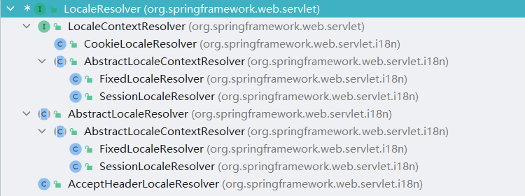
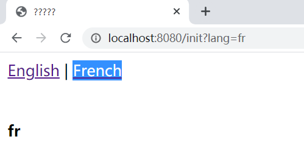
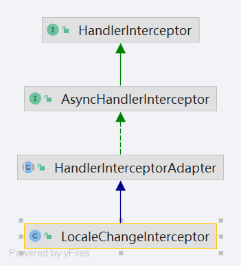

# LocaleResolver
本章将对 LocaleResolver 接口进行分析, LocaleResolver作用是从request中解析出Locale。在LocaleResolver 接口中定义了两个方法，具体代码如下：

```java
public interface LocaleResolver {

   Locale resolveLocale(HttpServletRequest request);

   void setLocale(HttpServletRequest request, @Nullable HttpServletResponse response, @Nullable Locale locale);

}
```

在LocaleResolver接口定义中有两个方法：

1. 方法resolveLocale作用是从请求对象中解析Locale对象。
2. 方法setLocale作用是设置Locale对象。


## 初始化LocaleResolver

本节将对LocaleResolver对象的初始化相关内容进行分析，具体处理代码如下：

```java
private void initLocaleResolver(ApplicationContext context) {
   try {
      // 从Spring容器中根据名称和类型获取
      this.localeResolver = context.getBean(LOCALE_RESOLVER_BEAN_NAME, LocaleResolver.class);
      if (logger.isTraceEnabled()) {
         logger.trace("Detected " + this.localeResolver);
      }
      else if (logger.isDebugEnabled()) {
         logger.debug("Detected " + this.localeResolver.getClass().getSimpleName());
      }
   }
   catch (NoSuchBeanDefinitionException ex) {
      // We need to use the default.
      // 加载默认的 LocaleResolver
      this.localeResolver = getDefaultStrategy(context, LocaleResolver.class);
      if (logger.isTraceEnabled()) {
         logger.trace("No LocaleResolver '" + LOCALE_RESOLVER_BEAN_NAME +
               "': using default [" + this.localeResolver.getClass().getSimpleName() + "]");
      }
   }
}
```

在上述代码中提供了初始化LocaleResolver对象的两种方式：

1. 从Spring容器中根据名称和类型获取LocaleResolver实例对象。
2. 加载默认的LocaleResolver实例对象。

下面将对第二种方式进行分析，首先需要查看SpringMVC中的DispatcherServlet.properties文件，该文件中有关于LocaleResolver的默认实现类的说明，具体信息如下：

```properties
org.springframework.web.servlet.LocaleResolver=org.springframework.web.servlet.i18n.AcceptHeaderLocaleResolver
```

在第二种方式处理过程中会得到AcceptHeaderLocaleResolver对象，一般在开发时对该对象的使用相对比较少。具体实例化的过程时将LocaleResolver对应的数据读取通过反射的方式进行对象创建。

在SpringMVC中LocaleResolver接口的实现类有很多，具体信息如图所示：



在上图中抛开抽象类以外的类有CookieLocaleResolver、FixedLocaleResolver、FixedLocaleResolver和AcceptHeaderLocaleResolver，在这些类中相对常用的是CookieLocaleResolver，在其中默认的实现是AcceptHeaderLocaleResolver。此外从图中还可以发现LocaleContextResolver接口也继承了LocaleResolver，下面对LocaleContextResolver接口中的方法进行说明，首先查看源代码：

```java
public interface LocaleContextResolver extends LocaleResolver {

   LocaleContext resolveLocaleContext(HttpServletRequest request);

 
   void setLocaleContext(HttpServletRequest request, @Nullable HttpServletResponse response,
         @Nullable LocaleContext localeContext);

}
```

在上述代码中可以看到有两个方法：

1. 方法resolveLocaleContext作用是从请求中解析LocaleContext对象。
2. 方法setLocaleContext作用是设置LocaleContext对象。

在这两个方法中都使用到了LocaleContext对象，该对象是国际化的核心，基本知识点在SpringMessageSource中。在LocaleContext接口中直接可以获取Locale对象。


## 国际化测试环境搭建

本节将对国际化测试环境搭建进行说明，后续关于LocaleResolver接口的分析将会再次基础上进行。在SpringMVC中关于国际化的核心对象是Locale，它表示了支持的国际化语言代码，具体信息可以在java.util.Locale类中进行查看，本节将使用en、fr和zh_CN作为国际化测试语言，明确需要进行的国际化语言后需要编写三个properties文件，第一个文件名为welcome_en.properties，具体代码如下：

```properties
welcome.message = en
```

第二个文件名为welcome_fr.properties，具体代码如下：

```properties
welcome.message = fr
```

第三个文件名为welcome_zh_CN.properties，具体代码如下：

```properties
welcome.message = zh
```

在完成国际化文本定义后需要进行JSP代码的编写，该文件位于spring-source-mvc-demo/src/main/webapp/page路径下，文件名称为welcome.jsp，具体代码如下：

```jsp
<%@ page language="java" contentType="text/html; charset=ISO-8859-1" pageEncoding="ISO-8859-1"%>
<%@ page isELIgnored="false" %>
<%@ taglib prefix="spring" uri="http://www.springframework.org/tags" %>
<!DOCTYPE html PUBLIC "-//W3C//DTD HTML 4.01 Transitional//EN" "http://www.w3.org/TR/html4/loose.dtd">
<html>
<head>
   <title>国际化测试</title>
</head>
<body>
<a id="en" href="/init?lang=en">English</a> |
<a id="fr" href="/init?lang=fr">French</a>
<div>&nbsp;</div>
   <h4><spring:message code="welcome.message" /></h4>
</body>
</html>
```

完成JSP页面编辑后需要进行Controller的编写，类名为LocaleResolverCtr，具体代码如下：

```java
@Controller
public class LocaleResolverCtr {
   @GetMapping(value = "/init")
   public ModelAndView initView() {
      ModelAndView modelAndView = new ModelAndView();
      modelAndView.setViewName("welcome");
      return modelAndView;
   }
}
```

在完成Controller对象的编写后需要对Spring配置文件进行修正，修正的文件为applicationContext.xml，修正内容如下：

1. 添加mvc拦截器，具体添加代码如下：

```xml
<mvc:interceptor>
   <mvc:mapping path="/init" />
   <bean class="org.springframework.web.servlet.i18n.LocaleChangeInterceptor">
      <property name="paramName" value="lang"></property>
   </bean>
</mvc:interceptor>
```

2. 添加消息源对象，具体消息源代码如下：

```xml
<bean id="messageSource"
     class="org.springframework.context.support.ReloadableResourceBundleMessageSource">
   <property name="basename" value="/WEB-INF/welcome" />
</bean>
```

3. 添加localeResolver实例，具体添加代码如下：

```xml
<bean id="localeResolver"
     class="org.springframework.web.servlet.i18n.CookieLocaleResolver">
</bean>
```

在完成这些基本代码编写后即可启动项目，在项目启动后访问http://localhost:8080/init地址后可以看到如图所示内容：


从上图中不难发现在第一次进入时会采取本地的语言系统进行内容渲染，即采用welcome_zh_CN.properties文件中的数据作为显示结果。

当点击English后可以看到如图所示内容：


从上图中可以发现此时的请求地址是http://localhost:8080/init?lang=en，它传递了lang参数，此时渲染的数据结果是和welcome_en.properties文件中的内容相符合。

当点击French后可以看到如图所示内容：



从上图中可以发现此时的请求地址是http://localhost:8080/init?lang=fr，它传递了lang参数，此时渲染的数据结果是和welcome_fr.properties文件中的内容相符合。


## LocaleChangeInterceptor分析

在前文的测试用例中可以发现使用了LocaleChangeInterceptor对象并设置了paramName属性，本节将对LocaleChangeInterceptor类进行分析，首先查看类图，具体信息如图所示：



从类图中可以发现LocaleChangeInterceptor对象是一个拦截器，在确定它是拦截器后也明确了需要阅读的方法，这个方法是preHandle，具体处理代码如下：

```java
@Override
public boolean preHandle(HttpServletRequest request, HttpServletResponse response, Object handler)
      throws ServletException {

   // 获取请求中的paramName对应的数据
   String newLocale = request.getParameter(getParamName());
   if (newLocale != null) {
      // 检查请求方式
      if (checkHttpMethod(request.getMethod())) {
         // 请求上下文工具类中获取 LocaleResolver
         LocaleResolver localeResolver = RequestContextUtils.getLocaleResolver(request);
         if (localeResolver == null) {
            throw new IllegalStateException(
                  "No LocaleResolver found: not in a DispatcherServlet request?");
         }
         try {
            // 设置 Locale 对象
            localeResolver.setLocale(request, response, parseLocaleValue(newLocale));
         }
         catch (IllegalArgumentException ex) {
            if (isIgnoreInvalidLocale()) {
               if (logger.isDebugEnabled()) {
                  logger.debug("Ignoring invalid locale value [" + newLocale + "]: " + ex.getMessage());
               }
            }
            else {
               throw ex;
            }
         }
      }
   }
   // Proceed in any case.
   return true;
}
```

在这段代码中主要处理操作有如下几个步骤：

1. 从请求中获取paramName对应的参数值数据。
2. 检查HTTP请求方式。
3. 通过请求上下文工具类获取LocaleResolver对象。
4. 设置LocaleResolver的Locale对象。

对于HTTP请求方式的检查会根据Bean初始化配置httpMethods属性进行验证，如果当前请求的请求方式是在httpMethods中的就会返回true，反之返回false。下面将对请求上下文工具类获取LocaleResolver对象进行分析，具体处理代码如下：

```java
@Nullable
public static LocaleResolver getLocaleResolver(HttpServletRequest request) {
   return (LocaleResolver) request.getAttribute(DispatcherServlet.LOCALE_RESOLVER_ATTRIBUTE);
}
```

从上述代码中可以发现这个获取操作是从request对象中获取LOCALE_RESOLVER_ATTRIBUTE属性名对应的数据。最后还有setLocale方法的处理，该方法是一个接口方法，具体实现会根据LocaleResolver的实际类型进行不同的处理，这部分内容分析将在单个LocaleResolver实现类的分析中进行。


## CookieLocaleResolver 分析

本节将对CookieLocaleResolver类进行分析，在这个类的分析过程中必然不会缺少接口的一些分析，下面先对resolveLocale方法进行分析，该方法是LocaleResolver接口提供的，具体处理代码如下：

```java
@Override
public Locale resolveLocale(HttpServletRequest request) {
   parseLocaleCookieIfNecessary(request);
   return (Locale) request.getAttribute(LOCALE_REQUEST_ATTRIBUTE_NAME);
}
```

在这段方法中主要处理流程有两个：

1. 对request进行前置准备处理，主要处理时提取Locale数据对象并设置给request。
2. 从request对戏中提取Locale对象将其返回。

继续向下查看CookieLocaleResolver类中的resolveLocaleContext方法，具体处理代码如下：

```java
@Override
public LocaleContext resolveLocaleContext(final HttpServletRequest request) {
   parseLocaleCookieIfNecessary(request);
   return new TimeZoneAwareLocaleContext() {
      @Override
      @Nullable
      public Locale getLocale() {
         return (Locale) request.getAttribute(LOCALE_REQUEST_ATTRIBUTE_NAME);
      }
      @Override
      @Nullable
      public TimeZone getTimeZone() {
         return (TimeZone) request.getAttribute(TIME_ZONE_REQUEST_ATTRIBUTE_NAME);
      }
   };
}
```

在上述代码中重要处理操作如下：

1. 对request进行前置准备处理，主要处理时提取Locale数据对象并设置给request。
2. 创建TimeZoneAwareLocaleContext对象，基本数据来源从request中获取。


### parseLocaleCookieIfNecessary 分析

在resolveLocale方法和resolveLocaleContext方法中可以发现这两个方法都使用了parseLocaleCookieIfNecessary方法，可见这个方法的重要程度，具体处理代码如下：

```java
private void parseLocaleCookieIfNecessary(HttpServletRequest request) {
   // 获取 LOCALE_REQUEST_ATTRIBUTE_NAME 属性,只有空才处理
   if (request.getAttribute(LOCALE_REQUEST_ATTRIBUTE_NAME) == null) {
      // 地区语言
      Locale locale = null;
      // 时区
      TimeZone timeZone = null;

      // Retrieve and parse cookie value.
      String cookieName = getCookieName();
      if (cookieName != null) {
         Cookie cookie = WebUtils.getCookie(request, cookieName);
         if (cookie != null) {
            String value = cookie.getValue();
            String localePart = value;
            String timeZonePart = null;
            int separatorIndex = localePart.indexOf('/');
            if (separatorIndex == -1) {
               // Leniently accept older cookies separated by a space...
               separatorIndex = localePart.indexOf(' ');
            }
            if (separatorIndex >= 0) {
               localePart = value.substring(0, separatorIndex);
               timeZonePart = value.substring(separatorIndex + 1);
            }
            try {
               locale = (!"-".equals(localePart) ? parseLocaleValue(localePart) : null);
               if (timeZonePart != null) {
                  timeZone = StringUtils.parseTimeZoneString(timeZonePart);
               }
            }
            catch (IllegalArgumentException ex) {
               if (isRejectInvalidCookies() &&
                     request.getAttribute(WebUtils.ERROR_EXCEPTION_ATTRIBUTE) == null) {
                  throw new IllegalStateException("Encountered invalid locale cookie '" +
                        cookieName + "': [" + value + "] due to: " + ex.getMessage());
               }
               else {
                  // Lenient handling (e.g. error dispatch): ignore locale/timezone parse exceptions
                  if (logger.isDebugEnabled()) {
                     logger.debug("Ignoring invalid locale cookie '" + cookieName +
                           "': [" + value + "] due to: " + ex.getMessage());
                  }
               }
            }
            if (logger.isTraceEnabled()) {
               logger.trace("Parsed cookie value [" + cookie.getValue() + "] into locale '" + locale +
                     "'" + (timeZone != null ? " and time zone '" + timeZone.getID() + "'" : ""));
            }
         }
      }

      request.setAttribute(LOCALE_REQUEST_ATTRIBUTE_NAME,
            (locale != null ? locale : determineDefaultLocale(request)));
      request.setAttribute(TIME_ZONE_REQUEST_ATTRIBUTE_NAME,
            (timeZone != null ? timeZone : determineDefaultTimeZone(request)));
   }
}
```

在这段代码中主要处理目标是提取Locale对象和TimeZone对象，提取方式有两种：

1. 从cookie中进行提取。
2. 默认提取方式。

下面先对cookie提取方式进行分析，采取该方式提取的前提是存在cookieName。提取细节如下：

1. 提取cookie的属性对象，数据名为value。

2. 从第一步中得到的数据进行字符串操作。具体的拆分核心是如下代码

   ```java
   localePart = value.substring(0, separatorIndex);
   timeZonePart = value.substring(separatorIndex + 1);
   ```

最后对默认的提取方式进行说明，首先是Locale对象的默认提取方法，具体代码如下：

```java
@Nullable
protected Locale determineDefaultLocale(HttpServletRequest request) {
   Locale defaultLocale = getDefaultLocale();
   if (defaultLocale == null) {
      defaultLocale = request.getLocale();
   }
   return defaultLocale;
}
```

从上述代码中可以看到默认的Locale数据值获取有两种方式：

1. 提取成员变量defaultLocale的数据。
2. 从请求中获取Locale对象。

关于成员变量defaultLocale的数据设置可以通过以下代码进行配置：

```xml
<bean id="localeResolver"
     class="org.springframework.web.servlet.i18n.CookieLocaleResolver">
   <property name="defaultLocale" value="en"/>
</bean>
```

最后对提取TimeZone的默认方法进行分析，具体处理代码如下：

```java
@Nullable
protected TimeZone determineDefaultTimeZone(HttpServletRequest request) {
   return getDefaultTimeZone();
}
```

在这段代码中会直接从成员变量defaultTimeZone中提取数据，同时该变量也可以通过XML配置进行，具体配置方式代码如下：

```xml
<bean id="localeResolver"
     class="org.springframework.web.servlet.i18n.CookieLocaleResolver">
   <property name="defaultTimeZone" value=""
</bean>
```

在得到Locale对象和TimeZone对象后会将数据设置到request中，因此可以看到resolveLocale方法和resolveLocaleContext方法可以直接从request获取数据。


### setLocaleContext 分析

在CookieLocaleResolver类中还有一个中要方法，它是setLocaleContext，具体处理代码如下：

```java
@Override
public void setLocaleContext(HttpServletRequest request, @Nullable HttpServletResponse response,
      @Nullable LocaleContext localeContext) {

   Assert.notNull(response, "HttpServletResponse is required for CookieLocaleResolver");

   Locale locale = null;
   TimeZone timeZone = null;
   if (localeContext != null) {
      locale = localeContext.getLocale();
      if (localeContext instanceof TimeZoneAwareLocaleContext) {
         timeZone = ((TimeZoneAwareLocaleContext) localeContext).getTimeZone();
      }
      addCookie(response,
            (locale != null ? toLocaleValue(locale) : "-") + (timeZone != null ? '/' + timeZone.getID() : ""));
   }
   else {
      removeCookie(response);
   }
   request.setAttribute(LOCALE_REQUEST_ATTRIBUTE_NAME,
         (locale != null ? locale : determineDefaultLocale(request)));
   request.setAttribute(TIME_ZONE_REQUEST_ATTRIBUTE_NAME,
         (timeZone != null ? timeZone : determineDefaultTimeZone(request)));
}
```

在上述代码中主要处理操作有三个：

1. 如果LocaleContext对象存在会进行添加Cookie数据操作。
2. 如果LocaleContext对象不存在会进行移除Cookie数据操作。
3. 向request对象设置LOCALE_REQUEST_ATTRIBUTE_NAME和TIME_ZONE_REQUEST_ATTRIBUTE_NAME数据。

在上述三个处理操作中主要需要使用的方法是addCookie和removeCookie，前者对应第一个处理操作，后者对应第二个处理操作，第三个处理操作中相关内容在前文已有分析。下面将对addCookie方法先进行分析，首先查看源代码：

```java
public void addCookie(HttpServletResponse response, String cookieValue) {
   Assert.notNull(response, "HttpServletResponse must not be null");
   Cookie cookie = createCookie(cookieValue);
   Integer maxAge = getCookieMaxAge();
   if (maxAge != null) {
      cookie.setMaxAge(maxAge);
   }
   if (isCookieSecure()) {
      cookie.setSecure(true);
   }
   if (isCookieHttpOnly()) {
      cookie.setHttpOnly(true);
   }
   response.addCookie(cookie);
   if (logger.isTraceEnabled()) {
      logger.trace("Added cookie [" + getCookieName() + "=" + cookieValue + "]");
   }
}
```

在addCookie代码中可以发现主要执行的目的是将cookie放入到response对象之中，在放入前所执行的操作有：

1. 创建cookie对象。
2. 设置最大时间。
3. 设置secure对象。
4. 设置httpOnly对象。

在阅读addCookie方法后下面对removeCookie方法进行分析，主要处理代码如下：

```java
public void removeCookie(HttpServletResponse response) {
   Assert.notNull(response, "HttpServletResponse must not be null");
   Cookie cookie = createCookie("");
   cookie.setMaxAge(0);
   if (isCookieSecure()) {
      cookie.setSecure(true);
   }
   if (isCookieHttpOnly()) {
      cookie.setHttpOnly(true);
   }
   response.addCookie(cookie);
   if (logger.isTraceEnabled()) {
      logger.trace("Removed cookie '" + getCookieName() + "'");
   }
}
```

在removeCookie方法中可以发现主要执行流程和addCookie方法中的主要执行流程相似，它们的差异是在removeCookie方法中将最大时间设置为0。


## FixedLocaleResolver 分析

本节将对FixedLocaleResolver对象进行分析，首先关注FixedLocaleResolver的类图，具体信息如图所示：


对象FixedLocaleResolver从类图上比较难以看出直接操作，下面直接进入源代码查看下面三个方法：

1. 方法resolveLocale。
2. 方法resolveLocaleContext。
3. 方法setLocaleContext。

### FixedLocaleResolver 核心方法分析


首先对方法resolveLocale进行分析，具体处理代码如下：

```java
@Override
public Locale resolveLocale(HttpServletRequest request) {
   Locale locale = getDefaultLocale();
   if (locale == null) {
      locale = Locale.getDefault();
   }
   return locale;
}
```

在这段代码中可以发现FixedLocaleResolver在解析Locale对象时并不依赖于参数request，而是完全采用默认值相关操作，默认值来源有两个：

1. 成员变量defaultLocale中获取。
2. Locale的静态方法getDefault中获取。

关于成员变量的配置可以通过下面代码在XML文件中进行配置，具体代码如下：

```xml
<bean class="org.springframework.web.servlet.i18n.FixedLocaleResolver">
   <property name="defaultLocale" value=""/>
</bean>
```


其次对方法resolveLocaleContext进行分析，具体处理代码如下：

```java
@Override
public LocaleContext resolveLocaleContext(HttpServletRequest request) {
   return new TimeZoneAwareLocaleContext() {
      @Override
      @Nullable
      public Locale getLocale() {
         return getDefaultLocale();
      }
      @Override
      public TimeZone getTimeZone() {
         return getDefaultTimeZone();
      }
   };
}
```

在这段代码中可以发现FixedLocaleResolver在解析LocaleContext对象时并不依赖于参数request，而是完全采用默认值相关操作，此时所采用的默认值均需要通过成员变量进行获取，成员变量是defaultLocale和defaultTimeZone，具体配置可以通过XML进行配置，详细配置如下：

```xml
<bean class="org.springframework.web.servlet.i18n.FixedLocaleResolver">
   <property name="defaultLocale" value=""/>
   <property name="defaultTimeZone" value=""/>
</bean>
```

最后对方法setLocaleContext进行分析，具体处理代码如下：

```java
@Override
public void setLocaleContext( HttpServletRequest request, @Nullable HttpServletResponse response,
      @Nullable LocaleContext localeContext) {

   throw new UnsupportedOperationException("Cannot change fixed locale - use a different locale resolution strategy");
}
```

在这段代码中可以发现如果进行了setLocaleContext方法的操作会直接抛出异常。

在分析了三个核心方法后可以发现FixedLocaleResolver对象的处理操作和请求对象（request）没有直接关系，它采用的是默认值策略，要么获取开发者在XML中定义的数据，要么获取对象本身的默认值。


## SessionLocaleResolver 分析

本节将对SessionLocaleResolver 对象进行分析，首先关注SessionLocaleResolver 的类图，具体信息如图所示：


对象SessionLocaleResolver从类图上比较难以看出直接操作，下面直接进入源代码查看下面三个方法：

1. 方法resolveLocale。
2. 方法resolveLocaleContext。
3. 方法setLocaleContext。

### SessionLocaleResolver 核心方法分析

首先对方法resolveLocale进行分析，具体处理代码如下：

```java
@Override
public Locale resolveLocale(HttpServletRequest request) {
   Locale locale = (Locale) WebUtils.getSessionAttribute(request, this.localeAttributeName);
   if (locale == null) {
      locale = determineDefaultLocale(request);
   }
   return locale;
}
```

在resolveLocale方法中主要对Locale对象的获取提供了两种方式：

1. 从Session中获取Locale对象，具体处理代码如下：

```java
@Nullable
public static Object getSessionAttribute(HttpServletRequest request, String name) {
   Assert.notNull(request, "Request must not be null");
   HttpSession session = request.getSession(false);
   return (session != null ? session.getAttribute(name) : null);
}
```

上述代码中可以发现Session数据从request中获取，Locale对象从Session的属性表中根据name进行获取。

2. 通过request进行推论Locale对象，具体处理代码如下：

```java
protected Locale determineDefaultLocale(HttpServletRequest request) {
   Locale defaultLocale = getDefaultLocale();
   if (defaultLocale == null) {
      defaultLocale = request.getLocale();
   }
   return defaultLocale;
}
```

从上述代码中可以发现关于默认Locale的获取有两种方式：

1. 从成员变量defaultLocale中获取。
2. 从请求中获取。

在这两个获取操作中需要注意的是从成员变量中获取的优先级高于从请求中获取。


其次对方法resolveLocaleContext进行分析，具体处理代码如下：

```java
@Override
public LocaleContext resolveLocaleContext(final HttpServletRequest request) {
   return new TimeZoneAwareLocaleContext() {
      @Override
      public Locale getLocale() {
         Locale locale = (Locale) WebUtils.getSessionAttribute(request, localeAttributeName);
         if (locale == null) {
            locale = determineDefaultLocale(request);
         }
         return locale;
      }
      @Override
      @Nullable
      public TimeZone getTimeZone() {
         TimeZone timeZone = (TimeZone) WebUtils.getSessionAttribute(request, timeZoneAttributeName);
         if (timeZone == null) {
            timeZone = determineDefaultTimeZone(request);
         }
         return timeZone;
      }
   };
}
```

从上述代码中可以发现一段和resolveLocale的处理相似的代码，这部分处理的内容是关于Locale对象的，此处不对其进行赘述，下面对getTimeZone方法进行分析，从代码中可以发现主要处理有两个：

1. 从Session中获取TimeZone对象。
2. 获取默认TimeZone对象。

从Session中获取的方式不管是获取Locale还是获取TimeZone本质都是一样的，先提取Session对象，在从Session对象中根据name获取对应数据。最后是determineDefaultTimeZone方法，该方法的处理会直接提取成员变量defaultTimeZone。


最后对方法setLocaleContext进行分析，具体处理代码如下：

```java
@Override
public void setLocaleContext(HttpServletRequest request, @Nullable HttpServletResponse response,
      @Nullable LocaleContext localeContext) {

   Locale locale = null;
   TimeZone timeZone = null;
   if (localeContext != null) {
      locale = localeContext.getLocale();
      if (localeContext instanceof TimeZoneAwareLocaleContext) {
         timeZone = ((TimeZoneAwareLocaleContext) localeContext).getTimeZone();
      }
   }
   WebUtils.setSessionAttribute(request, this.localeAttributeName, locale);
   WebUtils.setSessionAttribute(request, this.timeZoneAttributeName, timeZone);
}
```

在这段代码中可以发现主要处理操作是设置Session中的localeAttributeName属性和timeZoneAttributeName属性，这两个属性会为前两个方法提供帮助，设置的数据内容就是前两个方法提取的数据内容，具体Session设置属性的代码如下：

```java
public static void setSessionAttribute(HttpServletRequest request, String name, @Nullable Object value) {
   Assert.notNull(request, "Request must not be null");
   if (value != null) {
      request.getSession().setAttribute(name, value);
   }
   else {
      HttpSession session = request.getSession(false);
      if (session != null) {
         session.removeAttribute(name);
      }
   }
}
```


## AcceptHeaderLocaleResolver 分析

本节将对AcceptHeaderLocaleResolver 对象进行分析，首先关注AcceptHeaderLocaleResolver 的类图，具体信息如图所示：


对象AcceptHeaderLocaleResolver 从类图上比较难以看出直接操作，下面直接进入源代码查看下面二个方法：

1. 方法resolveLocale。
2. 方法setLocale。


### AcceptHeaderLocaleResolver 核心方法分析

首先对方法resolveLocale进行分析，具体处理代码如下：

```java
@Override
public Locale resolveLocale(HttpServletRequest request) {
   Locale defaultLocale = getDefaultLocale();
   if (defaultLocale != null && request.getHeader("Accept-Language") == null) {
      return defaultLocale;
   }
   Locale requestLocale = request.getLocale();
   List<Locale> supportedLocales = getSupportedLocales();
   if (supportedLocales.isEmpty() || supportedLocales.contains(requestLocale)) {
      return requestLocale;
   }
   Locale supportedLocale = findSupportedLocale(request, supportedLocales);
   if (supportedLocale != null) {
      return supportedLocale;
   }
   return (defaultLocale != null ? defaultLocale : requestLocale);
}
```

在上述代码中主要处理步骤如下：

1. 提取默认的Locale数据对象。
   1. 如果默认的Locale数据对象存在，并且请求头中Accept-Language数据不存在，将默认的Locale对象返回。
2. 从请求中提取Locale对象，并且获取支持的Locale集合。
   1. 如果支持的Locale集合为空或者支持的Locale集合中包括从请求提取的Locale对象，将请求中获取的Locale对象返回。
3. 确认支持的Locale对象。

下面将对第三个操作所涉及的方法进行分析，具体方法代码如下：

```java
@Nullable
private Locale findSupportedLocale(HttpServletRequest request, List<Locale> supportedLocales) {
   Enumeration<Locale> requestLocales = request.getLocales();
   Locale languageMatch = null;
   while (requestLocales.hasMoreElements()) {
      Locale locale = requestLocales.nextElement();
      if (supportedLocales.contains(locale)) {
         if (languageMatch == null || languageMatch.getLanguage().equals(locale.getLanguage())) {
            // Full match: language + country, possibly narrowed from earlier language-only match
            return locale;
         }
      }
      else if (languageMatch == null) {
         // Let's try to find a language-only match as a fallback
         for (Locale candidate : supportedLocales) {
            if (!StringUtils.hasLength(candidate.getCountry()) &&
                  candidate.getLanguage().equals(locale.getLanguage())) {
               languageMatch = candidate;
               break;
            }
         }
      }
   }
   return languageMatch;
}
```

在上述代码中关于Locale的推论方式提供了下面两种方式：

1. 如果当前需要处理的Locale对象在支持列表中，只需要满足下面条件的任意一个就可以做为推论结果，条件如下：
   1. 对象languageMatch为空。
   2. 对象languageMatch中的语言和当前Locale的语言比较相同。

2. 如果对象languageMatch为空，需要同时满足下面两个条件才会将其作为返回值，条件如下：
   1. 地区代码存在。
   2. 对象languageMatch中的语言和当前Locale的语言比较相同。


最后对setLocale方法进行分析，具体代码如下：

```java
@Override
public void setLocale(HttpServletRequest request, @Nullable HttpServletResponse response, @Nullable Locale locale) {
   throw new UnsupportedOperationException(
         "Cannot change HTTP accept header - use a different locale resolution strategy");
}
```

从上述代码中可以发现如果执行了该方法会抛出异常。


## LocaleResolver整体处理流程分析

前文对LocaleResolver接口的四个实现类做了相关源码分析，详细介绍了各个方法的处理流程和作用，下面将对整体的处理流程进行分析，主要解决SpringMVC中LocaleResolver的处理过程。在SpringMVC中关于LocaleResolver的处理代码可以在org.springframework.web.servlet.FrameworkServlet#processRequest方法中看到，主要处理代码如下：

```java
LocaleContext previousLocaleContext = LocaleContextHolder.getLocaleContext();
LocaleContext localeContext = buildLocaleContext(request);
initContextHolders(request, localeContext, requestAttributes);

```

下面将对上述代码中出现的三个方法进行分析，首先分析getLocaleContext方法，具体处理代码如下：

```java
@Nullable
public static LocaleContext getLocaleContext() {
   LocaleContext localeContext = localeContextHolder.get();
   if (localeContext == null) {
      localeContext = inheritableLocaleContextHolder.get();
   }
   return localeContext;
}
```

从上述代码中可以发现此时用到了两个变量：

1. 变量localeContextHolder，详细定义如下：

```java
private static final ThreadLocal<LocaleContext> localeContextHolder =
      new NamedThreadLocal<>("LocaleContext");
```

2. 变量inheritableLocaleContextHolder，详细定义如下：

```java
private static final ThreadLocal<LocaleContext> inheritableLocaleContextHolder =
      new NamedInheritableThreadLocal<>("LocaleContext");
```

从上述两个变量的定义中不难发现这是线程变量，对于getLocaleContext方法中获取LocaleContext对象提供了两个线程变量来进行数据获取。

其次分析buildLocaleContext方法，该方法的处理十分简单，将request作为参数创建SimpleLocaleContext对象，具体处理代码如下：

```java
@Nullable
protected LocaleContext buildLocaleContext(HttpServletRequest request) {
   return new SimpleLocaleContext(request.getLocale());
}
```

注意，该方法有子类实现！需要找到org.springframework.web.servlet.DispatcherServlet#buildLocaleContext中的内容，下面这段代码才是真正的执行代码：

```java
@Override
protected LocaleContext buildLocaleContext(final HttpServletRequest request) {
   LocaleResolver lr = this.localeResolver;
   if (lr instanceof LocaleContextResolver) {
      return ((LocaleContextResolver) lr).resolveLocaleContext(request);
   }
   else {
      return () -> (lr != null ? lr.resolveLocale(request) : request.getLocale());
   }
}
```

从这段代码中可以发现此时用的对象是localeResolver，该对象的来源是在SpringMVC项目启动时就加载完成的，在本文的额测试用例中数据对象是CookieLocaleResolver，此时会进入到CookieLocaleResolver类中的处理逻辑，如果是其他的类型就进入他们自己的处理逻辑。下面对initContextHolders方法进行分析，具体方法如下：

```
private void initContextHolders(HttpServletRequest request,
      @Nullable LocaleContext localeContext, @Nullable RequestAttributes requestAttributes) {

   if (localeContext != null) {
      LocaleContextHolder.setLocaleContext(localeContext, this.threadContextInheritable);
   }
   if (requestAttributes != null) {
      RequestContextHolder.setRequestAttributes(requestAttributes, this.threadContextInheritable);
   }
}
```

从上述代码中可以发现主要处理是将一些数据信息设置到成员变量中。上述是在FrameworkServlet类中关于LocaleResolver的处理，在DispatcherServlet类中还有一部分关于LocaleResolver的处理操作，具体方法是org.springframework.web.servlet.DispatcherServlet#render，处理代码如下：

```java
Locale locale =
      (this.localeResolver != null ? this.localeResolver.resolveLocale(request) : request.getLocale());
response.setLocale(locale);
```

在render方法中会有关于Locale对象的提取操作，注意在得到该数据后负责处理最终显示结果的处理是由ViewResolver接口进行。


## LocaleResolver总结

本章围绕LocaleResolver接口对该接口的三个实现类进行了相关分析，此外对整体的处理流程也做了相关分析，整体处理流程分为两大部分，第一部分是初始化基础数据，第二部分是为ViewResolver解析提供数据支持。