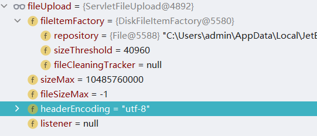
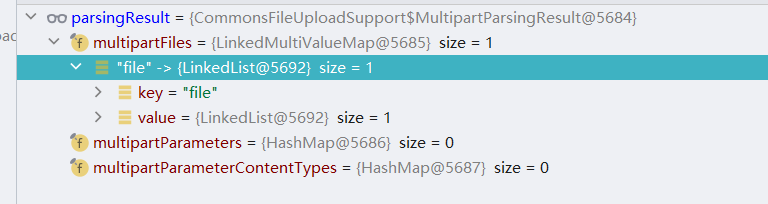

# MultipartResolver
本章将对 MultipartResolver 接口进行分析, MultipartResolver作用是判断 request是不是multipart/form-data类型，是则把request包装成MultipartHttpServletRequest。在MultipartResolver接口中定义了三个方法，具体代码如下：

```java
public interface MultipartResolver {

   boolean isMultipart(HttpServletRequest request);

   MultipartHttpServletRequest resolveMultipart(HttpServletRequest request) throws MultipartException;

   void cleanupMultipart(MultipartHttpServletRequest request);

}
```

下面对三个方法进行作用说明：

1. 方法isMultipart用于判断是否是一个多文件上传请求。
2. 方法resolveMultipart将多文件上传请求转换成MultipartHttpServletRequest对象。
3. 方法cleanupMultipart用于清理多文件数据。

## MultipartResolver 测试环境搭建

本节将介绍MultipartResolver 测试环境搭建，首先需要在build.gradle文件中添加依赖，具体依赖如下：

```gradle
implementation 'commons-io:commons-io:2.4'
implementation 'commons-fileupload:commons-fileupload:1.3.1'
```

其次需要在applicationContext.xml文件中添加MultipartResolver 的实现类，具体代码如下：

```xml
<bean id="multipartResolver" class="org.springframework.web.multipart.commons.CommonsMultipartResolver">
   <property name="defaultEncoding" value="utf-8"></property>
   <property name="maxUploadSize" value="10485760000"></property>
   <property name="maxInMemorySize" value="40960"></property>
</bean>
```

在这段代码中将MultipartResolver的实现类定义成CommonsMultipartResolver，并设置三个属性：

1. defaultEncoding：默认编码
2. maxUploadSize：上传文件的最大容量。
3. maxInMemorySize：上传文件写入磁盘之前允许的最大大小。

完成MultipartResolver实现类的定义和配置后需要编写Controller对象，具体代码如下：

```java
@Controller
public class MultipartResolverController {

   @PostMapping("/data")
   public String data(
         @RequestParam(value = "file",required = true) MultipartFile file
   ) {
      return "hello";
   }
}
```

完成Controller编写后需要进行接口测试，本次测试需要使用POSTMAN这个工具，具体测试接口信息如图所示：


在个请求中需要注意一点，请求参数file是一个文件类型并不是常规字符串，参数值可以选择任意的文件，当发送请求后会跳转到hello.jsp页面，具体返回值如下：

```
<html>

<head>
	<title>Title</title>
</head>

<body>
	<h3>hello-jsp</h3>

</body>

</html>
```


## MultipartResolver初始化

本节将对MultipartResolver的初始化进行分析，具体处理代码如下：

```java
private void initMultipartResolver(ApplicationContext context) {
   try {
      this.multipartResolver = context.getBean(MULTIPART_RESOLVER_BEAN_NAME, MultipartResolver.class);
      if (logger.isTraceEnabled()) {
         logger.trace("Detected " + this.multipartResolver);
      }
      else if (logger.isDebugEnabled()) {
         logger.debug("Detected " + this.multipartResolver.getClass().getSimpleName());
      }
   }
   catch (NoSuchBeanDefinitionException ex) {
      // Default is no multipart resolver.
      this.multipartResolver = null;
      if (logger.isTraceEnabled()) {
         logger.trace("No MultipartResolver '" + MULTIPART_RESOLVER_BEAN_NAME + "' declared");
      }
   }
}
```

在这段代码中只提供了一种方式获取MultipartResolver对象，具体方式是通过名称+类型进行获取，这个获取方式对应了前文对于测试环境搭建中的配置信息：

```xml
<bean id="multipartResolver" class="org.springframework.web.multipart.commons.CommonsMultipartResolver">
   <property name="defaultEncoding" value="utf-8"></property>
   <property name="maxUploadSize" value="10485760000"></property>
   <property name="maxInMemorySize" value="40960"></property>
</bean>
```

通过调试初始化方法可以看到multipartResolver的数据信息如下：


在这个信息中可以看到defaultEncoding、maxUploadSize和maxInMemorySize属性被设置到multipartResolver对象中。


## CommonsMultipartResolver 分析

本节将对CommonsMultipartResolver类进行分析，在CommonsMultipartResolver对象中最重要的方法是resolveMultipart，其他方法为其提供辅助，下面是resolveMultipart的具体代码：

```java
@Override
public MultipartHttpServletRequest resolveMultipart(final HttpServletRequest request) throws MultipartException {
   Assert.notNull(request, "Request must not be null");
   if (this.resolveLazily) {
      return new DefaultMultipartHttpServletRequest(request) {
         @Override
         protected void initializeMultipart() {
            MultipartParsingResult parsingResult = parseRequest(request);
            setMultipartFiles(parsingResult.getMultipartFiles());
            setMultipartParameters(parsingResult.getMultipartParameters());
            setMultipartParameterContentTypes(parsingResult.getMultipartParameterContentTypes());
         }
      };
   }
   else {
      MultipartParsingResult parsingResult = parseRequest(request);
      return new DefaultMultipartHttpServletRequest(request, parsingResult.getMultipartFiles(),
            parsingResult.getMultipartParameters(), parsingResult.getMultipartParameterContentTypes());
   }
}
```

在上述代码中可以发现主要目的是为了创建MultipartHttpServletRequest接口的实现类，该接口的实现类信息如图所示：


在resolveMultipart方法中具体创建的实例是DefaultMultipartHttpServletRequest，在创建过程中关于resolveLazily成员变量的数据内容会导致initializeMultipart方法的差异化，当resolveLazily为true时会进行如下操作：

1. 设置成员变量multipartFiles。
2. 设置成员变量multipartParameters，
3. 设置成员变量multipartParameterContentTypes。

需要注意在CommonsMultipartResolver类中resolveLazily数据默认值为false。下面发送一个请求，查看parsingResult变量和返回值的数据内容，具体信息如图所示：


在resolveMultipart方法调用过程中可以发现它需要使用parseRequest方法来创建（获取）MultipartParsingResult对象，下面将对该方法进行分析，具体处理代码如下：

```java
protected MultipartParsingResult parseRequest(HttpServletRequest request) throws MultipartException {
    String encoding = determineEncoding(request);
    FileUpload fileUpload = prepareFileUpload(encoding);
    try {
        List<FileItem> fileItems = ((ServletFileUpload) fileUpload).parseRequest(request);
        return parseFileItems(fileItems, encoding);
    }
    catch (FileUploadBase.SizeLimitExceededException ex) {
        throw new MaxUploadSizeExceededException(fileUpload.getSizeMax(), ex);
    }
    catch (FileUploadBase.FileSizeLimitExceededException ex) {
        throw new MaxUploadSizeExceededException(fileUpload.getFileSizeMax(), ex);
    }
    catch (FileUploadException ex) {
        throw new MultipartException("Failed to parse multipart servlet request", ex);
    }
}
```

在parseRequest方法中主要处理流程如下：

1. 确定编码，具体确定编码的方式有两种，第一种是通过请求的获取，第二种是采用默认编码，默认编码是ISO-8859-1。
2. 创建FileUpload对象，
3. 解析请求获得文件元素对象集合。此时所使用的parseRequest方法具体提供者是org.apache.commons.fileupload.servlet.ServletFileUpload#parseRequest。
4. 将文件元素对象集合转换成MultipartParsingResult做返回值。

下面将通过调试来对上述四个步骤中关键数据进行查看，首先是fileUpload对象，具体数据如下：




其次是fileItems的解析结果，具体数据填写：


最后是方法返回值具体数据如图所示：



通过上图可以发现在parseRequest方法的处理过程中主要目的是将请求中的文件数据转换成MultipartParsingResult对象的multipartFiles字段。最后在创建DefaultMultipartHttpServletRequest对象时也只是将数据从MultipartParsingResult搬运到DefaultMultipartHttpServletRequest。

## StandardServletMultipartResolver 分析

本节将对StandardMultipartHttpServletRequest对象进行分析，在该对象中主要关注的方法是parseRequest，具体处理代码如下：

```java
private void parseRequest(HttpServletRequest request) {
   try {
      Collection<Part> parts = request.getParts();
      this.multipartParameterNames = new LinkedHashSet<>(parts.size());
      MultiValueMap<String, MultipartFile> files = new LinkedMultiValueMap<>(parts.size());
      for (Part part : parts) {
         String headerValue = part.getHeader(HttpHeaders.CONTENT_DISPOSITION);
         ContentDisposition disposition = ContentDisposition.parse(headerValue);
         String filename = disposition.getFilename();
         if (filename != null) {
            if (filename.startsWith("=?") && filename.endsWith("?=")) {
               filename = MimeDelegate.decode(filename);
            }
            files.add(part.getName(), new StandardMultipartFile(part, filename));
         }
         else {
            this.multipartParameterNames.add(part.getName());
         }
      }
      setMultipartFiles(files);
   }
   catch (Throwable ex) {
      handleParseFailure(ex);
   }
}
```

在parseRequest方法中主要目的是设置二个成员变量：multipartParameterNames和multipartFiles，该方法的主要操作流程如下：

1. 从请求中获取part对象集合。
2. 将part集合中的数据转换成参数名称列表和MultiValueMap对象。

如果在上述两个操作过程中出现异常将抛出MaxUploadSizeExceededException或者MultipartException异常，具体处理异常的代码如下：

```java
protected void handleParseFailure(Throwable ex) {
   String msg = ex.getMessage();
   if (msg != null && msg.contains("size") && msg.contains("exceed")) {
      throw new MaxUploadSizeExceededException(-1, ex);
   }
   throw new MultipartException("Failed to parse multipart servlet request", ex);
}
```

在MultiValueMap集合中关于数据信息Value的实际对象是StandardMultipartFile，关于它的定义信息如下：

```java
private static class StandardMultipartFile implements MultipartFile, Serializable {

   private final Part part;

   private final String filename;
}
```

在StandardMultipartFile类中定义了两个属性：

1. part，表示文件对象，该文件对象并不是Java中的File对象而是Servlet中的文件对象。
2. filename，表示文件名称，该数据通常和ServletRequest中传递的文件名称一致。


## MultipartResolver整体处理流程

本节将对MultipartResolver整体处理流程进行分析，当发起一个文件上传的请求后进入SpringMVC项目后会率先进入org.springframework.web.servlet.DispatcherServlet#doDispatch方法，在该方法中主要进行文件上传处理的方法是checkMultipart(request)，具体代码如下：

```java
protected HttpServletRequest checkMultipart(HttpServletRequest request) throws MultipartException {
   if (this.multipartResolver != null && this.multipartResolver.isMultipart(request)) {
      if (WebUtils.getNativeRequest(request, MultipartHttpServletRequest.class) != null) {
         if (request.getDispatcherType().equals(DispatcherType.REQUEST)) {
            logger.trace("Request already resolved to MultipartHttpServletRequest, e.g. by MultipartFilter");
         }
      }
      else if (hasMultipartException(request)) {
         logger.debug("Multipart resolution previously failed for current request - " +
               "skipping re-resolution for undisturbed error rendering");
      }
      else {
         try {
            return this.multipartResolver.resolveMultipart(request);
         }
         catch (MultipartException ex) {
            if (request.getAttribute(WebUtils.ERROR_EXCEPTION_ATTRIBUTE) != null) {
               logger.debug("Multipart resolution failed for error dispatch", ex);
               // Keep processing error dispatch with regular request handle below
            }
            else {
               throw ex;
            }
         }
      }
   }
   // If not returned before: return original request.
   return request;
}
```

在checkMultipart方法中主要处理处理如下：

1. 判断当前请求是否是多文件上传请求，如果不是直接结束处理，如果是则进行如下处理：
   1. 将请求交给MultipartResolver接口实现类进行解析，将解析值返回。

在得到checkMultipart(request)方法处理后的request对象后需要进行的操作是寻找对应的HandlerMapping进行处理。


## MultipartResolver总结

本章围绕MultipartResolver接口对该接口的二个实现类进行了相关分析，第一个类是CommonsMultipartResolver ，第二个类是StandardServletMultipartResolver ，此外对整体的处理流程也做了相关分析。