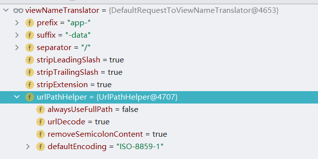
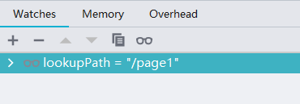

# RequestToViewNameTranslator
本章将对 ThemeResolver 接口进行分析, ThemeResolver的作用是从request获取viewName，并且在springmvc容器中只能配置一个。在RequestToViewNameTranslator接口中定义了一个方法，具体代码如下：

```java
public interface RequestToViewNameTranslator {

   @Nullable
   String getViewName(HttpServletRequest request) throws Exception;

}
```

在`getViewName`方法中主要目的是通过`HttpServletRequest`对象找到对应的视图名称。


## RequestToViewNameTranslator测试环境搭建

本节将搭建一个用于RequestToViewNameTranslator源码分析和调试的测试环境，首先需要在applicationContext.xml文件中添加一个RequestToViewNameTranslator的实现类，具体代码如下：

```xml
<bean id="viewNameTranslator" class="org.springframework.web.servlet.view.DefaultRequestToViewNameTranslator">
   <property name="prefix" value="app-"/>
   <property name="suffix" value="-data"/>
</bean>
```

其次需要创建一个JSP页面，该页面需要放在page目录下，文件名需要符合"app-"+"*"+"-data"规则，本例的文件名为app-page1-data.jsp，具体代码如下：

```jsp
<%@ page contentType="text/html;charset=UTF-8" language="java" %>
<html>
<head>
    <title>Title</title>
</head>
<body>
<h3>hello-jsp</h3>

</body>
</html>
```

最后需要编写一个Controller接口，这个接口的路由地址需要是"app-"和"-data"之间的数据，本例为page1，具体代码如下：

```java
@RequestMapping({"page1"})
public void handle() {
}
```

在完成所需要的基本代码后需要进行接口模拟，具体的接口模拟信息如下：

```
GET http://localhost:8080/page1

HTTP/1.1 200 
Vary: Origin
Vary: Access-Control-Request-Method
Vary: Access-Control-Request-Headers
Set-Cookie: JSESSIONID=2188386BDCC1900C3B5988364C1421D0; Path=/; HttpOnly
Content-Type: text/html;charset=UTF-8
Content-Language: zh-CN
Content-Length: 92
Date: Wed, 14 Apr 2021 07:59:36 GMT
Keep-Alive: timeout=20
Connection: keep-alive

<html>
<head>
    <title>Title</title>
</head>
<body>
<h3>hello-jsp</h3>

</body>
</html>
```

在这个接口中可以发现整体的处理流程是通过前缀+路由地址+后缀找到jsp的文件并将其渲染。


## RequestToViewNameTranslator初始化

本节将对RequestToViewNameTranslator对象的初始化相关内容进行分析，具体处理代码如下：

```java
private void initRequestToViewNameTranslator(ApplicationContext context) {
   try {
      this.viewNameTranslator =
            context.getBean(REQUEST_TO_VIEW_NAME_TRANSLATOR_BEAN_NAME, RequestToViewNameTranslator.class);
      if (logger.isTraceEnabled()) {
         logger.trace("Detected " + this.viewNameTranslator.getClass().getSimpleName());
      }
      else if (logger.isDebugEnabled()) {
         logger.debug("Detected " + this.viewNameTranslator);
      }
   }
   catch (NoSuchBeanDefinitionException ex) {
      // We need to use the default.
      this.viewNameTranslator = getDefaultStrategy(context, RequestToViewNameTranslator.class);
      if (logger.isTraceEnabled()) {
         logger.trace("No RequestToViewNameTranslator '" + REQUEST_TO_VIEW_NAME_TRANSLATOR_BEAN_NAME +
               "': using default [" + this.viewNameTranslator.getClass().getSimpleName() + "]");
      }
   }
}
```

在这段代码中只提供了一种方式获取RequestToViewNameTranslator对象，具体方式是通过名称+类型进行获取，这个获取方式对应了前文对于测试环境搭建中的配置信息：

```
<bean id="viewNameTranslator" class="org.springframework.web.servlet.view.DefaultRequestToViewNameTranslator">
   <property name="prefix" value="app-"/>
   <property name="suffix" value="-data"/>
</bean>
```

通过调试初始化方法可以看到RequestToViewNameTranslator的数据信息如下：




在这个信息中可以看到prefix和suffix属性被设置到RequestToViewNameTranslator对象中。


## DefaultRequestToViewNameTranslator 分析

在SpringMVC中RequestToViewNameTranslator有且仅有一个实现类，该实现类是DefaultRequestToViewNameTranslator ，注意这个接口不在DispatcherServlet.properties文件中有定义。DefaultRequestToViewNameTranslator 对象作为RequestToViewNameTranslator的实现类需要关注的方法是getViewName，具体代码如下：

```java
@Override
public String getViewName(HttpServletRequest request) {
   String lookupPath = this.urlPathHelper.getLookupPathForRequest(request, HandlerMapping.LOOKUP_PATH);
   return (this.prefix + transformPath(lookupPath) + this.suffix);
}
```

在这段代码中主要执行流程如下：

1. 从请求中提取核心地址。
2. 组合前缀、核心地址和后缀组装成视图名称。

关于提取核心地址在本例中的模拟请求是http://localhost:8080/page1，核心地址的提取可以理解为将ip端口号删除留下page1关键字，下图为该请求经过提取核心地址后的数据信息：



在得到核心地址信息后还需要进行一次转换（处理方法是transformPath），转换规则如下：

1. 核心地址的第一个字符是"/"将其删除。
2. 核心地址的最后一个字符是"/"将其删除

经过转换后得到的结果是page1，此时经过组合最终的数据值是app-page1-data。


## RequestToViewNameTranslator 整体处理流程分析

本节将对RequestToViewNameTranslator 整体处理流程分析，当发起http://localhost:8080/page1这个请求时会进入到org.springframework.web.servlet.DispatcherServlet#doDispatch方法，在该方法中有下面代码来进行相关处理：

```java
private void applyDefaultViewName(HttpServletRequest request, @Nullable ModelAndView mv) throws Exception {
    if (mv != null && !mv.hasView()) {
        String defaultViewName = getDefaultViewName(request);
        if (defaultViewName != null) {
            mv.setViewName(defaultViewName);
        }
    }
}
@Nullable
protected String getDefaultViewName(HttpServletRequest request) throws Exception {
    return (this.viewNameTranslator != null ? this.viewNameTranslator.getViewName(request) : null);
}

```

在applyDefaultViewName方法中主要核心方法是getDefaultViewName，通过阅读getDefaultViewName方法可以发现它所使用的用来获取默认视图名称的对象是RequestToViewNameTranslator，也就是通过配置文件进行配置的，通过getDefaultViewName方法即可解析得到默认视图名称。


## RequestToViewNameTranslator 总结

RequestToViewNameTranslator,介绍了RequestToViewNameTranslator接口的方法和一个实现类的具体实现过程，此外对RequestToViewNameTranslator 的整体处理流程进行了分析。