# ThemeResolver
本章将对 ThemeResolver 接口进行分析, ThemeResolver的作用是从请求(request)解析出主题名，然后ThemeSource根据主题名找到主题Theme。在ThemeResolver接口中定义了两个方法，具体代码如下：

```java
public interface ThemeResolver {

   String resolveThemeName(HttpServletRequest request);

   void setThemeName(HttpServletRequest request, @Nullable HttpServletResponse response, @Nullable String themeName);

}
```

在ThemeResolver 接口定义中有两个方法：

1. 方法resolveThemeName作用是从请求对象中解析主题名称。
2. 方法setThemeName作用是设置主题名称。


## 初始化ThemeResolver

本节将对ThemeResolver对象的初始化相关内容进行分析，具体处理代码如下：

```java
private void initThemeResolver(ApplicationContext context) {
   try {
      this.themeResolver = context.getBean(THEME_RESOLVER_BEAN_NAME, ThemeResolver.class);
      if (logger.isTraceEnabled()) {
         logger.trace("Detected " + this.themeResolver);
      }
      else if (logger.isDebugEnabled()) {
         logger.debug("Detected " + this.themeResolver.getClass().getSimpleName());
      }
   }
   catch (NoSuchBeanDefinitionException ex) {
      // We need to use the default.
      this.themeResolver = getDefaultStrategy(context, ThemeResolver.class);
      if (logger.isTraceEnabled()) {
         logger.trace("No ThemeResolver '" + THEME_RESOLVER_BEAN_NAME +
               "': using default [" + this.themeResolver.getClass().getSimpleName() + "]");
      }
   }
}
```

在上述代码中提供了初始化ThemeResolver对象的两种方式：

1. 从Spring容器中根据名称和类型获取ThemeResolver实例对象。
2. 加载默认的ThemeResolver实例对象。

下面将对第二种方式进行分析，首先需要查看SpringMVC中的DispatcherServlet.properties文件，该文件中有关于ThemeResolver的默认实现类的说明，具体信息如下：

```properties
org.springframework.web.servlet.ThemeResolver=org.springframework.web.servlet.theme.FixedThemeResolver
```

在第二种方式处理过程中会得到FixedThemeResolver对象。具体实例化的过程时将ThemeResolver对应的数据读取通过反射的方式进行对象创建。

在SpringMVC中ThemeResolver接口的实现类有很多，具体信息如图所示：

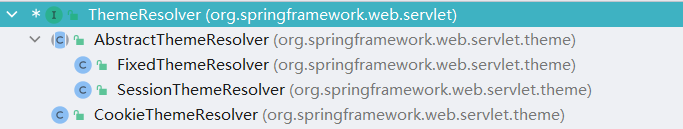


## 主题测试环境搭建

本节将对主题测试环境搭建进行说明，后续关于ThemeResolver接口的分析将会再次基础上进行。主题这个名词在WEB开发中一般情况下是对前端样式的一种描述，首先创建两个css文件，第一个文件名为bright.css，具体代码如下：

```css
h3{
    background: wheat;
}
```

第二个文件名为dark.css，具体代码如下：

```java
h3{
    background: black;
}
```

在完成样式文件的编写后需要进行主题配置文件的编写，首先编写bright.properties文件，具体内容如下：

```properties
stylesheet=themes/bright.css
```

其次编写dark.properties文件，具体内容如下：

```properties
stylesheet=themes/dark.css
```

在完成主题配置文件编写后需要编写展示页，展示页文件名为theme.jsp，具体代码如下：

```jsp
<%@ taglib uri="http://www.springframework.org/tags" prefix="spring"%>
<html>
<head>
    <link rel="stylesheet" href="<spring:theme code='stylesheet'/>" type="text/css" />
    <title>Spring MVC ThemeResolver Example</title>
</head>
<body>

<h3>Spring MVC ThemeResolver Example</h3>
theme: <a href="/theme?theme=bright">bright</a> | <a href="/theme?theme=dark">dark</a>

</body>
</html>
```

在完成JSP文件的编写后需要进行XML配置文件的添加，具体添加内容如下：

```xml

<bean id="themeSource" class="org.springframework.ui.context.support.ResourceBundleThemeSource">
    <property name="defaultEncoding" value="UTF-8"/>
    <property name="basenamePrefix" value="themes."/>
</bean>
<mvc:resources mapping="/themes/**" location="/themes/"/>
<bean id="themeResolver" class="org.springframework.web.servlet.theme.CookieThemeResolver">
    <property name="defaultThemeName" value="bright"/>
    <property name="cookieName" value="my-theme-cookie"/>
</bean>
	
<mvc:interceptor>
    <mvc:mapping path="/theme"/>
    <bean id="themeChangeInterceptor" class="org.springframework.web.servlet.theme.ThemeChangeInterceptor">
        <property name="paramName" value="theme"/>
    </bean>
</mvc:interceptor>

```

最后编写Controller接口，文件名为ThemeResolverCtr，具体代码如下：

```java
@Controller
public class ThemeResolverCtr {

   @RequestMapping(value = "/theme", method = RequestMethod.GET)
   public ModelAndView initView() {
      ModelAndView modelAndView = new ModelAndView();
      modelAndView.addObject("msg", "data");
      modelAndView.setViewName("theme");
      return modelAndView;
   }
}
```

在完成这些基本代码编写后即可启动项目，在项目启动后访问http://localhost:8080/theme地址后可以看到如图所示内容：

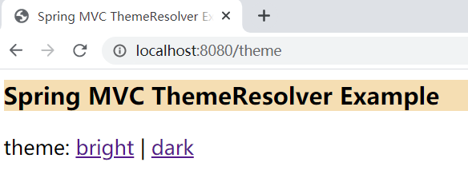

当点击dark后可以看到如图所示内容：

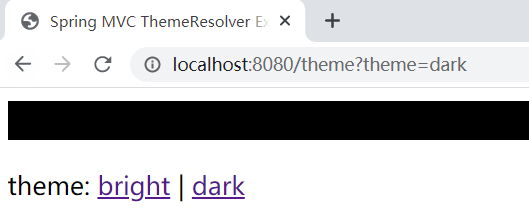


通过前文的操作可以发现点击dark后文本显示内容的背景色进行了替换，此时就说明配置成功。


## ThemeChangeInterceptor 分析

在前文的测试用例中可以发现使用了ThemeChangeInterceptor对象并设置了paramName属性，本节将对ThemeChangeInterceptor 类进行分析，首先查看类图，具体信息如图所示：

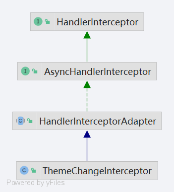

从类图中可以发现ThemeChangeInterceptor 对象是一个拦截器，在确定它是拦截器后也明确了需要阅读的方法，这个方法是preHandle，具体处理代码如下：

```java
@Override
public boolean preHandle(HttpServletRequest request, HttpServletResponse response, Object handler)
      throws ServletException {

   String newTheme = request.getParameter(this.paramName);
   if (newTheme != null) {
      ThemeResolver themeResolver = RequestContextUtils.getThemeResolver(request);
      if (themeResolver == null) {
         throw new IllegalStateException("No ThemeResolver found: not in a DispatcherServlet request?");
      }
      themeResolver.setThemeName(request, response, newTheme);
   }
   // Proceed in any case.
   return true;
}
```

在上述代码中主要执行目的是将请求中的theme数据设置到主题解析器中，主要处理逻辑如下：

1. 从请求中获取paramName对应的主题数据。
2. 从请求上下文中获取主题数据。
3. 将主题数据设置到主题解析器中。


## CookieThemeResolver 分析

本节将对CookieThemeResolver 类进行分析，首先查看它的类图，具体信息如图所示：

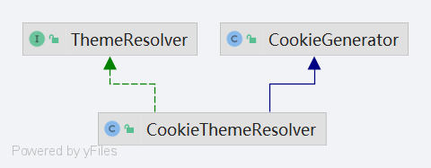

在CookieThemeResolver类图中可以发现它继承了CookieGenerator对象，在CookieGenerator对象中提供了一些关于Cookie的操作，主要操作是addCookie和removeCookie，具体调用会在CookieThemeResolver中有所涉及。

下面对resolveThemeName方法进行分析，具体处理代码如下：

```java
@Override
public String resolveThemeName(HttpServletRequest request) {
   // Check request for preparsed or preset theme.
   // 从请求的属性表中获取 THEME_REQUEST_ATTRIBUTE_NAME 对应的数据
   String themeName = (String) request.getAttribute(THEME_REQUEST_ATTRIBUTE_NAME);
   if (themeName != null) {
      return themeName;
   }

   // Retrieve cookie value from request.
   // 获取 cookie 名称
   String cookieName = getCookieName();
   if (cookieName != null) {
      // 提取 cookie 将cookie对应的value作为主题名称
      Cookie cookie = WebUtils.getCookie(request, cookieName);
      if (cookie != null) {
         String value = cookie.getValue();
         if (StringUtils.hasText(value)) {
            themeName = value;
         }
      }
   }

   // Fall back to default theme.
   if (themeName == null) {
      // 获取默认的主题名称
      themeName = getDefaultThemeName();
   }
   // 设置请求属性表中的数据
   request.setAttribute(THEME_REQUEST_ATTRIBUTE_NAME, themeName);
   return themeName;
}
```

在上述方法中对于主题名称的提取提供了如下三种获取方式：

1. 从请求的属性表中寻找THEME_REQUEST_ATTRIBUTE_NAME对应的数据值。
2. 从Cookie中获取数据值。
3. 获取默认的主题名称。

通过上述三种获取主题名称的方式获取到数据后会将其放置在请求的属性表中，并将主题名称返回。

下面对setThemeName方法进行分析，具体处理方法如下：

```java
@Override
public void setThemeName(
      HttpServletRequest request, @Nullable HttpServletResponse response, @Nullable String themeName) {

   Assert.notNull(response, "HttpServletResponse is required for CookieThemeResolver");

   if (StringUtils.hasText(themeName)) {
      // Set request attribute and add cookie.
      request.setAttribute(THEME_REQUEST_ATTRIBUTE_NAME, themeName);
      addCookie(response, themeName);
   }
   else {
      // Set request attribute to fallback theme and remove cookie.
      request.setAttribute(THEME_REQUEST_ATTRIBUTE_NAME, getDefaultThemeName());
      removeCookie(response);
   }
}
```

在上述代码中主要处理目标是为了设置主题名称，设置方式有两种：

1. 将该方法的主题名称参数设置到请求中。
2. 将主题名称默认值设置到请求中。

在第一种处理过程中会进行cookie新增操作，在第二种处理过程中会进行移除cookie操作。在方法addCookie和方法removeCookie中它们的差异是关于maxAge数据的设置，前者设置的数据值可能是0，后者设置的数据一定是0，其他设置操作都相同。


## FixedThemeResolver 分析

本节将对FixedThemeResolver 类进行分析，首先查看它的类图，具体信息如图所示：

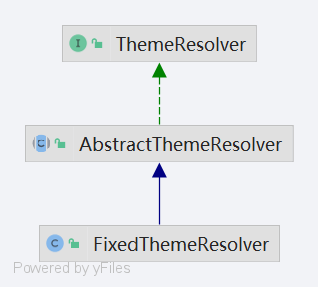


在FixedThemeResolver类中提供的方法有两个方法resolveThemeName和方法setThemeName。

下面对resolveThemeName方法进行分析，具体处理代码如下：

```java
@Override
public String resolveThemeName(HttpServletRequest request) {
   return getDefaultThemeName();
}
```

在上述代码中主要处理逻辑是将默认的主题名称作为返回值，关于默认主题名称的设置可以通过如下代码进行设置：

```xml
<bean id="themeResolver" class="org.springframework.web.servlet.theme.FixedThemeResolver">
   <property name="defaultThemeName" value="bright"/>
</bean>
```

下面对setThemeName方法进行分析，具体处理代码如下：

```java
@Override
public void setThemeName(
      HttpServletRequest request, @Nullable HttpServletResponse response, @Nullable String themeName) {

   throw new UnsupportedOperationException("Cannot change theme - use a different theme resolution strategy");
}
```

在上述代码中可以发现执行setThemeName会直接抛出异常。


## SessionThemeResolver 分析

本节将对SessionThemeResolver 类进行分析，首先查看它的类图，具体信息如图所示：

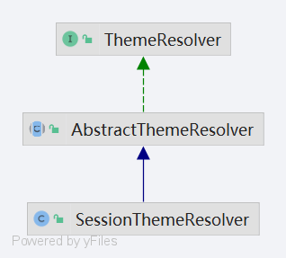

在SessionThemeResolver类中提供的方法有两个方法resolveThemeName和方法setThemeName。


下面对resolveThemeName方法进行分析，具体处理代码如下：

```java
@Override
public String resolveThemeName(HttpServletRequest request) {
   String themeName = (String) WebUtils.getSessionAttribute(request, THEME_SESSION_ATTRIBUTE_NAME);
   // A specific theme indicated, or do we need to fallback to the default?
   return (themeName != null ? themeName : getDefaultThemeName());
}
```

在上述代码中对于主题名称的获取提供了两种方式：

1. 从Session中获取主题名称。
2. 从成员变量defaultThemeName中获取主题名称。


下面对setThemeName方法进行分析，具体处理代码如下：

```java
@Override
public void setThemeName(
      HttpServletRequest request, @Nullable HttpServletResponse response, @Nullable String themeName) {

   WebUtils.setSessionAttribute(request, THEME_SESSION_ATTRIBUTE_NAME,
         (StringUtils.hasText(themeName) ? themeName : null));
}
```

在上述代码中提出了关于设置主题名称的方式，具体设置方式是在Session中进行设置。


## ResourceBundleThemeSource 分析

本节将对ResourceBundleThemeSource类进行分析，首先查看类图，具体信息如图所示：

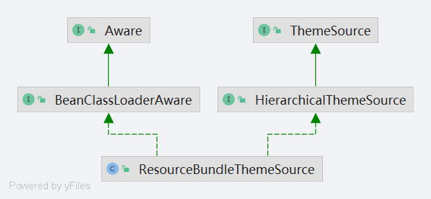

在ResourceBundleThemeSource的类图中可以发现他实现了ThemeSource接口，该接口的主要目的就是提供获取主题对象。因此对ResourceBundleThemeSource类的分析主要目标方法是ThemeSource接口提供的getTheme方法，具体处理代码如下：

```java
@Override
@Nullable
public Theme getTheme(String themeName) {
   Theme theme = this.themeCache.get(themeName);
   if (theme == null) {
      synchronized (this.themeCache) {
         theme = this.themeCache.get(themeName);
         if (theme == null) {
            String basename = this.basenamePrefix + themeName;
            MessageSource messageSource = createMessageSource(basename);
            theme = new SimpleTheme(themeName, messageSource);
            initParent(theme);
            this.themeCache.put(themeName, theme);
            if (logger.isDebugEnabled()) {
               logger.debug("Theme created: name '" + themeName + "', basename [" + basename + "]");
            }
         }
      }
   }
   return theme;
}
```

在上述代码中关于Theme对象的获取主要执行流程有如下操作：

1. 从主题缓存中进行获取主题对象。
2. 通过主题前缀名称+主题名称进行获取。

在这段代码中主要的对象有basenamePrefix、themeName和theme，在第一次请求时遇到的数据信息如图所示：

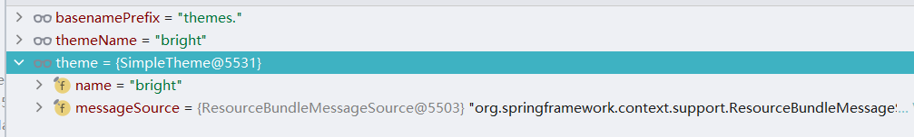

在第一次请求以后的请求由于缓存建立成功会直接从缓存中获取数据，缓存数据信息如图所示：

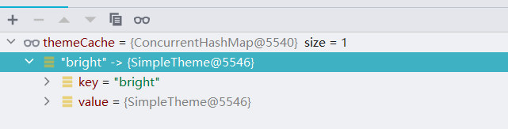

在这个处理过程中可以发现在Theme对象中还隐藏了MessageSource（消息源）对象，该对象会在渲染时起到关键作用。


## ThemeResolver 整体处理流程分析

在SpringMVC中关于ThemeResolver的主要处理流程位于org.springframework.web.servlet.tags.MessageTag#doEndTag方法中，这里的处理操作和JSP解析的处理有一定关系同时包含一些标签处理，具体处理代码如下：

```java
@Override
public int doEndTag() throws JspException {
   try {
      // Resolve the unescaped message.
      String msg = resolveMessage();

      // HTML and/or JavaScript escape, if demanded.
      msg = htmlEscape(msg);
      msg = this.javaScriptEscape ? JavaScriptUtils.javaScriptEscape(msg) : msg;

      // Expose as variable, if demanded, else write to the page.
      if (this.var != null) {
         this.pageContext.setAttribute(this.var, msg, TagUtils.getScope(this.scope));
      }
      else {
         writeMessage(msg);
      }

      return EVAL_PAGE;
   }
   catch (IOException ex) {
      throw new JspTagException(ex.getMessage(), ex);
   }
   catch (NoSuchMessageException ex) {
      throw new JspTagException(getNoSuchMessageExceptionDescription(ex));
   }
}
```

在上述代码中主要关注的方法是resolveMessage，通过该方法得到的数据内容是bright.properties文件或dark.properties文件的内容，下面将对该方法进行分析，具体处理代码如下：

```java
protected String resolveMessage() throws JspException, NoSuchMessageException {
   MessageSource messageSource = getMessageSource();

   // Evaluate the specified MessageSourceResolvable, if any.
   if (this.message != null) {
      // We have a given MessageSourceResolvable.
      return messageSource.getMessage(this.message, getRequestContext().getLocale());
   }

   if (this.code != null || this.text != null) {
      // We have a code or default text that we need to resolve.
      Object[] argumentsArray = resolveArguments(this.arguments);
      if (!this.nestedArguments.isEmpty()) {
         argumentsArray = appendArguments(argumentsArray, this.nestedArguments.toArray());
      }

      if (this.text != null) {
         // We have a fallback text to consider.
         String msg = messageSource.getMessage(
               this.code, argumentsArray, this.text, getRequestContext().getLocale());
         return (msg != null ? msg : "");
      }
      else {
         // We have no fallback text to consider.
         return messageSource.getMessage(
               this.code, argumentsArray, getRequestContext().getLocale());
      }
   }

   throw new JspTagException("No resolvable message");
}
```

在这段代码中主要执行流程如下：

1. 提取MessageSource接口对象。
2. message对象不为空通过MessageSourceResolvable接口进行获取解析结果获取。
3. 从MessageSource接口对象中获取真实的消息数据。

在这三个处理流程中需要关注的变量有messageSource，该变量的数据信息一般会从XML配置中来，XML中的配置信息如下：

```xml
<bean id="themeSource" class="org.springframework.ui.context.support.ResourceBundleThemeSource">
    <property name="defaultEncoding" value="UTF-8"/>
    <property name="basenamePrefix" value="themes."/>
</bean>
```

在处理一中此时得到的数据对象如图所示：

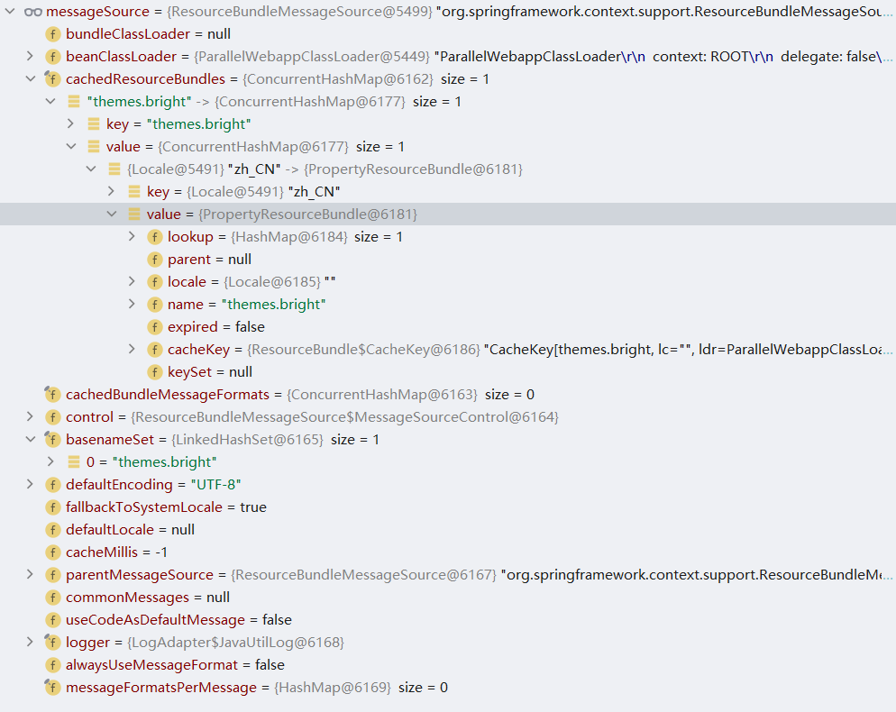

在得到该对象之后需要进行的处理操作会回归到SpringIoC中的MessageSource接口的使用，最终resolveMessage方法的返回值数据为themes/bright.css，在得到该数据后会进行数据写出操作从而完成整个主题解析相关内容。在整个解析过程中和JSP相关的内容有如下代码：

```xml
<link rel="stylesheet" href="<spring:theme code='stylesheet'/>" type="text/css" />
```

在主题解析过程中可以理解为如何将<spring:theme code='stylesheet'/>代码转换为具体的主题文件。

## ThemeResolver总结

本章围绕ThemeResolver接口出发,介绍了ThemeResolver接口的作用和三个实现类的具体实现过程，此外还对测试用例中的拦截器、主题源（Themeource）进行了相关分析。