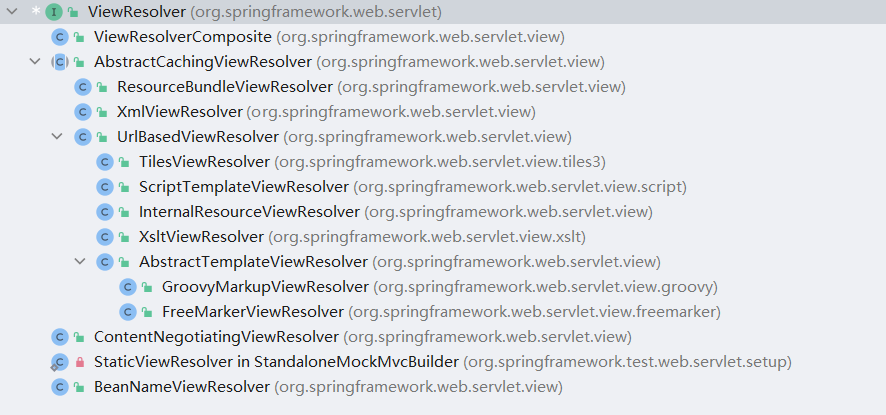
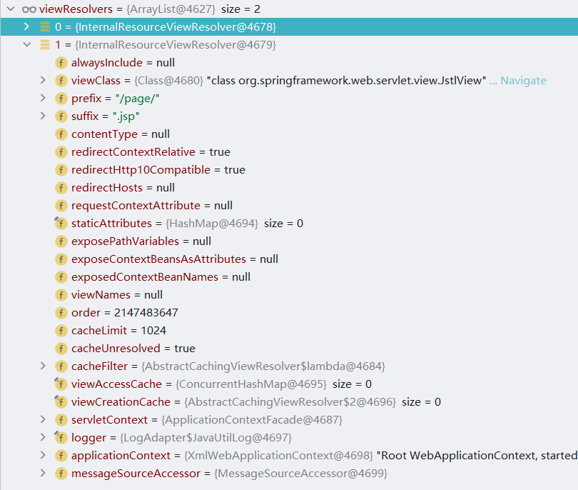

# ViewResolver
本章将对 ViewResolver 接口进行分析, ViewResolver的作用是根据视图名和Locale解析成View类型的视图。在ViewResolver接口中定义了一个方法，具体代码如下：

```java
public interface ViewResolver {

   @Nullable
   View resolveViewName(String viewName, Locale locale) throws Exception;

}
```

在ViewResolver接口定义中有两个方法：

1. 方法resolveViewName作用是据视图名和Locale解析成View类型的视图。

## 初始化ViewResolver

本节将对ViewResolver对象的初始化相关内容进行分析，具体处理代码如下：

```java
private void initViewResolvers(ApplicationContext context) {
   this.viewResolvers = null;

   if (this.detectAllViewResolvers) {
      // Find all ViewResolvers in the ApplicationContext, including ancestor contexts.
      Map<String, ViewResolver> matchingBeans =
            BeanFactoryUtils.beansOfTypeIncludingAncestors(context, ViewResolver.class, true, false);
      if (!matchingBeans.isEmpty()) {
         this.viewResolvers = new ArrayList<>(matchingBeans.values());
         // We keep ViewResolvers in sorted order.
         AnnotationAwareOrderComparator.sort(this.viewResolvers);
      }
   }
   else {
      try {
         ViewResolver vr = context.getBean(VIEW_RESOLVER_BEAN_NAME, ViewResolver.class);
         this.viewResolvers = Collections.singletonList(vr);
      }
      catch (NoSuchBeanDefinitionException ex) {
         // Ignore, we'll add a default ViewResolver later.
      }
   }

   // Ensure we have at least one ViewResolver, by registering
   // a default ViewResolver if no other resolvers are found.
   if (this.viewResolvers == null) {
      this.viewResolvers = getDefaultStrategies(context, ViewResolver.class);
      if (logger.isTraceEnabled()) {
         logger.trace("No ViewResolvers declared for servlet '" + getServletName() +
               "': using default strategies from DispatcherServlet.properties");
      }
   }
}
```

在上述代码中提供了初始化ViewResolver对象的三种方式：

1. 根据类型在容器中搜索。
2. 从Spring容器中根据名称和类型获取ViewResolver实例对象。
3. 加载默认的ViewResolver实例对象。

下面将对第三种方式进行分析，首先需要查看SpringMVC中的DispatcherServlet.properties文件，该文件中有关于ViewResolver的默认实现类的说明，具体信息如下：

```properties
org.springframework.web.servlet.ViewResolver=org.springframework.web.servlet.view.InternalResourceViewResolver
```

在第三种方式处理过程中会得到InternalResourceViewResolver对象。具体实例化的过程时将ViewResolver对应的数据读取通过反射的方式进行对象创建。在SpringMVC中ViewResolver接口的实现类有很多，具体信息如图所示：




## ViewResolver 测试用例

本节将编写ViewResolver的测试用例，首先需要进行SpringBean配置，修改的配置文件文件名是applicationContext.xml，具体配置代码如下：

```xml
<bean id="jspViewResolver" class="org.springframework.web.servlet.view.InternalResourceViewResolver">
    <property name="viewClass" value="org.springframework.web.servlet.view.JstlView"/>
    <property name="prefix" value="/page/"/>
    <property name="suffix" value=".jsp"/>
</bean>

```

在完成SpringBean配置文件修改后需要进行jsp文件的创建，具体创建位置应在/page下，文件名为hello.jsp，具体代码如下：

```jsp
<%@ page contentType="text/html;charset=UTF-8" language="java" %>
<html>
<head>
    <title>Title</title>
</head>
<body>
<h3>hello-jsp</h3>

</body>
</html>
```

最后需要进行Controller接口的编写，具体代码如下：

```java
@Controller
@CrossOrigin
public class HelloController {

   @GetMapping("/demo")
   public String demo() {
      return "hello";
   }
}
```

在编写完成上述代码后进行请求测试，具体请求测试信息如下：

```http
GET http://localhost:8080/demo

HTTP/1.1 200 
Vary: Origin
Vary: Access-Control-Request-Method
Vary: Access-Control-Request-Headers
Set-Cookie: JSESSIONID=779354EB949152ECA6B71E0B7079D36D; Path=/; HttpOnly
Content-Type: text/html;charset=UTF-8
Content-Language: zh-CN
Content-Length: 92
Date: Mon, 12 Apr 2021 03:34:42 GMT
Keep-Alive: timeout=20
Connection: keep-alive

<html>
<head>
    <title>Title</title>
</head>
<body>
<h3>hello-jsp</h3>

</body>
</html>
```


## InternalResourceViewResolver 分析

本节将对InternalResourceViewResolver类进行分析，首先查看InternalResourceViewResolver的类图,具体如图所示：


从类图上发现InternalResourceViewResolver类并没有实现一些特殊的接口，因此可以直接进入代码查看处理细节，在InternalResourceViewResolver类中需要关注的方法是buildView，具体处理代码如下：

```java
@Override
protected AbstractUrlBasedView buildView(String viewName) throws Exception {
   InternalResourceView view = (InternalResourceView) super.buildView(viewName);
   if (this.alwaysInclude != null) {
      view.setAlwaysInclude(this.alwaysInclude);
   }
   view.setPreventDispatchLoop(true);
   return view;
}
```

在这个方法中可以发现核心点在于父类的buildView方法，在这个方法中仅仅是做出了一些数据值的设置操作。基于前文的测试用例来查看InternalResourceViewResolver初始化时的数据，具体信息如下：



在上图中可以发现viewClass、prefix和suffix数据信息和SpringXML中的配置相同。


## UrlBasedViewResolver 分析

本节将分析UrlBasedViewResolver类，在前文分析InternalResourceViewResolver时提到了buildView方法，该方法是一个重要的方法，此外在UrlBasedViewResolver类中重要的方法还有如下几个：

1. 方法createView。
2. 方法loadView。
3. 方法applyLifecycleMethods。


### buildView方法分析

本节将对buildView方法进行分析，首先查看完整代码，具体代码如下：

```java
protected AbstractUrlBasedView buildView(String viewName) throws Exception {
   Class<?> viewClass = getViewClass();
   Assert.state(viewClass != null, "No view class");

   AbstractUrlBasedView view = (AbstractUrlBasedView) BeanUtils.instantiateClass(viewClass);
   view.setUrl(getPrefix() + viewName + getSuffix());
   view.setAttributesMap(getAttributesMap());

   String contentType = getContentType();
   if (contentType != null) {
      view.setContentType(contentType);
   }

   String requestContextAttribute = getRequestContextAttribute();
   if (requestContextAttribute != null) {
      view.setRequestContextAttribute(requestContextAttribute);
   }

   Boolean exposePathVariables = getExposePathVariables();
   if (exposePathVariables != null) {
      view.setExposePathVariables(exposePathVariables);
   }
   Boolean exposeContextBeansAsAttributes = getExposeContextBeansAsAttributes();
   if (exposeContextBeansAsAttributes != null) {
      view.setExposeContextBeansAsAttributes(exposeContextBeansAsAttributes);
   }
   String[] exposedContextBeanNames = getExposedContextBeanNames();
   if (exposedContextBeanNames != null) {
      view.setExposedContextBeanNames(exposedContextBeanNames);
   }

   return view;
}
```

在上述代码中主要处理流程如下：

1. 提取视图类对象。
2. 通过BeanUtils工具反射创建视图对象，注意此时创建的是一个父类AbstractUrlBasedView。
3. 设置部分属性。

在这个三个处理流程中关于前两个操作行为没有特别的内容，主要关注与第三个处理流程，关于属性的部分可以查看下表：

| 属性名称                       | 属性类型              | 属性含义                                                     |
| ------------------------------ | --------------------- | ------------------------------------------------------------ |
| url                            | `String`              | 路由地址。                                                   |
| staticAttributes               | `Map<String, Object>` | 静态属性表。                                                 |
| contentType                    | `String`              | 上下文类型。                                                 |
| requestContextAttribute        | `String`              | 请求上下文属性。                                             |
| exposePathVariables            | `boolean`             | 是否添加路径变量。                                           |
| exposeContextBeansAsAttributes | `boolean`             | 是否通过访问属性进行惰性检查，从而使应用程序上下文中的所有Spring Bean都可作为请求属性进行访问。 |
| exposedContextBeanNames        | `Set<String>`         | 公开的上下文名称。                                           |

在这个执行方法中了解上述成员变量即可，这些变量会在后续进行使用。


### loadView 方法分析

本节将对loadView 方法进行分析，首先查看完整代码，具体代码如下：

```java
@Override
protected View loadView(String viewName, Locale locale) throws Exception {
   AbstractUrlBasedView view = buildView(viewName);
   View result = applyLifecycleMethods(viewName, view);
   return (view.checkResource(locale) ? result : null);
}
```

在上述方法中主要处理流程如下：

1. 创建视图对象。
2. 应用生命周期方法，主要执行initializeBean。
3. 返回视图对象。

### applyLifecycleMethods 方法分析

本节将对applyLifecycleMethods 方法进行分析，首先查看完整代码，具体代码如下：

```java
protected View applyLifecycleMethods(String viewName, AbstractUrlBasedView view) {
   ApplicationContext context = getApplicationContext();
   if (context != null) {
      Object initialized = context.getAutowireCapableBeanFactory().initializeBean(view, viewName);
      if (initialized instanceof View) {
         return (View) initialized;
      }
   }
   return view;
}
```

在上述代码中可以发现主要目的是进行实例化操作，当实例化对象是View接口类型的时候就会将其进行返回，具体的实例化操作和SpringBean的实例化操作相同不做详细展开。在测试用例中此时生成的视图对象数据如图所示：


### createView 方法分析

本节将对createView 方法进行分析，首先查看完整代码，具体代码如下：

```java
@Override
protected View createView(String viewName, Locale locale) throws Exception {
   // If this resolver is not supposed to handle the given view,
   // return null to pass on to the next resolver in the chain.
   if (!canHandle(viewName, locale)) {
      return null;
   }

   // Check for special "redirect:" prefix.
   if (viewName.startsWith(REDIRECT_URL_PREFIX)) {
      String redirectUrl = viewName.substring(REDIRECT_URL_PREFIX.length());
      RedirectView view = new RedirectView(redirectUrl,
            isRedirectContextRelative(), isRedirectHttp10Compatible());
      String[] hosts = getRedirectHosts();
      if (hosts != null) {
         view.setHosts(hosts);
      }
      return applyLifecycleMethods(REDIRECT_URL_PREFIX, view);
   }

   // Check for special "forward:" prefix.
   if (viewName.startsWith(FORWARD_URL_PREFIX)) {
      String forwardUrl = viewName.substring(FORWARD_URL_PREFIX.length());
      InternalResourceView view = new InternalResourceView(forwardUrl);
      return applyLifecycleMethods(FORWARD_URL_PREFIX, view);
   }

   // Else fall back to superclass implementation: calling loadView.
   return super.createView(viewName, locale);
}
```

在这段代码中主要处理流程如下：

1. 判断是否可以进行处理，如果不能处理结束该方法调用。

2. 关于redirect的相关处理，具体处理细节如下：
   1. 在视图名中将"redirect:"字符串切除，留下真实视图名称。
   2. 创建RedirectView对象，该对象就是跳转视图。
   3. 获取host相关数据，将host数据设置给视图对象。
   4. 创建view对象作为方法返回值。
3. 关于forward的相关处理，具体处理细节如下：
   1. 在视图名称中将"forward:"字符串切除，留下真实视图名称。
   2. 创建InternalResourceView对象。
   3. 创建view对象作为方法返回值。
4. 生成视图对象。

从该方法中可以发现它能够处理三种视图对象：

1. 具备redirect的视图对象。
2. 具备forward的视图对象。
3. 原始的视图对象。


## XmlViewResolver 分析

本节将对XmlViewResolver类进行分析，分析过程主要从初始化、解析和摧毁进行，在开始分析之前需要线编写一个测试环境。

### XmlViewResolver 测试用例

下面开始XmlViewResolver的环境搭建，首先在web.xml文件中创建一个新的Sevlet标签，具体添加的代码如下：

```xml
<servlet>
   <servlet-name>xmlViewResolver</servlet-name>
   <servlet-class>org.springframework.web.servlet.DispatcherServlet</servlet-class>
   <load-on-startup>1</load-on-startup>
</servlet>
<servlet-mapping>
   <servlet-name>xmlViewResolver</servlet-name>
   <url-pattern>/xmlViewResolver/*</url-pattern>
</servlet-mapping>
```

在完成Servlet标签的新增操作后需要在web.xml的同级目录下创建名为xmlViewResolver-servlet.xml的文件，并向其添加如下内容：

```xml
<?xml version="1.0" encoding="UTF-8"?>
<beans xmlns="http://www.springframework.org/schema/beans"
      xmlns:xsi="http://www.w3.org/2001/XMLSchema-instance"
      xmlns:context="http://www.springframework.org/schema/context"
      xmlns:mvc="http://www.springframework.org/schema/mvc"
      xsi:schemaLocation="http://www.springframework.org/schema/beans http://www.springframework.org/schema/beans/spring-beans.xsd http://www.springframework.org/schema/context https://www.springframework.org/schema/context/spring-context.xsd http://www.springframework.org/schema/mvc https://www.springframework.org/schema/mvc/spring-mvc.xsd">
   <bean id="xmlViewResolver" class="org.springframework.web.servlet.view.XmlViewResolver">
      <property name="location" value="/WEB-INF/view.xml"/>
   </bean>
   <context:component-scan base-package="com.source.hot"/>
   <mvc:default-servlet-handler/>
   <mvc:annotation-driven/>
</beans>
```

在完成xmlViewResolver-servlet.xml文件的编写后需要在它的同级目录下创建一个文件，文件名为view.xml，具体代码如下：

```xml
<?xml version="1.0" encoding="UTF-8"?>
<beans xmlns="http://www.springframework.org/schema/beans"
      xmlns:xsi="http://www.w3.org/2001/XMLSchema-instance"
      xsi:schemaLocation="http://www.springframework.org/schema/beans http://www.springframework.org/schema/beans/spring-beans.xsd">
   <bean id="xmlConfig" class="org.springframework.web.servlet.view.JstlView">
      <property name="url" value="/WEB-INF/view/xmlViewResolver.jsp" />
   </bean>
</beans>
```

在完成view.xml文件编写后需要在同级文件夹下创建一个文件夹，文件夹名称为view，并向其中添加一个jsp页面，页面名称为xmlViewResolver.jsp，具体代码如下：

```jsp
<%@ page contentType="text/html;charset=UTF-8" language="java" %>
<html>
<head>
    <title>Title</title>
</head>
<body>
<h3>xmlViewResolver.jsp</h3>

</body>
</html>
```

最后需要一个Controller接口用来访问相关数据，具体代码如下：

```java
@GetMapping("xmlConfig")
public String xmlConfig() {
   return "xmlConfig";
}
```

现在所有的准备工作处理完成，下面进行请求模拟，具体模拟数据如下：

```http
GET http://localhost:8080/xmlViewResolver/xmlConfig

HTTP/1.1 200 
Set-Cookie: JSESSIONID=4002722BF6BC6FB76DB883A30F24B126; Path=/; HttpOnly
Content-Type: text/html;charset=UTF-8
Content-Language: zh-CN
Content-Length: 101
Date: Tue, 13 Apr 2021 00:57:31 GMT
Keep-Alive: timeout=20
Connection: keep-alive

<html>
<head>
    <title>Title</title>
</head>
<body>
<h3>xmlViewResolver.jsp</h3>

</body>
</html>
```


### XmlViewResolver 初始化

首先对XmlViewResolver类图进行分析，具体类图如下：


从XmlViewResolver类图中可以发现它实现了ViewResolver、InitializingBean和DisposableBean接口。首先对afterPropertiesSet方法进行分析，该方法的来源是InitializingBean接口，具体处理代码如下：

```java
@Override
public void afterPropertiesSet() throws BeansException {
   if (isCache()) {
      initFactory();
   }
}
```

在这段代码中会进行如下操作：

1. 判断是否进行缓存，如果需要进行缓存则初始化工厂。

关于是否进行缓存的判断条件是成员变量cacheLimit的数值是否大于0，该数值默认为1024，也就是说在默认情况下需要进行缓存操作。下面对initFactory方法进行分析，具体处理代码如下：

```java
protected synchronized BeanFactory initFactory() throws BeansException {
    // 判断缓存工厂是否存在
    if (this.cachedFactory != null) {
        return this.cachedFactory;
    }

    // 确定应用上下文
    ApplicationContext applicationContext = obtainApplicationContext();

    // 资源对象赋值
    Resource actualLocation = this.location;
    // 如果不存在则获取默认的资源地址
    if (actualLocation == null) {
        actualLocation = applicationContext.getResource(DEFAULT_LOCATION);
    }

    // 创建通用的Web应用上下文
    // Create child ApplicationContext for views.
    GenericWebApplicationContext factory = new GenericWebApplicationContext();
    // 设置父上下文
    factory.setParent(applicationContext);
    // 设置servlet上下文
    factory.setServletContext(getServletContext());

    // 创建 XmlBeanDefinitionReader 解析器
    // Load XML resource with context-aware entity resolver.
    XmlBeanDefinitionReader reader = new XmlBeanDefinitionReader(factory);
    // 设置环境
    reader.setEnvironment(applicationContext.getEnvironment());
    // 设置实体解析对象
    reader.setEntityResolver(new ResourceEntityResolver(applicationContext));
    // 解析bean
    reader.loadBeanDefinitions(actualLocation);

    // 刷新
    factory.refresh();

    if (isCache()) {
        // 缓存
        this.cachedFactory = factory;
    }
    return factory;
}
```

在initFactory方法中主要处理流程如下：

1. 判断缓存工厂是否存在，如果存在将直接结束处理。
2. 缓存工厂不存在的情况下需要进行如下操作：
   1. 确定应用上下文，这个确定过程其实是获取成员变量applicationContext的过程。
   2. 资源对象赋值，这个赋值过程存在两种方式，第一种是直接将成员变量赋值，第二种是在成员变量赋值后为空的情况下将默认值进行赋值，默认值是"/WEB-INF/views.xml"。
   3. 创建通用的Web应用上下文并设置父上下文对象和Servlet上下文对象。
   4. 创建XmlBeanDefinitionReader对象，创建该对象的作用是读取资源对象中的Bean数据。
   5. 缓存赋值。

下面进入调试阶段查看在这个方法执行后cachedFactory中的数据信息，具体如图所示：


从上图中可以发现beanDefinitionMap中的数据信息就是view.xml中的数据。至此view.xml的数据信息加载完成，从而完成初始化。

### XmlViewResolver 解析操作

下面将对XmlViewResolver 对象的解析操作进行分析，负责解析的方法是loadView，具体代码如下：

```java
@Override
protected View loadView(String viewName, Locale locale) throws BeansException {
   BeanFactory factory = initFactory();
   try {
      return factory.getBean(viewName, View.class);
   }
   catch (NoSuchBeanDefinitionException ex) {
      // Allow for ViewResolver chaining...
      return null;
   }
}
```

在这段代码中主要处理流程如下：

1. 初始化BeanFactory，初始化方法是initFactory。
2. 从BeanFactory中根据BeanName和类型获取实例。

在前文的测试用例中发送请求后具体的调用链路如图所示：


在上述调用链路中需要关注render方法，在该方法中提到了下面代码：

```java
view = resolveViewName(viewName, mv.getModelInternal(), locale, request);
```

通过这个方法将viewName进行了数据传递，此时viewName的数据是xmlConfig，继续向下解析会进入resolveViewName方法，该方法会循环当前容器中的ViewResolver集合，如果有一个可以将数据解析成功，得到View对象就完成处理，此时容器中的ViewResolver数据如图所示：


在上述的两个元素中第一个元素即可解析数据得到View对象，具体对象信息如图所示：


在得到该对象后即完成了解析操作。

### XmlViewResolver 摧毁

下面将对XmlViewResolver对象的摧毁操作进行分析，负责解析的方法是loadView，具体代码如下：

```
@Override
public void destroy() throws BeansException {
   if (this.cachedFactory != null) {
      this.cachedFactory.close();
   }
}
```

上述代码 主要执行操作如下：

1. 判断缓存工厂是否存在，如果存在则进行缓存工厂的关闭操作。


## BeanNameViewResolver 分析

本节将对BeanNameViewResolver 类进行分析，在开始分析之前需要线编写一个测试环境。

### BeanNameViewResolver 测试用例

下面开始BeanNameViewResolver 的环境搭建，首先在web.xml文件中创建一个新的Sevlet标签，具体添加的代码如下：

```xml
<servlet>
   <servlet-name>beanNameViewResolver</servlet-name>
   <servlet-class>org.springframework.web.servlet.DispatcherServlet</servlet-class>
   <load-on-startup>1</load-on-startup>
</servlet>
<servlet-mapping>
   <servlet-name>beanNameViewResolver</servlet-name>
   <url-pattern>/beanNameViewResolver/*</url-pattern>
</servlet-mapping>
```

在完成Servlet标签的新增操作后需要在web.xml的同级目录下创建名为beanNameViewResolver-servlet.xml的文件，并向其添加如下内容：

```xml
<?xml version="1.0" encoding="UTF-8"?>
<beans xmlns="http://www.springframework.org/schema/beans"
      xmlns:xsi="http://www.w3.org/2001/XMLSchema-instance"
      xmlns:context="http://www.springframework.org/schema/context"
      xmlns:mvc="http://www.springframework.org/schema/mvc"
      xsi:schemaLocation="http://www.springframework.org/schema/beans http://www.springframework.org/schema/beans/spring-beans.xsd http://www.springframework.org/schema/context https://www.springframework.org/schema/context/spring-context.xsd http://www.springframework.org/schema/mvc https://www.springframework.org/schema/mvc/spring-mvc.xsd">
   <bean id="beanNameViewResolver" class="org.springframework.web.servlet.view.BeanNameViewResolver">
   </bean>
   <context:component-scan base-package="com.source.hot"/>
   <mvc:default-servlet-handler/>
   <mvc:annotation-driven/>
   <bean id="customerView" class="com.source.hot.mvc.view.CustomerView"/>
</beans>
```

在完成beanNameViewResolver-servlet.xml的内容编写后需要创建一个视图（View）接口的实现类，实现类类名为CustomerView，具体代码如下：

```java
public class CustomerView implements View {
   @Override
   public String getContentType() {
      return "text/html";
   }

   @Override
   public void render(Map<String, ?> model, HttpServletRequest request, HttpServletResponse response) throws Exception {
      PrintWriter writer = response.getWriter();
      writer.println("<h1>hello</h1>");
   }
}
```

在完成视图接口实现类的编写后需要进行Controller的编写，具体代码如下：

```java
@GetMapping("/beanNameView")
public String beanNameView() {
   return "customerView";
}
```

现在所有的准备工作处理完成，下面进行请求模拟，具体模拟数据如下：

```http
GET http://localhost:8080/beanNameViewResolver/beanNameView

HTTP/1.1 200 
Content-Language: zh-CN
Content-Length: 16
Date: Tue, 13 Apr 2021 01:01:32 GMT
Keep-Alive: timeout=20
Connection: keep-alive

<h1>hello</h1>
```


### BeanNameViewResolver  解析操作

下面将对BeanNameViewResolver 对象的解析操作进行分析，负责解析的方法是resolveViewName，具体代码如下：

```java
@Override
@Nullable
public View resolveViewName(String viewName, Locale locale) throws BeansException {
   ApplicationContext context = obtainApplicationContext();
   if (!context.containsBean(viewName)) {
      // Allow for ViewResolver chaining...
      return null;
   }
   if (!context.isTypeMatch(viewName, View.class)) {
      if (logger.isDebugEnabled()) {
         logger.debug("Found bean named '" + viewName + "' but it does not implement View");
      }
      // Since we're looking into the general ApplicationContext here,
      // let's accept this as a non-match and allow for chaining as well...
      return null;
   }
   return context.getBean(viewName, View.class);
}
```

在上述代码中主要处理流程如下：

1. 获取应用上下文。
2. 在应用上下文中不包含当前视图名称所对应的Bean实例将返回null。
3. 在应用上下文中当前视图名称对应的Bean实例类型不是View将返回null。
4. 从应用上下文中通过视图名称和类型将Bean实例返回。

当发起请求时BeanNameViewResolver的调用链路如图所示：


## XsltViewResolver 分析

本节将对XsltViewResolver 类进行分析，在开始分析之前需要线编写一个测试环境。

### XsltViewResolver 测试用例

下面开始XsltViewResolver 的环境搭建，首先在web.xml文件中创建一个新的Sevlet标签，具体添加的代码如下：

```xml
<servlet>
   <servlet-name>xslt</servlet-name>
   <servlet-class>org.springframework.web.servlet.DispatcherServlet</servlet-class>
   <load-on-startup>1</load-on-startup>
</servlet>
<servlet-mapping>
   <servlet-name>xslt</servlet-name>
   <url-pattern>/xslt/*</url-pattern>
</servlet-mapping>
```

在完成Servlet标签的新增操作后需要在web.xml的同级目录下创建名为xslt-servlet.xml的文件，并向其添加如下内容：

```xml
<?xml version="1.0" encoding="UTF-8"?>
<beans xmlns="http://www.springframework.org/schema/beans"
      xmlns:xsi="http://www.w3.org/2001/XMLSchema-instance"
      xmlns:context="http://www.springframework.org/schema/context"
      xmlns:mvc="http://www.springframework.org/schema/mvc"
      xsi:schemaLocation="http://www.springframework.org/schema/beans http://www.springframework.org/schema/beans/spring-beans.xsd http://www.springframework.org/schema/context https://www.springframework.org/schema/context/spring-context.xsd http://www.springframework.org/schema/mvc https://www.springframework.org/schema/mvc/spring-mvc.xsd">
   <bean id="xsltViewResolver" class="org.springframework.web.servlet.view.xslt.XsltViewResolver">
      <property name="prefix" value="/page/"/>
      <property name="suffix" value=".xslt"/>
   </bean>
   <context:component-scan base-package="com.source.hot"/>
   <mvc:default-servlet-handler/>
   <mvc:annotation-driven/>
</beans>
```

在完成xslt-servlet.xml编写后需要在resource文件夹下创建一个xml文件用来存储数据资源，文件名为xsltdata.xml，具体代码如下：

```xml
<?xml version='1.0' encoding='UTF-8' standalone='no'?>
<employees>
   <employee>
      <id>1</id>
      <name>zhangsan</name>
      <dept>JavaDev</dept>
   </employee>
   <employee>
      <id>2</id>
      <name>lisi</name>
      <dept>PythonDev</dept>
   </employee>
</employees>
```

完成数据资源准备后需要在page文件夹下创建XSLTView.xslt文件，该文件将用于最终的数据呈现，具体代码如下：

```xml
<?xml version="1.0"?>
<xsl:stylesheet xmlns:xsl="http://www.w3.org/1999/XSL/Transform"
            version="1.0">
   <xsl:output method="html" indent="yes"/>
   <xsl:template match="/">
      <html>
         <head>
            <style>
               table.emp {
               border-collapse: collapse;
               }
               table.emp, table.emp th, table.emp td {
               border: 1px solid gray;
               }
            </style>
         </head>
         <body>
            <div align="center">
               <xsl:apply-templates/>
            </div>
         </body>
      </html>
   </xsl:template>
   <xsl:template match="employees">
      <table class="emp" style="width:100%;">
         <tr bgcolor="#eee">
            <th>Id</th>
            <th>Name</th>
            <th>Department</th>
         </tr>
         <xsl:for-each select="employee">
            <tr>
               <td>
                  <xsl:value-of select="id"/>
               </td>
               <td>
                  <xsl:value-of select="name"/>
               </td>
               <td>
                  <xsl:value-of select="dept"/>
               </td>
            </tr>
         </xsl:for-each>
      </table>
   </xsl:template>
</xsl:stylesheet>
```

最后需要编写一个Controller，这个Controller和其他的Controller有些不一样它需要使用Model和资源加载器对象，具体代码如下：

```java
@Autowired
private ResourceLoader resourceLoader;
@GetMapping("xsltView")
public String xsltView(Model model){
   Resource resource = resourceLoader.getResource("classpath:xsltdata.xml");
   model.addAttribute("employees", resource);
   return "XSLTView";
}
```

现在所有的准备工作处理完成，下面进行请求模拟，具体模拟数据如下：

```HTTP
GET http://localhost:8080/xslt/xsltView

HTTP/1.1 200 
Content-Type: text/html;charset=UTF-8
Content-Language: zh-CN
Transfer-Encoding: chunked
Date: Tue, 13 Apr 2021 01:22:33 GMT
Keep-Alive: timeout=20
Connection: keep-alive

<html>
<head>
    <META http-equiv="Content-Type" content="text/html; charset=UTF-8">
    <style>
        table.emp {
            border-collapse: collapse;
        }

        table.emp, table.emp th, table.emp td {
            border: 1px solid gray;
        }
    </style>
</head>
<body>
<div align="center">
    <table class="emp" style="width:100%;">
        <tr bgcolor="#eee">
            <th>Id</th>
            <th>Name</th>
            <th>Department</th>
        </tr>
        <tr>
            <td>1</td>
            <td>zhangsan</td>
            <td>JavaDev</td>
        </tr>
        <tr>
            <td>2</td>
            <td>lisi</td>
            <td>PythonDev</td>
        </tr>
    </table>
</div>
</body>
</html>

```


### XsltViewResolver 解析操作

下面将对XsltViewResolver对象的解析操作进行分析，首先需要查看XsltViewResolver的类图，具体如图所示：


从类图中可以发现它继承了UrlBasedViewResolver对象，在这个父类中需要子类实现的方法有buildView，该方法在XsltViewResolver类中的具体实现代码如下：

```java
@Override
protected AbstractUrlBasedView buildView(String viewName) throws Exception {
   XsltView view = (XsltView) super.buildView(viewName);
   if (this.sourceKey != null) {
      view.setSourceKey(this.sourceKey);
   }
   if (this.uriResolver != null) {
      view.setUriResolver(this.uriResolver);
   }
   if (this.errorListener != null) {
      view.setErrorListener(this.errorListener);
   }
   view.setIndent(this.indent);
   if (this.outputProperties != null) {
      view.setOutputProperties(this.outputProperties);
   }
   view.setCacheTemplates(this.cacheTemplates);
   return view;
}
```

在上述代码中主要处理流程如下：

1. 通过父类生成视图对象，实际类型是XsltView。
2. 设置各项属性，属性有如下内容：
   1. sourceKey。
   2. uriResolver。
   3. errorListener。
   4. indent。
   5. outputProperties。
   6. cacheTemplates。


## AbstractCachingViewResolver分析

本节将对AbstractCachingViewResolver类进行分析，主要分析方法是resolveViewName ，具体处理代码如下：

```
@Override
@Nullable
public View resolveViewName(String viewName, Locale locale) throws Exception {
   if (!isCache()) {
      return createView(viewName, locale);
   }
   else {
      Object cacheKey = getCacheKey(viewName, locale);
      View view = this.viewAccessCache.get(cacheKey);
      if (view == null) {
         synchronized (this.viewCreationCache) {
            view = this.viewCreationCache.get(cacheKey);
            if (view == null) {
               // Ask the subclass to create the View object.
               view = createView(viewName, locale);
               if (view == null && this.cacheUnresolved) {
                  view = UNRESOLVED_VIEW;
               }
               if (view != null && this.cacheFilter.filter(view, viewName, locale)) {
                  this.viewAccessCache.put(cacheKey, view);
                  this.viewCreationCache.put(cacheKey, view);
               }
            }
         }
      }
      else {
         if (logger.isTraceEnabled()) {
            logger.trace(formatKey(cacheKey) + "served from cache");
         }
      }
      return (view != UNRESOLVED_VIEW ? view : null);
   }
}
```

在这段代码中关于视图对象的获取主要提供了两个方法：

1. 通过createView方法进行创建，参数是视图名称和Locale对象。
2. 通过视图缓存进行获取。

在该方法中视图缓存的定义代码如下：

```java
private final Map<Object, View> viewAccessCache = new ConcurrentHashMap<>(DEFAULT_CACHE_LIMIT);
@SuppressWarnings("serial")
private final Map<Object, View> viewCreationCache =
    new LinkedHashMap<Object, View>(DEFAULT_CACHE_LIMIT, 0.75f, true) {
    @Override
    protected boolean removeEldestEntry(Map.Entry<Object, View> eldest) {
        if (size() > getCacheLimit()) {
            viewAccessCache.remove(eldest.getKey());
            return true;
        }
        else {
            return false;
        }
    }
};

```

在这两个视图缓存中key的生成规则是视图名称+"_"+Locale，value都是View接口的实例对象。此外在AbstractCachingViewResolver类中提供了removeFromCache方法，该方法可以进行视图缓存删除操作，根据视图名称和Locale对象进行删除。


## ViewResolver 整体处理流程

本节将对ViewResolver的整体处理流程进行分析，首先需要在SpringMVC项目中找到处理的入口，具体入口方法是org.springframework.web.servlet.DispatcherServlet#render，在该方法中可以看到如下代码：

```java
protected void render(ModelAndView mv, HttpServletRequest request, HttpServletResponse response) throws Exception {
   // Determine locale for request and apply it to the response.
   Locale locale =
         (this.localeResolver != null ? this.localeResolver.resolveLocale(request) : request.getLocale());
   response.setLocale(locale);

   View view;
   String viewName = mv.getViewName();
   if (viewName != null) {
      // We need to resolve the view name.
      view = resolveViewName(viewName, mv.getModelInternal(), locale, request);
      if (view == null) {
         throw new ServletException("Could not resolve view with name '" + mv.getViewName() +
               "' in servlet with name '" + getServletName() + "'");
      }
   }
    // 省略其他代码
}
```

在这段代码中可以发现resolveViewName方法的返回值是View，该方法就是最终的处理，具体处理代码如下：

```java
@Nullable
protected View resolveViewName(String viewName, @Nullable Map<String, Object> model,
      Locale locale, HttpServletRequest request) throws Exception {

   if (this.viewResolvers != null) {
      for (ViewResolver viewResolver : this.viewResolvers) {
         View view = viewResolver.resolveViewName(viewName, locale);
         if (view != null) {
            return view;
         }
      }
   }
   return null;
}
```

在这段代码中可以发现本体的处理逻辑是循环容器中的ViewResolver接口实现类，执行resolveViewName方法将方法返回值作为处理结果。最终在resolveViewName方法调用过程其本质是实现类的处理。


## ViewResolver总结

本章围绕ViewResolver接口出发，介绍了ViewResolver接口的作用和五个实现类它们具体实现过程，此外对一些常见的ViewResolver实现类做了相关测试用例作为源码调试的基础。