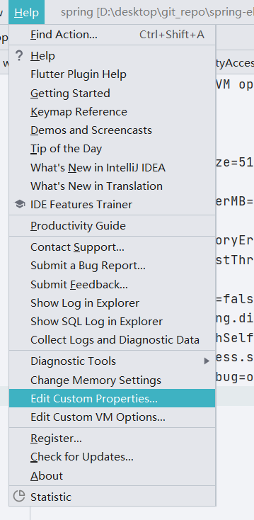

# 第一章 SpringMVC环境搭建

本章将介绍如何从零开始搭建一个SpringMVC环境。

本文及后续章节使用的Spring系列框架版本号均为5.2.3.release版本，JDK最低要求为JDK8。搭建环境有两种方式第一种方式是以源码方式进行搭建（在源码基础上进行搭建），第二种方式是以Jar的方式进行搭建，前者可以在源码上编写注释内容，后者不能进行源码编辑。


## 源码环境下搭建SpringMVC工程

首先对于源码环境下搭建SpringMVC工程进行介绍，第一步创建一个gradle工程，在SpringFramework源码工程目录顶层右键根据 <KBD>New</KBD> -> <KBD>Module</KBD>  进行点击，点击后弹出内容如图1.1所示


在出现图1.1后选择gradle并选择Java模块点击<KBD>Next</KBD>，弹出图1.2，在图1.2中填写Name、GroupId、ArtifactId三个属性，填写完成后点击<KBD>Finish</KBD>完成操作。


在点击Finish按钮后等待一定时间后会在项目目录中看到相关文件，详细内容如图


当工程初始化完毕后需要进行基本文件创建和修改，首先需要修改`build.gradle`文件，修改它的目的是将SpringMVC相关依赖加入到项目中，修改后的文件内容如下：

```groovy
plugins {
   id 'java'
   id 'war'
}

group 'org.springframework'
version '5.2.3.RELEASE'

repositories {
   mavenCentral()
}

dependencies {
   compile(project(":spring-context"))
   compile(project(":spring-core"))
    compile(project(":spring-web"))
    compile(project(":spring-webmvc"))
   compile group: 'javax.servlet.jsp.jstl', name: 'jstl-api', version: '1.2'
   testCompile group: 'junit', name: 'junit', version: '4.11'
   testImplementation 'org.junit.jupiter:junit-jupiter-api:5.6.0'
   testRuntimeOnly 'org.junit.jupiter:junit-jupiter-engine'
}

test {
   useJUnitPlatform()
}
```

完成`build.gradle`文件编写后编写SpringMVC相关的xml配置文件，文件名为`spring-mvc.xml`，具体代码如下：

```java
<?xml version="1.0" encoding="UTF-8"?>
<beans xmlns:xsi="http://www.w3.org/2001/XMLSchema-instance"
      xmlns:context="http://www.springframework.org/schema/context"
      xmlns:mvc="http://www.springframework.org/schema/mvc"
      xmlns="http://www.springframework.org/schema/beans"
      xsi:schemaLocation="http://www.springframework.org/schema/beans http://www.springframework.org/schema/beans/spring-beans.xsd http://www.springframework.org/schema/context https://www.springframework.org/schema/context/spring-context.xsd http://www.springframework.org/schema/mvc https://www.springframework.org/schema/mvc/spring-mvc.xsd">
   <context:component-scan base-package="com.source.hot"/>
   <mvc:default-servlet-handler/>
   <mvc:annotation-driven/>
   <bean id="jspViewResolver" class="org.springframework.web.servlet.view.InternalResourceViewResolver">
      <property name="viewClass" value="org.springframework.web.servlet.view.JstlView"/>
      <property name="prefix" value="/page/"/>
      <property name="suffix" value=".jsp"/>
   </bean>
</beans>
```

在完成SpringMVC配置文件编写后需要创建一些文件夹和文件，首先在main路径下创建webapp目录(文件夹)，

继续在webapp目录下创建page目录，向page目录下创建一个名为`hello.jsp`的文件，该文件具体内容如下：

```jsp
<%@ page contentType="text/html;charset=UTF-8" language="java" %>
<html>
<head>
    <title>Title</title>
</head>
<body>
<h3>hello-jsp</h3>

</body>
</html>
```

回到webapp目录下创建`index.jsp`文件，该文件具体内容如下：

```jsp
<%@ page contentType="text/html;charset=UTF-8" language="java" %>
<html>
  <head>
    <title>$Title$</title>
  </head>
  <body>
  $END$
  </body>
</html>
```

最后需要创建一个`web.xml`文件，该文件是webapp的核心，它被放置在webapp/WEB-INF目录下，具体内容如下：

```xml
<?xml version="1.0" encoding="UTF-8"?>
<web-app xmlns="http://xmlns.jcp.org/xml/ns/javaee"
       xmlns:xsi="http://www.w3.org/2001/XMLSchema-instance"
       xsi:schemaLocation="http://xmlns.jcp.org/xml/ns/javaee http://xmlns.jcp.org/xml/ns/javaee/web-app_4_0.xsd"
       version="4.0">


   <servlet>
      <servlet-name>sp</servlet-name>
      <servlet-class>org.springframework.web.servlet.DispatcherServlet</servlet-class>
      <init-param>
         <param-name>contextConfigLocation</param-name>
         <param-value>classpath:spring-mvc.xml</param-value>
      </init-param>
   </servlet>
   <servlet-mapping>
      <servlet-name>sp</servlet-name>
      <url-pattern>/</url-pattern>
   </servlet-mapping>
</web-app>
```

接下来编写一个Controller对象，类名为HelloController，具体代码如下：

```java
@Controller
public class HelloController {

   @GetMapping("/demo")
   public String demo() {
      return "hello";
   }
}
```

至此需要的基本代码都已经完成，接下来需要进行IDEA配置和tomcat下载，先来下载tomcat，进入tomcat官网选择tomcat下载即可，本书采用tomcat版本为9.0.37，下载后记住文件位置：`D:\download\apache-tomcat-9.0.37\apache-tomcat-9.0.37`，接下来对IDEA进行配置。

1. 项目配置，打开Project Structure找到Modules目录中的开发工程

   


2. 创建Artifacts，进入到Project Structure中的Artifacts选项点击加号选择Web Application:Exploded 选择From Modules，具体操作流程见下图

   

   根据前文所述点击Form Modules 后出现下图内容，选择spring.spring-source-mvc-demo.main点击ok

   

点击ok后会出现下图内容：


当Artifacts选项卡下出现`spring.spring-source-mvc-demo.main:war exploded`内容后点击ok完成创建

3. 编辑启动项，打开Run/Debug Configurations 新建tomcat service 具体创建内容如图所示：

   

   默认创建后出现下图内容：

   

   在这个图中需要进行tomcat配置，点击Configure

   

   在这个窗口中添加前文下载的tomcat，配置后内容如上。

   接下来选择deployment将Artifacts的内容加入

   

   点击Artifact后弹出下图内容

   

   在上图汇总选择最后一个点击ok完成新增操作。完成后配置如图所示
   

   将这个配置中的Application context 路径修改为 `/` ，修改完成后点击ok完成所有配置进行启动。访问`localhost:8080`即可看到`index.jsp`中的内容


## 环境搭建中的其他问题

### IDEA tomcat 输出乱码

根据前文进行配置后将其启动会在IDEA的控制台中输出下面内容：

```
15-Mar-2021 16:00:08.473 淇℃伅 [main] org.apache.coyote.AbstractProtocol.init 鍒濆鍖栧崗璁鐞嗗櫒 ["http-nio-8080"]
15-Mar-2021 16:00:08.524 淇℃伅 [main] org.apache.catalina.startup.Catalina.load 鏈嶅姟鍣ㄥ湪[550]姣鍐呭垵濮嬪寲
15-Mar-2021 16:00:08.554 淇℃伅 [main] org.apache.catalina.core.StandardService.startInternal 姝ｅ湪鍚姩鏈嶅姟[Catalina]
15-Mar-2021 16:00:08.555 淇℃伅 [main] org.apache.catalina.core.StandardEngine.startInternal 姝ｅ湪鍚姩 Servlet 寮曟搸锛歔Apache Tomcat/9.0.37]
15-Mar-2021 16:00:08.567 淇℃伅 [main] org.apache.coyote.AbstractProtocol.start 寮�濮嬪崗璁鐞嗗彞鏌刐"http-nio-8080"]
15-Mar-2021 16:00:08.577 淇℃伅 [main] org.apache.catalina.startup.Catalina.start [52]姣鍚庢湇鍔″櫒鍚姩
```

可以发现在控制台输出日志中是乱码，需要将其进行编码修改，点击Help下的Edit Custom VM Options，在最后添加`-Dfile.encoding=UTF-8` 代码得以修正




修正后在启动即可正常

```
15-Mar-2021 16:11:36.996 信息 [main] org.apache.coyote.AbstractProtocol.init 初始化协议处理器 ["http-nio-8080"]
15-Mar-2021 16:11:37.028 信息 [main] org.apache.catalina.startup.Catalina.load 服务器在[436]毫秒内初始化
15-Mar-2021 16:11:37.057 信息 [main] org.apache.catalina.core.StandardService.startInternal 正在启动服务[Catalina]
15-Mar-2021 16:11:37.057 信息 [main] org.apache.catalina.core.StandardEngine.startInternal 正在启动 Servlet 引擎：[Apache Tomcat/9.0.37]
15-Mar-2021 16:11:37.067 信息 [main] org.apache.coyote.AbstractProtocol.start 开始协议处理句柄["http-nio-8080"]
15-Mar-2021 16:11:37.078 信息 [main] org.apache.catalina.startup.Catalina.start [49]毫秒后服务器启动
```

