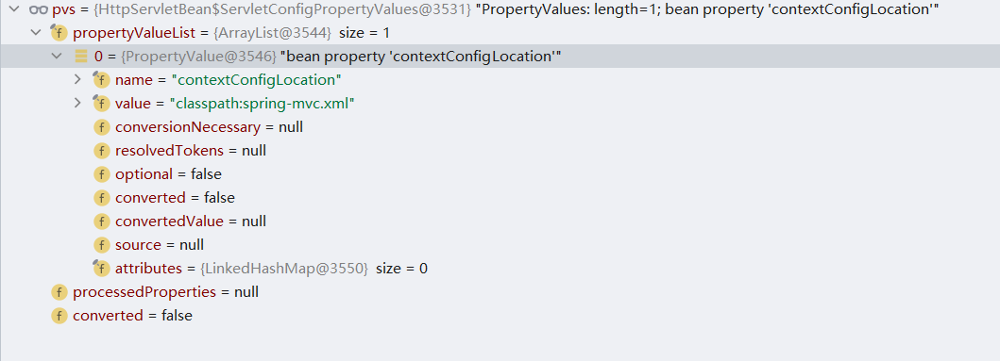
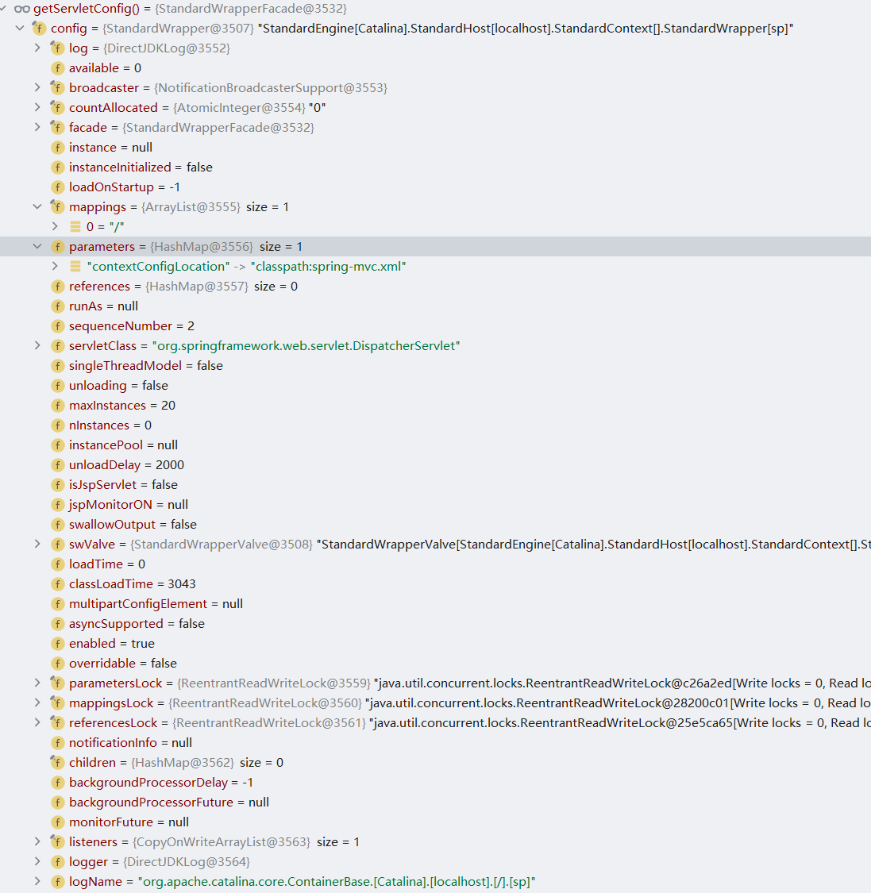
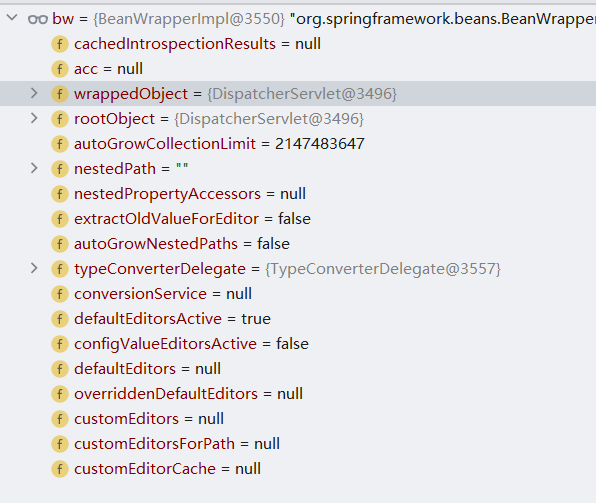
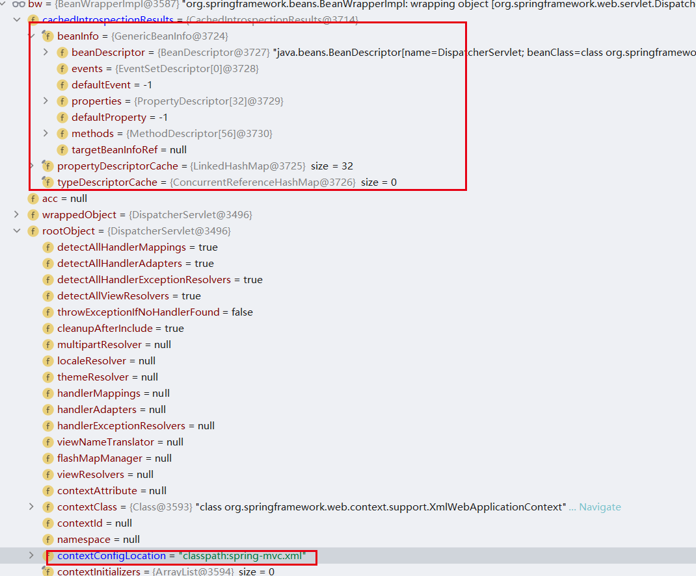
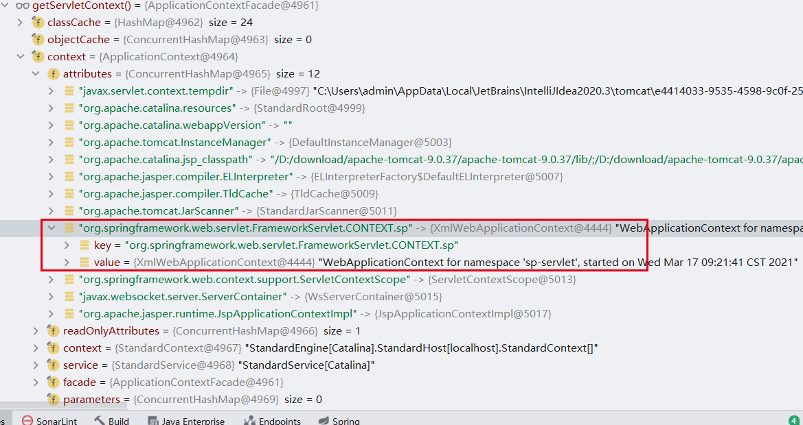
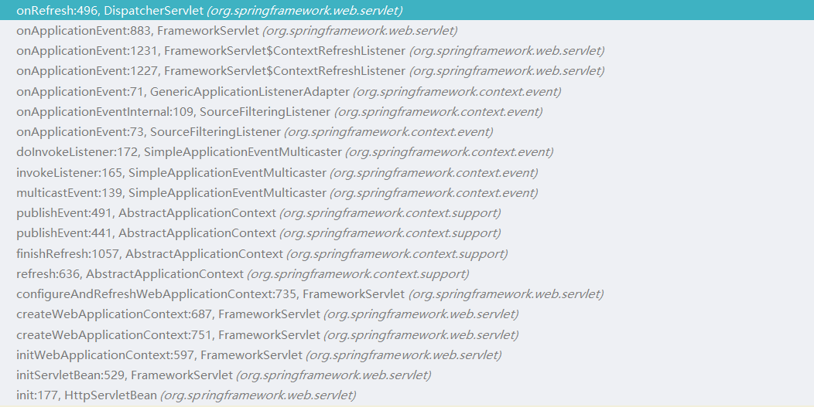

# 第二章 SpringMVC容器初始化
本章将介绍SpringMVC容器初始化的过程,对容器初始化中的一些细节进行分析.

## DispatcherServlet
首先打开`webapp/WEB-INF`目录下的`web.xml`文件，文件内容如下：

```xml
<?xml version="1.0" encoding="UTF-8"?>
<web-app xmlns="http://xmlns.jcp.org/xml/ns/javaee"
       xmlns:xsi="http://www.w3.org/2001/XMLSchema-instance"
       xsi:schemaLocation="http://xmlns.jcp.org/xml/ns/javaee http://xmlns.jcp.org/xml/ns/javaee/web-app_4_0.xsd"
       version="4.0">


   <servlet>
      <servlet-name>sp</servlet-name>
      <servlet-class>org.springframework.web.servlet.DispatcherServlet</servlet-class>
      <init-param>
         <param-name>contextConfigLocation</param-name>
         <param-value>classpath:spring-mvc.xml</param-value>
      </init-param>
   </servlet>
   <servlet-mapping>
      <servlet-name>sp</servlet-name>
      <url-pattern>/</url-pattern>
   </servlet-mapping>
</web-app>
```

在这个配置文件中需要重点关注`servlet` 标签中的`servlet-class`标签和`init-param`标签。在这两个标签中首先对`servlet-class`标签的内容进行分析，`org.springframework.web.servlet.DispatcherServlet` 对象在SpringMVC中很重要，先来看它的类图：


在DispatcherServlet的类图中可以发现它本质上是`Servlet`和`ServletConfig`对象，在看到Servlet对象后对于目标方法的分析也就明朗了，需要分析的目标方法是`Servlet#init`方法，在Spring中具体实现方法是`org.springframework.web.servlet.HttpServletBean#init`。

### DispatcherServlet 静态代码块分析

首先需要关注的是`DispatcherServlet` 对象本身。在`DispatcherServlet` 对象中首先需要关注的是静态代码块的内容，相关代码如下：

```java
static {
   // Load default strategy implementations from properties file.
   // This is currently strictly internal and not meant to be customized
   // by application developers.
   try {
      // 读取 DispatcherServlet.properties 文件
      ClassPathResource resource = new ClassPathResource(DEFAULT_STRATEGIES_PATH, DispatcherServlet.class);
      defaultStrategies = PropertiesLoaderUtils.loadProperties(resource);
   }
   catch (IOException ex) {
      throw new IllegalStateException("Could not load '" + DEFAULT_STRATEGIES_PATH + "': " + ex.getMessage());
   }
}
```

在这段代码中会加载资源文件，资源文件名为`DispatcherServlet.properties`，真实路径为`spring-webmvc/src/main/resources/org/springframework/web/servlet/DispatcherServlet.properties`，文件内容如下：

```properties
# Default implementation classes for DispatcherServlet's strategy interfaces.
# Used as fallback when no matching beans are found in the DispatcherServlet context.
# Not meant to be customized by application developers.

org.springframework.web.servlet.LocaleResolver=org.springframework.web.servlet.i18n.AcceptHeaderLocaleResolver

org.springframework.web.servlet.ThemeResolver=org.springframework.web.servlet.theme.FixedThemeResolver

org.springframework.web.servlet.HandlerMapping=org.springframework.web.servlet.handler.BeanNameUrlHandlerMapping,\
	org.springframework.web.servlet.mvc.method.annotation.RequestMappingHandlerMapping,\
	org.springframework.web.servlet.function.support.RouterFunctionMapping

org.springframework.web.servlet.HandlerAdapter=org.springframework.web.servlet.mvc.HttpRequestHandlerAdapter,\
	org.springframework.web.servlet.mvc.SimpleControllerHandlerAdapter,\
	org.springframework.web.servlet.mvc.method.annotation.RequestMappingHandlerAdapter,\
	org.springframework.web.servlet.function.support.HandlerFunctionAdapter


org.springframework.web.servlet.HandlerExceptionResolver=org.springframework.web.servlet.mvc.method.annotation.ExceptionHandlerExceptionResolver,\
	org.springframework.web.servlet.mvc.annotation.ResponseStatusExceptionResolver,\
	org.springframework.web.servlet.mvc.support.DefaultHandlerExceptionResolver

org.springframework.web.servlet.RequestToViewNameTranslator=org.springframework.web.servlet.view.DefaultRequestToViewNameTranslator

org.springframework.web.servlet.ViewResolver=org.springframework.web.servlet.view.InternalResourceViewResolver

org.springframework.web.servlet.FlashMapManager=org.springframework.web.servlet.support.SessionFlashMapManager
```

在`DispatcherServlet.properties`文件中的内容会在容器初始化时进行实例化对象。


### DispatcherServle 构造函数分析

在DispatcherServle对象的静态代码块执行完成后会进入构造函数，构造函数代码如下：

```java
public DispatcherServlet() {
   super();
   setDispatchOptionsRequest(true);
}
```

在这个构造函数中会调用父类构造并设置`dispatchTraceRequest`属性为true，属性`dispatchTraceRequest`表示是否需要将HTTP TRACE请求发送到`doService`方法。默认不发送，经过设置后会发送到`doService`方法中，关于`dispatchTraceRequest`变量的定义如下：

```java
/** Should we dispatch an HTTP TRACE request to {@link #doService}?. */
private boolean dispatchTraceRequest = false;
```


## HttpServletBean 中 init 方法分析

在Servlet容器启动中（本文以Tomcat作为Servlet容器进行启动）都会进行Servlet对象的创建，在Servlet中会执行`javax.servlet.GenericServlet#init()`方法从而得到具体的一个Servlet对象，在Spring中实现了该方法的类是`org.springframework.web.servlet.HttpServletBean`，具体处理方法如下：

```java
@Override
public final void init() throws ServletException {

    // Set bean properties from init parameters.
    // 获取 web.xml 中的配置
    PropertyValues pvs = new ServletConfigPropertyValues(getServletConfig(), this.requiredProperties);
    if (!pvs.isEmpty()) {
        try {
            // 将 HttpServletBean 创建
            BeanWrapper bw = PropertyAccessorFactory.forBeanPropertyAccess(this);
            // 资源加载器创建,核心对象是 ServletContext
            ResourceLoader resourceLoader = new ServletContextResourceLoader(getServletContext());
            // 注册自定义编辑器
            bw.registerCustomEditor(Resource.class, new ResourceEditor(resourceLoader, getEnvironment()));
            // 实例化 BeanWrapper
            initBeanWrapper(bw);
            // BeanWrapper 设置属性
            bw.setPropertyValues(pvs, true);
        }
        catch (BeansException ex) {
            if (logger.isErrorEnabled()) {
                logger.error("Failed to set bean properties on servlet '" + getServletName() + "'", ex);
            }
            throw ex;
        }
    }

    // Let subclasses do whatever initialization they like.
    // 实例化 ServletBean
    initServletBean();
}
```


在这个`init`方法中主要处理细节如下：

事项一：读取`web.xml`中的配置信息，具体方法是`getServletConfig()` ，提取后创建`ServletConfigPropertyValues` 对象，pvs对象如图所示：



从上图可以发现在这个读取结果中仅仅将init-param数据进行了提取，具体对应web.xml内容中的这部分代码：

```xml
<init-param>
   <param-name>contextConfigLocation</param-name>
   <param-value>classpath:spring-mvc.xml</param-value>
</init-param>
```

通过`getServletConfig()`得到的数据如图所示：



在上图中可以发现`web.xml`中的配置信息都被加载，具体对应关系如下：

| 标签            | `org.apache.catalina.core.StandardWrapper`中属性 |
| --------------- | ------------------------------------------------ |
| servlet-class   | servletClass                                     |
| servlet-name    | name                                             |
| init-param      | parameters                                       |
| servlet-mapping | mappings                                         |


事项二：创建`HttpServletBean` 对应的`BeanWrapper`对象

在创建BeanWrapper对象时使用的方法是`org.springframework.beans.PropertyAccessorFactory#forBeanPropertyAccess`底层是一个简单的BeanWrapperImpl对象的创建，具体代码如下：

```java
public static BeanWrapper forBeanPropertyAccess(Object target) {
   return new BeanWrapperImpl(target);
}
```

创建后的对象信息如图所示：




事项三：创建资源加载器对象，通过ServletContext创建资源加载器对象。

事项四：注册自定义编辑器，注册`Resource`对象对应的编辑器，具体类型是`ResourceEditor`

事项五：实例化`BeanWrapper`，在`HttpServletBean`类中目前该方法是一个空方法暂无具体处理。

事项六：BeanWrapper 设置属性，在设置属性时会设置`org.springframework.beans.BeanWrapperImpl#cachedIntrospectionResults`和`org.springframework.web.servlet.FrameworkServlet#contextConfigLocation`属性，设置后数据如下：



事项七：实例化 ServletBean，在`HttpServletBean`中这个方法属于抽象方法，交给子类实现，具体实现方法是`org.springframework.web.servlet.FrameworkServlet#initServletBean`


## FrameworkServlet 中 initServletBean 方法分析

加下来将对`org.springframework.web.servlet.FrameworkServlet#initServletBean`方法进行分析，需要分析的代码如下：

```java
@Override
protected final void initServletBean() throws ServletException {
   getServletContext().log("Initializing Spring " + getClass().getSimpleName() + " '" + getServletName() + "'");
   if (logger.isInfoEnabled()) {
      logger.info("Initializing Servlet '" + getServletName() + "'");
   }
   long startTime = System.currentTimeMillis();

   try {
      // 初始化WEB应用上下文
      this.webApplicationContext = initWebApplicationContext();
      // 初始化 FrameworkServlet 对象,暂时为空方法
      initFrameworkServlet();
   }
   catch (ServletException | RuntimeException ex) {
      logger.error("Context initialization failed", ex);
      throw ex;
   }

   if (logger.isDebugEnabled()) {
      String value = this.enableLoggingRequestDetails ?
            "shown which may lead to unsafe logging of potentially sensitive data" :
            "masked to prevent unsafe logging of potentially sensitive data";
      logger.debug("enableLoggingRequestDetails='" + this.enableLoggingRequestDetails +
            "': request parameters and headers will be " + value);
   }

   if (logger.isInfoEnabled()) {
      logger.info("Completed initialization in " + (System.currentTimeMillis() - startTime) + " ms");
   }
}
```


在这段代码中有两个关键操作：

操作一：初始化WEB应用上下文，将`WebApplicationContext`对象创建

操作二：初始化FrameworkServlet对象，目前负责的方法是`initFrameworkServlet`还没有填充实现逻辑，是一个空方法

在这两个操作中需要重点关注操作一所对应的处理方法`initWebApplicationContext`，具体处理代码如下：

```java
protected WebApplicationContext initWebApplicationContext() {
   // 获取WEB应用上下文
   WebApplicationContext rootContext =
         WebApplicationContextUtils.getWebApplicationContext(getServletContext());
   WebApplicationContext wac = null;

   if (this.webApplicationContext != null) {
      wac = this.webApplicationContext;
      // 类型如果是ConfigurableWebApplicationContext
      if (wac instanceof ConfigurableWebApplicationContext) {
         ConfigurableWebApplicationContext cwac = (ConfigurableWebApplicationContext) wac;
         if (!cwac.isActive()) {
            if (cwac.getParent() == null) {
               // 设置父上下文
               cwac.setParent(rootContext);
            }
            // 配置并刷新应用上下文
            configureAndRefreshWebApplicationContext(cwac);
         }
      }
   }
   if (wac == null) {
      // 寻找一个WEB应用上下文
      wac = findWebApplicationContext();
   }
   if (wac == null) {
      // 创建WEB应用上下文
      wac = createWebApplicationContext(rootContext);
   }

   if (!this.refreshEventReceived) {
      synchronized (this.onRefreshMonitor) {
         // 刷新应用上下文
         onRefresh(wac);
      }
   }

   // 是否需要推送上下文
   if (this.publishContext) {
      String attrName = getServletContextAttributeName();
      getServletContext().setAttribute(attrName, wac);
   }

   return wac;
}
```


在`initWebApplicationContext`方法中主要目的是为了创建`WebApplicationContext`对象，该对象的创建有如下操作：

操作一：如果`webApplicationContext`对象不为空并且类型是`ConfigurableWebApplicationContext`，如果不处于激活状态进行父上下文设置、应用配置和刷新WEB应用上下文

操作二：通过操作一没有获取到WEB应用上下文，进行`findWebApplicationContext`方法调用进一步搜索WEB应用上下文

操作三：通过操作二没有获取到WEB应用上下文，则主动创建一个全新的WEB应用上下文，处理地方法是`createWebApplicationContext`

操作四：刷新WEB应用上下文

操作五：设置属性，

在上述五个操作中前四个操作都有对应的处理方法在下文会着重分析，操作五没有独立的方法，它是两个方法的调用，具体调用方法如下：

```java
String attrName = getServletContextAttributeName();
getServletContext().setAttribute(attrName, wac);
```

在这段代码中主要做的事项为提取属性和设置属性，提取属性是字符串组合，组合方式如下：

`FrameworkServlet.class.getName() + ".CONTEXT."` + `servletName` 其中ServletName为`web.xml`中的`servlet-name`标签数据，

设置完成属性后ServletContext信息如下




### FrameworkServlet#configureAndRefreshWebApplicationContext 方法分析

接下来将对`configureAndRefreshWebApplicationContext`方法进行分析，该方法的作用是配置WEB应用上下文和刷新WEB应用上下文，处理代码如下：

```java
// org.springframework.web.servlet.FrameworkServlet#configureAndRefreshWebApplicationContext
protected void configureAndRefreshWebApplicationContext(ConfigurableWebApplicationContext wac) {
   // 判断id是否相同如果相同则进行id设置
   if (ObjectUtils.identityToString(wac).equals(wac.getId())) {
      // 如果当前id不为空则设置这个id给web应用上下文
      if (this.contextId != null) {
         wac.setId(this.contextId);
      }
      else {
         wac.setId(ConfigurableWebApplicationContext.APPLICATION_CONTEXT_ID_PREFIX +
               ObjectUtils.getDisplayString(getServletContext().getContextPath()) + '/' + getServletName());
      }
   }
   // 设置 ServletContext
   wac.setServletContext(getServletContext());
   // 设置 ServletConfig
   wac.setServletConfig(getServletConfig());
   // 设置命名空间
   wac.setNamespace(getNamespace());
   // 添加应用监听器
   wac.addApplicationListener(new SourceFilteringListener(wac, new ContextRefreshListener()));


   // 获取环境配置并初始化属性资源
   ConfigurableEnvironment env = wac.getEnvironment();
   if (env instanceof ConfigurableWebEnvironment) {
      ((ConfigurableWebEnvironment) env).initPropertySources(getServletContext(), getServletConfig());
   }

   // web应用上下文的后置处理
   postProcessWebApplicationContext(wac);
   // 实例化
   applyInitializers(wac);
   // 执行刷新操作
   wac.refresh();
}
```

在`configureAndRefreshWebApplicationContext`方法中主要操作步骤如下：

操作一：判断是否需要进行id设置，判断依据是当前参数`wac`生成的唯一标识和当前参数`wac`的id属性是否相同，如果相同会进行id重写，重写有两种方式，第一种方式需要依赖contextId属性，如果这个属性存在将其作为`wac`的id属性，第二种方式则是生成默认的id，具体生成规则如下：

```java
ConfigurableWebApplicationContext.APPLICATION_CONTEXT_ID_PREFIX +
      ObjectUtils.getDisplayString(getServletContext().getContextPath()) + '/' + getServletName()
```

操作二：设置 ServletContext 对象和设置 ServletConfig 对象

操作三：设置命名空间，关于命名空间的获取代码如下：

```java
public String getNamespace() {
   return (this.namespace != null ? this.namespace : getServletName() + DEFAULT_NAMESPACE_SUFFIX);
}
```

操作四：添加应用监听器。

操作五：初始获取环境配置并进行配置初始化，在SpringMVC中负责这个行为处理的类是`StandardServletEnvironment`，具体处理方法如下：

```java
@Override
public void initPropertySources(@Nullable ServletContext servletContext, @Nullable ServletConfig servletConfig) {
   WebApplicationContextUtils.initServletPropertySources(getPropertySources(), servletContext, servletConfig);
}


public static void initServletPropertySources(MutablePropertySources sources,
			@Nullable ServletContext servletContext, @Nullable ServletConfig servletConfig) {

		Assert.notNull(sources, "'propertySources' must not be null");
		String name = StandardServletEnvironment.SERVLET_CONTEXT_PROPERTY_SOURCE_NAME;
		if (servletContext != null && sources.contains(name) && sources.get(name) instanceof StubPropertySource) {
			// 把 name 替换成最终数据对象
			sources.replace(name, new ServletContextPropertySource(name, servletContext));
		}
		name = StandardServletEnvironment.SERVLET_CONFIG_PROPERTY_SOURCE_NAME;
		if (servletConfig != null && sources.contains(name) && sources.get(name) instanceof StubPropertySource) {
			// 把 name 替换成最终数据对象
			sources.replace(name, new ServletConfigPropertySource(name, servletConfig));
		}
	}
```

在这段代码中最重要的处理操作就是通过`name`属性替换对应的属性值，属性值会从`ServletContext`和`ServletConfig`中进行获取


操作六：web应用上下文的后置处理，具体处理方法是`postProcessWebApplicationContext` 目前是一个空方法。

操作七：实例化web应用上下文，具体处理方法是`applyInitializers`，具体代码如下：

```java
protected void applyInitializers(ConfigurableApplicationContext wac) {
   // 获取初始化参数
   // 提取 globalInitializerClasses 参数
   String globalClassNames = getServletContext().getInitParameter(ContextLoader.GLOBAL_INITIALIZER_CLASSES_PARAM);
   if (globalClassNames != null) {
      // 循环加载类 从类名转换到ApplicationContextInitializer对象
      for (String className : StringUtils.tokenizeToStringArray(globalClassNames, INIT_PARAM_DELIMITERS)) {
         this.contextInitializers.add(loadInitializer(className, wac));
      }
   }

   // 如果当前contextInitializerClasses字符串存在则进行实例化
   if (this.contextInitializerClasses != null) {
      for (String className : StringUtils.tokenizeToStringArray(this.contextInitializerClasses, INIT_PARAM_DELIMITERS)) {
         this.contextInitializers.add(loadInitializer(className, wac));
      }
   }

   // 对 ApplicationContextInitializer 进行排序
   AnnotationAwareOrderComparator.sort(this.contextInitializers);
   // 循环调用 ApplicationContextInitializer
   for (ApplicationContextInitializer<ConfigurableApplicationContext> initializer : this.contextInitializers) {
      initializer.initialize(wac);
   }
}
```

在这个方法中第一步会获取`globalInitializerClasses`数据，在得到这个数据后会进行反射创建对象具体处理方法是`loadInitializer`，当创建完成后会将其放入到`contextInitializers`容器中，第二步会获取`contextInitializerClasses`数据，在得到这个数据后会将其进行反射创建放入到`contextInitializers`容器，完成`globalInitializerClasses`数据和`contextInitializerClasses`数据处理后会进行排序操作，在排序操作完成之后会进行循环调度每个`ApplicationContextInitializer`方法。


操作八：刷新web应用上下文，刷新上限文的核心代码是由`AbstractApplicationContext`类进行提供，具体处理操作属于SpringIoC的操作内容本文不做分析。

### FrameworkServlet#findWebApplicationContext 方法分析

接下来将对`findWebApplicationContext` 方法进行分析，该方法的主要目的是寻找

```
@Nullable
protected WebApplicationContext findWebApplicationContext() {
   // 获取属性名称
   String attrName = getContextAttribute();
   if (attrName == null) {
      return null;
   }
   // servletContext 中寻找 attrName 的 webApplicationContext
   WebApplicationContext wac =
         WebApplicationContextUtils.getWebApplicationContext(getServletContext(), attrName);
   if (wac == null) {
      throw new IllegalStateException("No WebApplicationContext found: initializer not registered?");
   }
   return wac;
}
```

在`findWebApplicationContext`方法中关于web应用上下文的获取会从ServletContext中获取，如果获取结果为空抛出异常。


### FrameworkServlet#createWebApplicationContext 方法分析

接下来对`createWebApplicationContext`方法进行分析，该方法能够创建`WebApplicationContext`对象，参数是父上下文，具体代码如下：

```java
protected WebApplicationContext createWebApplicationContext(@Nullable WebApplicationContext parent) {
   return createWebApplicationContext((ApplicationContext) parent);
}

protected WebApplicationContext createWebApplicationContext(@Nullable ApplicationContext parent) {
    // 获取上下文类
    Class<?> contextClass = getContextClass();
    // 如果类型不是ConfigurableWebApplicationContext会抛出异常
    if (!ConfigurableWebApplicationContext.class.isAssignableFrom(contextClass)) {
        throw new ApplicationContextException(
            "Fatal initialization error in servlet with name '" + getServletName() +
            "': custom WebApplicationContext class [" + contextClass.getName() +
            "] is not of type ConfigurableWebApplicationContext");
    }
    // 反射创建web应用上下文
    ConfigurableWebApplicationContext wac =
        (ConfigurableWebApplicationContext) BeanUtils.instantiateClass(contextClass);

    // 设置环境变量
    wac.setEnvironment(getEnvironment());
    // 设置父上下文
    wac.setParent(parent);
    // 获取配置文件
    String configLocation = getContextConfigLocation();
    if (configLocation != null) {
        wac.setConfigLocation(configLocation);
    }
    // 配置并刷新应用上下文
    configureAndRefreshWebApplicationContext(wac);

    return wac;
}
```

在`createWebApplicationContext`方法中主要执行三个操作

操作一：获取上下文类，反射创建对象。上下文类默认是`XmlWebApplicationContext`

操作二：设置上下文属性。

操作三：配置并刷新应用上下文。


### FrameworkServlet#onRefresh 方法分析

在`FrameworkServlet`类中的`onRefresh `方法是一个抽象方法，具体代码如下：

```java
protected void  onRefresh(ApplicationContext context) {
   // For subclasses: do nothing by default.
}
```

该方法的最终实现会由`org.springframework.web.servlet.DispatcherServlet#onRefresh`进行处理


## SpringMVC常规启动环境搭建

在第一章中编写了一个SpringMVC的测试项目，本节将在这个基础上进行修改，将一些SpringMVC在启动时可以配置的内容进行配置，主要配置项为`contextConfigLocation`、`globalInitializerClasses`、`contextInitializerClasses`和`listener-class`，接下来将对这些内容进行环境搭建。第一步需要创建`applicationContext.xml`文件，该文件应该放在`"/WEB-INF/applicationContext.xml"`中，在这个文件中具体的编写内容是SpringXML配置内容，本例的代码内容如下：

```xml
<?xml version="1.0" encoding="UTF-8"?>
<beans xmlns:xsi="http://www.w3.org/2001/XMLSchema-instance"
      xmlns:context="http://www.springframework.org/schema/context"
      xmlns:mvc="http://www.springframework.org/schema/mvc"
      xmlns="http://www.springframework.org/schema/beans"
      xsi:schemaLocation="http://www.springframework.org/schema/beans http://www.springframework.org/schema/beans/spring-beans.xsd http://www.springframework.org/schema/context https://www.springframework.org/schema/context/spring-context.xsd http://www.springframework.org/schema/mvc https://www.springframework.org/schema/mvc/spring-mvc.xsd">
   <context:component-scan base-package="com.source.hot"/>
   <mvc:default-servlet-handler/>
   <mvc:annotation-driven/>
   <bean id="jspViewResolver" class="org.springframework.web.servlet.view.InternalResourceViewResolver">
      <property name="viewClass" value="org.springframework.web.servlet.view.JstlView"/>
      <property name="prefix" value="/page/"/>
      <property name="suffix" value=".jsp"/>
   </bean>
</beans>
```

完成`applicationContext.xml`内容编写后需要编写`ApplicationContextInitializer`接口的两个实现类，第一个实现类是`GlobalApplicationContextInitializer`，代码内容如下：

```
import org.springframework.context.ApplicationContextInitializer;
import org.springframework.web.context.support.XmlWebApplicationContext;

public class GlobalApplicationContextInitializer implements
		ApplicationContextInitializer<XmlWebApplicationContext> {

	public void initialize(XmlWebApplicationContext applicationContext) {
		System.out.println("com.source.hot.mvc.applicationContextInitializer.GlobalApplicationContextInitializer.initialize");
	}

}
```

第二个实现类是`ContextApplicationContextInitializer`，代码内容如下：

```java
import org.springframework.context.ApplicationContextInitializer;
import org.springframework.web.context.support.XmlWebApplicationContext;

public class ContextApplicationContextInitializer implements
      ApplicationContextInitializer<XmlWebApplicationContext> {

   public void initialize(XmlWebApplicationContext applicationContext) {
      System.out.println("com.source.hot.mvc.applicationContextInitializer.ContextApplicationContextInitializer.initialize");
   }

}
```

完成`ApplicationContextInitializer`实现类的编写后需要编写`web.xml`文件，具体内容如下：

```xml
<?xml version="1.0" encoding="UTF-8"?>
<web-app xmlns="http://xmlns.jcp.org/xml/ns/javaee"
       xmlns:xsi="http://www.w3.org/2001/XMLSchema-instance"
       xsi:schemaLocation="http://xmlns.jcp.org/xml/ns/javaee http://xmlns.jcp.org/xml/ns/javaee/web-app_4_0.xsd"
       version="4.0">


   <servlet>
      <servlet-name>sp</servlet-name>
      <servlet-class>org.springframework.web.servlet.DispatcherServlet</servlet-class>
      <init-param>
         <param-name>contextConfigLocation</param-name>
         <param-value>/WEB-INF/applicationContext.xml</param-value>
      </init-param>
   </servlet>
   <context-param>
      <param-name>globalInitializerClasses</param-name>
      <param-value>com.source.hot.mvc.applicationContextInitializer.GlobalApplicationContextInitializer</param-value>
   </context-param>
   <context-param>
      <param-name>contextInitializerClasses</param-name>
      <param-value>com.source.hot.mvc.applicationContextInitializer.ContextApplicationContextInitializer</param-value>
   </context-param>
   <listener>
      <listener-class>org.springframework.web.context.ContextLoaderListener</listener-class>
   </listener>
   <servlet-mapping>
      <servlet-name>sp</servlet-name>
      <url-pattern>/</url-pattern>
   </servlet-mapping>
</web-app>
```


接下来将对上述配置环境下的启动流程进行分析。


## ContextLoaderListener 分析

接下来将对`ContextLoaderListener`进行分析，第一步需要查看它的类图，类图信息如下：


在这个类图中需要重点关注`ServletContextListener`接口，它是servlet项目的核心。查看`ServletContextListener`的代码，具体内容如下：

```
public interface ServletContextListener extends EventListener {
	// 初始化时执行
    public void contextInitialized(ServletContextEvent sce);
	// 摧毁时执行
    public void contextDestroyed(ServletContextEvent sce);
}
```

在`ServletContextListener`接口中定义了两个方法，一个方法是初始化阶段执行，另一个方法是在摧毁阶段执行，本文分析的是启动时的操作对应的处理方法是`contextInitialized`，具体实现代码如下：

```java
// org.springframework.web.context.ContextLoaderListener#contextInitialized
@Override
public void contextInitialized(ServletContextEvent event) {
   initWebApplicationContext(event.getServletContext());
}
```

在`contextInitialized`方法中会进行web应用上下文初始化，具体处理方法如下：

```java
// org.springframework.web.context.ContextLoader#initWebApplicationContext
public WebApplicationContext initWebApplicationContext(ServletContext servletContext) {
   if (servletContext.getAttribute(WebApplicationContext.ROOT_WEB_APPLICATION_CONTEXT_ATTRIBUTE) != null) {
      throw new IllegalStateException(
            "Cannot initialize context because there is already a root application context present - " +
                  "check whether you have multiple ContextLoader* definitions in your web.xml!");
   }

   servletContext.log("Initializing Spring root WebApplicationContext");
   Log logger = LogFactory.getLog(ContextLoader.class);
   if (logger.isInfoEnabled()) {
      logger.info("Root WebApplicationContext: initialization started");
   }
   // 启动时间
   long startTime = System.currentTimeMillis();

   try {
      // Store context in local instance variable, to guarantee that
      // it is available on ServletContext shutdown.
      if (this.context == null) {
         // 创建应用上下文
         this.context = createWebApplicationContext(servletContext);
      }
      if (this.context instanceof ConfigurableWebApplicationContext) {
         ConfigurableWebApplicationContext cwac = (ConfigurableWebApplicationContext) this.context;
         if (!cwac.isActive()) {
            // The context has not yet been refreshed -> provide services such as
            // setting the parent context, setting the application context id, etc
            if (cwac.getParent() == null) {
               // The context instance was injected without an explicit parent ->
               // determine parent for root web application context, if any.
               ApplicationContext parent = loadParentContext(servletContext);
               cwac.setParent(parent);
            }
            // 配置并刷新应用上下文
            configureAndRefreshWebApplicationContext(cwac, servletContext);
         }
      }
      // servletContext设置属性
      servletContext.setAttribute(WebApplicationContext.ROOT_WEB_APPLICATION_CONTEXT_ATTRIBUTE, this.context);

      // 获取类加载器
      ClassLoader ccl = Thread.currentThread().getContextClassLoader();
      if (ccl == ContextLoader.class.getClassLoader()) {
         currentContext = this.context;
      }
      else if (ccl != null) {
         currentContextPerThread.put(ccl, this.context);
      }

      if (logger.isInfoEnabled()) {
         long elapsedTime = System.currentTimeMillis() - startTime;
         logger.info("Root WebApplicationContext initialized in " + elapsedTime + " ms");
      }

      return this.context;
   }
   catch (RuntimeException | Error ex) {
      logger.error("Context initialization failed", ex);
      servletContext.setAttribute(WebApplicationContext.ROOT_WEB_APPLICATION_CONTEXT_ATTRIBUTE, ex);
      throw ex;
   }
}
```

在`initWebApplicationContext`方法中主要操作如下：

操作一：创建应用上下文，执行方法为`createWebApplicationContext` ，该方法的底层是反射创建对象，具体处理代码如下：

```java
protected WebApplicationContext createWebApplicationContext(ServletContext sc) {
   // 类型推论
   Class<?> contextClass = determineContextClass(sc);
   if (!ConfigurableWebApplicationContext.class.isAssignableFrom(contextClass)) {
      throw new ApplicationContextException("Custom context class [" + contextClass.getName() +
            "] is not of type [" + ConfigurableWebApplicationContext.class.getName() + "]");
   }
   return (ConfigurableWebApplicationContext) BeanUtils.instantiateClass(contextClass);
}
```

在这段代码中需要关注`determineContextClass`方法，该方法用来推论当前web应用上下文的类型，具体处理方法如下：

```java
protected Class<?> determineContextClass(ServletContext servletContext) {

   // 获取web.xml中的contextClass数据信息
   String contextClassName = servletContext.getInitParameter(CONTEXT_CLASS_PARAM);
   if (contextClassName != null) {
      try {
         // 提取类数据
         return ClassUtils.forName(contextClassName, ClassUtils.getDefaultClassLoader());
      }
      catch (ClassNotFoundException ex) {
         throw new ApplicationContextException(
               "Failed to load custom context class [" + contextClassName + "]", ex);
      }
   }
   else {
      // 从默认数据集中获取属性
      contextClassName = defaultStrategies.getProperty(WebApplicationContext.class.getName());
      try {
         return ClassUtils.forName(contextClassName, ContextLoader.class.getClassLoader());
      }
      catch (ClassNotFoundException ex) {
         throw new ApplicationContextException(
               "Failed to load default context class [" + contextClassName + "]", ex);
      }
   }
}
```

在`determineContextClass`方法中可以确认类型推论有两个策略：

策略一：从`web.xml`文件中提取`contextClass`数据，通过`ClassUtils#forName`转换成`Class`对象

策略二：从`defaultStrategies` 数据对象中进行获取，该对象是Map结构，数据内容位于`spring-web/src/main/resources/org/springframework/web/context/ContextLoader.properties`，具体内容如下：

```properties
# Default WebApplicationContext implementation class for ContextLoader.
# Used as fallback when no explicit context implementation has been specified as context-param.
# Not meant to be customized by application developers.

org.springframework.web.context.WebApplicationContext=org.springframework.web.context.support.XmlWebApplicationContext
```

策略二：


操作二：配置并刷新应用上下文，执行方法为`configureAndRefreshWebApplicationContext`，具体处理代码如下：

```java
// org.springframework.web.context.ContextLoader#configureAndRefreshWebApplicationContext
protected void configureAndRefreshWebApplicationContext(ConfigurableWebApplicationContext wac, ServletContext sc) {
   // 判断id是否相同如果相同则进行id设置
   if (ObjectUtils.identityToString(wac).equals(wac.getId())) {
      // The application context id is still set to its original default value
      // -> assign a more useful id based on available information
      // 获取 web.xml 中contextId属性
      String idParam = sc.getInitParameter(CONTEXT_ID_PARAM);
      if (idParam != null) {
         wac.setId(idParam);
      }
      else {
         // Generate default id...
         // 默认的生成策略设置id
         wac.setId(ConfigurableWebApplicationContext.APPLICATION_CONTEXT_ID_PREFIX +
               ObjectUtils.getDisplayString(sc.getContextPath()));
      }
   }

   // 设置 ServletContext
   wac.setServletContext(sc);
   // 获取 contextConfigLocation 数据信息
   String configLocationParam = sc.getInitParameter(CONFIG_LOCATION_PARAM);
   if (configLocationParam != null) {
      // 设置 contextConfigLocation 属性
      wac.setConfigLocation(configLocationParam);
   }

   // The wac environment's #initPropertySources will be called in any case when the context
   // is refreshed; do it eagerly here to ensure servlet property sources are in place for
   // use in any post-processing or initialization that occurs below prior to #refresh
   // 获取环境配置并初始化属性资源
   ConfigurableEnvironment env = wac.getEnvironment();
   if (env instanceof ConfigurableWebEnvironment) {
      ((ConfigurableWebEnvironment) env).initPropertySources(sc, null);
   }

   // 自定义上下文处理
   customizeContext(sc, wac);
   wac.refresh();
}
```

在`configureAndRefreshWebApplicationContext`方法的处理中有如下几个操作

1. 判断id是否相同如果相同则进行id设置,id数据来源有两个，第一个是从`web.xml`中的`contextId`数据获取，第二个是采用默认生成策略进行生成，具体生成策略如下：

   ```java
   ConfigurableWebApplicationContext.APPLICATION_CONTEXT_ID_PREFIX +
         ObjectUtils.getDisplayString(sc.getContextPath())
   ```

2. 设置ServletContext

3. 获取`contextConfigLocation`数据并设置给web应用上下文

4. 获取环境配置并初始化属性资源

5. 自定义上下文处理

在这里需要关注自定义上下文处理，具体处理代码如下：

```java
// org.springframework.web.context.ContextLoader#customizeContext
protected void customizeContext(ServletContext sc, ConfigurableWebApplicationContext wac) {
		// 提取 ApplicationContextInitializer 类列表
		List<Class<ApplicationContextInitializer<ConfigurableApplicationContext>>> initializerClasses =
				determineContextInitializerClasses(sc);

		// 循环 ApplicationContextInitializer 类列表进行对象创建
		for (Class<ApplicationContextInitializer<ConfigurableApplicationContext>> initializerClass : initializerClasses) {
			Class<?> initializerContextClass =
					GenericTypeResolver.resolveTypeArgument(initializerClass, ApplicationContextInitializer.class);
			if (initializerContextClass != null && !initializerContextClass.isInstance(wac)) {
				throw new ApplicationContextException(String.format(
						"Could not apply context initializer [%s] since its generic parameter [%s] " +
								"is not assignable from the type of application context used by this " +
								"context loader: [%s]", initializerClass.getName(), initializerContextClass.getName(),
						wac.getClass().getName()));
			}
			this.contextInitializers.add(BeanUtils.instantiateClass(initializerClass));
		}

		// 排序
		AnnotationAwareOrderComparator.sort(this.contextInitializers);
		// 进行 ApplicationContextInitializer 方法调用
		for (ApplicationContextInitializer<ConfigurableApplicationContext> initializer : this.contextInitializers) {
			initializer.initialize(wac);
		}
	}
```

在`customizeContext`方法中的处理逻辑如下：

步骤一：获取类型是`ApplicationContextInitializer`的类对象

步骤二：将步骤一中获取的数据进行实例化放入到`contextInitializers`容器中

步骤三：`contextInitializers`进行排序

步骤四：调用`contextInitializers`中`ApplicationContextInitializer`对象所提供的`initialize`方法

在这四个步骤中需要了解类型推论，具体负责类型讨论的代码如下：

```java
// org.springframework.web.context.ContextLoader#determineContextInitializerClasses
protected List<Class<ApplicationContextInitializer<ConfigurableApplicationContext>>>
      determineContextInitializerClasses(ServletContext servletContext) {

   List<Class<ApplicationContextInitializer<ConfigurableApplicationContext>>> classes =
         new ArrayList<>();

   // 获取web.xml中的globalInitializerClasses数据
   String globalClassNames = servletContext.getInitParameter(GLOBAL_INITIALIZER_CLASSES_PARAM);
   if (globalClassNames != null) {
      for (String className : StringUtils.tokenizeToStringArray(globalClassNames, INIT_PARAM_DELIMITERS)) {
         classes.add(loadInitializerClass(className));
      }
   }

   // 获取web.xml中的 contextInitializerClasses 数据
   String localClassNames = servletContext.getInitParameter(CONTEXT_INITIALIZER_CLASSES_PARAM);
   if (localClassNames != null) {
      for (String className : StringUtils.tokenizeToStringArray(localClassNames, INIT_PARAM_DELIMITERS)) {
         classes.add(loadInitializerClass(className));
      }
   }

   return classes;
}
```

在`determineContextInitializerClasses`方法中可以看到对于`ApplicationContextInitializer`的推论会从`web.xml`中的`globalInitializerClasses`和`contextInitializerClasses`中进行数据获取。

操作三：设置ServletContext属性，具体设置上下文到ServletContext对象中

操作四：关于线程的数据设置，具体设置代码如下：

```java
ClassLoader ccl = Thread.currentThread().getContextClassLoader();
if (ccl == ContextLoader.class.getClassLoader()) {
   currentContext = this.context;
}
else if (ccl != null) {
   currentContextPerThread.put(ccl, this.context);
}
```

在这个处理中会进行两个属性变量的设置，第一个是`currentContext` 它表示当前上下文，第二个是`currentContextPerThread`，它是一个Map对象，用来存储类加载器和上下文之间的关系


## DispatcherServlet#onRefresh 分析

通过前文的操作目前已经得到了web应用上下文，在得到这个上下文后会进行刷新操作在刷新操作最后发布了一个事件（`new ContextRefreshedEvent(this)`）当事件发生之后会进入到DispatcherServlet中，具体调度流程如下：

1. `org.springframework.context.support.AbstractApplicationContext#finishRefresh`
2. `org.springframework.context.support.AbstractApplicationContext#publishEvent(org.springframework.context.ApplicationEvent)`
3. `org.springframework.context.support.AbstractApplicationContext#publishEvent(java.lang.Object, org.springframework.core.ResolvableType)`
4. `org.springframework.context.event.SimpleApplicationEventMulticaster#multicastEvent(org.springframework.context.ApplicationEvent, org.springframework.core.ResolvableType)`
5. `org.springframework.context.event.SimpleApplicationEventMulticaster#invokeListener`
6. `org.springframework.context.event.SimpleApplicationEventMulticaster#doInvokeListener`
7. `org.springframework.context.event.SourceFilteringListener#onApplicationEvent`
8. `org.springframework.context.event.SourceFilteringListener#onApplicationEventInternal`
9. `org.springframework.context.event.GenericApplicationListenerAdapter#onApplicationEvent`
10. `org.springframework.web.servlet.FrameworkServlet.ContextRefreshListener#onApplicationEvent`
11. `org.springframework.web.servlet.FrameworkServlet#onApplicationEvent`

在上述11个调度链路中可以直接关注最后一个方法，具体处理代码如下：

```java
// org.springframework.web.servlet.FrameworkServlet#onApplicationEvent
public void onApplicationEvent(ContextRefreshedEvent event) {
   this.refreshEventReceived = true;
   synchronized (this.onRefreshMonitor) {
      onRefresh(event.getApplicationContext());
   }
}
```

在 `onApplicationEvent` 方法中可以看到它调用了`onRefresh`方法，该方法是一个抽象方法，具体实现交给了`DispatcherServlet`，具体处理方法如下：

```java
@Override
protected void onRefresh(ApplicationContext context) {
   initStrategies(context);
}

protected void initStrategies(ApplicationContext context) {
    initMultipartResolver(context);
    initLocaleResolver(context);
    initThemeResolver(context);
    initHandlerMappings(context);
    initHandlerAdapters(context);
    initHandlerExceptionResolvers(context);
    initRequestToViewNameTranslator(context);
    initViewResolvers(context);
    initFlashMapManager(context);
}
```


在`DispatcherServlet#onRefresh`方法中核心目的是为了初始化SpringMVC中的9大对象，他们分别是

1. HandlerMapping：作用是根据request找到相应的处理器Handler和Interceptors。
2. HandlerAdapter：作用是进行请求处理。
3. HandlerExceptionResolver：作用是解析对请求做处理的过程中产生的异常，在render渲染过程中产生的异常它不会进行处理。
4. ViewResolver：作用是根据视图名和Locale解析成View类型的视图。
5. RequestToViewNameTranslator：作用是从request获取viewName，注意**在springmvc容器中只能配置一个**。
6. LocaleResolver：作用是从request中解析出Locale
7. ThemeResolver：作用是从request解析出主题名，然后ThemeSource根据主题名找到主题Theme。
8. MultipartResolver：作用是判断request是不是multipart/form-data类型，是则把request包装成MultipartHttpServletRequest。
9. FlashMapManager：作用是在redirect中传递参数，默认SessionFlashMapManager通过session实现传递。

上述9个对象的初始化操作基本属于同类操作，从SpringIoC容器中获取Bean实例，获取实例的方式有两种，第一种：`org.springframework.beans.factory.BeanFactory#getBean(java.lang.String, java.lang.Class<T>)` ，第二种`org.springframework.beans.factory.BeanFactoryUtils#beansOfTypeIncludingAncestors(org.springframework.beans.factory.ListableBeanFactory, java.lang.Class<T>, boolean, boolean)`，在获取完成实例对象后会将对象设置给具体的成员变量。


## AbstractRefreshableApplicationContext#loadBeanDefinitions 的拓展

在Spring中`org.springframework.context.support.AbstractRefreshableApplicationContext#loadBeanDefinitions` 方法会进行bean的加载，该方法是一个抽象方法，在SpringMVC中默认的应用上下文是`XmlWebApplicationContext`，在`XmlWebApplicationContext`类中可以发现`loadBeanDefinitions`方法的重写，具体代码如下：

```java
@Override
protected void loadBeanDefinitions(DefaultListableBeanFactory beanFactory) throws BeansException, IOException {
   // Create a new XmlBeanDefinitionReader for the given BeanFactory.
   // 创建 XmlBeanDefinitionReader 对象
   XmlBeanDefinitionReader beanDefinitionReader = new XmlBeanDefinitionReader(beanFactory);

   // Configure the bean definition reader with this context's
   // resource loading environment.
   // 设置环境信息、资源加载器和资源实体解析器
   beanDefinitionReader.setEnvironment(getEnvironment());
   beanDefinitionReader.setResourceLoader(this);
   beanDefinitionReader.setEntityResolver(new ResourceEntityResolver(this));

   // Allow a subclass to provide custom initialization of the reader,
   // then proceed with actually loading the bean definitions.
   // 初始化 XmlBeanDefinitionReader
   initBeanDefinitionReader(beanDefinitionReader);
   // 加载 bean definition
   loadBeanDefinitions(beanDefinitionReader);
}
```

在`loadBeanDefinitions` 方法中主要处理操作如下：

1. 创建 `XmlBeanDefinitionReader` 对象。
2. 设置环境信息、资源加载器和资源实体解析器。
3. 初始化 `XmlBeanDefinitionReader` 对象，处理方法是`initBeanDefinitionReader` 目前是空方法。
4. 加载 BeanDefinition，处理流程属于SpringIoC相关知识。


## 容器启动流程总结

总结SpringMVC的启动流程（常规流程不使用`listener`）：

1. `DispatcherServlet`静态代码块执行
2. `DispatcherServlet` 构造函数执行
3. `DispatcherServlet`父类`HttpServletBean`执行`init`方法
4. 在执行`init`最后执行`initServletBean`方法，具体方法提供者是`org.springframework.web.servlet.FrameworkServlet#initServletBean`
5. 在`initServletBean`方法中初始化 `WebApplicationContext` 对象（WEB应用上下文）
6. 初始化`FrameworkServlet`对象，暂时为空方法


上述启动流程进行细化后所对应调用堆栈如图所示：

